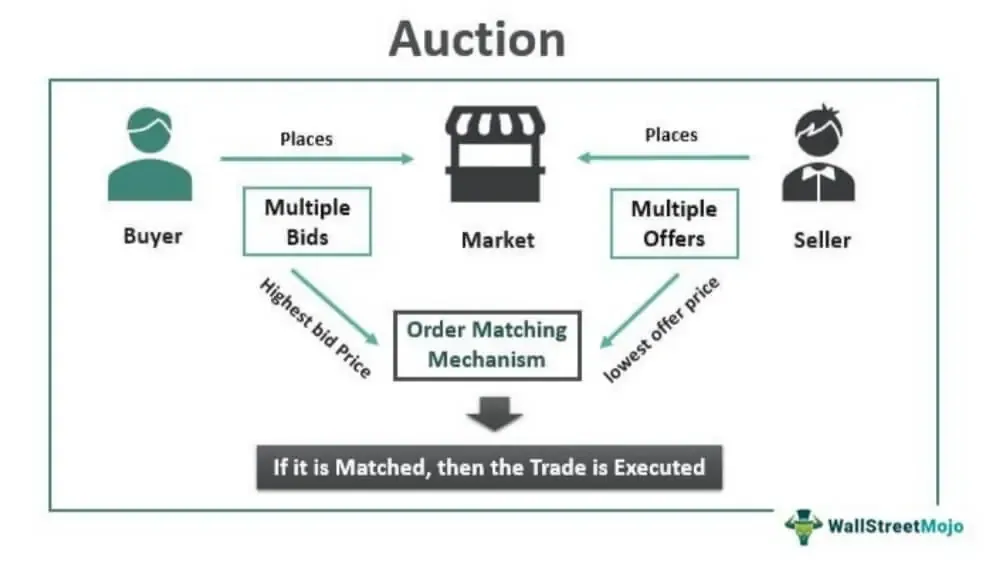

Auctions have been an integral component of human economics for centuries, serving as a distinctive platform for buying and selling a wide array of assets. Originating from as early as 500 B.C., auctions have continually adapted to societal and technological shifts, cementing their presence as a crucial mechanism in economic activities. Traditional auctions, which relied heavily on physical settings and direct human interaction, have undergone transformative changes with technological advancements. This evolution was particularly accelerated with the introduction of the internet and digital technologies, paving the way for more sophisticated methods such as online auctions and algorithmic trading systems.

Today, the auction process is not just limited to physical auction houses but also thrives in digital spaces where assets can be bought and sold efficiently across global markets. Algorithmic trading, in particular, represents a significant progression in this field. By employing complex algorithms, these systems enhance the speed and efficiency of auction processes, enabling rapid execution of trades and minimizing human errors. This integration of technology reflects the broader trend within financial markets toward automation and data-driven decision-making.



The continued importance of auctions in the financial marketplace is evident through their diverse applications, ranging from art and antiques to real estate and financial securities. This article aims to provide a comprehensive overview of the historical progression of auctions, the various auction types, the role played by major auction houses, and the impact of algorithmic trading. By examining these facets, it becomes clear how auctions have evolved over time to remain a vital cornerstone of modern commerce, ensuring efficient price discovery and asset liquidity.

## Table of Contents

## Auction History

Auctions have a long and varied history, with their origins dating back to 500 B.C. in ancient Greece. The Greeks utilized auctions in a unique way, primarily for the purpose of selling brides. According to historical accounts, families would auction off daughters of marriageable age, typically starting with the highest bidder, to ensure that they married into prosperous and stable households. This early form of auction highlights the foundational concept of auctions: a competitive bidding process to allocate resources or assets.

The Roman Empire expanded the use of auctions beyond matrimonial arrangements, deploying them as a method for selling war plunder and liquidating the assets of debtors. Roman soldiers would auction off goods seized during military campaigns, distributing wealth and promoting commercial activity within the empire. Additionally, the 'Auctio', a Roman term for public sale, became a tool for managing estate sales of debtors, serving as a mechanism to satisfy creditors.

Auctions saw a resurgence in popularity during the 17th century in Europe. The formalization of auctions during this period spurred the establishment of dedicated auction houses. Notably, in 1674, the Stockholm Auction House was founded, marking a significant transition to structured auction settings. This establishment represents one of the earliest examples of a regulated environment where goods were sold to the highest bidder, laying the foundation for modern auction practices.

The 17th and 18th centuries witnessed the solidification of auction formats that resemble those used today. Prominent auction houses like Sotheby’s, established in 1744, and Christie's, founded in 1766, emerged during this era. These institutions specialized in the sale of art, rare [books](/wiki/algo-trading-books), and collectibles, elevating the auction to a significant cultural and economic activity. Sotheby’s and Christie’s, in particular, have maintained their status as leading auction houses, synonymous with high-value and prestigious auctions globally, due to their historical significance and continued innovation in auction practices.

## Types of Auctions

Auctions are versatile mechanisms employed globally in various industries, each utilizing different formats to cater to specific market needs. One of the most prevalent types is the English auction, characterized by its open-ascending nature. In an English auction, participants openly bid against each other, with each subsequent bid being higher than the previous one. The process continues until no higher bids are offered, at which point the highest bidder secures the item or asset. This auction type is widely used because it allows participants to gauge the interest in an item and adjust their bidding strategies accordingly.

In contrast, the Dutch auction operates on a descending price mechanism. Initially, the auctioneer sets a high price, which is gradually reduced until a participant is willing to accept the current price. This format is mainly used in markets where quick disposals are preferred, such as in the Dutch flower auctions. The method can be advantageous in rapidly moving goods without the need for lengthy bidding wars.

Another significant auction type is the sealed first-price auction. In this format, each bidder submits a confidential bid without any knowledge of the other participants' bids. All bids are submitted simultaneously, and the highest bidder wins, paying the price they proposed. This method creates a strategic environment where bidders must carefully consider their offer, balancing the risk of bidding too high or too low without knowing competitors' strategies. Sealed first-price auctions are commonly used in public tenders and spectrum auctions.

Each auction type has unique characteristics that influence bidders’ strategies and market dynamics, making the choice of auction format critical depending on the objectives and nature of the assets being sold.

## Role of Auction Houses

Auction houses are pivotal institutions in the world of commerce, serving as key facilitators in the buying and selling of diverse assets ranging from fine art to commodities. These entities provide a curated and formalized environment where auctions are conducted under regulated guidelines, thereby ensuring transparency and fairness. By doing so, they instill confidence among buyers and sellers, creating a robust ecosystem for trade.

The structured nature of auction houses allows for a fair assessment of the items being auctioned, often involving experts to verify authenticity and value, which reassures potential buyers. This verification process is critical, especially in high-stakes auctions where items can reach significant monetary values. Furthermore, auction houses set standardized bidding increments and resolute auction terms, ensuring that participants are well-informed of the rules and procedures, reducing ambiguities that could lead to disputes.

Two of the most notable auction houses, Christie's and Sotheby’s, have become symbolic of high-value transactions. They often attract a global audience and are particularly associated with art and collectibles. Christie's, established in 1766, and Sotheby’s, founded in 1744, have built formidable reputations by handling some of the world's most prestigious art collections and historical artifacts. Their legacy and continued prestige are reflected in their ability to continually secure and present significant works at auction, making them leaders in the industry.

The marketplace provided by these auction houses also serves an essential economic function by aiding in the discovery of market prices for rare and unique items. This price discovery can influence the broader art market and related sectors, providing a benchmark for future sales. Auction houses employ both traditional and digital platforms, adapting to technological advancements to reach a broader audience and facilitate ease of participation. By conducting online auctions, they make it possible for international bidders to participate remotely, thus broadening market access and enhancing competitive bidding.

In conclusion, auction houses are critical conduits in the world of buying and selling, maintaining the integrity of transactions through structured processes while adapting to technological changes to meet modern demands. Their role underscores the blend of tradition and innovation, crucial in the progression and globalization of commerce in the art world and beyond.

## Algorithmic Trading in Auctions

Algorithmic trading has revolutionized the auction-based financial markets by using algorithms to automate decisions and executions with incredible precision. These systems largely depend on the ability to process large volumes of data at high speeds, allowing trades to be executed at optimal times.

The core function of [algorithmic trading](/wiki/algorithmic-trading) lies in the quantitative analysis of market trends and data patterns. By utilizing complex mathematical models and statistical tools, these algorithms can identify profitable trading opportunities and execute trades when specific market conditions are met. This approach minimizes human decision-making errors and biases, ensuring that trades are carried out based on data-driven insights rather than emotional or irrational judgments. For instance, algorithms can be designed to execute a trade if a particular asset's price falls below a certain moving average, capturing potentially lucrative opportunities as they arise.

The integration of algorithmic trading into auction markets is a reflection of the increased use of technology in financial transactions. Traditional auction markets, such as those used for commodities, artworks, and securities, have seen a marked improvement in efficiency through this integration. Algorithms enable traders to react quickly to market inefficiencies and anomalies that might be exploited for profit, such as [arbitrage](/wiki/arbitrage) opportunities where an asset may be mispriced across different markets or platforms.

By reducing the time lag inherent in manual trading methods, algorithmic trading ensures that transactions can happen within milliseconds, often faster than a human trader could react. This speed is particularly beneficial in high-frequency trading environments where even a microsecond delay can impact profitability. Furthermore, algorithms can be programmed to operate 24/7, continuously scanning markets for favorable conditions, thereby maximizing the potential for returns and ensuring that traders are always aligned with market dynamics. 

Overall, the use of algorithmic trading systems in auctions underscores the transformative power of technology in the modern financial landscape. As these systems become more sophisticated, they are set to play an increasingly integral role in shaping how assets are bought and sold in auction-based markets.

## Advantages of Automated Trading

Automated trading systems have revolutionized the financial markets by leveraging technology to enhance precision and efficiency in executing trades. These systems operate on pre-set criteria, allowing them to mitigate human error and ensure consistent execution of trades. Pre-programmed algorithms determine trading decisions by analyzing incoming data against specified parameters, resulting in a more objective trading strategy.

One key advantage of automated trading is its ability to process large volumes of data rapidly. This capacity enables systems to execute trades within milliseconds, a speed unattainable through manual trading. For example, high-frequency trading ([HFT](/wiki/high-frequency-trading-strategies)) relies on the ability to process information and execute orders at extremely high speeds, capturing market opportunities as they arise.

The adaptability of automated systems is another significant advantage. These systems can be programmed to react to a wide array of market conditions and can be adjusted to accommodate evolving trading strategies. Through [machine learning](/wiki/machine-learning) and [artificial intelligence](/wiki/ai-artificial-intelligence) technologies, automated trading systems can learn from market movements, continuously refining their strategies to align with market trends.

Moreover, the integration of automated trading systems with other risk management platforms and data sources enhances decision-making capabilities. Advanced systems can assess risk factors in real-time, modify trade strategies accordingly, and even halt trading in adverse conditions to manage potential losses. This comprehensive approach to risk management supports strategic decision-making by providing traders with a nuanced understanding of their exposure to risk.

To illustrate the efficiency of automated trading, consider a simple Python algorithm implementation for an automated trading strategy. This example uses historical market data to simulate a moving average crossover strategy:

```python
import pandas as pd
import numpy as np

# Load historical market data
data = pd.read_csv('market_data.csv')
data['Fast_MA'] = data['Close'].rolling(window=5).mean()
data['Slow_MA'] = data['Close'].rolling(window=20).mean()

# Generate trading signals
data['Signal'] = np.where(data['Fast_MA'] > data['Slow_MA'], 1, 0)
data['Position'] = data['Signal'].diff()

# Calculate strategy returns
data['Strategy_Returns'] = data['Position'].shift(1) * data['Close'].pct_change()

# Compute overall performance
performance = data['Strategy_Returns'].cumsum()
print(f"Strategy Cumulative Returns: {performance[-1]:.2f}%")
```

This code illustrates how an automated trading system can be set up to monitor moving averages and generate trading signals based on their crossover points, allowing for strategic trading decisions without human intervention.

Overall, automated trading systems are a vital advancement in the financial industry, ensuring more efficient, adaptable, and strategic trading. These benefits make automated trading an invaluable tool for traders aiming to optimize their performance in today's fast-paced financial markets.

## Conclusion

The journey of auctions from their inception in ancient societies to their present digital form showcases their unwavering adaptability and enduring significance in financial transactions. Originally serving as a simple mechanism for trading goods, auctions have embraced technological advancements, evolving into sophisticated platforms that are pivotal for modern commerce.

Modern auction markets, particularly those enhanced by algorithmic trading systems, present an efficient structure for price discovery and asset [liquidity](/wiki/liquidity-risk-premium). These systems utilize complex algorithms to process vast amounts of market data, identifying optimal trading opportunities and executing transactions with minimal latency. Algorithmic trading has enabled auctions to function with enhanced precision and speed, addressing market inefficiencies and providing participants with a higher degree of transparency and fairness.

For traders and investors, a comprehensive understanding of contemporary auction mechanisms, especially the integration of algorithmic trading, is indispensable. As financial markets become increasingly complex and fast-paced, the ability to harness these auction systems offers significant opportunities. With algorithmic tools, market participants can capitalize on real-time data analysis, optimize their trading strategies, and achieve superior outcomes in a highly competitive environment.

The evolution of auctions serves as a testament to their lasting relevance and transformative capacity in a world where technology continuously reshapes economic and financial landscapes. Embracing these advancements allows individuals and institutions to better navigate today's dynamic market conditions and seize emerging opportunities for growth and investment.

## References & Further Reading

[1]: Cassady, R. (1967). "Auctions and Auctioneering." University of California Press.

[2]: Milgrom, P. (1989). "Auctions and Bidding: A Primer." Journal of Economic Perspectives, 3(3), 3-22. [Link to paper](https://www.aeaweb.org/articles?id=10.1257/jep.3.3.3)

[3]: Klemperer, P. (2004). "Auctions: Theory and Practice." Princeton University Press. 

[4]: Lucking-Reiley, D. (2000). "Auctions on the Internet: What's Being Auctioned, and How?" Journal of Industrial Economics, 48(3), 227-252. [Link to paper](https://onlinelibrary.wiley.com/doi/full/10.1111/1467-6451.00122)

[5]: Harris, L. (2002). "Trading and Exchanges: Market Microstructure for Practitioners." Oxford University Press. 

[6]: "The Sotheby's Wine Encyclopedia" (6th Edition), by Tom Stevenson.

[7]: DeGarmo, D. (2015). "Algorithmic Trading: Winning Strategies and Their Rationale." Wiley Trading.

[8]: "Auction Theory" by Vijay Krishna. Academic Press. 

[9]: "Rothschild, M., & Stiglitz, J. (1970). "Increasing Risk: I. A Definition." Journal of Economic Theory, 2(3), 225-243. [Link to paper](https://www.sciencedirect.com/science/article/pii/0022053170900384)90109-5)