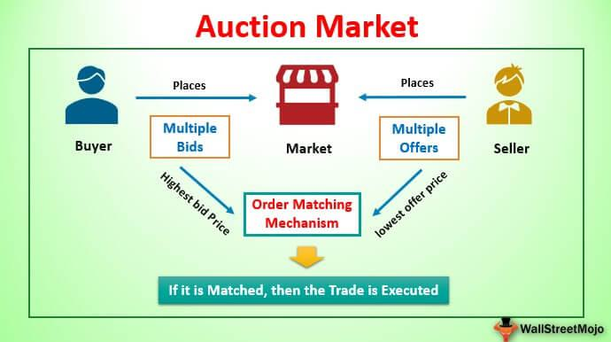

The financial markets have undergone a significant transformation with the advent and evolution of diverse trading methodologies. Auction market trading and algorithmic trading are two primary approaches that have notably influenced modern markets. Auction market trading, exemplified by systems like the New York Stock Exchange (NYSE), relies on competitive bidding processes to match buyers and sellers, facilitating the determination of price through a transparent mechanism. On the other hand, algorithmic trading employs sophisticated computer algorithms to execute trades at high speeds, offering efficiency and precision that surpass human capabilities.

This article aims to examine the intricate dynamics of auction market processes and the pioneering advancements in algorithmic trading. By understanding the mechanisms and implications of both methodologies, investors and market participants can gain a comprehensive perspective on the complexities of today’s financial markets. Such insights are crucial for capitalizing on the opportunities presented by these distinct yet interconnected trading approaches. As financial markets continue to evolve, recognizing the contributions and limitations of both auction and algorithmic trading becomes essential for navigating the ever-changing landscape.

## Table of Contents

## Understanding Auction Market Trading

An auction market is a financial trading platform where buyers and sellers submit competitive bids and offers for securities. This process of buying and selling sets the market price for a given security, ensuring efficient price discovery based on supply and demand dynamics. In an auction market, the highest price a buyer is willing to pay—known as the bid price—is matched with the lowest price a seller is willing to accept—the ask price. When these prices align, a transaction is executed. 

The New York Stock Exchange (NYSE) serves as a quintessential model of an auction market. As one of the largest and most influential stock exchanges globally, it operates primarily through a continuous auction format during trading hours. Buyers and sellers enter their orders through brokers, enabling them to place bids and offers that compete in the market. The electronic order book helps facilitate this process by displaying current bids and offers, allowing market participants to make informed decisions.

This auction mechanism underpins efficient market operation by promoting transparency and competitive pricing. For example, the equation used to identify the point of transaction in this market is:

$$
P_{transaction} = \max(P_{bid}) = \min(P_{ask})
$$

Here, $P_{transaction}$ is the transaction price, $\max(P_{bid})$ is the highest bid price, and $\min(P_{ask})$ is the lowest ask price. This equation ensures that trades occur at prices where both buyers and sellers find mutual agreement, aligning with the fundamental principles of auction market trading.

The competitive nature of auction markets allows them to adjust swiftly to new information, which is crucial for effective price discovery. As open orders are continually matched, the resulting transactions reflect the most current consensus value of a security among market participants. Such mechanisms are characteristic of efficient markets and illustrate why auction setups like the NYSE remain integral to the financial ecosystem.

## The Auction Market Process

Unlike Over-the-Counter (OTC) markets, auction markets operate without direct negotiations between buyers and sellers. In these markets, the trades are facilitated by a mechanism known as the double auction process. In a double auction, multiple buyers and sellers submit bid and ask prices, respectively, into the system. The market then matches the highest bid price from buyers with the lowest ask price from sellers to execute trades. This ensures that the transaction occurs at a mutually agreeable price point, reflecting real-time supply and demand dynamics.

A practical example of the auction market process is observed in Treasury auctions. Here, the government issues debt securities to finance its activities, and investors place bids specifying the quantity and the rate they are willing to accept. Treasury auctions are typically of two types: 
1. **Competitive bids**, where bidders specify the yield they are willing to accept and may not receive the securities if their bid is too high.
2. **Non-competitive bids**, where bidders agree to accept the yield determined at the auction, guaranteeing them the securities.

During the auction, bids are ranked, and securities are allocated, starting from the lowest yield bid until the auction issue amount is fulfilled. This systematic approach ensures equitable distribution of securities and efficient pricing reflective of the current economic conditions.

Mathematically, the process of matching bids and asks can be seen as finding the equilibrium price where supply equals demand. If $Q_b(p)$ represents the quantity demanded at price $p$ and $Q_s(p)$ indicates the quantity supplied, the equilibrium price $p^*$ satisfies:

$$
Q_b(p^*) = Q_s(p^*)
$$

This model underscores the efficiency inherent to auction markets as they aim to clear the market at a price that aligns with the collective estimation of value by market participants.

 to Algorithmic Trading

Algorithmic trading represents a significant shift in how financial markets operate, employing sophisticated computer algorithms to [carry](/wiki/carry-trading) out trading decisions based on pre-determined criteria. This approach automates the trading process, aiming to maximize efficiency and execution speed, often surpassing the capabilities of human traders.

Algorithmic trading utilizes computer systems to execute orders by following a set of rules that account for variables such as timing, price, and [volume](/wiki/volume-trading-strategy). The algorithms analyze vast quantities of data and market signals, making it possible to execute trades in fractions of a second. This rapid decision-making process affords traders the ability to capitalize on fleeting market opportunities, providing a competitive edge in highly dynamic markets.

High-frequency trading ([HFT](/wiki/high-frequency-trading-strategies)) is a prominent strategy within [algorithmic trading](/wiki/algorithmic-trading), characterized by the execution of a large number of orders at extremely fast speeds. HFT strategies depend on complex algorithms to identify and exploit small price discrepancies across different markets. By rapidly entering and exiting positions, traders aim to make incremental profits that accumulate significantly over time. HFT often relies on robust technological infrastructure and proximity to major exchanges, ensuring minimal latency in trade execution.

Market making is another key strategy where algorithmic traders continuously quote buy and sell prices for certain securities. By acting as intermediaries, market makers provide [liquidity](/wiki/liquidity-risk-premium) to the market, profiting from the bid-ask spread. Algorithms facilitate the real-time adjustment of prices based on supply and demand dynamics, ensuring that market makers can swiftly respond to changing market conditions.

The implementation of algorithmic trading has led to increased liquidity, improved price discovery, and reduced transaction costs across financial markets. However, it also raises concerns regarding market [volatility](/wiki/volatility-trading-strategies) and systemic risk, particularly during periods of market stress. Despite these challenges, algorithmic trading continues to evolve, driven by advancements in technology and data analytics, shaping the future of global finance.

## Evolution of Algorithmic Trading

Algorithmic trading, often referred to as algo trading, has undergone significant evolution since its inception. This form of trading relies on computer algorithms to automate trade orders, aiming for speed, precision, and the ability to process complex mathematical models. The roots of modern algorithmic trading can be traced back to the early 1990s with the introduction of Electronic Communication Networks (ECNs). ECNs revolutionized traditional trading by facilitating direct interactions between buyers and sellers in a digitized format, bypassing traditional stock exchanges and creating opportunities for more efficient and transparent transactions.

One of the pivotal regulatory changes that accelerated the adoption of algorithmic trading was decimalization, which the U.S. Securities and Exchange Commission (SEC) implemented in 2001. Decimalization changed the tick size (the smallest price movement possible in trading) from fractions of a dollar to decimals, thereby allowing stocks to be priced in one-cent increments instead of larger fractions like one-sixteenth of a dollar. This shift reduced bid-ask spreads, leading to more precise pricing and execution of trades, which automated trading systems could exploit because of their ability to act on small price changes rapidly and efficiently.

Algorithmic trading experienced significant growth and sophistication as the decade progressed. The mid-1990s marked a major shift with the increasing integration of algorithmic strategies in global financial markets. The proliferation of the internet and advancements in computing power allowed algorithms to analyze vast amounts of data swiftly and execute decisions with minimal human intervention. This led to the development of various algorithmic strategies, such as [arbitrage](/wiki/arbitrage), [statistical arbitrage](/wiki/statistical-arbitrage), [trend following](/wiki/trend-following), and high-frequency trading.

The rapid increase in trading volumes and the enhanced liquidity provided by algorithmic trading have reshaped market dynamics. Algorithms now account for a substantial portion of trades executed on stock exchanges worldwide. The ability of these sophisticated algorithms to scan multiple markets and execute trades within milliseconds has fundamentally changed the landscape of trading, posing both opportunities and challenges for market participants.

As financial markets continue to evolve, algorithmic trading remains at the forefront, driven by ongoing advancements in technology and data processing capabilities. The continuous refinement of algorithms and the use of [artificial intelligence](/wiki/ai-artificial-intelligence) and [machine learning](/wiki/machine-learning) techniques are pushing the boundaries of what is possible in algorithmic trading, ensuring its relevance in the increasingly complex world of finance.

## Impact and Strategies of Algorithmic Trading

Algorithmic trading, a technologically driven approach to executing trades, has fundamentally transformed the landscape of financial markets. Its impact can be observed in several dimensions, most notably in increasing transaction volumes, reducing trading costs, and enhancing market transparency.

One of the key effects of algorithmic trading is the substantial increase in transaction volumes. Automated trading systems can execute orders at a pace and scale that far exceed human capabilities. This has led to a more liquid market environment where assets can be bought and sold quickly without causing significant price fluctuations. Enhanced liquidity can, in turn, attract more participants to the market, creating a virtuous cycle that fosters further volume growth.

Cost reduction is another important benefit of algorithmic trading. Traditional trading often involves manual processes that can be time-consuming and prone to human error, potentially leading to higher costs. By automating the decision-making and execution processes, algorithmic trading minimizes these inefficiencies, significantly lowering the transaction costs associated with buying and selling securities. Furthermore, automation allows for the optimization of order execution, ensuring that trades are completed at the best possible prices.

Market transparency has also improved as a result of algorithmic trading. The use of sophisticated algorithms allows for the continual assessment of market conditions based on a vast array of data points, resulting in more informed pricing and reduced information asymmetry. This clarity encourages fairer and more efficient market operations, providing all participants with equal access to market information.

Various strategies have been developed within algorithmic trading to capitalize on market opportunities. Arbitrage is one such strategy, exploiting price discrepancies of the same asset in different markets to generate profits with minimal risk. Mean reversion strategies rely on the premise that asset prices will revert to their historical averages over time, allowing traders to buy low and sell high. Pairs trading involves simultaneously buying and selling two correlated assets to profit from relative price movements. Scalping focuses on executing numerous trades to profit from small price changes, often over short time horizons.

The effectiveness of these strategies largely relies on the speed and data processing capabilities of the algorithms employed. With the advent of high-frequency trading and other technologically advanced methods, the importance of executing trades swiftly and processing large volumes of data cannot be overstated. This speed advantage allows algorithmic traders to exploit fleeting market inefficiencies that would elude slower, human traders.

In conclusion, algorithmic trading has redefined the operational dynamics of financial markets, offering substantial improvements in volume, cost, and transparency. Its strategies continue to evolve, driven by advancements in computing power and data analytics, underscoring the need for traders to remain agile and informed in leveraging these technological tools effectively.

## Auction vs. Algorithmic Trading: A Comparison

Auction and algorithmic trading systems serve distinct roles within financial markets, each with its unique advantages and limitations. Auction markets are characterized by their emphasis on price discovery through competitive bidding. In these markets, participants engage in a process where buyers present bids, and sellers offer asks. The transactions occur when the highest bid meets the lowest ask, successfully matching buyers and sellers. This process fosters transparent price formation and can lead to equitable market conditions by reflecting supply and demand dynamics.

On the other hand, algorithmic trading focuses on efficiency and speed, leveraging computational power to execute trades. Algorithms, predefined sets of rules, analyze a myriad of market conditions and execute trades based on those parameters. This allows for large volumes of transactions to be conducted at speeds unattainable by human traders, leading to enhanced market liquidity and reduced trading costs. However, algorithmic trading relies heavily on technical infrastructure, including high-speed internet connections and advanced software, which can be cost-intensive.

The key difference between these two systems lies in their operational mechanics. Auction trading functions through a public process of bids and offers, providing transparency and enabling traders to see real-time market movements. This process makes it easier for investors to predict price movements based on observed bids and offers. In contrast, algorithmic trading systems often operate invisibly within the market framework, executing large orders with minimal market impact, and attempting to capitalize on minute, often imperceptible price discrepancies.

Each method impacts market dynamics differently. Auction markets may better reflect real-time economic conditions due to their reliance on human judgment and negotiation. However, they can also be slower and less efficient, potentially leading to greater market volatility. Algorithmic trading, by accelerating trade executions and increasing market liquidity, helps stabilize prices and narrow bid-ask spreads. However, its reliance on sophisticated technology introduces risks, such as "flash crashes," where algorithmic errors can lead to rapid, large-scale trading anomalies.

In conclusion, both auction and algorithmic trading methods contribute significantly, yet differently, to the structure of modern financial markets. Auction markets prioritize transparency and participatory price formation, while algorithmic trading emphasizes speed and transaction efficiency. Understanding the inherent advantages and challenges of each approach is vital for market participants aiming to optimize their trading strategies.

## Conclusion

The integration of auction market mechanisms with the advanced techniques of algorithmic trading fundamentally transforms contemporary financial markets. Auction markets, with their structured environment for price discovery through competitive bidding, operate as essential platforms where the equilibrium price is identified by matching buy and sell orders. This mechanism inherently contributes to liquidity by ensuring that buy and sell interests find a common ground efficiently.

Conversely, algorithmic trading employs computer algorithms to execute trades at speeds unattainable by manual methods. This approach enhances market liquidity and price efficiency by executing a vast number of trades quickly, used to capitalize on minor price discrepancies. The resultant impact of these trades often leads to narrower bid-ask spreads, which benefits the overall market by reducing transaction costs and enhancing price discovery.

The concurrent application of both auction and algorithmic trading presents a dynamic landscape within financial markets. While auction markets provide a transparent and organized structure for price setting, algorithmic trading offers unparalleled efficiency and speed, leading to significant improvements in market operations. This synergy fosters an environment where market participants can benefit from enhanced liquidity and refined pricing mechanisms, adapting to opportunities with greater precision and agility.

As the financial markets continue their trajectory of evolution, it becomes imperative for investors and market participants to familiarize themselves with these trading methodologies. Understanding and leveraging the strengths of both auction and algorithmic trading can position market players to capitalize on emerging opportunities effectively. The ability to adapt to these methodologies will be crucial in navigating the complexities of modern financial landscapes and sustaining competitive advantages.

## References & Further Reading

[1]: Harris, L. (2003). ["Trading and Exchanges: Market Microstructure for Practitioners."](https://www.amazon.com/Trading-Exchanges-Market-Microstructure-Practitioners/dp/0195144708) Oxford University Press.

[2]: Aldridge, I. (2013). ["High-Frequency Trading: A Practical Guide to Algorithmic Strategies and Trading Systems."](https://www.amazon.com/High-Frequency-Trading-Practical-Algorithmic-Strategies/dp/1118343506) John Wiley & Sons.

[3]: Hasbrouck, J. (2007). ["Empirical Market Microstructure: The Institutions, Economics, and Econometrics of Securities Trading."](https://archive.org/details/empiricalmarketm0000hasb) Oxford University Press.

[4]: Domowitz, I., & Steil, B. (1999). ["Automation, Trading Costs, and the Structure of the Trading Services Industry."](https://www.nomurafoundation.or.jp/en/wordpress/wp-content/uploads/2014/09/19971011_Ian_Domowitz_-_Benn_Steil.pdf) Brookings-Wharton Papers on Financial Services.

[5]: Cartea, Á, Jaimungal, S., & Penalva, J. (2015). ["Algorithmic and High-Frequency Trading"](https://assets.cambridge.org/97811070/91146/frontmatter/9781107091146_frontmatter.pdf) Cambridge University Press.