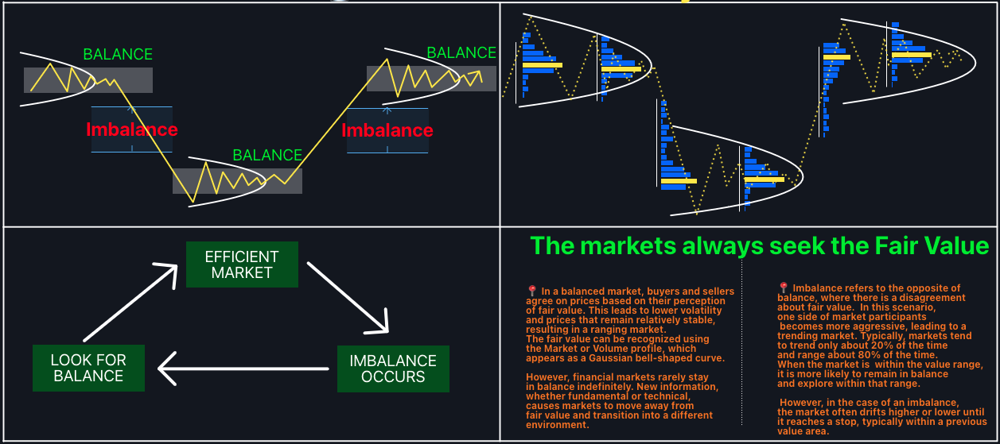

## Table of Contents

## What is an auction market in trading?

An auction market in trading is a place where people buy and sell things like stocks or commodities. It works a bit like a big auction where buyers and sellers come together to agree on a price. In this market, the price of an item is decided by how much people are willing to pay and how much sellers are willing to accept. This happens in real time, and the price can change quickly based on what everyone is doing.

In an auction market, there are special people called market makers or specialists who help make sure the buying and selling goes smoothly. They keep track of all the orders and make sure there are enough buyers and sellers. This helps keep the market fair and efficient. Some well-known auction markets are stock exchanges like the New York Stock Exchange, where people trade stocks every day.

## How does an auction market differ from other types of markets?

An auction market is different from other types of markets because it uses a bidding process to set prices. In an auction market, buyers and sellers come together and compete to buy or sell items like stocks or commodities. The price is decided by how much buyers are willing to pay and how much sellers are willing to accept. This can happen quickly and the price can change a lot in a short time. Other markets, like dealer markets, might have fixed prices set by dealers or brokers, and the buying and selling happens more directly without the open bidding.

Another difference is the role of market makers or specialists in auction markets. These people help manage the buying and selling process, making sure there are enough buyers and sellers and that the market stays fair. In other types of markets, like over-the-counter (OTC) markets, there might not be these special roles. Instead, dealers or brokers might handle transactions directly with buyers and sellers, and the process can be less transparent. So, auction markets are more open and competitive, while other markets might be more controlled and direct.

## What are the basic steps involved in participating in an auction market?

To participate in an auction market, you first need to find a broker or an online platform that lets you trade. You can open an account with them and put some money in it. Once your account is set up, you can start looking at what's available to buy or sell. You'll see a list of items, like stocks or commodities, and their current prices. You can decide if you want to buy or sell something based on these prices.

When you want to buy, you place a bid, which is like saying how much you're willing to pay for an item. Other people might also be bidding, so the price can go up until someone agrees to sell at that price. If you want to sell, you can set an asking price, which is how much you want for your item. Other people might offer to buy it at a lower price, so you might need to adjust your price until someone agrees to buy. Once a buyer and seller agree on a price, the trade happens, and the item changes hands.

## What types of assets are commonly traded in auction markets?

In auction markets, people often trade stocks. Stocks are pieces of ownership in a company. When you buy a stock, you're buying a small part of that company. People trade stocks in places like the New York Stock Exchange or the NASDAQ. These are big auction markets where lots of people come together to buy and sell stocks every day. The price of a stock can change a lot because it depends on how much people want to buy it and how much people want to sell it.

Another common thing traded in auction markets is commodities. Commodities are things like gold, oil, or wheat. These are physical items that people need or use every day. In an auction market, buyers and sellers come together to agree on a price for these commodities. The price can go up or down based on how much people want to buy or sell. For example, if a lot of people want to buy oil, the price might go up. If a lot of people want to sell wheat, the price might go down.

## How do price discovery and transparency work in an auction market?

In an auction market, price discovery is the process of finding out what something is worth. It happens when buyers and sellers come together and start bidding. If a lot of people want to buy something, they might bid higher and higher until someone agrees to sell at that price. If a lot of people want to sell something, they might lower their price until someone agrees to buy. This back-and-forth helps everyone figure out the right price for the item, based on what people are willing to pay and what people are willing to accept.

Transparency in an auction market means that everyone can see what's happening. When you're trading, you can see all the bids and offers that people are making. This helps you know if the price is fair and if you're getting a good deal. Because everyone can see the same information, it makes the market fair for everyone. This openness also helps stop people from trying to cheat or hide things, because everything is out in the open for everyone to see.

## What are the roles of buyers and sellers in an auction market?

In an auction market, buyers are the people who want to buy things like stocks or commodities. They look at what's available and decide if they want to buy something. When they find something they like, they place a bid, which is like saying how much they're willing to pay. Other buyers might also be bidding on the same thing, so the price can go up until someone agrees to sell at that price. Buyers need to keep an eye on the market to make sure they're getting a good deal and to see if the price is going up or down.

Sellers in an auction market are the people who want to sell things. They set an asking price, which is how much they want for their item. Other people might offer to buy it at a lower price, so sellers might need to change their price until someone agrees to buy. Sellers need to watch the market too, to see if people are interested in what they're selling and to make sure they're getting a fair price. Both buyers and sellers help decide the price by bidding and offering, and this makes the market fair and open for everyone.

## What strategies can beginners use to succeed in an auction market?

Beginners in an auction market should start by learning as much as they can about how the market works. They can read [books](/wiki/algo-trading-books), watch videos, or take online courses to understand the basics of trading. It's also a good idea to practice with a demo account before using real money. This way, they can try out different strategies without risking any money. Beginners should also set clear goals for what they want to achieve and stick to a plan. This helps them stay focused and avoid making quick decisions based on emotions.

Another important strategy is to start small. Beginners should only trade with money they can afford to lose. This helps them learn without too much risk. They should also focus on a few items at a time, like a couple of stocks or commodities, instead of trying to trade everything. This makes it easier to keep track of what's happening and make better decisions. Lastly, beginners should be patient and not expect to make a lot of money right away. It takes time to learn and get good at trading in an auction market.

## How do auction markets handle large volumes of trades?

Auction markets handle large volumes of trades with the help of special people called market makers or specialists. These people make sure that buying and selling happens smoothly, even when a lot of people are trading at the same time. They keep track of all the orders and help match buyers with sellers quickly. This is important because it keeps the market fair and efficient, even when there are a lot of trades happening.

Technology also plays a big role in handling large volumes of trades. Computers and trading platforms can process a lot of information very fast. They can handle many trades at once and make sure that the prices are always up to date. This means that even if a lot of people are buying and selling, the market can keep up and make sure everything goes smoothly.

## What are the common pitfalls and risks associated with trading in auction markets?

Trading in auction markets can be risky because prices can change a lot and very quickly. If you're not careful, you might buy something when the price is high and then it goes down, losing you money. This is called market risk. Another risk is not knowing enough about what you're trading. If you don't understand how stocks or commodities work, you might make bad choices and lose money. This is called knowledge risk. Also, sometimes people get too excited or scared and make quick decisions based on their feelings instead of thinking things through. This is called emotional risk.

Another common pitfall is not having a plan. Without a clear strategy, you might jump into trades without thinking about the risks and rewards. This can lead to big losses. Also, some people use too much money to trade, hoping to make a lot quickly. This is called over-leveraging, and it can be very dangerous because if things go wrong, you could lose more than you can afford. It's important to only trade with money you can lose and to always have a plan to help guide your decisions.

## How do advanced traders use auction market data to inform their trading decisions?

Advanced traders use auction market data to make smart choices about when to buy and sell. They look at things like how many people are buying or selling, the prices they're bidding, and how the prices are changing over time. This helps them see patterns and trends that other people might miss. For example, if they see a lot of people suddenly wanting to buy a certain stock, they might think the price will go up and decide to buy it too. They also use special tools and charts to help them understand the data better and make better decisions.

Another way advanced traders use auction market data is by looking at the [order book](/wiki/order-book-trading-strategies), which shows all the current bids and offers. This helps them see if there are more buyers or sellers and at what prices they're willing to trade. By understanding the balance between buyers and sellers, advanced traders can predict how the price might move next. They might also use this information to set their own bids and offers at the right levels to get the best deals. This careful analysis of auction market data helps them stay ahead and make more profitable trades.

## What technological tools and platforms are essential for effective trading in auction markets?

To trade effectively in auction markets, traders need good technological tools and platforms. One important tool is a trading platform, like E*TRADE or Robinhood. These platforms let you see the prices of stocks and commodities, place bids, and make trades easily. They also have charts and graphs that help you understand how prices are changing. Another useful tool is a market data feed, which gives you real-time information about what's happening in the market. This helps you make quick decisions based on the latest data.

Advanced traders also use special software called trading algorithms. These are computer programs that can automatically buy and sell things based on certain rules. For example, an algorithm might be set to buy a stock if its price goes up by a certain amount. This can help traders make trades faster and more accurately than they could by themselves. Also, many traders use risk management tools, like stop-loss orders, which automatically sell a stock if its price drops too much. This helps protect their money if the market goes against them.

## How have auction markets evolved with the advent of electronic trading and what future trends can we expect?

Auction markets have changed a lot since electronic trading started. Before, people had to go to a physical place, like the New York Stock Exchange, to trade. They would shout out their bids and offers, and it could be slow and confusing. Now, with electronic trading, everything happens on computers. Traders can buy and sell from anywhere using trading platforms. This makes things faster and easier. Also, computers can handle a lot more trades at once, so the market can be bigger and more efficient. Electronic trading has made auction markets more open and fair because everyone can see the same information at the same time.

In the future, we can expect auction markets to keep getting better with technology. One trend might be more use of [artificial intelligence](/wiki/ai-artificial-intelligence) (AI) and [machine learning](/wiki/machine-learning). These technologies can help traders make better decisions by finding patterns in the data that people might miss. Another trend could be more use of blockchain technology, which can make trading safer and more transparent. Also, as more people start trading, auction markets might become even more global, with people from all over the world trading together. This could make the markets bigger and more exciting, but it also means traders will need to keep learning and adapting to stay successful.

## What is Understanding Auction Market Trading?

An auction market is a financial trading platform where buyers and sellers submit competitive bids and offers for securities. This process of buying and selling sets the market price for a given security, ensuring efficient price discovery based on supply and demand dynamics. In an auction market, the highest price a buyer is willing to pay—known as the bid price—is matched with the lowest price a seller is willing to accept—the ask price. When these prices align, a transaction is executed. 

The New York Stock Exchange (NYSE) serves as a quintessential model of an auction market. As one of the largest and most influential stock exchanges globally, it operates primarily through a continuous auction format during trading hours. Buyers and sellers enter their orders through brokers, enabling them to place bids and offers that compete in the market. The electronic order book helps facilitate this process by displaying current bids and offers, allowing market participants to make informed decisions.

This auction mechanism underpins efficient market operation by promoting transparency and competitive pricing. For example, the equation used to identify the point of transaction in this market is:

$$
P_{transaction} = \max(P_{bid}) = \min(P_{ask})
$$

Here, $P_{transaction}$ is the transaction price, $\max(P_{bid})$ is the highest bid price, and $\min(P_{ask})$ is the lowest ask price. This equation ensures that trades occur at prices where both buyers and sellers find mutual agreement, aligning with the fundamental principles of auction market trading.

The competitive nature of auction markets allows them to adjust swiftly to new information, which is crucial for effective price discovery. As open orders are continually matched, the resulting transactions reflect the most current consensus value of a security among market participants. Such mechanisms are characteristic of efficient markets and illustrate why auction setups like the NYSE remain integral to the financial ecosystem.

## What is the Auction Market Process?

Unlike Over-the-Counter (OTC) markets, auction markets operate without direct negotiations between buyers and sellers. In these markets, the trades are facilitated by a mechanism known as the double auction process. In a double auction, multiple buyers and sellers submit bid and ask prices, respectively, into the system. The market then matches the highest bid price from buyers with the lowest ask price from sellers to execute trades. This ensures that the transaction occurs at a mutually agreeable price point, reflecting real-time supply and demand dynamics.

A practical example of the auction market process is observed in Treasury auctions. Here, the government issues debt securities to finance its activities, and investors place bids specifying the quantity and the rate they are willing to accept. Treasury auctions are typically of two types: 
1. **Competitive bids**, where bidders specify the yield they are willing to accept and may not receive the securities if their bid is too high.
2. **Non-competitive bids**, where bidders agree to accept the yield determined at the auction, guaranteeing them the securities.

During the auction, bids are ranked, and securities are allocated, starting from the lowest yield bid until the auction issue amount is fulfilled. This systematic approach ensures equitable distribution of securities and efficient pricing reflective of the current economic conditions.

Mathematically, the process of matching bids and asks can be seen as finding the equilibrium price where supply equals demand. If $Q_b(p)$ represents the quantity demanded at price $p$ and $Q_s(p)$ indicates the quantity supplied, the equilibrium price $p^*$ satisfies:

$$
Q_b(p^*) = Q_s(p^*)
$$

This model underscores the efficiency inherent to auction markets as they aim to clear the market at a price that aligns with the collective estimation of value by market participants.

 to Algorithmic Trading

Algorithmic trading represents a significant shift in how financial markets operate, employing sophisticated computer algorithms to [carry](/wiki/carry-trading) out trading decisions based on pre-determined criteria. This approach automates the trading process, aiming to maximize efficiency and execution speed, often surpassing the capabilities of human traders.

Algorithmic trading utilizes computer systems to execute orders by following a set of rules that account for variables such as timing, price, and [volume](/wiki/volume-trading-strategy). The algorithms analyze vast quantities of data and market signals, making it possible to execute trades in fractions of a second. This rapid decision-making process affords traders the ability to capitalize on fleeting market opportunities, providing a competitive edge in highly dynamic markets.

High-frequency trading ([HFT](/wiki/high-frequency-trading-strategies)) is a prominent strategy within [algorithmic trading](/wiki/algorithmic-trading), characterized by the execution of a large number of orders at extremely fast speeds. HFT strategies depend on complex algorithms to identify and exploit small price discrepancies across different markets. By rapidly entering and exiting positions, traders aim to make incremental profits that accumulate significantly over time. HFT often relies on robust technological infrastructure and proximity to major exchanges, ensuring minimal latency in trade execution.

Market making is another key strategy where algorithmic traders continuously quote buy and sell prices for certain securities. By acting as intermediaries, market makers provide [liquidity](/wiki/liquidity-risk-premium) to the market, profiting from the bid-ask spread. Algorithms facilitate the real-time adjustment of prices based on supply and demand dynamics, ensuring that market makers can swiftly respond to changing market conditions.

The implementation of algorithmic trading has led to increased liquidity, improved price discovery, and reduced transaction costs across financial markets. However, it also raises concerns regarding market [volatility](/wiki/volatility-trading-strategies) and systemic risk, particularly during periods of market stress. Despite these challenges, algorithmic trading continues to evolve, driven by advancements in technology and data analytics, shaping the future of global finance.

## References & Further Reading

[1]: Harris, L. (2003). ["Trading and Exchanges: Market Microstructure for Practitioners."](https://www.amazon.com/Trading-Exchanges-Market-Microstructure-Practitioners/dp/0195144708) Oxford University Press.

[2]: Aldridge, I. (2013). ["High-Frequency Trading: A Practical Guide to Algorithmic Strategies and Trading Systems."](https://www.amazon.com/High-Frequency-Trading-Practical-Algorithmic-Strategies/dp/1118343506) John Wiley & Sons.

[3]: Hasbrouck, J. (2007). ["Empirical Market Microstructure: The Institutions, Economics, and Econometrics of Securities Trading."](https://archive.org/details/empiricalmarketm0000hasb) Oxford University Press.

[4]: Domowitz, I., & Steil, B. (1999). ["Automation, Trading Costs, and the Structure of the Trading Services Industry."](https://www.nomurafoundation.or.jp/en/wordpress/wp-content/uploads/2014/09/19971011_Ian_Domowitz_-_Benn_Steil.pdf) Brookings-Wharton Papers on Financial Services.

[5]: Cartea, Á, Jaimungal, S., & Penalva, J. (2015). ["Algorithmic and High-Frequency Trading"](https://assets.cambridge.org/97811070/91146/frontmatter/9781107091146_frontmatter.pdf) Cambridge University Press.