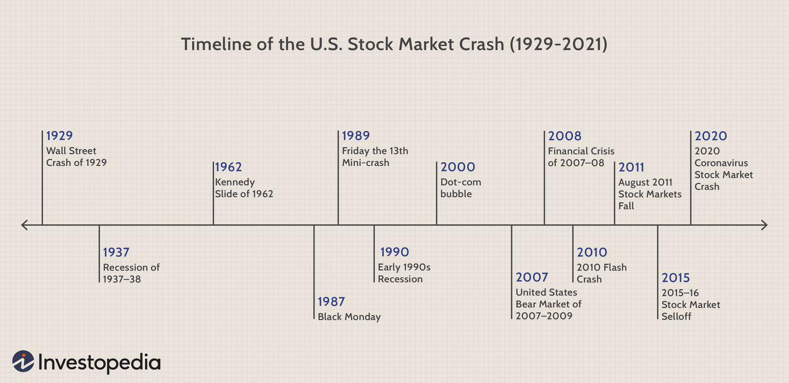

## Table of Contents

## What are Auction Rate Securities (ARS)?

Auction Rate Securities (ARS) are a type of financial instrument that have long-term maturity dates but offer short-term interest rates that are reset through auctions. These securities are typically issued by municipalities, student loan providers, and other institutions to raise funds. The interest rates on ARS are determined by bidding at auctions that usually happen every 7, 28, or 38 days. Investors place bids on the interest rate they are willing to accept, and the lowest rate that clears the market becomes the interest rate for the next period.

When the auction process works smoothly, ARS can be an attractive investment because they offer higher interest rates than traditional money market funds and are considered to be very liquid. However, if there are not enough buyers at an auction, the auction fails, and the interest rate resets to a maximum rate set by the issuer. This can cause problems for investors who need to access their funds, as they may be stuck with the securities until the next successful auction. The ARS market experienced significant issues during the 2008 financial crisis, leading to many failed auctions and regulatory scrutiny.

## How do Auction Rate Securities work?

Auction Rate Securities (ARS) are a type of investment that combines the features of long-term bonds and short-term interest rates. They are issued by organizations like cities or schools to borrow money. The special thing about ARS is that their interest rates are set through regular auctions, which happen every few weeks. In these auctions, investors bid on the interest rate they want. The lowest rate that gets all the securities sold becomes the new interest rate for the next period until the next auction.

When everything goes well, ARS can be a good choice for investors. They usually offer higher interest rates than regular savings accounts or money market funds. Plus, they are seen as easy to buy and sell because of the frequent auctions. But if not enough people want to buy the securities at an auction, it can fail. When this happens, the [interest rate](/wiki/interest-rate-trading-strategies) jumps to a very high level set by the issuer, and investors might not be able to sell their securities until the next successful auction. This became a big problem during the 2008 financial crisis when many auctions failed, and many investors found themselves unable to get their money out.

## What is the history of Auction Rate Securities?

Auction Rate Securities, or ARS, started in the 1980s. They were created as a way for cities, schools, and other groups to borrow money. ARS were popular because they offered higher interest rates than regular savings accounts. They were also easy to buy and sell because their interest rates were set by auctions that happened every few weeks. Investors liked them because they could get a good return and thought they could get their money back anytime they wanted.

For many years, ARS worked well. But in 2008, big problems started. During the financial crisis, many auctions failed because there weren't enough buyers. This meant that the interest rates on ARS jumped very high, and many investors couldn't get their money out. This led to a lot of trouble for people who had invested in ARS. After 2008, fewer ARS were being used, and new rules were put in place to protect investors.

## Who are the typical issuers of ARS?

The typical issuers of Auction Rate Securities are usually big organizations like cities, schools, and other public groups. They use ARS to borrow money for things like building schools or fixing roads. These groups like ARS because they can get money for a long time but pay interest rates that change often, which can be cheaper for them.

Sometimes, private companies also issue ARS. These can be big companies or smaller ones that need money for their projects. They use ARS for the same reason as public groups: to borrow money for a long time but with interest rates that can change often. This way, they can manage their costs better.

## Who are the typical investors in ARS?

The typical investors in Auction Rate Securities are usually people or groups looking for a safe place to put their money while still getting a good return. These investors often include wealthy individuals who want to keep their money growing but don't want to take big risks. They like ARS because they think they can get their money back anytime they need it, thanks to the regular auctions.

Another group of typical investors in ARS are big organizations like banks, insurance companies, and investment funds. These groups invest in ARS to manage their money and make a profit for their clients or shareholders. They are attracted to ARS because they offer higher interest rates than regular savings accounts, and the frequent auctions make them seem easy to buy and sell.

## What are the benefits of investing in Auction Rate Securities?

Investing in Auction Rate Securities can offer good benefits for people looking to grow their money safely. One big benefit is that ARS usually give higher interest rates than regular savings accounts or money market funds. This means you can earn more money on your investment without taking big risks. Another benefit is that ARS are seen as liquid, which means you can usually get your money back when you need it because of the regular auctions.

But there are also some risks with ARS. If not enough people want to buy them at an auction, the auction can fail. When this happens, the interest rate can jump to a very high level, and you might not be able to sell your ARS until the next successful auction. This can be a problem if you need your money right away. Despite these risks, many investors still find ARS attractive because of the potential for higher returns and the chance to get their money back quickly when everything goes well.

## What are the risks associated with Auction Rate Securities?

Investing in Auction Rate Securities can be risky. One big risk is that auctions can fail. If not enough people want to buy ARS at an auction, the auction fails, and the interest rate can jump to a very high level. This can make the ARS less valuable and harder to sell. During the 2008 financial crisis, many auctions failed, and a lot of investors found themselves stuck with ARS they couldn't sell. This showed that even though ARS are supposed to be easy to buy and sell, they can become very hard to get rid of when the market is not doing well.

Another risk is that ARS might not be as safe as they seem. Even though they are often seen as low-risk investments, they can still lose value if the issuer has financial trouble. If the city, school, or company that issued the ARS runs into money problems, it might not be able to pay back the investors. This means you could lose some or all of your money. So, while ARS can offer higher interest rates and seem easy to sell, they come with risks that investors need to think about carefully.

## What led to the market collapse of Auction Rate Securities in 2008?

The market collapse of Auction Rate Securities in 2008 was mainly because of the big financial crisis that happened that year. During the crisis, many people and companies were scared and didn't want to invest in risky things. ARS were seen as safe before, but now, with so much uncertainty, investors didn't want to buy them at the auctions. This led to many auctions failing because there weren't enough buyers. When auctions failed, the interest rates on ARS jumped to very high levels, and investors couldn't sell their ARS easily.

The problems got worse because many big banks and brokers had told people that ARS were safe and easy to sell. But when the auctions started failing, these banks and brokers couldn't help their clients get their money back. This made a lot of investors angry and led to many lawsuits against the banks. The whole situation showed that ARS were not as safe and liquid as everyone thought, and after 2008, the use of ARS dropped a lot, and new rules were made to protect investors better.

## How did the market collapse affect investors and issuers of ARS?

The market collapse of Auction Rate Securities in 2008 hit investors hard. Many people and companies had put their money into ARS thinking they were safe and easy to sell. But when the auctions started failing, they couldn't get their money back. This left them stuck with securities they couldn't sell, and the interest rates on these securities went up a lot. Many investors were angry and felt tricked by banks and brokers who had told them ARS were safe. This led to a lot of lawsuits against these financial institutions.

Issuers of ARS, like cities and schools, were also affected by the collapse. They had used ARS to borrow money for their projects, thinking they would have to pay only low interest rates that changed often. But when the auctions failed, the interest rates jumped to very high levels. This made it much more expensive for these issuers to borrow money. Some had to find other ways to borrow money, which could be harder and more expensive. The whole situation made people trust ARS less, and after 2008, fewer ARS were issued, and new rules were put in place to protect investors.

## What regulatory changes were implemented following the ARS market collapse?

After the Auction Rate Securities market collapsed in 2008, regulators made new rules to help protect investors. They started looking more closely at how banks and brokers were selling ARS. The regulators wanted to make sure that people were told the truth about how risky ARS could be. They also made rules that said banks and brokers had to buy back ARS from some investors who couldn't sell them because of the failed auctions. This was to help those investors get their money back.

These changes also made it harder for issuers to sell new ARS. The new rules meant that issuers had to tell people more about the risks of ARS. This made fewer people want to buy them, so fewer ARS were sold after 2008. Overall, the new rules were meant to make the market safer and more honest, but they also made ARS less popular as an investment.

## What is the current state of the Auction Rate Securities market?

Since the big problems in 2008, the Auction Rate Securities market has become much smaller. Not many ARS are being sold anymore because people are more careful about the risks. The new rules that were made after the collapse have made it harder for issuers to sell ARS, and investors are less interested in them. This has led to a quieter market where ARS are not as common as they used to be.

Even though the ARS market is smaller, there are still some ARS being traded. These are mostly held by big investors like banks and insurance companies who understand the risks better. For regular people, ARS are not seen as a good investment anymore. The memory of the 2008 problems is still strong, and most people look for safer places to put their money.

## What are the future prospects for Auction Rate Securities?

The future of Auction Rate Securities looks like it will stay small. After the big problems in 2008, people are more careful about investing in ARS. The rules that were made after the collapse make it harder for cities, schools, and companies to sell ARS. Investors are also more aware of the risks, so they are less likely to buy them. This means that ARS will probably not become popular again anytime soon.

Even though the ARS market is small now, some big investors like banks and insurance companies might still use them. These big investors understand the risks better and might see ARS as a way to make money. But for regular people, ARS will likely stay off the radar. They will look for safer investments that they can trust more. So, while ARS might still be around, they won't be a big part of the investment world like they were before 2008.

## References & Further Reading

[1]: Hanweck, J.M., & Litan, R.E. (2009). ["The Fall of the Auction Rate Securities Market: What Happened and What Should Be Done?"](https://fcic-static.law.stanford.edu/cdn_media/fcic-docs/2009-04-00%20McConnell-Saretto%20Auction%20Failures.pdf) The Brookings Institution.

[2]: Dor, A., & Xu, G. (2009). ["The Collapse of the Auction Rate Securities Market"](https://papers.ssrn.com/sol3/papers.cfm?abstract_id=1327429) The Journal of Financial Transformation, 31, 125-131.

[3]: Finch, E., & Lutz, D. (2009). ["Auction Rate Securities: A Post Mortem"](https://journals.sagepub.com/doi/abs/10.1177/0038038509103208) Morgan Lewis Publications.

[4]: U.S. Securities and Exchange Commission. (2008). ["SEC Charges Citigroup for Misleading Investors about Auction Rate Securities"](https://www.sec.gov/news/testimony/2008/ts091808lct.htm).

[5]: U.S. Financial Industry Regulatory Authority. (2008). ["FINRA Fines Firms $3.75 Million for Failures Related to Auction Rate Securities"](https://en.wikipedia.org/wiki/Federal_Deposit_Insurance_Corporation).