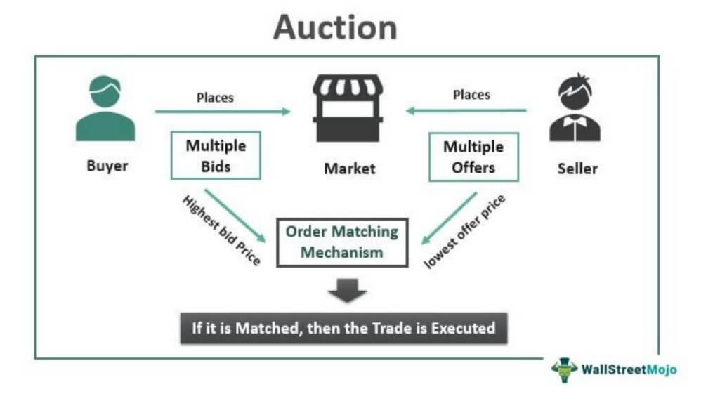

## Table of Contents

## What is an auction?

An auction is a way to sell things where people bid against each other to buy an item. The person who bids the highest amount of money wins the item. Auctions can happen in person, like at an auction house, or online, where people can bid from their computers or phones.

There are different types of auctions. In some auctions, the price starts low and goes up as people bid higher. This is called an ascending auction. In other auctions, the price starts high and goes down until someone decides to buy it. This is called a descending auction. Auctions are used to sell many things, like art, cars, and even houses.

## What are the different types of auctions?

There are several types of auctions, each with its own way of setting the price. One common type is the ascending auction, also known as an English auction. In this type, the auction starts with a low price, and people keep bidding higher until no one wants to bid anymore. The highest bidder wins the item. This is what most people think of when they hear the word "auction."

Another type is the descending auction, also called a Dutch auction. Here, the auction starts with a high price, and the price keeps going down until someone decides to buy the item. The first person to accept the current price wins. This type of auction is faster because it doesn't take as long for people to keep bidding higher.

There are also sealed bid auctions, where everyone writes down their highest bid secretly and gives it to the auctioneer. The auctioneer then opens all the bids and the highest one wins. This type is used when the seller wants to keep the bidding private. Each type of auction has its own benefits and is used for different kinds of items.

## How does a traditional auction work?

A traditional auction, often called an English auction, is a way to sell things where people bid against each other. The auction starts with a low price, and people shout out higher prices they are willing to pay. The auctioneer, who is in charge of the auction, keeps track of the bids and encourages people to bid higher. The bidding continues until no one wants to bid anymore. The person who made the highest bid wins the item and has to pay the amount they bid.

These auctions can happen in a special place called an auction house, or they can happen online. In an auction house, people come together and bid in person. The auctioneer stands in front of everyone and calls out the current highest bid. Online auctions work the same way, but people bid from their computers or phones. The auctioneer or a computer program keeps track of the bids. Traditional auctions are used to sell many different things, like art, cars, and even houses.

## What is the role of an auctioneer?

An auctioneer is the person who runs the auction. They start the bidding by calling out the first price. Then, they keep track of all the bids people make. The auctioneer's job is to make sure everyone follows the rules and to keep the auction moving quickly. They encourage people to bid higher by talking fast and using a special way of speaking that is hard to understand if you are not used to it.

The auctioneer also helps to make the auction exciting. They use their voice and body language to get people interested and to make them want to bid more. At the end of the auction, the auctioneer announces the winner, who is the person that made the highest bid. Then, they make sure the winner pays the right amount of money and gets the item they won. The auctioneer plays a big part in making sure the auction goes smoothly and everyone has a good time.

## What are the benefits of participating in an auction?

Participating in an auction can be a fun and exciting way to buy things. You get to be part of a lively event where you can see and hear other people bidding. It's like a game where you try to win the item you want by bidding higher than everyone else. This can make buying things more interesting and enjoyable than just going to a store.

Auctions also give you a chance to find unique items that you might not find anywhere else. Sometimes, you can even get these items for a lower price than you would pay in a store. This is because the price is decided by the people bidding, not by the seller. So, if not many people want the item, you might be able to buy it for less money.

## How can someone prepare for bidding at an auction?

Before you go to an auction, it's good to do some homework. First, find out what kind of auction it is and what rules you need to follow. Some auctions happen in person, and others are online. Knowing the rules will help you bid the right way. Next, look at the items that will be sold at the auction. If you see something you like, learn about it. Find out how much it might be worth so you know how much to bid. It's also smart to set a budget for yourself. Decide the most money you want to spend and stick to it, so you don't end up paying too much.

On the day of the auction, make sure you get there early if it's in person. This gives you time to look at the items up close and ask any questions you have. If it's an online auction, make sure your internet connection is good and you know how to use the bidding website. When the auction starts, stay calm and focused. Listen to the auctioneer and watch the other bidders. If you see the price getting too high, it's okay to stop bidding. Remember, the goal is to get a good deal, not to win at any cost.

## What are common strategies used by bidders in auctions?

Bidders often use different strategies to try to win at auctions. One common strategy is called sniping. This means waiting until the very last moment to place a bid. Snipers hope that other bidders won't have time to react and bid higher. Another strategy is to bid early and often. Some people think that if they keep bidding, other people will get tired and stop. This can work, but it can also make other people want to bid more.

Another strategy is to set a limit and stick to it. Smart bidders decide before the auction starts how much they are willing to pay for an item. They don't let the excitement of the auction make them spend more than they planned. Some bidders also try to read other people's body language or watch how they bid. They might see if someone is getting tired or if they really want the item. This can help them decide when to bid and how much to bid.

## How do online auctions differ from in-person auctions?

Online auctions and in-person auctions are different in a few ways. Online auctions happen on the internet, so you can bid from anywhere using your computer or phone. You don't have to be in the same place as the auction. This makes it easier for more people to join the auction, and you can bid on items from all over the world. In-person auctions happen in a real place, like an auction house, where people come together to bid. You have to be there to bid, and you can see and touch the items before the auction starts.

Another difference is how the bidding works. In online auctions, you usually type in your bid and the computer keeps track of it. The auction might last for a few days, and you can see the current highest bid at any time. In-person auctions are faster. An auctioneer talks quickly and keeps the bidding moving. You have to shout out your bids, and the auction can be over in just a few minutes. Both types of auctions can be fun, but they work in different ways.

## What legal considerations should be taken into account when participating in an auction?

When you take part in an auction, there are some legal things you need to think about. First, you need to understand the auction's rules. Each auction might have different rules about how to bid, what happens if you win, and how to pay. Make sure you read and understand these rules before you start bidding. If you win an item, you have to pay for it and take it with you, or the auction house might keep your money or take you to court.

Another important thing is to know about the item you are bidding on. Some auctions have a "buyer beware" rule, which means you buy the item as it is, even if it has problems. If you don't check the item before bidding, you might end up with something that doesn't work or isn't what you thought it was. Also, some items might have legal issues, like if they are stolen or if you need a special license to own them. Always make sure the item is legal and okay to buy before you bid.

## How do auction houses determine the value of items?

Auction houses figure out the value of items by looking at a few things. They start by checking what similar items have sold for in the past. This helps them see how much people are willing to pay for that kind of item. They also think about how rare the item is. If not many people have it, it might be worth more money. The condition of the item matters too. If it's in good shape, it will be worth more than if it's broken or damaged.

Sometimes, auction houses ask experts to help them decide the value. These experts know a lot about certain types of items, like art or old coins. They can tell if an item is really old or if it's a fake. The experts' opinions help the auction house set a starting price that is fair. This way, the auction house can make sure the item sells for a good price and the buyer gets a fair deal.

## What are the economic theories behind auction mechanisms?

Auctions are interesting to economists because they show how people make choices and set prices. One important theory is called the revenue equivalence theorem. This theory says that, under certain conditions, different types of auctions will make the same amount of money for the seller. For example, an English auction and a sealed bid auction might end up with the same final price if everyone bidding knows the same information and bids honestly. This helps economists understand that the way an auction is run might not matter as much as they thought.

Another theory is about how people act in auctions. Bidders often have to guess what other people know and what they will bid. This is called game theory. In an auction, each bidder tries to win the item for the lowest price possible, but they also have to think about what everyone else is doing. If they bid too low, they might lose the item, but if they bid too high, they might pay more than they need to. Economists study these strategies to learn more about how people make decisions when they don't have all the information.

## How can technology enhance the auction process?

Technology can make auctions better in many ways. One big way is by making it easier for more people to join. With online auctions, people from all over the world can bid on items without having to go to an auction house. This means more people can see the items and bid, which can make the prices go up. Also, technology helps keep track of bids and makes sure everything is fair. Computers can quickly show the current highest bid and keep a record of all the bids, so there's no confusion or mistakes.

Another way technology helps is by making auctions more fun and easy to use. Websites and apps can have pictures and videos of the items, so people can see them better before they bid. Some auctions even let you watch live video of the auction happening, so it feels like you're there even if you're far away. Technology also lets people set up automatic bids, where they tell the computer the most they want to pay, and the computer bids for them. This can save time and make sure they don't miss out on an item they really want.

## What is Algorithmic Trading in Auctions?

Algorithmic trading plays a transformative role in auction markets by executing trades based on predefined criteria, thereby enhancing the speed, precision, and reliability of transactions. By leveraging advanced computing power, these algorithms can process substantial volumes of data from various sources, enabling them to identify trading opportunities and risks much faster than human traders.

In auction environments, the central advantage of [algorithmic trading](/wiki/algorithmic-trading) lies in its ability to optimize trade execution in real-time. The algorithms analyze market trends, historical data, and current bidding information to make split-second decisions. This process significantly reduces latency in trade execution, allowing traders to capitalize on market movements that a manual approach might miss.

For example, consider an algorithm constructed to engage in high-frequency trading within an auction market. Such an algorithm is programmed to swiftly adjust its bidding strategy based on fluctuations in supply and demand, thereby exploiting transient market inefficiencies. The formula governing these trades might involve calculating moving averages to predict price movements:

$$
M_t = \frac{1}{n} \sum_{i=0}^{n-1} P_{t-i}
$$

Here, $M_t$ is the moving average at time $t$, $n$ is the number of periods included in the average, and $P_{t-i}$ represents the price of the asset at time point $t-i$.

Incorporating algorithmic trading into auction markets also alleviates human error. Unlike humans, algorithms perform consistently under pressure and do not succumb to emotional or psychological biases. This consistency is particularly valuable in high-pressure auction settings, where decision-making speed and accuracy are critical.

Moreover, these algorithms are continually updated to adapt to changing market conditions and regulatory environments. As markets evolve, algorithmic models incorporate enhancements to refine their strategies, ensuring they remain effective tools for navigating the complexities of modern auction markets. Through [machine learning](/wiki/machine-learning) techniques, algorithms can even predict future market trends with increasing accuracy, reducing the risk of unexpected market shifts.

By harnessing algorithmic trading, participants in auction markets can achieve a significant advantage, optimizing their trading outcomes and exploiting market inefficiencies that might otherwise go unnoticed.

## References & Further Reading

[1]: Bergstra, J., Bardenet, R., Bengio, Y., & Kégl, B. (2011). ["Algorithms for Hyper-Parameter Optimization."](https://papers.nips.cc/paper/4443-algorithms-for-hyper-parameter-optimization) Advances in Neural Information Processing Systems 24.

[2]: ["Advances in Financial Machine Learning"](https://www.amazon.com/Advances-Financial-Machine-Learning-Marcos/dp/1119482089) by Marcos Lopez de Prado

[3]: ["Evidence-Based Technical Analysis: Applying the Scientific Method and Statistical Inference to Trading Signals"](https://www.amazon.com/Evidence-Based-Technical-Analysis-Scientific-Statistical/dp/0470008741) by David Aronson

[4]: ["Machine Learning for Algorithmic Trading"](https://github.com/PacktPublishing/Machine-Learning-for-Algorithmic-Trading-Second-Edition) by Stefan Jansen

[5]: ["Quantitative Trading: How to Build Your Own Algorithmic Trading Business"](https://www.amazon.com/Quantitative-Trading-Build-Algorithmic-Business/dp/1119800064) by Ernest P. Chan