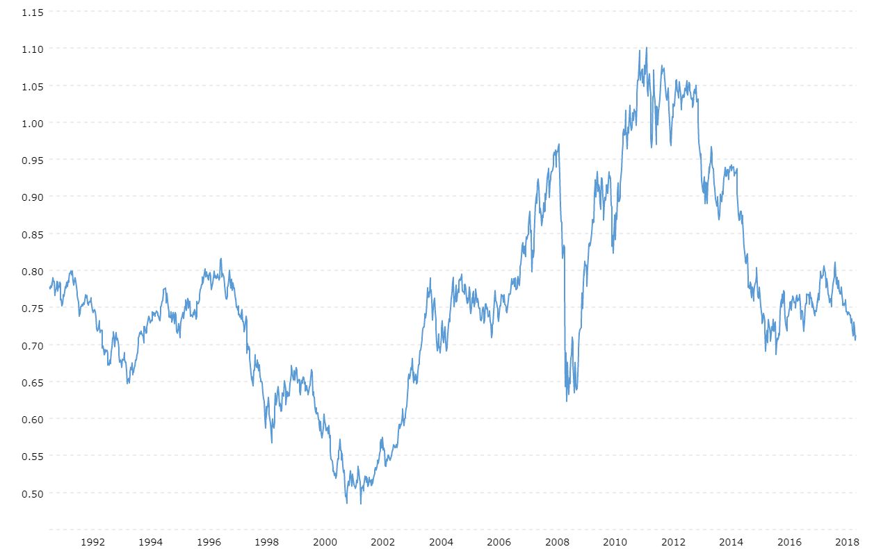

## Table of Contents

## What is the AUD/USD exchange rate?

The AUD/USD exchange rate shows how many US dollars you can get for one Australian dollar. It changes every day because of things like how well the economies of Australia and the US are doing, what's happening in the world, and what people think will happen in the future. If the rate is going up, it means the Australian dollar is getting stronger compared to the US dollar.

You can find the current AUD/USD exchange rate on financial news websites, banks, or special apps for currency exchange. For example, if the rate is 0.70, it means you can get 0.70 US dollars for every Australian dollar. This rate is important for people who travel, do business, or invest money between Australia and the US.

## Why is the AUD/USD exchange rate important?

The AUD/USD exchange rate is important because it tells us how much one Australian dollar is worth in US dollars. This matters a lot for people who travel between Australia and the US. If you're going on a trip, you need to know this rate to figure out how much your money is worth in the other country. It also affects how much things cost when you're shopping or eating out abroad.

This rate is also crucial for businesses that trade between Australia and the US. If a company in Australia sells things to the US, a higher AUD/USD rate means they get more Australian dollars for their US earnings, which can be good for their profits. On the flip side, if the rate goes down, it might hurt their business. Investors also watch this rate closely because it can affect the value of their investments in either country.

In short, the AUD/USD exchange rate influences everyday life for travelers, the success of businesses, and the decisions of investors. It's a key piece of information that connects the economies of Australia and the US, showing how their financial health impacts each other.

## How has the AUD/USD exchange rate changed over the past year?

Over the past year, the AUD/USD exchange rate has gone up and down a lot. At the start of the year, it was around 0.68. It then went as high as 0.72 in the middle of the year because the Australian economy was doing well, and people thought it would keep doing well. But then, it dropped back down to about 0.67 towards the end of the year. This happened because the US economy was doing better than expected, and the Australian economy had some problems.

These changes in the exchange rate affect people and businesses in both countries. For example, when the rate was higher, Australians traveling to the US could get more US dollars for their money, making their trips cheaper. But when the rate went down, their trips became more expensive. Businesses that sell things from Australia to the US made more money when the rate was high, but less when it was low. So, the ups and downs of the AUD/USD rate have a big impact on everyday life and the economy.

## What are the main factors influencing the AUD/USD exchange rate?

The AUD/USD exchange rate is affected by many things. One big factor is how well the economies of Australia and the US are doing. If Australia's economy is doing great, people might want to buy more Australian dollars, which can make the AUD/USD rate go up. But if the US economy is doing better, people might want to buy more US dollars instead, which can make the rate go down. Another important thing is what people think will happen in the future. If they think Australia will do well, they might buy more AUD now, pushing the rate up.

Interest rates also play a big role. If the interest rates in Australia go up, it can make the AUD more attractive to investors because they can earn more money by holding onto it. On the other hand, if US interest rates go up, the USD might become more attractive, which can push the AUD/USD rate down. Other things like political news, natural disasters, and big changes in the prices of things Australia sells a lot of, like iron ore and coal, can also move the exchange rate. All these factors together make the AUD/USD rate go up and down.

## How does the economic performance of Australia affect the AUD/USD rate?

When Australia's economy is doing well, it usually makes the Australian dollar (AUD) stronger compared to the US dollar (USD). This is because a strong economy means more people and businesses want to buy AUD. They might want to invest in Australia or buy things from there. If Australia is selling a lot of its big exports like iron ore and coal, that can also make the AUD stronger because other countries need to buy AUD to pay for these goods. So, when the Australian economy is booming, the AUD/USD exchange rate often goes up.

On the other hand, if Australia's economy is not doing so well, the AUD can get weaker against the USD. This happens because fewer people and businesses want to buy AUD when the economy is struggling. They might be worried about losing money if they invest in Australia. Also, if fewer countries are buying Australia's exports, there's less demand for AUD, which can push the AUD/USD rate down. So, the health of Australia's economy plays a big role in deciding how strong the AUD is compared to the USD.

## What impact does U.S. monetary policy have on the AUD/USD exchange rate?

U.S. monetary policy, which is mainly set by the Federal Reserve, can really affect the AUD/USD exchange rate. When the Federal Reserve raises interest rates, it often makes the US dollar (USD) stronger. This is because higher interest rates mean people and businesses can earn more money by holding onto USD. So, if the U.S. raises its interest rates, more people might want to buy USD, which can make the AUD/USD rate go down because the Australian dollar (AUD) becomes less attractive compared to the USD.

On the other hand, if the Federal Reserve lowers interest rates, it can make the USD weaker. Lower interest rates mean less money to be made from holding onto USD, so people might look for other currencies like the AUD. This can make the AUD/USD rate go up because the AUD becomes more attractive. Also, the Federal Reserve's actions can affect how people think about the U.S. economy, which can also change the demand for USD and impact the AUD/USD rate.

## Can you describe the historical highs and lows of the AUD/USD exchange rate?

Over the years, the AUD/USD exchange rate has seen some big ups and downs. The highest the rate has ever been was back in July 2011, when it reached about 1.10. This means you could get 1.10 US dollars for every Australian dollar. That was a great time for Australians traveling to the US or doing business there because their money was worth a lot. The rate was high because Australia's economy was doing really well, especially with its big exports like iron ore and coal.

On the other hand, the lowest the AUD/USD rate has been in recent history was in March 2020, when it dropped to about 0.55. That was during the start of the global health crisis, which made everyone worried about the economy. When the rate is low like this, it means the Australian dollar is weak compared to the US dollar. This can make trips to the US more expensive for Australians and can affect businesses that sell things from Australia to the US. The rate goes up and down because of many things, like how well the economies of Australia and the US are doing and what people think will happen in the future.

## How do geopolitical events influence the AUD/USD exchange rate?

Geopolitical events can really shake up the AUD/USD exchange rate. When something big happens in the world, like a war or a trade disagreement, it can make people and businesses worried about the future. If the event makes people think that Australia's economy might not do well, they might sell off their Australian dollars. This can make the AUD weaker compared to the USD, so the AUD/USD rate goes down. For example, if there's a big problem with one of Australia's main trading partners, like China, it could hurt Australia's exports and make the AUD drop.

On the other hand, if a geopolitical event makes the US economy look less stable, people might want to buy more Australian dollars instead. This can happen if there's a lot of uncertainty in the US, like during big political changes or disagreements. When people think the US might not do well, they might move their money to other countries, like Australia, which can make the AUD stronger and push the AUD/USD rate up. So, big events around the world can make the exchange rate go up and down by changing what people think about the future of both countries' economies.

## What are some trading strategies for the AUD/USD pair?

When trading the AUD/USD pair, one common strategy is to use technical analysis. This means looking at charts and patterns to guess where the exchange rate might go next. Traders often use tools like moving averages, support and resistance levels, and indicators like the Relative Strength Index (RSI) to help them decide when to buy or sell. For example, if the AUD/USD rate is going up and hits a resistance level, a trader might think it's a good time to sell because they expect the rate to go down soon. On the other hand, if the rate is going down and hits a support level, it might be a good time to buy because they think the rate will go back up.

Another strategy is to pay attention to economic news and events that can affect the AUD/USD rate. This is called [fundamental analysis](/wiki/fundamental-analysis). Traders watch things like interest rate decisions from the Federal Reserve and the Reserve Bank of Australia, employment reports, and big news about Australia's exports like iron ore and coal. If there's good news about Australia's economy, traders might buy AUD expecting the rate to go up. If there's bad news about the US economy, they might also buy AUD for the same reason. By keeping an eye on these events, traders can make better guesses about where the exchange rate is headed and make their trading decisions based on that.

Some traders also use a mix of both technical and fundamental analysis. They might look at the charts to see where the AUD/USD rate is going, but also keep an eye on the news to understand why it's moving. This can help them make more informed decisions. For example, if the charts show the rate is about to break through a resistance level and there's also good economic news from Australia, a trader might feel more confident about buying AUD. By combining these two approaches, traders can try to get the best of both worlds and make smarter trades.

## How does the interest rate differential between Australia and the U.S. affect the AUD/USD rate?

The interest rate differential between Australia and the U.S. plays a big role in the AUD/USD exchange rate. When the interest rates in Australia are higher than in the U.S., it can make the Australian dollar (AUD) more attractive to investors. They might want to move their money to Australia to earn more from the higher interest rates. This increased demand for AUD can push the AUD/USD rate up, making the Australian dollar stronger compared to the US dollar.

On the other hand, if the interest rates in the U.S. are higher than in Australia, it can make the US dollar (USD) more appealing. Investors might want to keep their money in the U.S. to take advantage of the better returns. This can lead to more people selling AUD and buying USD, which can push the AUD/USD rate down, making the Australian dollar weaker compared to the US dollar. So, the difference in interest rates between the two countries can really move the exchange rate one way or the other.

## What role do commodity prices play in the AUD/USD exchange rate?

Commodity prices have a big impact on the AUD/USD exchange rate because Australia is a big exporter of commodities like iron ore, coal, and gold. When the prices of these commodities go up, it's good for Australia's economy. More countries want to buy these things from Australia, so they need more Australian dollars (AUD) to pay for them. This increased demand for AUD can make it stronger compared to the US dollar (USD), pushing the AUD/USD rate up.

On the flip side, if commodity prices go down, it can hurt Australia's economy. Fewer countries want to buy Australia's exports, so there's less demand for AUD. This can make the AUD weaker compared to the USD, causing the AUD/USD rate to go down. So, keeping an eye on commodity prices is important for understanding how the AUD/USD rate might change.

## How can one forecast future movements in the AUD/USD exchange rate using technical analysis?

To forecast future movements in the AUD/USD exchange rate using technical analysis, traders look at charts and patterns to see where the rate might go next. They use tools like moving averages, which help smooth out price data to see the overall trend. If the AUD/USD rate is above its moving average, it might keep going up. If it's below, it might keep going down. Traders also look for support and resistance levels. Support is a price level where the rate often stops falling and might start going up again. Resistance is where the rate often stops rising and might start going down. By watching these levels, traders can guess when the rate might change direction.

Another important tool is the Relative Strength Index (RSI), which shows if the AUD/USD rate is overbought or oversold. If the RSI is over 70, it means the rate might be too high and could go down soon. If it's under 30, it might be too low and could go up. Traders also look at chart patterns like head and shoulders or double tops and bottoms. These patterns can signal if the rate is about to change direction. By combining all these tools, traders can make better guesses about where the AUD/USD rate might go next.

## How can risk management be effectively implemented in AUD/USD algorithmic trading?

### Risk Management in AUD/USD Algo Trading

Effective risk management is crucial in AUD/USD [algorithmic trading](/wiki/algorithmic-trading), especially given the [volatility](/wiki/volatility-trading-strategies) associated with high-frequency trading ([HFT](/wiki/high-frequency-trading-strategies)) strategies. High-frequency trading, characterized by rapid execution of numerous trades within milliseconds, magnifies both potential returns and risks. Identifying and mitigating these risks, therefore, becomes a key pillar for successful trading.

#### Identifying and Mitigating Risks in High-Frequency Trading

One of the primary risks in high-frequency trading is market volatility. Volatility can lead to significant slippage, where there is a difference between the expected price of a trade and the actual price at which the trade is executed. This discrepancy can erode potential profits quickly. Additionally, latency issues, where there is a delay in executing trades due to technological constraints, can result in trades being executed at undesired prices.

To mitigate these risks, traders can implement robust latency reduction techniques such as optimizing network paths and using co-location services, which involve placing trading systems physically close to exchange servers. Additionally, implementing circuit breakers can prevent drastic losses by halting trading activities when predetermined thresholds are reached.

#### Role of Leverage in AUD/USD Trading

Leverage is another [factor](/wiki/factor-investing) that significantly impacts risk in [forex](/wiki/forex-system) trading. It allows traders to control a large position with a small amount of capital, potentially amplifying both gains and losses. The use of leverage should be managed with caution, particularly in AUD/USD trading, where market movements can be swift and unpredictable due to factors such as [interest rate](/wiki/interest-rate-trading-strategies) announcements and changes in commodity prices.

A common practice is to use lower leverage ratios, which means using more of the trader's capital to cover a position. This approach reduces the risk of margin calls and forces liquidation in volatile markets. Additionally, setting strict stop-loss orders helps prevent excessive losses by automatically exiting a position when it reaches a certain loss limit.

#### Strategies for Effective Risk Management

Successful risk management in algorithmic trading involves employing a comprehensive strategy that covers diversification, position sizing, and continuous monitoring. Diversification involves spreading investments across different asset classes or currency pairs to reduce the impact of adverse movements in any single market.

Position sizing is another crucial aspect, wherein traders determine the amount of capital to allocate for each trade based on their risk tolerance. This can be calculated using the formula:

$$
\text{Position Size} = \frac{\text{Account Risk \%} \times \text{Account Balance}}{\text{Trade Risk\%}}
$$

This formula ensures that the potential loss from each trade does not exceed a specified percentage of the account balance.

Continuous monitoring and adjustment of strategies are essential to accommodate changing market conditions and to incorporate new data analytics, [machine learning](/wiki/machine-learning) models, or heuristics designed to predict market movements more accurately. Automation can assist in this adaptive process by generating alerts or automatically rebalancing portfolios based on predefined criteria.

In summary, effective risk management in AUD/USD algo trading involves reducing exposure to volatility and leverage risks, diversifying investments, and implementing automated strategies for continuous monitoring and adjustment. These components together provide a structured approach to safeguard against potential losses while maintaining opportunities for profit in high-frequency forex trading.

## References & Further Reading

[1]: Diane Coyle, "GDP: A Brief but Affectionate History," Princeton University Press, 2014.

[2]: ["Algorithmic and High-Frequency Trading"](https://www.cambridge.org/us/universitypress/subjects/mathematics/mathematical-finance/algorithmic-and-high-frequency-trading) by Álvaro Cartea, Sebastian Jaimungal, and José Penalva

[3]: Bodie, Zvi, Kane, Alex, Marcus, Alan J. "Essentials of Investments," McGraw-Hill Education, 2019. 

[4]: ["A Foreign Exchange Primer"](https://www.amazon.com/Foreign-Exchange-Primer-Wiley-Finance/dp/0470851627) by Shani Shamah

[5]: Narang, Rishi K. "Inside the Black Box: A Simple Guide to Quantitative and High Frequency Trading," John Wiley & Sons, 2013.