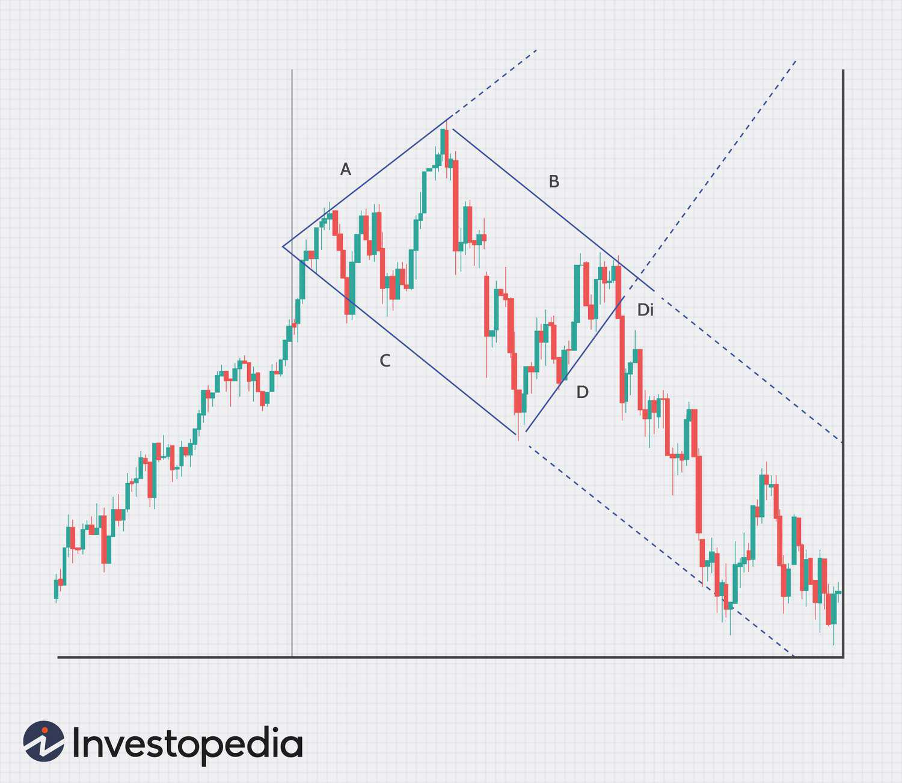

The AUD/USD currency pair, representing the exchange rate between the Australian Dollar (AUD) and the United States Dollar (USD), is a major pair in the forex market. It is widely traded due to the economic significance of both nations and their global economic connections. Factors such as commodity price fluctuations, interest rate differentials, and macroeconomic indicators drive the pair's exchange rate, making it a focal point for traders and analysts in the forex market. Australia's economy, bolstered by vast natural resources, is significantly affected by commodity prices, particularly metals and agriculture, which influences the AUD's valuation. Conversely, the USD's value is affected by the broader economic landscape of the United States, the world's largest economy. Consequently, the AUD/USD pair attracts substantial trading volumes, providing liquidity and volatility that appeal to forex traders.

Algorithmic trading, often referred to as algo trading, involves using computer algorithms to execute orders, analyze market data, and optimize trading strategies with minimal human intervention. Its impact on the forex market is profound, as it enhances precision, speed, and efficiency. Algorithms can process vast data sets, identify patterns, and execute trades at speeds beyond human capability. This has transformed the landscape of forex trading, allowing for the development of complex strategies and the ability to exploit small market inefficiencies.



The objective of this article is to provide an in-depth understanding of how algorithms are utilized in trading the AUD/USD currency pair. By examining the components that influence this pair's value and exploring algorithmic strategies used for its trading, the article aims to equip traders with insights into optimizing their trading approaches using algorithmic systems.

## Table of Contents

## Understanding the AUD/USD Forex Market

The AUD/USD currency pair, commonly referred to as the "Aussie," represents the exchange rate between the Australian Dollar (AUD) and the United States Dollar (USD). This currency pair is one of the most actively traded in the forex market due to the significant economic relations between Australia and the U.S., as well as the influence of global commodity trading where Australia is a major player.

Historically, the AUD/USD has been used by market participants as a proxy for global risk appetite because of the Australian economy's reliance on commodity exports such as iron ore, coal, and natural gas. The pair was floated in 1983, allowing its value to be determined by the foreign exchange market without direct intervention from the Reserve Bank of Australia. Since then, it has experienced notable fluctuations, reflective of both local economic conditions and wider economic developments.

Several key factors influence the exchange rates of the AUD/USD pair:

1. **Commodity Prices**: As a major exporter of commodities, Australia’s economy is significantly influenced by global commodity prices. An increase in commodity prices generally strengthens the AUD as foreign buyers need to purchase more Australian dollars to pay for these goods.

2. **Interest Rate Differentials**: The interest rate differentials between Australia and the U.S. significantly impact the AUD/USD exchange rate. Generally, a higher interest rate in Australia compared to the U.S. would attract capital flows into the Australian economy, leading to an appreciation of the AUD relative to the USD.

3. **Economic Performance**: The health of the Australian and U.S. economies plays a crucial role in determining the AUD/USD value. Economic indicators such as GDP growth, employment figures, and inflation rates can influence currency valuations. For instance, strong economic performance in Australia might lead to a stronger AUD, whereas robust U.S. data might increase the USD's strength.

4. **Political Stability and Global Events**: Political stability in both countries can influence investor confidence and affect the AUD/USD rate. Additionally, global geopolitical events and economic data releases can create volatility in this currency pair.

The Australian and U.S. central banks, the Reserve Bank of Australia (RBA) and the Federal Reserve, respectively, also influence the AUD/USD rate through monetary policy adjustments such as changing interest rates or quantitative easing measures. The interplay of these factors creates dynamic trading opportunities in the AUD/USD [forex](/wiki/forex-system) market.

Understanding these influences is crucial for traders and investors who engage with this currency pair, as the ability to anticipate these changes can be a significant advantage in speculative and hedging activities within the forex market.

## Algorithmic Trading in Forex

Algorithmic trading in the foreign exchange (forex) market involves the use of computer programs and systems to execute trades based on predefined criteria. By leveraging advanced algorithms, traders can not only enhance the precision of their trades but also capitalize on speed and efficiency that surpasses human capabilities.

**Explanation of Algorithmic Trading and Its Benefits**

Algorithmic trading relies on complex algorithms that process vast amounts of data and make trading decisions with little to no human intervention. This method is particularly beneficial in the forex market, where trades occur 24 hours a day across different global exchanges. Some of the primary advantages of [algorithmic trading](/wiki/algorithmic-trading) include improved speed and accuracy, the ability to backtest strategies over historical data, and the minimization of human errors and emotions during trading.

Algorithms execute trades at high velocities, reacting to market conditions in fractions of a second—a crucial advantage in the fast-paced forex markets. By automatically buying or selling currencies based on programmed conditions, algorithms can efficiently manage orders and reduce transaction costs. This results in better overall execution quality, which can significantly impact profitability.

**How Algorithms Are Used in Forex Trading to Optimize Strategies**

Algorithms optimize trading strategies by using mathematical models to analyze market data and identify potential trading opportunities. These strategies can range from simple moving averages to complex quantitative models. Algorithms take into account a wide array of inputs, including historical price data, technical indicators, and market sentiment indicators. For instance, a typical moving average crossover strategy involves buying when a short-term moving average crosses above a long-term moving average, and selling when the opposite occurs.

In Python, this strategy can be implemented using libraries such as Pandas for data manipulation and NumPy for numerical calculations. Here's a basic example:

```python
import pandas as pd

# Load historical forex data for AUD/USD
data = pd.read_csv('aud_usd_data.csv')

# Calculate moving averages
short_window = 40
long_window = 100
data['short_mavg'] = data['Close'].rolling(window=short_window, min_periods=1, center=False).mean()
data['long_mavg'] = data['Close'].rolling(window=long_window, min_periods=1, center=False).mean()

# Generate buy/sell signals
data['signal'] = 0.0
data['signal'][short_window:] = np.where(data['short_mavg'][short_window:] > data['long_mavg'][short_window:], 1.0, 0.0)   
data['positions'] = data['signal'].diff()
```

**The Role of Technology in Enhancing Trading Efficiency**

Technology plays a pivotal role in algorithmic trading, offering platforms and tools that empower traders to develop, test, and deploy algorithms. The integration of advanced technologies, such as [machine learning](/wiki/machine-learning) and [artificial intelligence](/wiki/ai-artificial-intelligence), has further revolutionized algorithms, enabling them to learn from market data and adapt to new conditions.

Moreover, the emergence of high-performance computing and cloud technologies enhances the capability to process vast datasets and execute trades in microseconds. Trading platforms have also evolved to provide user-friendly interfaces and APIs, making it easier for traders of all levels to incorporate algorithmic trading into their strategies.

In conclusion, algorithmic trading has transformed the forex landscape by offering unparalleled speed, efficiency, and the capacity to systematically apply complex trading strategies with precision. As technology continues to advance, its role in optimizing trading strategies is likely to expand, offering even more sophisticated tools to traders.

## Strategies for Algo Trading AUD/USD

AUD/USD algorithmic trading employs a variety of strategies designed to capitalize on price movements of one of the most traded currency pairs. These strategies often incorporate technical analysis tools and indicators to enhance prediction accuracy and optimize trading outcomes.

**Common Strategies**

1. **Trend Following**: This strategy involves identifying and capitalizing on the direction of price movements, either upwards or downwards. Traders use moving averages (MA), moving average convergence divergence (MACD), and trend lines to identify trends. For example, a simple moving average crossover system might involve going long (buy) when a short-term moving average crosses above a long-term one, indicating an upward trend.

2. **Mean Reversion**: This assumes that prices will revert to their average over time. When prices deviate significantly from their historical average, traders expect a reversal. Bollinger Bands and relative strength index (RSI) are commonly used to identify potential mean reversion trades. A strategy could be to buy when the price touches the lower Bollinger Band and sell when it hits the upper band.

3. **Breakout Strategies**: These aim to capture price changes when the market exits a previous trading range. Breakouts are identified using support and resistance levels. A breakout strategy might involve placing a buy order above resistance and a sell order below support, prompting action when the price breaks through these levels.

**Technical Analysis Tools and Indicators**

1. **Moving Averages**: Simple (SMA) and exponential moving averages (EMA) help smooth price data to identify trend directions. EMAs give more weight to the latest data, enhancing responsiveness to new price information.

2. **Bollinger Bands**: A volatility indicator utilizing standard deviation and a moving average. Bollinger Bands aid in identifying overbought or oversold conditions.

3. **Relative Strength Index (RSI)**: A momentum oscillator measuring speed and change of price movements on a scale from 0 to 100. An RSI above 70 indicates overbought conditions, while below 30 suggests oversold conditions.

4. **MACD**: Used to identify trend changes and momentum by comparing short-term and long-term EMAs.

**Backtesting and Performance Analysis**

Backtesting is a critical component of developing a reliable algorithmic trading strategy. It involves running the trading strategy against historical market data to evaluate its efficacy. Essential aspects of [backtesting](/wiki/backtesting) include:

- **Data Integrity**: Ensures that historical data is accurate and relevant to the intended market conditions. Anomalies in data can lead to false signals and unreliable testing outcomes.

- **Performance Metrics**: Key metrics include profitability (e.g., net profit, return on investment), risk measures (e.g., maximum drawdown, Sharpe ratio), and trading efficiency (e.g., win/loss ratio, average profit per trade).

- **Overfitting**: This occurs when a strategy is specifically tailored to historical data, potentially reducing its effectiveness in live trading. To mitigate overfitting, algorithms should be tested across different data samples and market conditions.

Implementing robust strategies using the appropriate technical tools and rigorous backtesting can significantly enhance the success rates of AUD/USD algorithmic trading. These strategies allow traders to respond more efficiently to price dynamics, optimizing their trading operations.

## Risk Management in AUD/USD Algo Trading

### Risk Management in AUD/USD Algo Trading

Effective risk management is crucial in AUD/USD algorithmic trading, especially given the [volatility](/wiki/volatility-trading-strategies) associated with high-frequency trading ([HFT](/wiki/high-frequency-trading-strategies)) strategies. High-frequency trading, characterized by rapid execution of numerous trades within milliseconds, magnifies both potential returns and risks. Identifying and mitigating these risks, therefore, becomes a key pillar for successful trading.

#### Identifying and Mitigating Risks in High-Frequency Trading

One of the primary risks in high-frequency trading is market volatility. Volatility can lead to significant slippage, where there is a difference between the expected price of a trade and the actual price at which the trade is executed. This discrepancy can erode potential profits quickly. Additionally, latency issues, where there is a delay in executing trades due to technological constraints, can result in trades being executed at undesired prices.

To mitigate these risks, traders can implement robust latency reduction techniques such as optimizing network paths and using co-location services, which involve placing trading systems physically close to exchange servers. Additionally, implementing circuit breakers can prevent drastic losses by halting trading activities when predetermined thresholds are reached.

#### Role of Leverage in AUD/USD Trading

Leverage is another [factor](/wiki/factor-investing) that significantly impacts risk in forex trading. It allows traders to control a large position with a small amount of capital, potentially amplifying both gains and losses. The use of leverage should be managed with caution, particularly in AUD/USD trading, where market movements can be swift and unpredictable due to factors such as [interest rate](/wiki/interest-rate-trading-strategies) announcements and changes in commodity prices.

A common practice is to use lower leverage ratios, which means using more of the trader's capital to cover a position. This approach reduces the risk of margin calls and forces liquidation in volatile markets. Additionally, setting strict stop-loss orders helps prevent excessive losses by automatically exiting a position when it reaches a certain loss limit.

#### Strategies for Effective Risk Management

Successful risk management in algorithmic trading involves employing a comprehensive strategy that covers diversification, position sizing, and continuous monitoring. Diversification involves spreading investments across different asset classes or currency pairs to reduce the impact of adverse movements in any single market.

Position sizing is another crucial aspect, wherein traders determine the amount of capital to allocate for each trade based on their risk tolerance. This can be calculated using the formula:

$$
\text{Position Size} = \frac{\text{Account Risk \%} \times \text{Account Balance}}{\text{Trade Risk\%}}
$$

This formula ensures that the potential loss from each trade does not exceed a specified percentage of the account balance.

Continuous monitoring and adjustment of strategies are essential to accommodate changing market conditions and to incorporate new data analytics, machine learning models, or heuristics designed to predict market movements more accurately. Automation can assist in this adaptive process by generating alerts or automatically rebalancing portfolios based on predefined criteria.

In summary, effective risk management in AUD/USD algo trading involves reducing exposure to volatility and leverage risks, diversifying investments, and implementing automated strategies for continuous monitoring and adjustment. These components together provide a structured approach to safeguard against potential losses while maintaining opportunities for profit in high-frequency forex trading.

## Benefits and Challenges of AUD/USD Algo Trading

When trading the AUD/USD currency pair, algorithmic strategies offer a range of benefits designed to enhance trading efficiency and profitability. One of the primary advantages is the ability to execute trades at a speed and frequency that is beyond human capability. Algorithms can swiftly analyze multiple market indicators and execute trades in milliseconds, allowing traders to capitalize on fleeting market opportunities. This rapid execution can significantly reduce the slippage and transaction costs associated with manual trading.

Moreover, algorithms can maintain objectivity by eliminating emotional biases, which often lead to suboptimal trading decisions. This objectivity is crucial for dealing with AUD/USD, where market volatility can be influenced by numerous geopolitical and economic factors. Advanced algorithms can process vast amounts of data to detect patterns and trends that might not be apparent to human traders, making them particularly suitable for a currency like the AUD/USD, which is influenced by fluctuating commodity prices and interest rate changes.

Despite these benefits, traders face several challenges when implementing automated strategies. Developing a robust algorithm requires an in-depth understanding of both the forex market and programming skills. Even with well-constructed algorithms, there is a risk of overfitting, where a strategy that performs exceptionally on historical data fails to deliver similar results in live markets. Additionally, the dynamic nature of the forex market means that a previously successful algorithm may become obsolete as market conditions change.

Another challenge is the technical complexity and cost of maintaining the infrastructure needed for algorithmic trading. Reliable high-speed internet, advanced computing capabilities, and up-to-date software are essential, and any technical failure can lead to significant trading losses. Moreover, regulatory compliance adds another layer of complexity, as traders must ensure their algorithms adhere to financial regulations in both Australia and the U.S.

Market sentiment and economic events can also have a profound impact on algo trading systems targeting the AUD/USD pair. Sudden economic announcements or unexpected geopolitical developments can result in rapid market swings. While algorithms are designed to respond quickly to such changes, their predefined logic may not always accurately interpret the nuances of human-driven market sentiment, potentially leading to erroneous trading decisions. Therefore, traders must frequently update their algorithms to account for new variables and shifting market conditions, ensuring continued alignment with their trading strategies.

## Future of AUD/USD Algo Trading

**Future of AUD/USD Algo Trading**

Emerging trends in algorithmic trading within the forex market have been shaped by technological advancements, such as artificial intelligence, machine learning, and high-frequency trading platforms. These technologies have opened new avenues for trading the AUD/USD currency pair, offering increased accuracy in forecasting price movements and optimizing trading decisions.

Artificial Intelligence (AI) and machine learning (ML) are increasingly integral to the development of sophisticated trading algorithms. These technologies enable the processing of vast amounts of data to identify patterns and make predictive decisions. In the context of AUD/USD trading, AI systems can analyze economic indicators, geopolitical events, and market sentiment to forecast currency fluctuations with greater precision. According to a study by J.P. Morgan, AI-driven trading strategies have demonstrated improved performance over traditional methods, particularly in volatile markets [1].

High-frequency trading (HFT) is another significant trend influencing the future of AUD/USD algo trading. By leveraging cutting-edge hardware and network infrastructure, traders can execute transactions at microsecond speeds, capitalizing on minimal price discrepancies for profit. The role of HFT in increasing market [liquidity](/wiki/liquidity-risk-premium) and efficiency is well-documented, though it requires managing significant risks associated with rapid market movements [2].

The future outlook for AUD/USD algo trading is promising, given these technological advancements. Traders increasingly rely on algorithmic strategies to navigate the complexities of forex markets. The ability to process real-time data and react instantly to market changes provides a strategic edge in the highly competitive forex market. As technology continues to evolve, new tools and platforms will further enhance the capabilities of algorithmic trading systems.

Expert opinions suggest continued growth and sophistication in algorithmic trading for forex markets. The integration of quantum computing and blockchain technologies could revolutionize the way trading is conducted, offering unprecedented computational power and secure transaction processing. Quantum computing, in particular, could exponentially speed up data analysis processes, allowing for even faster execution of trades and the development of more complex trading models [3].

In conclusion, the future of AUD/USD algo trading is closely tied to ongoing technological innovations. The increasing reliance on artificial intelligence, high-frequency trading, and potential breakthroughs in quantum computing are poised to reshape the forex market landscape. Traders and investors are encouraged to embrace these technological changes, staying informed and adaptable to leverage the full potential of algorithmic trading strategies.

**References:**
1. J.P. Morgan, "Artificial Intelligence: The Robot Decision Makers," 2022.
2. Aldridge, I., "High-Frequency Trading: A Practical Guide to Algorithmic Strategies and Trading Systems," Wiley Trading, 2013.
3. Harrow, A. W., Hassidim, A., and Lloyd, S., "Quantum Algorithm for Linear Systems of Equations," Physical Review Letters, 2022.

## Conclusion

In summary, the AUD/USD currency pair serves as a pivotal entity within the forex market, influenced by multiple factors including commodity prices, interest rate differentials, and the economic health of Australia and the United States. Algorithmic trading, characterized by the use of automated strategies to optimize trading decisions, has become a significant force in the forex sector. It harnesses technology to improve trading efficiency and strategy execution, particularly by utilizing computational models for timely decision-making.

Algorithmic trading strategies for AUD/USD typically involve technical analysis tools and indicators, which must be rigorously tested and validated through backtesting to ensure their efficacy. Risk management is paramount in algorithmic forex trading, requiring meticulous attention to leveraging tactics and potential market volatility. 

The benefits of algo trading are substantial, offering enhanced speed, precision, and the capacity to operate continuously without emotional biases that can affect human traders. However, challenges persist, including the need to adapt to market sentiments and economic events that can impact automated strategies.

Looking forward, technological advancements will continue to reshape the forex trading landscape, with the potential for more sophisticated algorithms and tools. Staying abreast of these evolving technologies is crucial for traders seeking to maintain a competitive edge. In conclusion, exploring algorithmic trading for the AUD/USD pair is not just a viable option but a strategic move for those aiming to capitalize on the dynamic nature of forex markets. Embracing these automated approaches can lead to more informed, data-driven trading decisions and potentially more successful trading outcomes.

## References & Further Reading

[1]: Diane Coyle, "GDP: A Brief but Affectionate History," Princeton University Press, 2014.

[2]: ["Algorithmic and High-Frequency Trading"](https://www.cambridge.org/us/universitypress/subjects/mathematics/mathematical-finance/algorithmic-and-high-frequency-trading) by Álvaro Cartea, Sebastian Jaimungal, and José Penalva

[3]: Bodie, Zvi, Kane, Alex, Marcus, Alan J. "Essentials of Investments," McGraw-Hill Education, 2019. 

[4]: ["A Foreign Exchange Primer"](https://www.amazon.com/Foreign-Exchange-Primer-Wiley-Finance/dp/0470851627) by Shani Shamah

[5]: Narang, Rishi K. "Inside the Black Box: A Simple Guide to Quantitative and High Frequency Trading," John Wiley & Sons, 2013.