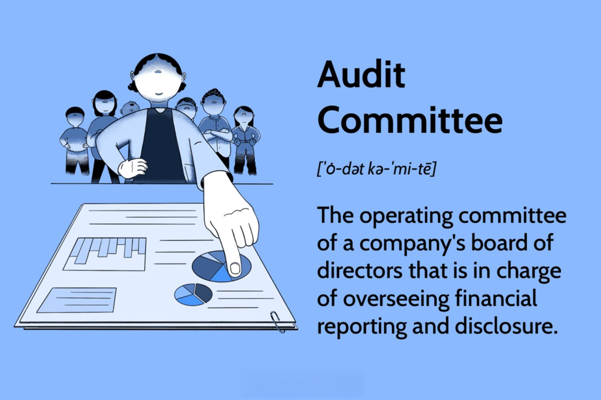

In today's rapidly evolving corporate landscape, the roles of corporate governance bodies have expanded beyond traditional boundaries, adapting to technological advancements that redefine market dynamics. The intricate relationship between corporate governance audit committees, financial oversight, and algorithmic trading has gained prominence as organizations strive for robust operational integrity and transparency. Algorithmic trading, driven by artificial intelligence and machine learning, has transformed traditional trading strategies into complex, high-frequency transactions. This technological advancement necessitates enhanced governance and audit mechanisms to manage associated risks, such as market manipulation and technological failures.

Corporate governance now requires a strategic approach that emphasizes accountability, fairness, and sustainable economic growth. This involves meticulous oversight by governance bodies to ensure compliance with evolving regulatory standards and ethical practices. Audit committees, as integral components of corporate governance, are tasked with the critical role of overseeing financial activities. Their responsibilities encompass the scrutiny of financial reports to accurately reflect the company’s financial position, thereby safeguarding investor interests.



The role of audit committees has progressively expanded to include oversight of algorithmic trading practices within organizations. They are required to maintain a vigilant approach in assessing the effectiveness of financial controls and risk management frameworks associated with complex trading algorithms. This includes ensuring pre-trade checks, ongoing monitoring, and robust control mechanisms.

As technology continues to evolve, the need for a proactive and informed governance framework becomes ever more pressing. The financial landscape calls for corporate governance bodies to anticipate emerging risks and opportunities, fostering an environment of transparency and integrity that aligns with industry best practices and regulatory expectations. In this context, audit committees are positioned as pivotal guardians of financial probity, tasked with navigating the complexities of modern financial ecosystems and ensuring that their oversight functions advance the strategic objectives of the organization while adhering to high ethical standards.

## Table of Contents

## Understanding Corporate Governance

Corporate governance is fundamentally the framework through which companies are directed and controlled, forming the backbone of any substantial corporate entity. It represents the ensemble of processes, customs, policies, laws, and institutions affecting the way a corporation is administered or controlled. The essential function of corporate governance is to balance the diverse interests of the company's stakeholders, which can include shareholders, management, customers, suppliers, financiers, government, and the broader community. This balancing act ensures a company's operations maintain accountability, transparency, and integrity—key pillars necessary for sustaining investor trust and achieving long-term success.

The board of directors stands at the core of corporate governance, acting as the principal decision-making body within the organization. The board's responsibilities include setting the company's strategic aims, providing leadership to implement them, overseeing the management of the business, and reporting to shareholders on their stewardship. Within the board, several committees play distinct roles in ensuring effective governance. Notably, the audit committee is tasked with overseeing financial reporting and disclosure, focusing on maintaining the accuracy and integrity of the financial statements, and facilitating smooth coordination with external auditors.

Corporate governance practices have significantly evolved, spurred by a more intricate financial ecosystem and increased demands for transparency and governance reforms. This evolution is particularly evident in the layers of regulatory compliance that contemporary businesses must navigate. From the Sarbanes-Oxley Act to ongoing developments in international regulatory standards, governance frameworks are continually refined to address emerging financial, ethical, and social challenges. Consequently, modern governance not only mitigates risks involved in corporate finance but also steers organizations through complex operational landscapes, aligning them with ethical practices and sustainable growth objectives.

## The Role of Audit Committees

Audit committees play a critical role in maintaining the accuracy and integrity of financial reports within organizations. Their fundamental responsibility involves ensuring that financial disclosures accurately reflect the financial position and performance of the company. This is achieved through the establishment and maintenance of a strong, cooperative relationship with external auditors. By overseeing the financial reporting process, audit committees help to detect and correct any discrepancies or inaccuracies in financial statements before they become public.

A significant aspect of an audit committee's duties is to ensure compliance with regulatory requirements. This involves not only adhering to accounting and auditing standards but also ensuring that financial practices meet the expectations set by bodies such as the Securities and Exchange Commission (SEC) in the United States. Regulatory compliance is vital not only to protect the company from legal penalties but to preserve shareholder trust and uphold the company's reputation in financial markets.

Independence and expertise are indispensable attributes for members of audit committees. Independence ensures that members can provide unbiased oversight without influence from management, thereby strengthening the credibility of financial reporting. The requisite expertise allows them to effectively understand complex financial statements, audit risks, and any issues arising from changes in accounting standards or regulatory environments. Members typically possess financial literacy and relevant experience in financial oversight to fulfill these responsibilities proficiently.

The audit committee serves as an essential intermediary between the board of directors, company management, and external auditors. This positioning allows the committee to facilitate open communication and to foster a culture of ethical financial practices within the organization. By acting as a conduit, the audit committee helps ensure that any concerns raised by auditors or management are promptly addressed and resolved in a manner consistent with the interests of shareholders and other stakeholders.

In recent years, the responsibilities of audit committees have expanded to include attention to emerging issues such as cybersecurity and risks associated with [algorithmic trading](/wiki/algorithmic-trading). The proliferation of cyber threats necessitates that audit committees integrate cybersecurity risks into their oversight of financial reporting. Additionally, as algorithmic trading becomes more prevalent, audit committees must understand its implications for market behavior and potential risks, such as unintended consequences of trading algorithms, market manipulation, or technology failures. These developments require audit committees to engage with experts in data security and algorithmic systems to maintain robust and comprehensive governance frameworks.

By embracing these expanded roles, audit committees ensure not only the precision and reliability of financial reports but also the broader financial integrity and resilience of their organizations in a rapidly changing technological landscape.

## Financial Oversight in the Age of Algorithmic Trading

Algorithmic trading, a process where computers are programmed to execute trades at high speed, relies on complex mathematical models and advanced technologies. This mode of trading presents unique challenges and opportunities for financial oversight. Audit committees play a crucial role in adapting to these changes, requiring enhanced vigilance and strategic measures to ensure market integrity and transparency.

Audit committees must implement and oversee rigorous pre-trade checks. These checks are critical in ensuring that the algorithms employed are compliant with regulatory standards and ethical considerations. Pre-trade checks involve scrutinizing algorithm parameters to ensure they function within acceptable risk thresholds and do not inadvertently facilitate market abuse or manipulation. 

Ongoing monitoring and control mechanisms are equally essential. Algorithmic trading systems operate at speeds and volumes beyond human capability, making real-time oversight crucial. Auditors need to continually evaluate the performance of these algorithms to detect any anomalous behavior that may indicate a breach of regulations or internal controls. For instance, anomaly detection algorithms can be integrated into the oversight process to identify irregularities in trading patterns, thereby enabling prompt corrective actions.

The Financial Conduct Authority (FCA) has highlighted the importance of governance and transparency in algorithmic trading operations. The FCA mandates robust control frameworks that include regular audits and comprehensive documentation of trading strategies and their development processes. These measures are designed to ensure that firms can demonstrate accountability in the deployment of trading algorithms.

Managing risks associated with complex trading algorithms is a priority for audit committees. Algorithmic trading risks include not only market risks but also operational risks, such as technology failures and data inaccuracies. Effective risk management strategies involve assessing these risks, establishing contingency plans, and regularly updating risk assessment protocols to incorporate new regulatory and market developments. 

Concerns over market manipulation and technology failures also underscore the amplified need for robust governance frameworks. Flash crashes and other disruptive market events have been partly attributed to algorithmic trading. These incidents demonstrate the potential consequences if adequate controls are not in place. As such, governance frameworks must address the potential for algorithms to amplify systemic risks, and committees must ensure transparency in algorithm testing and deployment.

In conclusion, as algorithmic trading continues to evolve, audit committees must remain proactive in enhancing their oversight capabilities. By implementing stringent checks, ongoing monitoring, and robust risk management protocols, committees can better manage the complexities introduced by algorithmic trading. This vigilant approach is crucial to maintaining market stability and investor confidence.

## Regulatory Compliance and Risk Management

Compliance with legal and regulatory standards is essential for maintaining market integrity in the dynamic and technology-driven financial sector. Audit committees play a crucial role in ensuring companies adhere to frameworks such as the Sarbanes-Oxley Act in the United States and the Markets in Financial Instruments Directive II (MiFID-II) in the European Union. These frameworks establish rigorous requirements for financial disclosure, transparency, and operational conduct, forming the backbone of effective regulatory compliance.

The Sarbanes-Oxley Act mandates stricter auditing and financial regulations to protect investors from fraudulent financial reporting by corporations. Key provisions include enhanced financial disclosures and internal controls over financial reporting. Audit committees must reinforce these controls, ensuring that executives certify the accuracy of financial statements and that procedures exist to detect and prevent fraud.

MiFID-II, on the other hand, provides a comprehensive framework for financial markets in Europe, aiming to increase competition and investor protection. It covers various aspects of trading, including algorithmic trading, which requires firms to have systems and controls in place to manage the risks associated with this trading method. Audit committees must ensure that firms have pre-trade and post-trade risk management systems, effective surveillance systems, and that they are continuously monitored and tested.

Risk management is another critical responsibility of audit committees. It involves the proactive identification and mitigation of potential financial and operational risks. Committees should engage in comprehensive risk assessments and develop strategic responses aligned with the evolving regulatory landscape. This includes understanding algorithmic trading risks such as market manipulation and technology failures. Developing robust risk frameworks and employing advanced analytical tools can aid in this. For instance, Python can be used to simulate trading scenarios and assess potential risks through models like Value at Risk (VaR).

```python
import numpy as np

def value_at_risk(returns, confidence_level=0.95):
    # Sort returns to get the empirical distribution
    sorted_returns = np.sort(returns)
    # Calculate the index at the specified confidence level
    index = int((1 - confidence_level) * len(sorted_returns))
    # VaR is the return at this index
    var = sorted_returns[index]
    return var

# Sample returns from historical trading data
sample_returns = np.random.normal(0, 0.01, 1000)  # Mean = 0, StdDev = 1%
var_95 = value_at_risk(sample_returns)
```

Continual monitoring and updating of compliance protocols are pivotal for maintaining sustainable corporate practices. As regulatory bodies frequently update legal requirements to address new challenges, audit committees must stay informed and adapt their compliance and risk management frameworks accordingly. This ensures that organizations not only comply with existing standards but are also prepared for future regulatory changes, thereby safeguarding market integrity and promoting long-term organizational sustainability.

## Best Practices for Effective Governance

Charters and well-defined policies serve as the backbone for the effective operation of audit committees. They ensure clarity in the roles, responsibilities, and expectations of committee members. A comprehensive charter delineates the scope of the committee’s authority, provides a framework for decision-making, and outlines the procedures for engaging with external auditors and management. This structural clarity is crucial for maintaining focus on key oversight functions, particularly in the dynamically evolving financial landscape.

Continuous education and training are indispensable for committee members to stay abreast of emerging challenges, particularly those presented by advancements in financial technologies. As these technologies evolve, so do the complexities of associated risks and regulatory frameworks. Audit committee members need regular updates and training sessions on regulatory changes, technological advancements, and emerging market trends. These educational initiatives not only enhance the expertise of the members but also equip them with the necessary tools to effectively oversee complex processes such as algorithmic trading.

Performance evaluations serve as a critical tool for assessing the effectiveness of audit committees and identifying areas for improvement. Regular reviews of committee performance ensure alignment with best practices and the evolving needs of the organization. These evaluations can provide actionable insights by highlighting gaps in knowledge, effectiveness in addressing key issues, and the overall impact of the committee's initiatives. By focusing on continuous improvement, audit committees can refine their processes and bolster their governance capabilities.

In an era characterized by rapid technological advancements and constantly shifting financial landscapes, audit committees must remain proactive and agile. This adaptability allows them to quickly respond to emerging trends and unforeseen challenges in financial technologies. They should actively monitor technological innovations and assess their potential impacts on financial operations and compliance standards. Through agile governance practices, committees can better manage risks associated with algorithmic trading and other complex financial instruments.

Fostering a culture of ethical behavior and transparency is paramount for audit committees. This involves promoting integrity and accountability across all levels of the organization. Committees should ensure that ethical conduct is integrated into the corporate culture, aligning with both internal policies and external regulatory expectations. Transparent communication channels, robust whistleblowing policies, and an emphasis on ethical decision-making support a governance framework that prioritizes fairness and integrity, ultimately contributing to the sustainable growth of the organization.

## Conclusion

As the financial landscape evolves, audit committees encounter increasing complexity in their oversight duties, particularly with the integration of advanced technologies such as algorithmic trading. This modern trading approach necessitates a nuanced understanding of both financial systems and technology to ensure governance is both effective and comprehensive. Algorithmic trading, characterized by its use of complex algorithms to execute orders at speeds impossible for human traders, demands robust oversight practices to safeguard against potential risks such as market manipulation and unforeseen technological failures. 

Effective governance in algorithmic trading, therefore, hinges on a committee's ability to maintain strategic leadership and uncompromising accountability. Audit committees are tasked with maintaining an up-to-date comprehension of the algorithms involved in trading activities, ensuring that pre-trade checks and ongoing monitoring protocols are adequately implemented. This requires a multifaceted approach that not only encompasses the technical aspects of the algorithms but also considers the broader financial and regulatory environment.

The role of audit committees is undeniably expanding, evolving beyond traditional financial oversight to encompass a broader spectrum of responsibilities including risk management and cybersecurity. This expansion requires committee members to not only adhere to established best practices but also to continually evolve them in response to the fast-paced technological advancements. Regular performance evaluations and continual education are vital for maintaining the effectiveness and relevancy of audit committee operations.

By rigorously adhering to best practices, audit committees can play a crucial role in ensuring the financial health and sustainability of their organizations. These practices include establishing clear charters and policies, fostering a culture of transparency and ethical behavior, and remaining agile in response to change. Vigilant and well-informed committees not only protect their organizations from potential risks but also contribute to the overall stability and integrity of the financial markets. As technology continues to transform trading practices, the importance of audit committees as guardians of financial integrity becomes ever more pronounced.

## References & Further Reading

[1]: Bergstra, J., Bardenet, R., Bengio, Y., & Kégl, B. (2011). ["Algorithms for Hyper-Parameter Optimization."](https://dl.acm.org/doi/10.5555/2986459.2986743) Advances in Neural Information Processing Systems 24.

[2]: ["Advances in Financial Machine Learning"](https://www.amazon.com/Advances-Financial-Machine-Learning-Marcos/dp/1119482089) by Marcos Lopez de Prado

[3]: ["Evidence-Based Technical Analysis: Applying the Scientific Method and Statistical Inference to Trading Signals"](https://www.amazon.com/Evidence-Based-Technical-Analysis-Scientific-Statistical/dp/0470008741) by David Aronson

[4]: ["Machine Learning for Algorithmic Trading"](https://github.com/stefan-jansen/machine-learning-for-trading) by Stefan Jansen

[5]: ["Quantitative Trading: How to Build Your Own Algorithmic Trading Business"](https://www.amazon.com/Quantitative-Trading-Build-Algorithmic-Business/dp/1119800064) by Ernest P. Chan