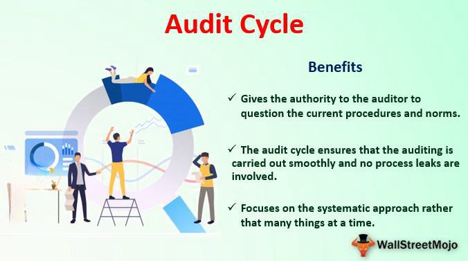

Algorithmic trading has revolutionized financial markets by significantly increasing the speed, efficiency, and precision of trade executions. This transformation has been driven by complex algorithms that make trading decisions in fractions of a second, optimizing outcomes and executing large volumes of trades with minimal human intervention. However, with these advancements come new challenges, particularly in ensuring the algorithms operate within established regulatory frameworks and maintain operational integrity.

A central element in managing these challenges is the implementation of robust audit cycles. These cycles serve as a structured mechanism to systematically review and validate the deployment and operation of trading algorithms, ensuring compliance with financial regulations and adherence to internal controls. Audit cycles are crucial for identifying potential risks, inconsistencies, or regulatory breaches in real-time trading environments.



This article focuses on the essential aspects of establishing an effective audit cycle that addresses the unique requirements of algorithmic trading. By examining both the general components of the audit cycle and the specific demands placed on it by algorithmic trading, the article aims to provide a comprehensive guide for financial institutions. These institutions can use such guides to refine their audit processes, ensuring their algorithmic trading operations not only remain compliant but also uphold the highest standards of accuracy and reliability.

By exploring key considerations such as risk identification, compliance requirements, and operational adaptations, this guide will equip financial entities with the knowledge needed to enhance their audit practices specifically for algorithmic trading.

## Table of Contents

## Understanding the Audit Cycle

The audit cycle is a structured procedure designed to evaluate a company's financial records to guarantee the accuracy and integrity of its financial data. Traditionally, this procedure involves several critical steps:

1. **Identification**: This initial phase involves determining the specific areas of financial data that require auditing. The selection is based on the risk profiles and regulatory requirements pertinent to the company.

2. **Methodology Selection**: Once the scope for audit is clarified, the next step involves choosing appropriate strategies and techniques for data collection and analysis. This typically includes qualitative and quantitative approaches aimed at ensuring comprehensive coverage of the financial information being reviewed.

3. **Fieldwork**: In this phase, the actual examination of financial records occurs. Auditors conduct tests and comparisons against established benchmarks and accounting standards to detect any discrepancies or compliance issues. This step is crucial for uncovering irregularities and ensuring adherence to financial regulations.

4. **Management Review**: Following the fieldwork, auditors discuss their findings with the company's management. This stage involves presenting documented evidence of any issues discovered during the audit and suggesting corrective measures to address them. The aim is to foster transparency and ensure that financial practices align with statutory and regulatory requirements.

In [algorithmic trading](/wiki/algorithmic-trading), these conventional audit steps must be adapted to cater to the complexities inherent in automated trading systems. Unlike standard financial audits, auditing in algorithmic trading involves evaluating algorithms that execute trades at high speeds. Consequently, the audit process must involve not only a review of financial data but also an assessment of the algorithms' logic, performance, and compliance with industry-specific regulations such as the Markets in Financial Instruments Directive II (MiFID II). This may require advanced methodologies, including algorithm simulation and stress testing, to ensure algorithms perform as intended under different market conditions and comply with relevant regulatory frameworks.

Adapting the audit cycle for algo trading demands a thorough understanding of the trading algorithms themselves, as well as the trading infrastructure and compliance landscape. This includes verifying that the algorithms adhere to operational and regulatory standards and that robust risk management protocols are in place. As a result, integrating technical expertise within the audit teams becomes essential, necessitating collaboration between auditors, trading experts, and compliance officers to achieve an effective audit cycle in algorithmic trading environments.

## Key Steps in the Audit Cycle

The audit cycle in algorithmic trading is a structured approach that ensures the integrity and compliance of trading algorithms. The process involves four key steps: identification, audit methodology, fieldwork, and management review. Each step requires careful consideration to address the complexities and speed inherent in algo trading environments.

**Identification** involves determining which aspects of the algorithms need to be audited. This step is crucial as it sets the foundation for the entire audit cycle. The selection is based on the risk profile of the trading algorithms and the relevant regulatory requirements. Different algorithms may pose varying levels of risk depending on factors like market impact, financial exposure, and compliance with laws such as the Markets in Financial Instruments Directive II (MiFID II). Therefore, prioritizing algorithms with higher risk profiles and those subject to stringent regulatory oversight is essential for effective audits.

In the **Audit Methodology** phase, the strategies and techniques for data collection and analysis are established. This involves selecting appropriate data sources and analytical tools to scrutinize the algorithms' operations. For instance, statistical methods can be employed to evaluate the performance and efficiency of trades executed by algorithms. Additionally, advanced analytical techniques, including [machine learning](/wiki/machine-learning) models, may be utilized to identify patterns or anomalies within large datasets. A well-crafted methodology ensures accurate results, providing a solid foundation for subsequent audit stages.

**Fieldwork** encompasses the execution of tests and comparisons against established metrics to detect any discrepancies or compliance issues. During this step, auditors perform thorough examinations of trading logs, algorithmic behavior, and system interactions. This analysis helps to verify whether trades are executed according to the intended strategies and compliance guidelines. Stress tests and scenario analyses might also be used to assess how algorithms perform under different market conditions, ensuring robustness and resilience. Fieldwork requires meticulous attention to detail and a comprehensive understanding of the trading algorithms in question.

Lastly, the **Management Review** is an evaluative process where findings are presented to management, with suggestions for any necessary corrective actions. This step is vital as it translates technical audit results into strategic insights for decision-makers. It includes developing a detailed report that highlights areas of concern, non-compliance, or potential risks, accompanied by recommendations to address these issues. Effective communication with management ensures that audit insights are integrated into the organization's risk management and control frameworks, fostering a culture of continuous improvement in algo trading practices.

Through these steps, financial institutions can implement a robust audit cycle that enhances the transparency and reliability of their algorithmic trading systems.

## Considerations for Algo Trading

Algorithmic trading presents a distinct set of challenges that necessitate specialized audit approaches. The primary complexities arise from the speed and [volume](/wiki/volume-trading-strategy) of trades executed by algorithms, which can significantly outpace human capabilities. This characteristic demands a robust audit framework capable of handling large datasets and rapidly fluctuating market conditions. 

Ensuring compliance with regulatory frameworks, such as the European Union's Markets in Financial Instruments Directive II (MiFID II), is a critical component of auditing in algo trading environments. MiFID II imposes stringent requirements designed to enhance transparency, investor protection, and market integrity. These include obligations for pre-trade transparency, post-trade reporting, and comprehensive record-keeping of orders and transactions. An effective audit process must be equipped to verify adherence to these regulations, ensuring that order placement, execution policies, and risk management strategies conform to regulatory standards.

Firms must adapt their audit procedures to address the intricacies of algo trading systems. This includes scrutinizing order placement algorithms, which are responsible for determining when and how trades are executed. The audit process should evaluate the logic embedded in these algorithms to ensure they align with the firm's trading strategy and risk appetite. Additionally, the audit should assess the effectiveness of risk management systems designed to monitor and manage potential adverse market events or algorithmic failures. 

An adaptive audit strategy is vital, whereby procedures are continuously refined to address evolving market dynamics and technological advancements in trading algorithms. This adaptability involves incorporating techniques such as real-time monitoring and anomaly detection, which can flag irregular patterns or deviations from expected behavior. The integration of machine learning models into audit processes can further enhance the detection of complex, non-linear relationships within trading data.

In conclusion, auditing algo trading requires a specialized approach that considers the intricate and fast-paced nature of algorithmic trade execution, compliance with regulatory frameworks, and the adaptability to new technological and market developments.

## Planning and Execution

Effective planning is a critical component in establishing clear roles, responsibilities, and expectations across all business functions involved in the audit cycle of algorithmic trading systems. This process begins with defining the scope of the audit, including identifying the key algorithmic systems and processes subject to review. In addition, it involves determining the objectives and specific outcomes expected from the audit, which guides the allocation of resources and expertise within the organization.

To ensure the success of the audit cycle, flexibility in the approach and timelines is essential. Algorithmic trading environments are dynamic and can present unforeseen challenges, such as rapidly evolving market conditions or unexpected regulatory updates. A flexible audit plan allows for the accommodation of such changes, ensuring that the audit can adapt to new circumstances without compromising the integrity of the audit process. This adaptability might include adjusting the sequence of audit procedures or reallocating resources to more pressing areas of concern.

Regular communication among stakeholders is another vital aspect of effective planning and execution in the audit cycle. This communication ensures that all parties involved, including compliance officers, IT specialists, and algorithm developers, are aligned with the audit objectives and their respective roles. Stakeholders should engage in open dialogue to provide insights and address potential issues early in the process. Regular check-ins or progress meetings can facilitate this interaction, serving as a platform for discussing findings, challenges, and necessary adjustments to the audit plan.

By integrating these approaches, firms can effectively navigate the complexities inherent in scrutinizing algorithmic trading systems, setting a robust foundation for a successful audit cycle. The focus on planning and communication fosters a collaborative environment, which is crucial for identifying any operational inefficiencies or compliance gaps early in the audit process.

## Validation and Reporting

Validation is a critical step in the audit cycle for algorithmic trading, designed to assess the effectiveness of controls and ensure the integrity of trading processes. In this stage, detailed analysis and systematic checks are carried out to verify that the algorithms and the surrounding infrastructure comply with internal policies and external regulatory requirements.

A comprehensive report is generated from the validation phase, which should contain detailed documentation of the findings. This includes highlighting any areas of non-compliance or weaknesses in the control framework. The report should suggest remedial actions to address observed deficiencies. This can help in setting measurable objectives for enhancing the control mechanisms and ensuring adherence to best practices.

The dynamic nature of financial markets necessitates that validation methods are regularly updated. Evolving market conditions and regulatory frameworks drive the need for continuous improvements in validation techniques. One approach is to adopt a risk-based validation strategy, which prioritizes areas with the highest risk impact. This strategy can be augmented by utilizing advanced tools such as machine learning algorithms to detect anomalous patterns that might signify control failures or compliance breaches.

In practice, running simulations and back-testing trading algorithms against historical data under different market scenarios helps evaluate their performance and robustness. Python, with its rich ecosystem of libraries such as `pandas` and `numpy`, can be particularly useful for such tasks. An example Python snippet for back-testing might involve:

```python
import pandas as pd
import numpy as np

# Load historical trading data
data = pd.read_csv('historical_data.csv')

# Define a simple moving average trading strategy
data['SMA_short'] = data['Price'].rolling(window=10).mean()
data['SMA_long'] = data['Price'].rolling(window=50).mean()

# Generate trading signals
data['Signal'] = np.where(data['SMA_short'] > data['SMA_long'], 1, 0)

# Calculate strategy returns
data['Strategy_Returns'] = data['Signal'].shift(1) * (data['Price'].pct_change())

# Evaluate strategy performance
cumulative_returns = (1 + data['Strategy_Returns']).cumprod()
print(cumulative_returns.tail())
```

This example demonstrates a basic moving average crossover strategy, allowing auditors to evaluate the algorithm's returns and risk attributes over a predefined period.

Regular updates in validation methods assist firms in staying compliant with changing regulations such as the Market in Financial Instruments Directive II (MiFID II) in Europe or the Dodd-Frank Act in the United States. These updates ensure that validation processes remain robust, relevant, and responsive to the latest market developments, ensuring the integrity of algorithmic trading systems.

## The Role of Internal Audit

Internal audit plays a crucial role in maintaining the integrity of the audit cycle within algorithmic trading environments. By providing an independent and thorough review of the validation processes, internal audit ensures that the controls over algorithmic trading remain robust and effective. This independent review is pivotal in identifying weaknesses or potential areas of risk that may have been overlooked during initial validations. 

One of the significant contributions of internal audit is offering a final layer of oversight. This oversight is vital for verifying that governance structures are sound and that compliance measures meet regulatory and organizational standards. Internal audit functions as an unbiased entity that can objectively assess whether the algorithmic trading systems adhere to established policies and regulatory requirements, including those mandated by frameworks such as MiFID II, which is crucial for financial institutions operating within the European Union.

Engaging the internal audit team early in the audit cycle can significantly enhance both efficiency and effectiveness. Early involvement ensures that the audit team is well-acquainted with the technical and operational nuances of the algorithmic trading systems. This familiarity allows them to identify potential risks proactively and recommend interventions prior to the completion of the audit cycle. Early engagement helps in anticipating challenges and aligning audit objectives with the overall strategic goals of the organization, fostering a culture of continuous improvement and risk management.

To optimize the benefits of internal auditing in algorithmic trading, firms should ensure the audit team's skills are continuously updated in response to evolving market dynamics and technological advancements. A well-informed internal audit team is invaluable in navigating the complexities of algorithmic trading environments, ensuring comprehensive oversight, and upholding the overall integrity of financial operations.

## Challenges and Solutions

Identifying skilled resources for auditing algorithmic trading systems presents an ongoing challenge for financial institutions. The complexity inherent in algorithmic trading, characterized by high-frequency data processing and intricate financial models, necessitates a workforce equipped with a diverse skill set. This creates a demand for professionals who are not only proficient in technical aspects but also knowledgeable about regulatory requirements and financial practices.

A multi-disciplinary approach effectively addresses this challenge by integrating expertise from various domains. Technical specialists, proficient in programming languages such as Python or C++, are essential for understanding and evaluating the code underpinning trading algorithms. They play a critical role in identifying potential flaws in algorithm design or implementation that could lead to financial and compliance risks.

Regulatory experts ensure that these algorithms comply with relevant financial regulations. In regions where frameworks like the Markets in Financial Instruments Directive II (MiFID II) govern trading activities, their input is crucial to ensuring that trading algorithms adhere to legal standards, such as transparency and best execution practices.

Financial experts provide insights into market behavior and risk assessment. Their role is vital in understanding the financial models incorporated into trading algorithms and assessing whether these models accurately reflect market dynamics and risk appetite.

To maintain this multi-disciplinary competence, financial institutions should prioritize regular training and updates for audit teams. Given the ever-evolving nature of trading technologies and regulatory landscapes, continuous professional development is essential. Training programs might include workshops on new programming techniques, seminars on evolving regulatory standards, and courses on financial risk management. For instance, an audit team might benefit from a Python coding workshop that focuses on detecting anomalous trading patterns within algorithmic trading logs.

By fostering an environment of continuous learning and cross-functional collaboration, firms can enhance their audit outcomes. This proactive approach not only mitigates the risks associated with algorithmic trading but also ensures that audit processes keep pace with technological advancements and regulatory demands. Regular knowledge updates prepare audit teams to effectively handle the dynamic challenges presented by algorithmic trading systems, ultimately contributing to a robust and resilient financial auditing process.

## Conclusion

A robust audit cycle is crucial in mitigating risks associated with algorithmic trading, a sector where speed, precision, and compliance are paramount. In an environment characterized by rapid technological advancements and stringent regulatory frameworks, maintaining a detailed and adaptive audit process is essential for financial institutions.

One of the primary benefits of a well-structured audit cycle is its ability to provide a systematic approach to assessing and improving compliance with current regulations. As regulations evolve, such as the ongoing updates in MiFID II or other financial regulations, firms must regularly reassess and adapt their audit practices to align with new requirements. This continuous adaptation not only helps in maintaining compliance but also enhances the integrity of trading activities by ensuring that all processes are up to date and conform to industry standards.

Ensuring a seamless transition between different stages of the audit cycle underscores a firm's commitment to operational integrity. This involves effectively 'closing the loop', where feedback from each stage of the audit is used to inform improvements and adjustments in subsequent cycles. By doing so, organizations can ensure that any identified discrepancies are addressed promptly and that strategies for risk mitigation are optimized continually. Such a dynamic approach fosters a culture of accountability and continual improvement, essential for maintaining investor trust and operational transparency in algorithmic trading environments.

Overall, by utilizing a comprehensive and flexible audit cycle, financial institutions not only safeguard against potential risks but also demonstrate a proactive stance in upholding the highest standards of regulatory compliance and operational excellence.

## References & Further Reading

[1]: Bergstra, J., Bardenet, R., Bengio, Y., & Kégl, B. (2011). ["Algorithms for Hyper-Parameter Optimization."](https://dl.acm.org/doi/10.5555/2986459.2986743) Advances in Neural Information Processing Systems 24.

[2]: ["Advances in Financial Machine Learning"](https://www.amazon.com/Advances-Financial-Machine-Learning-Marcos/dp/1119482089) by Marcos Lopez de Prado

[3]: ["Evidence-Based Technical Analysis: Applying the Scientific Method and Statistical Inference to Trading Signals"](https://www.amazon.com/Evidence-Based-Technical-Analysis-Scientific-Statistical/dp/0470008741) by David Aronson

[4]: ["Machine Learning for Algorithmic Trading"](https://github.com/stefan-jansen/machine-learning-for-trading) by Stefan Jansen

[5]: ["Quantitative Trading: How to Build Your Own Algorithmic Trading Business"](https://www.amazon.com/Quantitative-Trading-Build-Algorithmic-Business/dp/1119800064) by Ernest P. Chan