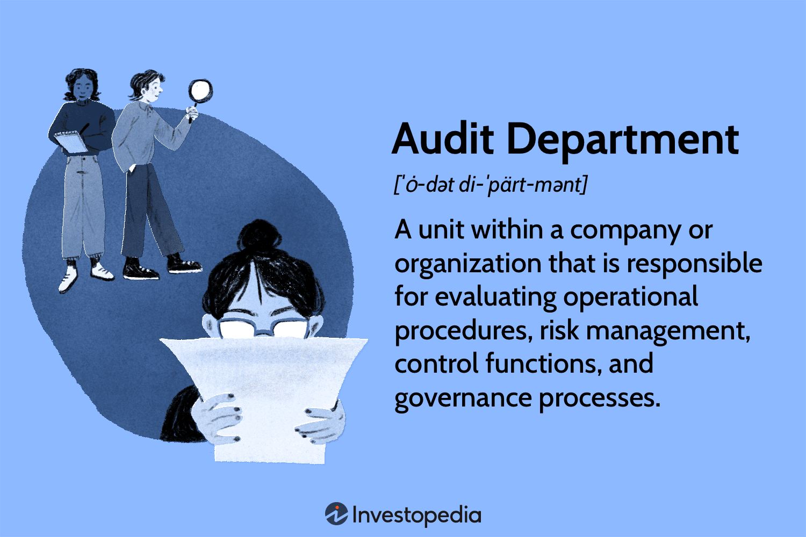

Auditing in financial markets is a systematic process of examining and evaluating financial records and transactions to ensure accuracy and compliance with applicable standards and regulations. This process plays a crucial role in maintaining transparency, accountability, and trust in financial reporting. It helps uncover financial misstatements and fraudulent activities, protecting the interests of stakeholders including investors, regulators, and the general public. Audits are essential in verifying the correctness of financial statements, detecting errors, and providing an independent assessment of an organization's financial health.

The importance of audits extends to ensuring compliance with laws, regulations, and internal policies. In this context, audits help organizations identify areas where they are not meeting legal obligations or where improvements are necessary, thus safeguarding against legal penalties and reputational damage. By evaluating operational procedures and control functions, audits provide a framework for risk management, helping organizations mitigate financial risks and uncertainties.

In algorithmic trading environments, where high-frequency and automated trading processes dominate, audits have a specific and critical role. Algorithmic trading involves the use of computer algorithms to execute trades at high speed, which can enhance liquidity and efficiency but also poses significant risks, such as market manipulation and systemic failures. Audits in these environments are essential to ensure that algorithms operate within predefined parameters and adhere to regulatory standards.

To understand the full scope of auditing in financial markets, this article explores key aspects of audit functions, their significance, and the structure of audit departments within organizations. It also addresses the unique challenges and responsibilities audits face in algorithmic trading settings. As financial markets evolve, so too does the role of audits, making their continuous adaptation and diligent execution fundamental to ensuring robust governance and compliance.

## Table of Contents

## Functions of Audit

The audit department plays a critical role in maintaining the integrity and efficiency of an organization’s financial and operational activities. Its primary function is to evaluate the adequacy and effectiveness of operational procedures, risk management protocols, and control functions. This evaluation involves a systematic review of the organization’s operations to ensure that they are being conducted in accordance with established procedures and that they align with the organization’s strategic objectives.

A key function of auditing is assessing compliance with internal policies, internal controls, and regulatory standards. Auditors examine whether an organization’s processes adhere to relevant laws and regulations, as well as internal guidelines and industry best practices. Through this assessment, audits can identify areas where the organization may be at risk of non-compliance, potentially averting legal penalties or financial losses.

Audits are also pivotal in verifying the existence and condition of physical assets. This involves confirming that reported assets actually exist and are accounted for accurately. The process may include physical inspections, inventory counts, and reconciliation activities to match physical assets with recorded values.

In addition, auditing is essential in investigating complaints and potential fraudulent activities. Auditors utilize analytical procedures and forensic techniques to identify discrepancies or unusual patterns that may indicate fraudulent activity. By systematically examining financial records and operational data, auditors can provide insights into potential fraud, allowing organizations to take corrective actions promptly.

Overall, the functions of an audit department extend beyond mere checks and balances; they are integral to risk management, compliance, and the safeguarding of an organization's resources and reputation. These functions help ensure that an organization operates transparently and efficiently, thereby maintaining stakeholder trust and confidence.

## Importance of Audit

Audits play a pivotal role in maintaining transparency in financial reporting by providing an independent and systematic review of a company’s financial statements. This independent verification ensures that the financial information presented by organizations is accurate, reliable, and free from material misstatement. The audit process enhances credibility, allowing stakeholders, including investors, regulators, and the public, to make informed decisions based on the organization’s reported financial health.

The prevention and identification of financial misrepresentation and fraud are critical elements inherent in the auditing process. Audits scrutinize financial documents and records, testing and confirming the legitimacy of transactions and entries. Through techniques such as forensic analysis and substantive procedures, auditors can uncover discrepancies and potentially fraudulent activities. By identifying risks and highlighting weaknesses in internal controls, audits serve as a deterrent against malicious financial manipulation, ultimately protecting the organization and its stakeholders.

The importance of audits in sustaining investor confidence cannot be overstated. Investors rely on accurate and fair financial reporting to assess the viability and profitability of their investments. Regular audits reassure investors that the company is operating with integrity and adhering to established accounting and ethical standards. This comfort is crucial for maintaining steady investment flows and supporting a robust financial market. In effect, audits contribute to an environment where transparency and accountability are prioritized, fostering trust between corporations and their investors.

Enhanced governance practices are a direct result of effective audits. A thorough auditing process encourages organizations to implement robust internal controls and comply with regulatory standards, thereby promoting good corporate governance. Auditors frequently interact with management and the audit committee to discuss their findings and suggest improvements, leading to more efficient operations and stronger governance frameworks. This symbiotic relationship helps create an organizational culture that values ethical practices and continuous improvement, ultimately driving a more sustainable and transparent business ecosystem.

Overall, audits are essential tools for safeguarding against financial misrepresentation and fraud, vital for sustaining investor confidence, and integral to enhancing governance practices. By providing assurance on the integrity and fairness of financial reporting, audits underpin trust in financial markets, contributing significantly to economic stability and growth.

## The Audit Department: Structure and Purpose

An audit department plays a critical role in upholding the integrity and efficiency of an organization's operations, particularly within financial markets. This department is chiefly responsible for ensuring that the organization's internal processes, financial reporting, and compliance mechanisms adhere to established standards and regulations.

### Objectives and Responsibilities

The primary objective of an audit department is to provide independent assurance that an organization’s risk management, governance, and internal control processes are operating effectively. Auditors assess compliance with both internal policies and external regulatory standards, ensuring adherence to legal requirements and identifying areas for improvement. A key responsibility is evaluating the accuracy and fairness of financial statements, thus preventing financial misrepresentations.

Auditors are also tasked with evaluating operational efficiency, mitigating risks, and ensuring the adequacy of control mechanisms. This involves a comprehensive review of processes, verifying the existence and valuation of physical and intangible assets, and investigating any allegations of fraud or misconduct. By doing so, auditors help in reinforcing the transparency and reliability of financial reporting.

### Structure and Functioning

An audit department is typically structured according to the size and complexity of the organization. Larger organizations may have extensive audit teams segmented into divisions focusing on specific areas such as finance, operations, compliance, and IT. These specialized teams allow for a focused approach to addressing risks pertinent to each area.

The head of the audit department is usually the Chief Audit Executive (CAE), who reports directly to the Audit Committee and often to the Chief Executive Officer (CEO) as well. This reporting structure is vital as it ensures the independence and objectivity of the audit department. Audit teams frequently perform fieldwork, which includes gathering and analyzing financial and operational data, conducting interviews, and testing processes to gauge their effectiveness.

### Relationship With Corporate Governance Bodies

The audit department maintains a significant relationship with corporate governance bodies, notably the Audit Committee. The Audit Committee is a subset of the board of directors and plays a crucial role by providing oversight of the financial reporting process, selecting and overseeing the external auditor, and monitoring the internal audit function.

The synergy between the audit department and the Audit Committee is essential for fostering robust corporate governance. Regular communication between these bodies facilitates the exchange of information regarding potential risks, the effectiveness of the internal controls, and financial reporting issues. This ongoing dialogue ensures that the board of directors is well-informed and can make decisions that uphold the organization's financial health and regulatory compliance.

In conclusion, the audit department is indispensable not only for maintaining an organization’s compliance and operational efficiency but also for reinforcing investor confidence and corporate governance practices. Its structured approach in aligning with governance bodies aids in building the transparency and accountability necessary for sustainable organizational success.

## Algorithmic Trading: Challenges and Audit Role

Algorithmic trading, often referred to as algo trading, uses computer algorithms to execute a significant number of trading orders in financial markets at exceptionally high speeds. This trading approach is favored for its efficiency and ability to exploit trading opportunities that may not be discernible to individual traders. The proliferation of [algorithmic trading](/wiki/algorithmic-trading) has markedly transformed the dynamics of financial markets by increasing market [liquidity](/wiki/liquidity-risk-premium), tightening bid-ask spreads, and enhancing price discovery processes.

However, the rapid execution of trades can also introduce [volatility](/wiki/volatility-trading-strategies) and systemic risk. The complexity and speed of these trades make it challenging for traditional auditing methods to keep up. One of the primary challenges associated with auditing in algorithmic trading is ensuring the accuracy and integrity of the algorithms themselves. Auditors must assess whether the trading algorithms comply with specific regulatory and organizational policies, which requires a deep understanding of both the market and coding languages used in these algorithms, such as Python or C++.

Additionally, high-frequency trading ([HFT](/wiki/high-frequency-trading-strategies)), a subset of algorithmic trading, adds another layer of complexity. HFT strategies can execute thousands of transactions within fractions of a second. This necessitates sophisticated audit functions to monitor and analyze these trades in real-time to detect any manipulative activities or market abuses, such as spoofing or layering.

Auditors play a pivotal role in managing risks associated with algorithmic trading. By conducting thorough assessments, they ensure that trading algorithms operate within the regulatory frameworks. Auditors review and validate algorithmic strategies to confirm that they are not only profitable but also compliant with ethical standards and legal constraints. Risk management controls are crucial for preventing financial losses, system disruptions, or breaches of market conduct rules.

The audit process in algorithmic trading involves evaluating the algorithm's design, deployment, and operational controls. This includes validating data inputs, [backtesting](/wiki/backtesting) results, and checking system security measures. Moreover, auditors analyze whether the risk management tools in place, such as limit orders and circuit breakers, are effective in mitigating potential losses.

Regulatory bodies and financial institutions have emphasized the importance of robust audit mechanisms to foster transparency and protect market integrity. By conducting regular audits, organizations can ensure compliance with evolving regulations and protect themselves from potential legal liabilities.

In conclusion, as algorithmic trading continues to gain prominence in financial markets, the role of audits in managing associated risks and ensuring compliance becomes increasingly vital. Auditors must adapt to technological advancements and equip themselves with the necessary skills to effectively oversee algorithm-driven trading activities, thereby safeguarding market integrity and investor confidence.

## Conclusion

Audits are fundamental to ensuring the integrity and reliability of financial systems. They perform critical functions such as evaluating operational procedures, managing risks, and ensuring compliance with regulatory standards. By verifying the accuracy of financial reporting and assessing the effectiveness of internal controls, audits help prevent financial misrepresentation and fraud. This process maintains transparency, enhances governance practices, and sustains investor confidence.

In the context of algorithmic trading, audits play an essential role in managing the unique risks and challenges presented by these fast-paced, automated environments. Algorithmic trading systems must adhere to stringent regulatory requirements due to their potential to impact market stability. Here, audits offer a comprehensive review of trading algorithms and systems, ensuring they comply with both organizational policies and external regulations. 

As such, organizations must prioritize robust audit practices. This priority will facilitate improved transparency and compliance, ultimately leading to more stable and trustworthy financial markets. By empowering audit departments and integrating them effectively within corporate governance structures, firms can harness the full potential of audits to safeguard their operations against potential risks and enhance overall performance.

## References & Further Reading

- Arens, A. A., Elder, R. J., & Beasley, M. S. (2017). *Auditing and Assurance Services: An Integrated Approach*. This textbook offers a comprehensive exploration of auditing principles, from basic concepts to advanced applications, and is considered essential reading for understanding auditing processes.

- Loughran, T., & McDonald, B. (2016). "Textual analysis in accounting and finance: A survey." *Journal of Accounting Research*, 54(4), 1187-1230. This article discusses the use of textual analysis in accounting, providing insight that could extend to the analysis of audit reports, particularly in complex algorithmic trading environments.

- Zigrand, J.-P. (2014). "High-Frequency Trading, Algorithmic Trading, and the Flash Crash: What Do We Know and What Should We Know?" *Journal of Economic Perspectives*, 28(2), 127-145. This paper provides a critical look at the implications of high-frequency trading and the need for regulatory frameworks to audit such activities.

- Spencer Pickett, K. H. (2011). *The Internal Auditing Handbook*. This book elaborates on the roles and responsibilities of internal auditors, offering insights into audit department functionalities and best practices, specifically in corporate governance and risk management.

- Aldridge, I., & Krawciw, S. (2017). *Real-Time Risk: What Investors Should Know About Fintech, High-Frequency Trading, and Flash Crashes*. The book delves into the specifics of the technological advancements in financial markets and the associated audit imperatives, predominantly focusing on fintech and high-frequency trading.

- Fama, E. F., & French, K. R. (1993). "Common risk factors in the returns on stocks and bonds." *Journal of Financial Economics*, 33(1), 3-56. This seminal paper outlines a framework for understanding risk factors, providing crucial context for auditors assessing risk management strategies in finances.

- PCAOB. (2010). "Audit Documentation and Audit Evidence." Portions of this regulatory guideline highlight essential audit practices, particularly in verifying compliance and internal controls within financial sectors, including algorithmic trading systems.

- Bloomberg, M., Neuhierl, A., & Weber, M. (2020). "Market Efficiency and Limits to Arbitrage: Evidence from the 19th Century." *Review of Financial Studies*, 33(7), 3247-3275. The paper explores market efficiency's historical evolution, offering a background for the necessity and methods of auditing within modern algorithmic trading contexts. 

These resources provide extensive coverage of auditing frameworks, challenges in algorithmic trading, and the evolution of both practices within financial reporting and governance.

