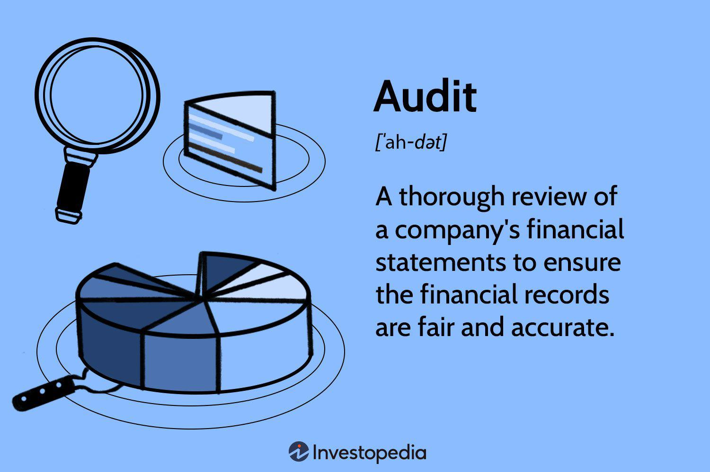

In the rapidly evolving financial sector, accounting, finance, audit, and algorithmic trading converge to form a vital intersection that influences every aspect of modern finance. These disciplines, each with its distinct focus, collaboratively drive the efficiency, transparency, and innovation essential for today's competitive financial landscape.

Accounting serves as the foundational framework for financial information, offering essential data required for informed decision-making. Through accurate financial reporting, companies maintain the transparency and trust necessary for healthy financial markets. Simultaneously, advances in technology, such as artificial intelligence (AI) and machine learning, are transforming traditional accounting processes, enabling real-time analysis and enhancing the precision of financial forecasting. For example, AI can automate data entry and categorization, significantly reducing human error and allowing accountants to focus on strategic analysis.

Parallel to accounting, finance acts as the lifeblood of business operations, entailing the management of assets, liabilities, and investments critical for sustainable growth. The financial sector's ongoing digital transformation facilitates more efficient fund allocation and risk management, driven by the proliferation of financial technology (fintech) innovations. These technological advancements, including blockchain and robo-advisors, not only expedite financial transactions but also aid in offering more personalized financial services and insights, thus reshaping traditional notions of finance.

Audit, traditionally a manual process, is also undergoing a technological transformation. Modern auditing leverages automated systems and advanced software to ensure compliance and accuracy in financial statements, thereby safeguarding business integrity. Data analytics now play a central role in identifying discrepancies and potential risks swiftly, increasing both the efficiency and effectiveness of the audit process. As regulatory landscapes evolve, auditors are required to continuously adapt and integrate new tools to maintain rigorous standards.

Algorithmic trading represents a significant leap in trading methodologies. By employing sophisticated algorithms, trades are executed at optimal speeds and prices, enhancing market efficiency and reducing the likelihood of human errors. A subset of this approach, high-frequency trading, has become a dominant force in financial markets, utilizing big data and AI for superior predictive analytics and competitive trading strategies. Despite these efficiencies, algorithmic trading also introduces challenges such as heightened market volatility and increased regulatory scrutiny.

Understanding the synergy of accounting, finance, audit, and algorithmic trading is crucial for financial professionals aiming to stay competitive. Embracing technological advancements and their integration within these disciplines is essential for ensuring future readiness. As the financial world becomes increasingly dynamic, continued learning and technological adoption will be vital for success, driving a future characterized by enhanced operational efficiency and strategic opportunities.

## Table of Contents

## The Role of Accounting in Financial Markets

Accounting is fundamental to the effective functioning of financial markets, acting as the backbone for providing critical data that informs decision-making processes. Accurate financial reporting underpins transparency and trust in financial markets, essential qualities that investors, regulators, and stakeholders rely upon to make informed decisions. 

Technological advancements, notably [artificial intelligence](/wiki/ai-artificial-intelligence) (AI) and [machine learning](/wiki/machine-learning), are revolutionizing accounting practices. Unlike traditional methods, these technologies facilitate real-time data analysis and enhance financial forecasting abilities. AI algorithms can process vast amounts of financial data to identify patterns and trends that would be impossible for human accountants to discern manually. For instance, using machine learning, predictive models can be developed to forecast financial outcomes based on historical data, thereby improving the accuracy and reliability of financial projections.

The integration of technology in accounting serves to optimize operations by automating repetitive tasks and minimizing human errors. Accounting software equipped with AI capabilities can automatically classify transactions, reconcile accounts, and detect anomalies, enhancing the efficiency and accuracy of accounting processes. This automation allows accountants to focus on more strategic tasks, such as financial analysis and planning.

Moreover, advancements in technology reduce the likelihood of errors, which are particularly costly in high-stake financial environments. Automated systems with machine learning capabilities continuously improve over time, becoming more adept at handling complex datasets and adapting to evolving financial reporting standards. This not only streamlines operations but also ensures compliance with regulatory requirements, safeguarding the integrity of financial reports.

In summary, accounting, aided by technological innovation, plays a crucial role in supporting financial market operations. As technology advances further, the capabilities of accounting are expected to expand, fostering greater market transparency, efficient decision-making, and robust financial management.

## Finance: The Lifeblood of Business

Finance is integral to the sustainability and growth of businesses, acting as the framework for managing assets, liabilities, and investments. Effective financial management ensures that companies allocate resources wisely and mitigate risks, thereby safeguarding their financial health. As businesses navigate increasingly complex markets, the role of technology in finance has become indispensable.

The integration of technology into financial management has revolutionized fund allocation and risk management processes. Advanced technologies facilitate real-time data analysis, allowing businesses to make informed financial decisions swiftly. For example, machine learning algorithms can predict market trends, enabling companies to adjust their investment strategies proactively. Furthermore, blockchain technology ensures secure transactions and reduces operational costs by eliminating intermediaries.

The emergence of financial technology, or fintech, has further transformed traditional finance. Fintech innovations, such as mobile banking apps, digital wallets, and peer-to-peer lending platforms, offer consumers greater flexibility and accessibility in managing their finances. These services disrupt conventional banking models by providing faster, more user-friendly alternatives. For instance, robo-advisors use algorithms to provide personalized investment advice, making wealth management accessible to a broader audience.

Digital transformation in finance also enhances customer service by streamlining processes and personalizing interactions. Automated customer service tools, like chatbots, deliver instant assistance, while data analytics allows firms to customize offerings based on consumer behavior. This focus on customer experience fosters loyalty and attracts new clients, providing a competitive edge.

The synergy between finance and technology supports businesses in maintaining a competitive advantage in the market. By leveraging data-driven insights and automating routine financial tasks, companies can focus on strategic growth and innovation. This technological integration not only optimizes operational efficiency but also positions businesses to adapt to rapidly changing market dynamics.

In summary, finance is essential to business operation, with technology playing a crucial role in its evolution. As fintech continues to reshape traditional models, businesses must embrace digital tools to enhance decision-making and customer engagement, thereby securing their competitive positioning in the industry.

## Auditing in the Digital Age

Auditing plays a critical role in maintaining the accuracy and reliability of financial statements, which is essential for the integrity of any business. In the digital age, traditional auditing methods are rapidly evolving, influenced significantly by advancements in technology. The shift towards automated systems and advanced software solutions is transforming how audits are conducted, enhancing both efficiency and effectiveness.

Automation in auditing replaces labor-intensive tasks with systems capable of processing large volumes of transactions at high speed, minimizing the potential for human error. This includes employing tools that utilize robotic process automation (RPA) to handle repetitive tasks, allowing auditors to focus on more analytical aspects of their work. For instance, automating data collection and processing not only speeds up the audit process but also ensures greater accuracy by reducing human intervention in routine data entry.

Data analytics stands at the forefront of modern auditing. By employing advanced data analytics tools, auditors can swiftly identify anomalies and potential risks within vast data sets. Machine learning algorithms, for example, can be used to analyze patterns in financial data, highlighting irregularities that warrant further examination. These insights allow auditors to perform more in-depth analyses, providing higher value insights for stakeholders.

Technological advancements have also led to significant reductions in audit costs. By automating processes and harnessing advanced software, audits are conducted more efficiently, resulting in cost savings for organizations. Additionally, digital tools provide real-time analysis capabilities, enabling continuous auditing rather than the traditional periodic approach. This shift not only ensures ongoing compliance but also allows for immediate action to be taken in response to detected discrepancies.

The regulatory landscape governing audits is continually evolving, further driving the need for auditors to adapt by leveraging new technologies. Compliance with standards such as the International Financial Reporting Standards (IFRS) or the Sarbanes-Oxley Act requires auditors to remain informed and prepared to incorporate new tools into their auditing processes. Advanced auditing software often includes modules designed to assist with compliance, providing built-in checks and balance systems to ensure adherence to regulatory requirements.

In summary, the digital transformation of auditing processes offers enhanced accuracy, efficiency, and cost-effectiveness, benefiting both auditors and the organizations they serve. As the regulatory environment continues to change, auditors must remain agile, continuously updating their skill sets and tools to stay ahead of compliance requirements while delivering high-quality audits.

## Algorithmic Trading: A Game Changer in Financial Markets

Algorithmic trading employs sophisticated algorithms to automate trading processes, executing trades at speeds and prices that are optimal for market conditions. This tech-driven approach allows traders to swiftly capitalize on market opportunities while minimizing human errors. By leveraging algorithms, traders can process vast amounts of market data in real time, making informed decisions to buy or sell financial instruments. 

One significant advantage of [algorithmic trading](/wiki/algorithmic-trading) is its enhanced trading efficiency. Algorithms can analyze multiple market variables simultaneously, including price, timing, and [volume](/wiki/volume-trading-strategy), to execute trades with precision that human traders might struggle to match. For instance, algorithms can be programmed to execute trades automatically when specific conditions are met, such as a stock reaching a particular price point, thus eliminating emotional biases that typically affect human trading.

High-frequency trading ([HFT](/wiki/high-frequency-trading-strategies)) is a prominent subset of algorithmic trading, characterized by high-speed trade executions and a large number of transactions conducted within very short periods, often milliseconds. HFT strategies require substantial technological infrastructure to ensure minimal latency, thus securing advantageous positions in the market. The rapidity with which these algorithms operate often allows traders to exploit small price discrepancies, [earning](/wiki/earning-announcement) profits on minor market movements.

The integration of big data and artificial intelligence (AI) into algorithmic trading further amplifies its potential. Big data enables traders to gather and analyze a wealth of market data from various sources, while AI techniques, such as machine learning, facilitate the development of models that predict market trends and optimize trading strategies. For instance, machine learning algorithms can identify patterns and correlations within large data sets that may not be readily apparent to human analysts, providing a competitive edge in developing predictive trading models.

Despite these benefits, algorithmic trading also introduces challenges. The speed and volume of trades executed by these algorithms can contribute to market [volatility](/wiki/volatility-trading-strategies), as seen in events like the 2010 Flash Crash. Rapid trades can lead to significant price swings, potentially destabilizing the market. Additionally, algorithmic trading faces increased regulatory scrutiny, with regulators keen to ensure that trading practices do not unfairly manipulate market conditions or disadvantage other participants. Consequently, traders must maintain transparency and adhere to compliance standards set by regulatory bodies to mitigate risks inherent in algorithmic trading practices.

## Integrating Accounting, Finance, Audit, and Algo Trading

The integration of accounting, finance, audit, and algorithmic trading is transforming the financial landscape by facilitating comprehensive financial management and strategic decision-making. These interconnected systems improve data accuracy, risk assessment, and operational efficiency, which are vital for businesses seeking a competitive edge and sustainable growth in today's economy.

Central to this integration is the role of emerging technologies such as artificial intelligence (AI), machine learning, and blockchain. These technologies provide the backbone for systems that connect these financial disciplines. For instance, AI algorithms can process vast amounts of financial data to uncover patterns and insights that would be nearly impossible for human analysts to detect. Machine learning models assist in predictive analytics, enhancing the precision of financial forecasting and investment strategies. Simultaneously, blockchain technology ensures the integrity and traceability of financial transactions, which is crucial for auditing purposes.

The collaboration between financial professionals, technologists, and strategists is crucial for successfully integrating these systems. This interdisciplinary approach ensures that technological innovations align with strategic financial goals and regulatory compliance requirements. Such collaboration can lead to the development of sophisticated financial products and services that enhance market efficiency and cater to the evolving needs of stakeholders.

Integrated systems also foster innovation by enabling financial institutions to adapt to swift changes in market dynamics more effectively. For example, algorithmic trading provides the capability to execute large volumes of trades at unprecedented speeds and precision. By utilizing big data analytics within these trading systems, institutions can achieve superior market insights and develop more robust trading strategies. This capability is complemented by advanced auditing tools that provide real-time compliance monitoring and risk assessment, strengthening the overall governance framework within financial markets.

Overall, the synergy between accounting, finance, audit, and algorithmic trading drives resilience and progress, enabling organizations to navigate complexities and seize opportunities in a digitally connected world. Financial professionals must continue to hone their skills and leverage these technologies to maintain relevance and drive growth in an increasingly competitive industry.

## Conclusion

Accounting, finance, audit, and algorithmic trading serve as pivotal pillars in the ongoing transformation of the financial industry. These disciplines, when integrated with technological advancements, pave the way for a robust and future-ready financial ecosystem. The harmonious synergy derived from combining these fields fosters enhanced efficiency and uncovers strategic opportunities that were previously unattainable.

Embracing technologies such as artificial intelligence, machine learning, and big data analytics is paramount for businesses and professionals aiming to maintain a competitive edge. These innovations not only streamline operations but also enhance decision-making processes, enabling swift responses to market dynamics. For example, the adoption of algorithmic trading has revolutionized the execution of trades, allowing for precision and speed that were unimaginable in previous decades.

The rapidly evolving landscape demands that businesses and professionals adapt quickly. This dynamic environment requires a shift in perspective, where continuous learning and technological adaptation become core to strategic planning. As the financial world becomes increasingly data-driven, proficiency in using analytical tools and understanding complex algorithms will become indispensable.

In conclusion, the integration of accounting, finance, audit, and algorithmic trading, underpinned by technological innovation, is essential for navigating the complexities of the modern financial landscape. Organizations that prioritize technological adoption and foster a culture of continual learning will not only survive but thrive, harnessing the full potential of these disciplines to create lasting growth and sustainability.

## References & Further Reading

[1]: Bergstra, J., Bardenet, R., Bengio, Y., & Kégl, B. (2011). ["Algorithms for Hyper-Parameter Optimization."](https://papers.nips.cc/paper/4443-algorithms-for-hyper-parameter-optimization) Advances in Neural Information Processing Systems 24.

[2]: ["Advances in Financial Machine Learning"](https://www.amazon.com/Advances-Financial-Machine-Learning-Marcos/dp/1119482089) by Marcos Lopez de Prado

[3]: ["Evidence-Based Technical Analysis: Applying the Scientific Method and Statistical Inference to Trading Signals"](https://www.amazon.com/Evidence-Based-Technical-Analysis-Scientific-Statistical/dp/0470008741) by David Aronson

[4]: ["Machine Learning for Algorithmic Trading"](https://github.com/stefan-jansen/machine-learning-for-trading) by Stefan Jansen

[5]: ["Quantitative Trading: How to Build Your Own Algorithmic Trading Business"](https://www.amazon.com/Quantitative-Trading-Build-Algorithmic-Business/dp/1119800064) by Ernest P. Chan