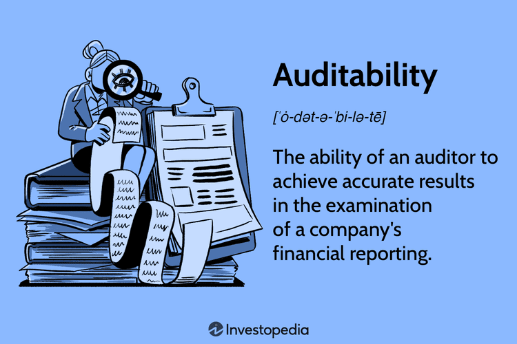

Auditability, along with audit benefits and requirements, forms a critical framework for modern financial and operational systems, especially in algorithmic trading. This trading method employs automated systems to execute transactions at high speeds, demanding meticulous auditing mechanisms to assure reliability and compliance with standards and regulations.

Algorithmic trading is marked by its speed and the volume of transactions it can process, making the need for auditability paramount. As these systems execute trades automatically, the potential for errors and unintended consequences grows, necessitating a robust framework to detect, prevent, and mitigate these risks. By implementing effective auditing mechanisms, transparency is bolstered, risks are minimized, and regulatory compliance is maintained, thereby protecting the integrity and stability of financial markets.

This article will examine how auditability contributes to greater transparency, reduces risks, and supports regulatory compliance in algorithmic trading. It outlines key components necessary for effective auditing within this context, including requirements, anticipated benefits, and challenges. These elements are vital for ensuring that financial markets operate smoothly and remain trustworthy to participants and regulators alike.

Understanding the interplay between auditability and algorithmic trading is not only about adhering to regulations but also about fostering trust in financial markets. By emphasizing these foundational aspects, this text aims to underline the importance of auditability as a cornerstone of sustainable financial practices.

## Table of Contents

## Understanding Auditability

Auditability is a foundational concept in financial and operational systems characterized by the ability of an auditor to obtain accurate and reliable results during the examination of a company's financial records. This concept is paramount in ensuring transparency and adherence to established accounting standards. Financial records must be clear and accurate, providing a complete picture of a company's operations and financial health. For algorithmic trading, auditability is crucial in making sure trading activities are both transparent and traceable, which helps build confidence among investors and stakeholders.

In algorithmic trading, where trades are executed at high speeds and volumes, transparency is critical. It allows for effective monitoring and tracing of each transaction. This transparency is achieved through comprehensive operational reporting and meticulous record-keeping that aligns with financial regulations and standards. Compliance with these standards guarantees that all recorded transactions can be audited efficiently, verifying their integrity and accuracy.

The role of auditors in this context extends beyond mere examination. Auditors are responsible for validating the integrity of financial statements, ensuring that they represent an accurate depiction of the company's financial position. Their work is vital for maintaining investor confidence, as it reassures them about the security and reliability of their investments.

Several key factors affect the auditability of a company, particularly in [algorithmic trading](/wiki/algorithmic-trading). First is the **quality of accounting records**, which must be precise, comprehensive, and readily accessible for audit purposes. High-quality records play a crucial role in facilitating accurate audits and in preventing discrepancies or misrepresentations in financial reporting.

Additionally, the **transparency of operations** is essential. Clear documentation and openness in operational processes help auditors trace transactions back to their origins, gauge their legitimacy, and ensure alignment with regulatory requirements. Operations that lack transparency can hinder audit processes and weaken the reliability of financial reports.

Finally, the **cooperation of management** is a significant [factor](/wiki/factor-investing) that influences auditability. Management must support audit activities by providing necessary access to documents, systems, and insights into operational processes. Their cooperation can ensure that auditors receive the full spectrum of information required to conduct a comprehensive audit. Without this collaboration, auditors may face significant challenges in fulfilling their responsibilities, which could impact investor trust and regulatory compliance.

In summary, auditability in algorithmic trading underscores the importance of having precise accounting records, transparent operations, and supportive management. These elements collectively enhance the reliability and effectiveness of audits, which are fundamental in fostering trust and compliance within financial markets.

## Audit Requirements in Algorithmic Trading

Compliance with audit requirements is crucial for algorithmic traders to ensure accountability and transparency within financial markets. Regulatory bodies such as the Commodity Futures Trading Commission (CFTC), the Securities and Exchange Commission (SEC), and the Office of the Comptroller of the Currency (OCC) have established comprehensive frameworks designed to regulate algorithmic trading activities. These frameworks serve to safeguard market integrity and foster investor confidence by imposing a set of stringent audit requirements.

A fundamental aspect of these requirements is the implementation of pre-trade risk controls. These controls are essential in preventing trading errors that could lead to significant financial loss or market disruption. By employing tools such as parameter limits, automated lockouts, and checks for erroneous orders, algorithmic traders can mitigate potential risks before trades are executed. 

Post-trade surveillance also plays a critical role in ensuring the compliance of algorithmic trading activities. Through the continuous monitoring of trading patterns and behaviors, traders can detect and rectify anomalies or manipulations in the market. This requirement helps in identifying potentially unlawful activities such as spoofing or layering, which can distort market prices and are deemed harmful to market equilibrium.

Robust record-keeping practices are another key component of audit requirements. Traders must maintain detailed records of all trading activities, algorithmic strategies, and system modifications. This documentation is vital for conducting thorough audits and ensuring transparency in trading operations. 

These audit requirements are designed not only to comply with legal standards but also to boost market confidence among investors, regulators, and other stakeholders. By adhering to these regulations, algorithmic traders reinforce the stability of financial markets and uphold their responsibility in maintaining a trustworthy trading environment.

## Benefits of Auditability in Algorithmic Trading

Auditability offers significant benefits in the context of algorithmic trading, playing a vital role in maintaining the stability and integrity of financial markets. One of the primary advantages is fraud prevention. By implementing effective auditing mechanisms, firms can detect and deter fraudulent activities, safeguarding the interests of investors and enhancing overall market confidence.

Transparency and accountability are critical in financial markets, and auditability facilitates both. In algorithmic trading, where transactions occur at high speeds and volumes, ensuring transparency in operations helps maintain trust among market participants. This transparency enables stakeholders to have a clearer understanding of trading activities and decisions, thereby promoting an environment of accountability. 

Enhanced auditability is instrumental in identifying and mitigating risks associated with high-frequency and algorithmic trading. The ability to track and analyze trading patterns and behaviors in real-time allows for early detection of anomalies or irregularities. This proactive risk management is essential for preventing potential systemic threats and ensuring the smooth functioning of trading systems.

Moreover, auditability supports systematic risk management. By providing a comprehensive view of trading activities, auditing processes contribute to the assessment and management of risk exposures. This systematic approach to risk management is crucial for maintaining the stability of financial markets, as it helps prevent the propagation of localized issues into broader market disruptions.

Firms with high levels of auditability often enjoy better relationships with regulators, investors, and creditors. Transparent auditing practices not only ensure legal compliance but also build credibility and trust with these critical stakeholders. Companies demonstrating a commitment to robust auditability are likely to be viewed more favorably by regulatory bodies, which can result in more flexible regulatory oversight and increased investor confidence. Similarly, creditors may offer more favorable terms to businesses with transparent and reliable financial reporting mechanisms.

In summary, the benefits of auditability in algorithmic trading extend beyond mere compliance to encompass fraud prevention, risk mitigation, and enhanced stakeholder relationships, all of which contribute to the long-term stability and efficiency of financial markets.

## Challenges in Achieving Auditability

Achieving comprehensive auditability in algorithmic trading is fraught with challenges due to the intricacy and rapid pace inherent in such systems. The first major challenge is insufficient or improper record-keeping, which can severely hinder audit processes. In algorithmic trading, vast amounts of data are generated and processed rapidly, necessitating meticulous and precise record-keeping. Without proper documentation, auditors may find themselves unable to reconstruct or verify trading activities, which could lead to incomplete assessments and potentially overlook non-compliant actions.

Another significant challenge lies in ensuring that the trading models employed are developed, validated, and monitored with rigorous standards. Models in algorithmic trading are complex, often involving advanced statistical methods and [machine learning](/wiki/machine-learning) techniques. As these models are central to trading strategies, their integrity is crucial for auditability. Establishing thorough testing and validation protocols is necessary to ensure these models function as intended and do not introduce unforeseen risks.

Inter-department cooperation and transparent management practices are also necessary for effective auditability. Frequently, algorithmic trading systems are managed by various departments, such as IT, compliance, and trading desks. For an audit to be effective, there must be seamless communication and collaboration among these departments. Such cooperation aids in compiling accurate data and ensuring that systems are compliant with audit requirements.

Additionally, maintaining the independence of auditors is critical for objective audit assessments. If auditors have any conflicts of interest or undue influence from management, the effectiveness and credibility of their audits can be jeopardized. Independent auditors can provide unbiased assessments, which is vital for identifying potential risks and maintaining market trust.

Implementing effective audit processes in algorithmic trading requires addressing these multifaceted challenges. Strategies to overcome these issues include investing in advanced record-keeping systems, ensuring robust model validation practices, fostering inter-departmental collaboration, and reinforcing the independence of auditors. By tackling these challenges, the financial industry can work towards achieving a higher standard of auditability within the sphere of algorithmic trading.

## Conclusion

Auditability plays an integral role in managing the risks associated with algorithmic trading, which is characterized by the use of automated systems to execute trades at high speeds. By adhering to stringent audit requirements, businesses can cultivate greater transparency and trust among stakeholders. Regulatory frameworks, such as those established by bodies like the U.S. Securities and Exchange Commission (SEC) and the Commodity Futures Trading Commission (CFTC), are designed to enforce robust auditing standards, thereby minimizing risks such as market manipulation and systemic threats [1].

The benefits of effective auditability extend beyond mere compliance; they significantly enhance the long-term stability and efficiency of financial markets. Enhanced auditability facilitates the identification and mitigation of risks associated with high-frequency trading operations, thus supporting systematic risk management strategies. Furthermore, companies that prioritize auditability often foster better relationships with regulators and investors, who are reassured by the transparency and accountability that come with rigorous auditing processes.

As the landscape of algorithmic trading continues to evolve, it is crucial for auditing practices to advance correspondingly. Developments in technologies, such as machine learning and data analytics, offer new tools for auditors to track and analyze trading patterns more effectively. This ensures that audit processes remain robust and capable of addressing the complexities and rapid changes inherent in algorithmic trading environments.

Ultimately, auditability serves as a cornerstone for sustainable and responsible financial practices. By ensuring transparency and accountability, it not only contributes to regulatory compliance but also reinforces the integrity of financial markets. This fosters a climate of confidence and stability, which is essential for the continued growth and development of global trading systems. Continuous improvement and innovation in auditing techniques are therefore vital to maintaining the trust and efficacy of market operations.

---

[1] U.S. Securities and Exchange Commission, "Algorithmic Trading: Regulatory Considerations," https://www.sec.gov/.

## References & Further Reading

[1]: U.S. Securities and Exchange Commission, ["Algorithmic Trading: Regulatory Considerations."](https://www.sec.gov/files/Algo_Trading_Report_2020.pdf)

[2]: ["Advances in Financial Machine Learning"](https://www.amazon.com/Advances-Financial-Machine-Learning-Marcos/dp/1119482089) by Marcos Lopez de Prado

[3]: ["Quantitative Trading: How to Build Your Own Algorithmic Trading Business"](https://www.amazon.com/Quantitative-Trading-Build-Algorithmic-Business/dp/1119800064) by Ernest P. Chan

[4]: Hendershott, T., Jones, C., & Menkveld, A. J. (2011). ["Does Algorithmic Trading Improve Liquidity?"](https://onlinelibrary.wiley.com/doi/full/10.1111/j.1540-6261.2010.01624.x) Journal of Finance.

[5]: Aldridge, I. (2013). ["High-Frequency Trading: A Practical Guide to Algorithmic Strategies and Trading Systems,"](https://books.google.com/books/about/High_Frequency_Trading.html?id=6l0DDQAAQBAJ) 2nd Edition.