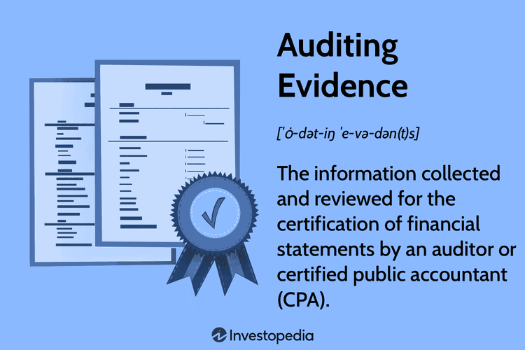

In the modern era of rapid technological advancements, the field of auditing has evolved significantly, particularly with the rise of algorithmic trading and complex financial instruments. Algorithmic trading refers to the use of advanced mathematical models and automated systems to execute trades at speeds and frequencies beyond human capability. This evolution has introduced novel challenges and opportunities for auditors who are tasked with ensuring the accuracy and reliability of financial statements.

The relationship between auditing evidence and algorithmic trading is intricate, primarily due to the unique nature of digital transactions and the complexity of the algorithms involved. Auditors must be equipped to assess the robustness of these trading algorithms, verify the integrity of transaction records, and evaluate whether such systems comply with accounting standards like the Generally Accepted Accounting Principles (GAAP) or International Financial Reporting Standards (IFRS).



This article aims to explore various facets of auditing evidence in the context of algorithmic trading, focusing on the characteristics of reliable evidence and providing real-world examples. Ensuring that the evidence gathered in these high-speed trading environments is sufficient, reliable, and relevant is essential for forming justifiable audit opinions. Auditors face several challenges, including adapting traditional audit procedures to address the intricacies introduced by algorithmic systems and the risk of automated fraud.

Understanding these dynamics is crucial for investors, auditors, and financial institutions aiming to navigate today’s complex financial landscape. As algorithmic trading continues to gain prevalence, maintaining robust auditing practices will be vital for preserving the integrity and transparency of financial markets.

## Table of Contents

## Understanding Auditing Evidence

Auditing evidence refers to the information that auditors gather to evaluate and verify a company's financial transactions, aiming to ensure compliance with established accounting standards such as Generally Accepted Accounting Principles (GAAP) or International Financial Reporting Standards (IFRS). The primary objective of collecting auditing evidence is to confirm the accuracy and reliability of a company's financial statements, thereby providing assurance to stakeholders including investors, regulators, and management.

Central to the concept of auditing evidence are several key components such as sufficiency, reliability, source, nature, and relevance. These attributes help auditors form a well-founded opinion on the financial health of an entity.

1. **Sufficiency**: This pertains to the quantity of evidence gathered. It must be adequate to enable auditors to form a reasonable opinion on the financial statements. The concept of sufficiency is often related to statistical sampling and judgments on the risk of material misstatements.

2. **Reliability**: Reliability concerns the trustworthiness and credibility of the evidence sources. Generally, evidence obtained from external sources, such as third-party confirmations and market data, is deemed more reliable than internally generated evidence. Independent, objective evidence is critical in reducing audit risk.

3. **Source**: The source of evidence profoundly affects its credibility. External documents, confirmations, and third-party attestations hold higher weight compared to internally prepared reports, which might carry inherent biases or errors.

4. **Nature**: This covers the form of evidence, which can be physical, documentary, oral, or digital, especially in modern environments where digital records are prevalent. Understanding the nature of evidence helps auditors use appropriate testing procedures.

5. **Relevance**: Relevance ensures that the collected evidence pertains directly to the audit objective. Evidence must adequately reflect the specific assertion being tested, such as completeness, accuracy, or valuation, thereby offering meaningful insights into the entity's compliance and performance.

Quality auditing evidence is indispensable for reducing audit risk and supporting auditors' conclusions regarding financial statements. By thoroughly evaluating these components, auditors can build a comprehensive understanding of an entity's financial position and operational outcomes, significantly enhancing the reliability of the financial reporting process.

## Characteristics of Good Auditing Evidence

Sufficiency, reliability, and relevance are cornerstone principles in assessing the quality of auditing evidence, ensuring accurate evaluation and verification of financial statements. 

### Sufficiency
Sufficiency refers to the need for an adequate quantity of evidence to allow auditors to form a reasonable opinion on the financial statements. This concept does not solely hinge on the [volume](/wiki/volume-trading-strategy) of data collected but rather requires a balanced consideration of both the risk of material misstatement and the quality of the evidence obtained. Auditors must assess whether the evidence they have gathered is enough to provide a substantive basis for their conclusions, often employing statistical sampling methods to support this determination. For instance, if assessing a firm's revenue recognition processes, auditors might determine a sample size that reflects the inherent risks associated with misstatements in that area.

### Reliability
Reliability is paramount in ensuring the trustworthiness of the evidence collected. The reliability of audit evidence depends heavily on its source and the manner in which it is obtained. Generally, evidence derived from independent external sources is considered more reliable than that obtained internally. For instance, confirmation of account balances from external financial institutions or verification of transactions through third-party confirmations typically carries greater credibility. Additionally, consistency in documentation and corroboration among different evidence sources enhance reliability. Auditors must critically evaluate the controls over information systems and data integrity, particularly in digital contexts like [algorithmic trading](/wiki/algorithmic-trading), to ensure the fidelity of financial records.

### Relevance
Relevance pertains to the appropriateness of evidence in addressing specific audit objectives. It requires the evidence to provide meaningful insights into the financial statements and reflect the entity’s compliance and performance. For auditing evidence to be relevant, it must closely relate to the assertions being tested, such as existence, completeness, or valuation. For example, when examining the valuation of financial instruments used in algorithmic trading, an auditor must gather data that directly supports valuation assertions, such as current market prices and the model assumptions used. Relevance ensures that the information collected effectively supports the auditor's conclusions about the financial statements’ fairness and accuracy. 

Each characteristic is integral in establishing a comprehensive audit framework that effectively scrutinizes the financial records of any entity, including those operating within high-speed, complex environments like algorithmic trading.

## Examples of Auditing Evidence

Auditing evidence is a cornerstone of ensuring the accuracy and reliability of financial statements. It comprises various documents and data points that auditors collect to verify financial transactions and assess compliance with relevant accounting standards. Common examples of auditing evidence include bank statements, invoices, receipts, and management accounts. These documents provide a basis for auditors to substantiate financial information and facilitate accurate reporting.

In algorithmic trading environments, the nature and scope of auditing evidence extend beyond traditional documents. Algorithmic trading involves the use of computer algorithms to execute trades at [high frequency](/wiki/high-frequency-trading) and volume, leading to the generation of large amounts of digital data. Consequently, auditors must consider additional elements such as system logs, trading algorithms themselves, and transaction records as critical sources of evidence.

System logs document the sequence of trading activities and systems operations, serving as a vital resource for auditors to verify the correctness of transactions and identify any discrepancies. Trading algorithms, representing the logic and rules governing automated trading decisions, require scrutiny to ensure they operate as intended without introducing errors or biases.

Transaction records in algorithmic trading environments provide detailed information on each executed trade, including timestamps, traded instruments, quantities, and prices. These records allow auditors to trace transactions back to source data and verify their accuracy against reported financial outcomes.

For instance, when auditing the financial records of a trading firm, auditors would collect invoices, transaction receipts, and third-party confirmations to substantiate reported revenues and bank balances. Third-party confirmations, especially from financial institutions, offer an independent source of verification that enhances the reliability of the information being audited.

In summary, while traditional sources of evidence such as bank statements and invoices remain critical, the dynamic nature of algorithmic trading necessitates a broader approach to evidence gathering. Auditors must integrate digital data sources like system logs and transaction records to provide a comprehensive audit that ensures financial integrity and compliance.

## Challenges of Auditing in Algorithmic Trading

Algorithmic trading has revolutionized financial markets, enabling large volumes of trades to be executed in microseconds. This rapid pace introduces unique challenges for auditors tasked with verifying the accuracy and integrity of such transactions. Traditional audit procedures, developed in an era of manual or semi-automated trading, often fall short in environments dominated by algorithmic trading due to several key complexities.

Firstly, the sheer volume and velocity of trading activities present a substantial monitoring challenge. Unlike manual trades, algorithmic trading can execute millions of transactions within seconds. This requires auditors to employ sophisticated data analytics tools capable of handling big data to capture and analyze this vast quantity of transactions effectively. The traditional sampling approaches may be inadequate, compelling the need for more comprehensive and continuous auditing techniques.

Secondly, algorithmic trading introduces the potential for automated errors and fraud, complicating the detection and correction processes. Algorithms can malfunction due to coding errors, leading to significant financial discrepancies. Moreover, there is an increased risk of malicious activities, such as spoofing or layering, where trading algorithms are manipulated to deceive other market participants. Auditors must be vigilant in assessing the integrity of these algorithms and ensuring they comply with regulatory standards.

Another challenge lies in the complexity of trading systems and internal controls. Algorithmic trading requires robust internal controls to prevent unauthorized access and mitigate operational risks. Auditors need to verify that these controls are not only in place but are also effective in maintaining the reliability of the trading environment. This involves a detailed examination of the IT infrastructure, including algorithms, system logs, and security protocols.

The continuous evolution of algorithms and trading platforms adds another layer of difficulty. As financial institutions frequently update their trading systems to gain a competitive edge, auditors must constantly adapt their methods and understanding to keep pace with these technological advancements.

Lastly, there is a necessity for specialized knowledge in both technology and finance among auditors. Understanding how different algorithms function, the purpose they serve, and the potential risks they pose requires a blend of expertise that is often scarce in the auditing profession. Institutions may need to invest in training auditors or hiring data scientists and technologists to augment traditional auditing teams.

In summary, auditing in the context of algorithmic trading necessitates a holistic approach that leverages advanced analytical tools and embraces continuous monitoring. It demands a thorough understanding of both the technological and financial aspects of algorithmic trading to effectively safeguard the integrity of modern financial markets.

## The Role of Technology in Enhancing Auditing Practices

The integration of big data analytics and [artificial intelligence](/wiki/ai-artificial-intelligence) (AI) into auditing is revolutionizing the way auditing evidence is gathered and analyzed. In the context of algorithmic trading, these technologies provide tools to handle the complexity and volume of data generated, which traditional auditing approaches would struggle to manage efficiently.

Automated tools empowered by AI assist auditors in rapidly identifying anomalies and trends within large datasets. These systems employ [machine learning](/wiki/machine-learning) algorithms that can detect unusual patterns indicative of errors or potential fraud. For instance, AI algorithms can be programmed to flag transactions that deviate from historical normatives. An example of such an algorithm in Python might involve using libraries like `numpy` and `scikit-learn` to identify outliers:

```python
import numpy as np
from sklearn.ensemble import IsolationForest

# Example dataset representing transaction values
transactions = np.array([100, 105, 120, 130, 150, 1000, 110, 115])

# Using IsolationForest to detect outliers
model = IsolationForest(contamination=0.1)
model.fit(transactions.reshape(-1, 1))
anomalies = transactions[model.predict(transactions.reshape(-1, 1)) == -1]

print("Anomalous transactions:", anomalies)
```

This utilization of technology aids the continuous auditing process, allowing auditors to perform real-time verification and assessment of financial transactions. Continuous auditing is enabled by systems that can process data streams as they occur, providing instant feedback on financial performance and adherence to compliance standards.

Moreover, blockchain technology is emerging as a significant influence in enhancing auditing practices. It ensures data integrity through immutable records, thus offering a transparent and secure method for tracking transaction histories. Through smart contracts, auditors can automate compliance checks and validate transactions without manual intervention.

AI and machine learning facilitate the creation of predictive models that anticipate future issues based on historical data analysis. These algorithms can evaluate vast amounts of information to predict potential compliance breaches or financial discrepancies, thereby allowing auditors to preemptively address potential risks.

In conclusion, big data analytics and AI are not merely augmenting traditional auditing processes but are fundamentally transforming them. By leveraging these technologies, auditors can ensure a higher degree of precision and reliability in their evaluations, maintaining the integrity and transparency necessary for the complex environments of modern financial systems like algorithmic trading.

## Conclusion

As algorithmic trading continues its ascent in financial markets, the auditing discipline is compelled to adapt to the increasing complexities of evidence gathering and verification processes. The speed and volume at which transactions occur in algorithmic trading environments demand precise and efficient auditing methodologies to ensure that financial information remains accurate and comprehensive.

Upholding the integrity and transparency of financial markets necessitates the maintenance of strong auditing practices. By ensuring that all financial statements and transactions are subjected to rigorous verification processes, auditors play a crucial role in fostering stakeholder trust and market stability. Robust auditing practices are foundational to identifying discrepancies and preventing malpractices in financial reporting.

To navigate the dynamic landscape of algorithmic trading, auditors must embrace technological advancements that enhance their capabilities. Leveraging tools such as big data analytics and artificial intelligence allows auditors to manage large volumes of data and identify patterns or anomalies that could indicate fraudulent activities or compliance issues. This technological integration not only streamlines traditional audit procedures but also provides auditors with novel insights that may not be accessible through conventional means.

As the industry progresses, auditors are tasked with adapting their methodologies to keep pace with technological innovations. This involves a commitment to continuous learning and the implementation of cutting-edge technologies that facilitate real-time auditing and assessments. By harnessing these advancements, auditors can deliver accurate and reliable conclusions essential for informed decision-making by investors, regulators, and financial institutions. 

In essence, the evolution of auditing practices in response to the proliferation of algorithmic trading is crucial. It ensures that auditors remain effective defenders of market integrity, thereby underscoring their indispensable role in the evolving financial landscape.

## References & Further Reading

[1]: Bergstra, J., Bardenet, R., Bengio, Y., & Kégl, B. (2011). ["Algorithms for Hyper-Parameter Optimization."](https://dl.acm.org/doi/10.5555/2986459.2986743) Advances in Neural Information Processing Systems 24.

[2]: ["Advances in Financial Machine Learning"](https://www.amazon.com/Advances-Financial-Machine-Learning-Marcos/dp/1119482089) by Marcos Lopez de Prado

[3]: ["Evidence-Based Technical Analysis: Applying the Scientific Method and Statistical Inference to Trading Signals"](https://www.amazon.com/Evidence-Based-Technical-Analysis-Scientific-Statistical/dp/0470008741) by David Aronson

[4]: ["Machine Learning for Algorithmic Trading"](https://github.com/stefan-jansen/machine-learning-for-trading) by Stefan Jansen

[5]: ["Quantitative Trading: How to Build Your Own Algorithmic Trading Business"](https://www.amazon.com/Quantitative-Trading-Build-Algorithmic-Business/dp/1119800064) by Ernest P. Chan