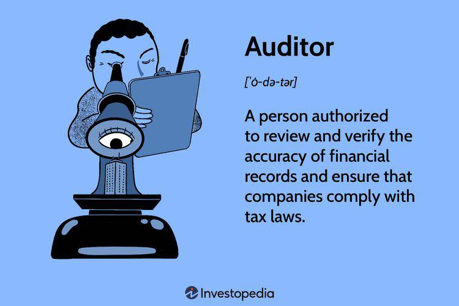

In the complex world of finance, auditors play a critical role in ensuring the accuracy and integrity of financial statements. They act as independent evaluators who verify the financial health and operations of an organization, thus underpinning the trustworthiness of financial reports. By scrutinizing financial records, auditors help protect against inaccuracies, inconsistencies, and fraudulent activities that could severely impact economic decisions and stakeholder confidence.

Understanding the different types of auditors and their qualifications is essential for businesses aiming to maintain transparency and trust. Organizations invest considerable resources in auditing not only to comply with regulatory obligations but also to enhance their internal controls and operational efficiency. By hiring qualified auditors, businesses can assure investors, regulatory bodies, and the public of their financial stability and ethical business practices.

This article explores the various types of audits, the necessary qualifications for auditors, and the intersection with algorithmic trading. With advancements in technology, algorithmic trading has become an integral part of the financial landscape, necessitating rigorous oversight from auditors to ensure compliance and minimize risks associated with automated trading systems. Auditors who specialize in this area play a pivotal role in verifying the integrity of trading algorithms and ensuring that they adhere to applicable laws and regulations.

## Table of Contents

## What is an Auditor?

An auditor is a professional responsible for examining and verifying the financial records of organizations to ensure accuracy and compliance with tax laws. This role is critical in maintaining the integrity of a company’s financial operations and ensuring that financial statements are accurate, complete, and free from material misstatement. Auditors provide an essential level of assurance for stakeholders, including investors, creditors, and regulatory bodies, who rely on financial reports for decision-making purposes.

Auditors help protect businesses from fraud by systematically evaluating financial documents and transactions to detect any irregularities or misconduct. They implement rigorous testing procedures and analytical techniques to identify potential fraud or financial discrepancies. In doing so, auditors not only safeguard the company’s assets but also bolster its credibility and trustworthiness in the marketplace.

Beyond fraud detection, auditors offer valuable insights and recommendations aimed at enhancing operational efficiency. By analyzing internal processes and controls, they identify areas where improvements can be made to reduce inefficiencies, cut costs, and optimize resource utilization. These recommendations can lead to improved business operations and better strategic decision-making.

Auditors operate across various sectors and industries, and their responsibilities can differ significantly depending on their specific type and field of audit. Internal auditors, for instance, primarily focus on evaluating a company's internal controls and risk management processes, ensuring that these processes comply with organizational policies and regulations. In contrast, external auditors, who are typically hired by third-party firms, provide independent evaluations of a company's financial statements, which are crucial for stakeholders outside of the company. Additionally, specialized auditors, such as forensic auditors, concentrate on investigating financial irregularities that may involve fraud or criminal activity, often supporting legal proceedings with their findings.

Overall, an auditor plays a pivotal role in ensuring the reliable operation of financial systems within organizations by upholding transparency, accuracy, and regulatory compliance.

## Types of Auditors

Auditors are integral to the financial ecosystem, offering services tailored to different organizational needs and regulatory requirements. Four primary types of auditors are central to maintaining financial integrity and compliance across various sectors: internal auditors, external auditors, government auditors, and forensic auditors.

**Internal Auditors** are professionals employed within an organization to conduct thorough assessments of its financial and operational activities. Their primary function is to evaluate the effectiveness of internal controls, risk management processes, and governance systems. Internal auditors help organizations identify inefficiencies, recommend improvements, and monitor compliance with internal policies. They often report their findings directly to senior management or the audit committee, ensuring that any potential issues are promptly addressed and rectified.

**External Auditors** are typically associated with third-party firms that provide an independent assessment of an organization's financial statements. Their objective is to offer an unbiased opinion on whether the financial reports accurately reflect the company's financial position. External auditors are crucial for fulfilling statutory audit requirements and offering assurance to investors, regulators, and other stakeholders. They meticulously examine financial records, assess accounting practices, and test internal controls to verify the accuracy and consistency of financial information.

**Government Auditors** focus on evaluating financial operations within public sector entities to ensure compliance with relevant laws and regulations. Their audits often emphasize accountability and transparency in the use of public resources. Government auditors are responsible for verifying that public funds are spent efficiently and according to the allocated budget. They may work for government agencies such as the Internal Revenue Service (IRS) in the United States or the National Audit Office in the United Kingdom, scrutinizing a wide range of financial activities from tax collection to defense spending.

**Forensic Auditors** specialize in identifying and investigating financial fraud and irregularities. They are often called upon during legal proceedings or investigations to provide expert analysis and testimony. Forensic auditors employ various techniques, including data analysis and interview processes, to trace financial anomalies and uncover fraudulent activities. Their work is instrumental in building legal cases, particularly in complex financial fraud scenarios, such as embezzlement, bribery, or corruption. Their findings frequently contribute to prosecutions and settlements in court.

Each type of auditor brings a unique skill set and plays a critical role in safeguarding financial integrity, ensuring compliance, and fostering trust within the financial domain. Businesses and public agencies alike rely on these professionals to provide transparency, improve operational efficiencies, and protect against financial improprieties.

## Auditor Qualifications

Auditors require specific qualifications and continuous professional development to effectively perform their roles. External auditors are generally expected to hold a Certified Public Accountant (CPA) license. This credential is granted by the American Institute of Certified Public Accountants (AICPA) and is widely recognized as a standard for auditing proficiency in the United States. The CPA license ensures that an auditor has met rigorous education, examination, and experience requirements, affirming their capability to assess financial information accurately and objectively.

Internal auditors, on the other hand, might not need a CPA license. While it can be beneficial, internal auditors typically have a bachelor's degree in finance, accounting, or a related field. This educational background provides them with the foundational knowledge necessary to evaluate an organization’s financial and operational systems effectively. Internal auditors may also pursue certifications such as the Certified Internal Auditor (CIA) designation, which is awarded by The Institute of Internal Auditors (IIA).

Regardless of their specific qualifications, auditors must engage in continuous professional education. The financial and regulatory landscapes are constantly evolving, necessitating that auditors stay updated with changes to maintain their competence. This ongoing education can include attending workshops, seminars, and conferences, or participating in online courses and training sessions. Keeping abreast of industry regulations and best practices is essential for auditors, as it enables them to provide accurate assessments and recommendations to their clients or employers.

The commitment to lifelong learning ensures that auditors can adapt to new auditing standards and emerging challenges in the financial world, thereby maintaining their role as reliable and trusted advisors in ensuring financial transparency and integrity.

## The Role of Auditors in Algorithmic Trading

Algorithmic trading utilizes sophisticated computer programs to execute trades at high speed and [volume](/wiki/volume-trading-strategy), often operating across multiple markets simultaneously. This form of trading relies heavily on algorithms that are designed to make decisions based on market data analysis, technical indicators, and other financial variables.

In this complex landscape, auditors play a critical role. They ensure that the algorithms used comply with trading laws and regulations, which are essential for maintaining market integrity and preventing manipulative practices. For instance, auditors verify the compliance of trading algorithms with regulations established by financial authorities, such as the Securities and Exchange Commission (SEC) in the United States or the European Securities and Markets Authority (ESMA) in the European Union.

A key responsibility for auditors is the accurate documentation of trades executed by algorithmic systems. Accurate trade documentation helps prevent financial discrepancies and ensures transparency in trading activities. Auditors evaluate the end-to-end trading processes to confirm that trading activities are recorded correctly and comply with both internal policies and external regulations.

Moreover, auditors assess the functionality of automated systems to ensure they operate as intended. This involves verifying that algorithms execute trades based on predefined criteria without unintended deviations that may result in financial inaccuracies or fraudulent transactions. For example, an algorithm designed for [arbitrage](/wiki/arbitrage) opportunities should consistently exploit price differentials across markets without executing errant trades due to coding errors or data misinterpretation.

To minimize risks, auditors conduct regular reviews and stress tests of the trading algorithms. They evaluate the risk management controls put in place to address potential system failures or market anomalies. Through rigorous testing and validation processes, auditors help establish that trading systems maintain their accuracy and integrity even in complex market conditions.

In conclusion, auditors provide essential oversight in [algorithmic trading](/wiki/algorithmic-trading), ensuring compliance with regulatory standards and maintaining accuracy in automated trading systems. By doing so, they play a crucial role in safeguarding the financial integrity of markets, contributing to the broader goal of fostering trust and stability in the financial industry.

## Conclusion

Auditors are essential for maintaining the financial integrity of organizations, providing an indispensable service through a variety of assessments, including internal audits and forensic investigations. These professionals play a crucial role in safeguarding against financial misstatements and fraudulent activities, thereby ensuring confidence in the company's reported financial status.

Understanding the distinct types of auditors and their qualifications is critical for organizations seeking to employ the right expertise tailored to their specific needs. Internal auditors focus on evaluating and improving risk management and internal controls within an organization, while external auditors provide an independent examination of financial statements for regulatory and public assurance. Forensic auditors specialize in identifying financial fraud and supporting legal inquiries, adding a further layer of protection against financial crime.

The advent of advanced technologies like algorithmic trading has increased the demand for auditors who can ensure these systems operate within legal and regulatory frameworks. Auditors in this area must verify that algorithms execute trades as intended and that they comply with applicable trading laws, thereby reducing the risk of discrepancies and potential financial misconduct. Their oversight is integral to maintaining the authenticity of automated systems, which is essential for sustaining investor trust and public confidence.

Overall, the growing complexity of financial systems in today's technologically driven environment underscores the importance of auditors. Their role in verifying compliance and operational effectiveness is critical not only for organizational stability but also for the broader economic landscape, where investor confidence hinges on the reliability of financial reporting.

## Additional Resources

For individuals interested in pursuing a career in auditing, several programs and certifications can significantly enhance skills and qualifications. Key among these is the Certified Public Accountant (CPA) certification, a widely-recognized credential essential for external auditors, particularly in the United States. The American Institute of Certified Public Accountants (AICPA) oversees the CPA examination, which tests knowledge across various domains including auditing, financial accounting, and business environments.

Another valuable certification is the Certified Internal Auditor (CIA) designation, governed by the Institute of Internal Auditors (IIA). This certification is particularly beneficial for those aiming to specialize in internal auditing and involves comprehensive testing on risk management, governance, and control processes. For individuals interested in forensic auditing, the Certified Fraud Examiner (CFE) certification, offered by the Association of Certified Fraud Examiners (ACFE), equips professionals with specialized skills to detect and prevent fraud.

Businesses should prioritize hiring qualified auditors to safeguard their financial processes and ensure long-term stability. Qualified auditors offer reliability in financial reporting, assist in managing risk, and contribute to effective corporate governance. Selecting auditors with the appropriate certifications and continuous professional education ensures adherence to the latest industry standards and practices.

For updated information on auditing standards and certifications, individuals and businesses can turn to various regulatory websites and educational portals. The AICPA, IIA, and ACFE all provide resources and updates related to certification requirements and industry trends. These organizations often offer webinars, seminars, and other educational opportunities that are crucial in maintaining up-to-date knowledge in the dynamic field of auditing. Regulatory bodies such as the Public Company Accounting Oversight Board (PCAOB) and the International Auditing and Assurance Standards Board (IAASB) also provide valuable guidelines and updates on auditing standards worldwide.

## References & Further Reading

[1]: ["Auditing and Assurance Services"](https://www.pearsonhighered.com/assets/preface/0/1/3/5/0135176115.pdf) by Alvin A. Arens, Randal J. Elder, and Mark S. Beasley

[2]: ["Principles of Auditing & Other Assurance Services"](https://quizlet.com/429893931/chapter-2-principles-of-auditing-other-assurance-services-flash-cards/) by Ray Whittington and Kurt Pany

[3]: ["Internal Auditing: Assurance & Advisory Services"](https://www.amazon.com/Internal-Auditing-Assurance-Advisory-Services/dp/0894139878) by The Institute of Internal Auditors

[4]: ["Certified Fraud Examiner (CFE) Exam Prep"](https://www.acfe.com/cfe-credential/about-the-cfe-exam) from the Association of Certified Fraud Examiners

[5]: ["Algorithmic Trading and DMA: An Introduction to Direct Access Trading Strategies"](https://www.amazon.com/Algorithmic-Trading-DMA-introduction-strategies/dp/0956399207) by Barry Johnson