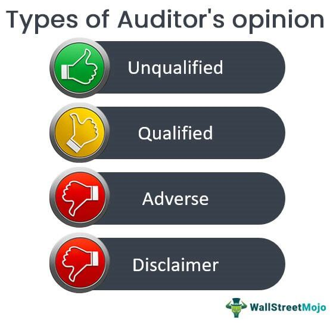

This article explores the crucial interrelationship between an auditor's opinion, audit reports, financial auditing, and algorithmic trading. The financial markets depend significantly on the accuracy of financial statements and reliable audits, which, in turn, influence the strategies employed in algorithmic trading. Thoroughly understanding auditors' opinions, encompassing the various types issued, their role in financial auditing, and their impact on algorithmic trading is essential for making well-informed financial decisions.

Auditors' opinions serve as a certification mechanism, providing an assessment of a company's adherence to prevailing accounting standards and the overall accuracy of its financial statements. This evaluation is critical as it shapes the perception of stakeholders about a company’s financial health, directly affecting investor confidence. Consequently, these opinions are not only pivotal for traditionally managed portfolios but also for algorithmic trading systems, which rely on accurate, timely financial data to execute trades based on predefined criteria.

Algorithmic trading, characterized by its use of automated systems to make trading decisions, thrives on data integrity ensured by comprehensive auditing processes. The interplay between audit practices and automated trading fosters an environment of enhanced market transparency and operational efficiency. As transactions occur at speeds unattainable by human traders, the veracity of the data sourced from financial statements becomes imperative. Misstatements or inaccuracies can significantly alter trading outcomes, highlighting the need for a robust auditing framework to safeguard the integrity of financial reporting.

This article aims to provide insights into how auditing practices nurture market transparency and efficiency, particularly within the automation landscape in trading. As technology and financial systems evolve, the importance of precise, audited financial data remains foundational to the successful functioning of markets, underpinning both traditional investment approaches and advanced algorithmic trading.

## Table of Contents

## Understanding Auditor's Opinion

An auditor’s opinion serves as a professional endorsement that accompanies financial statements following audit assessments. It effectively communicates the auditor’s evaluation regarding the accuracy of a company’s financial statements and their adherence to established accounting standards, such as Generally Accepted Accounting Principles (GAAP) or International Financial Reporting Standards (IFRS). The auditor's opinion is an integral part of the audit report, which also details the scope of the audit procedures conducted and specifies the type of opinion issued.

Auditors typically issue one of four types of opinions, each reflecting varying degrees of confidence and conformity with accounting principles:

1. **Unqualified Opinion**: Often termed a 'clean' opinion, this suggests that the financial statements present a true and fair view, free of material misstatements, and are in compliance with the applicable accounting framework. Such an opinion indicates that the auditor has encountered no significant issues during the audit process.

2. **Qualified Opinion**: This indicates that, except for certain specified issues, the financial statements are presented fairly. The qualification usually pertains to particular areas of the financial statements that deviate from the standard due to limited evidence or a specific anomaly observed during audit tests.

3. **Adverse Opinion**: This is a severe form of opinion where the auditor concludes that the financial statements are materially misstated and do not conform to the required accounting principles. An adverse opinion often suggests significant issues such as fraud or substantial misrepresentations that impact the reliability of the financial information.

4. **Disclaimer of Opinion**: This occurs when auditors are unable to complete the audit or have insufficient evidence to form an opinion on the financial statements. This could be due to constraints imposed on the audit process or uncertainties within the financial records.

The type of auditor’s opinion issued can significantly influence stakeholders' trust and confidence in a company's financial health. An unqualified opinion typically enhances credence in the accuracy of a company’s financial disclosures, while a qualified or adverse opinion may raise concerns among investors, creditors, and other stakeholders regarding potential financial risks or discrepancies. Understanding these opinions is thus essential for accurately assessing the financial integrity and operational performance of a business entity.

## Types of Auditor's Opinions

Auditors' opinions are essential components of the audit process as they provide stakeholders with an evaluation of a company's financial health and conformity with accounting standards. These opinions are typically categorized into four distinct types, each with its implications for financial statements and their users.

Unqualified Opinion: The unqualified opinion, often referred to as a 'clean' opinion, is the most favorable type of auditor's opinion a company can receive. This opinion signifies that the financial statements are free from material misstatements and are presented in accordance with Generally Accepted Accounting Principles (GAAP). It suggests that the company's financial records are both accurate and complete, boosting stakeholders’ confidence in the company's financial practices.

Qualified Opinion: A qualified opinion is issued when an auditor encounters certain exceptions to GAAP during the assessment of financial statements. While the financial records are generally presented accurately, the auditor outlines specific areas where the company failed to comply with accounting principles. Users of the financial statements must take these exceptions into account, as they might affect the overall accuracy or reliability of the financial data provided.

Adverse Opinion: This opinion is issued when financial statements are materially misstated and do not conform to the required accounting standards. An adverse opinion is a significant red flag for users, indicating potential issues such as financial inaccuracies or fraud. As such, it often leads to increased scrutiny from investors and regulatory bodies, as well as potential legal ramifications for the company.

Disclaimer of Opinion: A disclaimer is issued when auditors are unable to complete the audit and, as a result, cannot form an opinion on the financial statements. This situation typically arises due to significant limitations on the scope of the audit, such as a lack of sufficient and competent audit evidence. Companies receiving a disclaimer face challenges in maintaining stakeholder trust, as it suggests a substantial lack of transparency or cooperation in the auditing process.

These different types of auditors' opinions play a critical role in assessing the reliability of financial reports, thus influencing financial decision-making processes and strategies.

## The Importance of Audit Reports

Audit reports are essential instruments that provide assurance regarding the accuracy of financial statements, significantly bolstering investor confidence. These reports serve as a foundational component in the financial decision-making process, as they are used by investors, analysts, and other stakeholders to evaluate the financial health and performance of a company. An audit report, typically prepared by an independent external auditor, offers a professional opinion on whether the financial statements present a true and fair view in accordance with the applicable financial reporting framework, such as Generally Accepted Accounting Principles (GAAP) or International Financial Reporting Standards (IFRS).

The identification of inaccuracies or misrepresentations in financial reporting is one of the core functions of audit reports. By conducting a detailed and systematic examination of a company's financial records, auditors are able to detect errors, fraudulent activities, or other discrepancies that could potentially mislead stakeholders. This detection process not only protects stakeholders from making misinformed decisions but also discourages companies from engaging in fraudulent reporting practices due to the increased likelihood of detection. 

A reliable audit process is crucial for ensuring the accuracy of financial data. Accurate financial data is vital not only for traditional investors who rely on these data to make informed investment decisions but also for automated trading systems. Algorithmic traders use sophisticated models and algorithms to process vast amounts of financial data quickly and to execute trading strategies. The reliability of their models and operations is heavily dependent on the integrity and accuracy of the underlying financial data obtained through audit-certified reports. Therefore, any misstatement or error in the financial data can lead to substantial financial losses due to incorrect trading decisions based on flawed data.

Furthermore, audit reports play a critical role in mitigating risks and ensuring fair financial practices within organizations. They improve corporate governance by fostering an environment of accountability and transparency. Audits provide insights that can lead to better internal controls and risk management strategies, reducing the likelihood of financial irregularities and associated risks. For companies, reliable audit outcomes can enhance credibility and augment market reputation, positively influencing investor perceptions and potentially leading to a lower cost of capital.

In summary, audit reports not only instill trust in the financial markets but also enhance the efficiency and reliability of trading decisions, particularly in [algorithmic trading](/wiki/algorithmic-trading) systems. By providing assurance of the accuracy and fairness of financial statements, they form the linchpin of transparent and effective financial systems, serving the needs of both human investors and automated systems alike.

## The Role of Algo Trading

Algorithmic trading involves using automated systems to execute trades according to pre-defined criteria, often leveraging vast amounts of financial data. These systems are designed to make trading decisions based on algorithms that analyze market conditions, historical prices, and other factors. The efficacy of algorithmic trading is largely contingent upon the availability of accurate and timely financial data.

Audited financial statements play a crucial role in ensuring that the data used by algorithmic trading systems is reliable. Thorough auditing processes help verify the accuracy of financial information, reducing the risk of strategies based on incorrect data. This reliability is paramount as algorithmic trading systems depend on high-quality data to execute trades at optimal times and prices.

The speed and efficiency of automated trading systems offer an advantage over human traders. Algorithms can process and respond to market data far more quickly than humans, allowing for rapid execution of trades. This capability often translates into more efficient trading strategies and potentially higher returns, based on real-time data and trends.

However, the performance of algorithmic trading systems is inherently tied to the trustworthiness of the financial data they utilize. Inaccurate or misleading information can lead to poor trading decisions, undermining the effectiveness of even the most advanced trading algorithms. Therefore, maintaining the accuracy and reliability of this data through diligent auditing is critical to the success of algorithmic trading in financial markets.

## Intersection of Audit and Algo Trading

Algorithmic trading depends heavily on the precision and dependability of financial data, which hinges on the rigorous auditing of financial statements. Accurate audits provide the foundation for the data that automated systems use when developing trading strategies. Any inaccuracies or misrepresentations in financial reports can result in automated systems making incorrect trading decisions, potentially leading to significant market aberrations.

The importance of auditing extends to promoting transparency and stability within the market. A transparent market enhances confidence among stakeholders, including algorithmic traders who rely on the data's integrity for effective decision-making. A robust audit process ensures that financial statements present a true and fair view of a company's financial position, reducing the risk of errors that could lead to misguided trading actions.

Moreover, auditor opinions, whether unqualified or qualified, play a crucial role in informing the data pool accessed by algorithmic trading systems. An unqualified opinion from auditors indicates that the financial statements are presented fairly in all material aspects, adhering to the applicable financial reporting framework. This assurance supports algorithmic trading systems in implementing strategies based on sound financial data, thereby optimizing their trading performance.

Erroneous data input from unreliable financial statements can propagate through automated trading algorithms, causing undesired outcomes. For instance, if a company's profitability is overstated due to misstatements, an algorithm might overweight the company in a portfolio, exposing it to unnecessary risk. Consequently, reliable auditing serves as a critical safeguard, ensuring the quality and reliability of the input data for these sophisticated systems, which is vital for executing effective trading strategies and maintaining market equilibrium.

## Conclusion

The synergy between accurate financial reporting, thorough auditing, and efficient algorithmic trading is a cornerstone of modern financial markets. Accurate financial data forms the foundation upon which algorithmic trading systems operate. These systems rely on precise information to make rapid trading decisions, highlighting the essentiality of trustworthy audits. Understanding the nuances of auditor's opinions, such as unqualified, qualified, adverse, and disclaimer of opinion, is crucial for investors and algorithmic traders. Each type reflects varying levels of confidence in a company's financial statements and directly impacts the perceived reliability of financial data used in trading algorithms.

As algorithmic trading continues to evolve, rigorous financial audits and transparent reporting remain paramount. Automated systems often make decisions faster than human capabilities, which necessitates a high level of trust in the underlying data. Any discrepancies or misstatements in financial reports can have significant repercussions, potentially leading to erroneous trading strategies and substantial financial consequences.

Future advancements in technology and financial systems will undoubtedly increase the complexity and speed of financial data usage. Despite these changes, the dependency on accurate, audited financial data will persist. Ensuring data integrity through meticulous audits not only supports the functionality of algorithmic trading systems but also contributes to overall market transparency and efficiency. It is a continuous cycle of trust and verification that underpins the stability and success of financial markets globally.

## References & Further Reading

Explore authoritative resources to deepen your understanding of financial auditing and algorithmic trading strategies by consulting a diverse range of literature:

- 'Understanding Financial Statements' and 'Auditing and Assurance Services' are comprehensive books that offer insights into the preparation and examination of financial records, providing a solid foundation for appreciating the mechanics and significance of audits.

- Stay informed about the latest trends in auditing standards and algorithmic trading technologies by engaging with financial publications and research papers. Journals such as the Journal of Finance, The Accounting Review, and the Journal of Financial Economics often feature articles that cover advancements and analysis in both fields.

- To gain more specialized knowledge, consider exploring industry journals such as the Journal of Computational Finance and Algorithmic Finance, which focus on the specific technologies and methodologies employed in algorithmic trading.

- Various financial accounting textbooks provide foundational knowledge that is crucial for understanding complex audit processes and their impact on financial statements and trading strategies. Examples include 'Principles of Accounting and Finance' and 'Intermediate Financial Management.'

By referring to these materials, practitioners and students alike can gain a more nuanced understanding of how financial audits support market transparency and efficiency, especially in automated trading environments.

