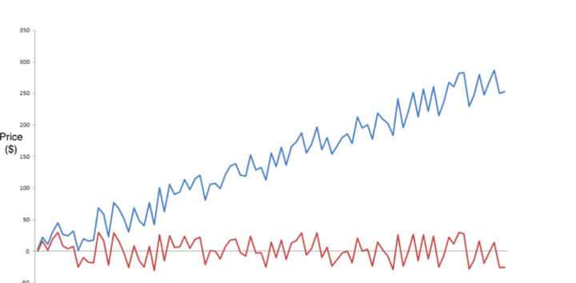

The Augmented Dickey-Fuller (ADF) Test is an essential instrument in algorithmic trading, especially for strategies that depend on time series analysis. Time series data is a record of observations taken sequentially over time, and for successful algorithmic trading, it is critical to determine whether such a series is stationary. Stationarity suggests that the time series has consistent statistical properties, such as mean and variance, over time, which is crucial for making reliable predictions and informed trading decisions. Non-stationary data, on the other hand, can lead to models that make inaccurate forecasts, as their statistical properties change over time, making them unpredictable.

Understanding the stationarity of a time series allows traders to identify trends, cycles, and seasonal effects, and to apply appropriate models that can exploit these behaviors. The ADF test aids in this by testing the null hypothesis that a unit root is present, suggesting the series is non-stationary. Rejecting this hypothesis indicates that the series is stationary and suitable for further analysis. Algorithmic traders leverage the insights gained from the ADF test to optimize their strategies and minimize risks associated with trading based on unreliable data patterns.



This article examines the importance of the ADF test in algorithmic trading and elucidates how it assists in confirming the stationarity of a time series. Understanding these concepts is vital for traders aiming to refine their strategies and enhance their predictive capabilities in financial markets.

## Table of Contents

## Understanding Stationarity in Time Series

Stationarity in time series analysis is a foundational concept essential for the development of reliable algorithmic trading models. A time series is said to be stationary if its statistical properties, such as mean, variance, and autocorrelation, are constant over time. This is mathematically represented as: 

$$

E(X_t) = \mu \quad \text{and} \quad \text{Var}(X_t) = \sigma^2 
$$

where $X_t$ represents the value of the time series at time $t$, $\mu$ is the mean, and $\sigma^2$ is the variance. Consistency in these properties allows traders to make predictions based on historical data, as the future statistical behavior of the series is assumed to mirror the past.

In [algorithmic trading](/wiki/algorithmic-trading), stationary time series facilitate precise forecasting of asset prices or returns. This stability aids in developing models that rely on the assumption of data consistency over time, such as mean reversion strategies. Models constructed on non-stationary data often result in unreliable predictions and can lead to significant financial losses. Differences between stationary and non-stationary series primarily affect the suitability of statistical models; many analytical techniques, for instance, regression, assume stationarity to yield valid results.

Non-stationary series, where trends or seasonality exist, can mislead traders by indicating false relationships or patterns that are not truly predictive. As a result, it is crucial to transform non-stationary data into stationary before embedding them into trading algorithms. Techniques like differencing, transformation, or detrending are commonly used to attain stationarity.

Being able to distinguish between stationary and non-stationary time series is critical for any trading model. The effective application of these concepts ensures models are statistically sound and the associated trading strategies are viable in real-world financial markets.

## The Augmented Dickey Fuller Test

The Augmented Dickey-Fuller (ADF) test is a vital statistical method used to determine if a given time series is stationary. Stationarity, a key concept in time series analysis, indicates that the statistical properties of a series, such as mean and variance, remain constant over time. The ADF test expands upon the basic Dickey-Fuller test by incorporating a larger and more flexible model framework, allowing the examination of complex time series data with potential autocorrelation issues.

In hypothesis testing, the ADF test examines the null hypothesis that a unit root is present in a time series. A unit root signifies that the series is non-stationary, implying that shocks to the system have persistent effects on the data's level. The general form of the ADF test regression equation is:

$$
\Delta y_t = \alpha + \beta t + \gamma y_{t-1} + \sum_{i=1}^{p} \delta_i \Delta y_{t-i} + \epsilon_t
$$

where $\Delta$ is the difference operator, $\alpha$ represents the constant term, $\beta t$ the trend component, $\gamma y_{t-1}$ the lagged level term, and $\epsilon_t$ is the white noise error term. The parameter $p$ is the lag order of the autoregressive process, which is added to address any potential autocorrelation in the residuals.

The focus of the ADF test is on the coefficient $\gamma$. Specifically, the null hypothesis $H_0: \gamma = 0$ suggests that a unit root exists, resulting in a non-stationary series. Conversely, rejecting $H_0$ in favor of the alternative $H_1: \gamma < 0$ implies stationarity.

Interpreting the results of the ADF test involves examining the test statistic and comparing it to critical values. If the test statistic is less than the critical value, the null hypothesis is rejected, indicating that the series is stationary. However, several considerations must be accounted for when interpreting the results, including the choice of lag length and whether or not to include trend or constant terms in the analysis.

In summary, understanding the ADF test is crucial for accurately assessing the stationarity of time series data, which is integral to developing reliable predictive models and ensuring sound decision-making in various analytical applications.

## Importance of ADF Test in Algorithmic Trading

Algorithmic trading (algo trading) effectively utilizes statistical tools to identify profitable trading opportunities, with the Augmented Dickey-Fuller (ADF) test being a critical component in this process. The ADF test is primarily used to establish stationarity in time series data, which serves as a foundation for making precise predictions and developing reliable trading models.

Stationarity implies consistent statistical properties, such as mean and variance, over time. Such properties are desirable in trading systems because they enhance the predictability of future price movements. Established stationarity aids traders in identifying non-random price patterns that can be exploited in trading strategies. The ADF test provides a systematic approach to determine whether a time series conforms to the notion of stationarity by evaluating the presence of a unit root. The null hypothesis in the ADF test states that the time series is non-stationary, with rejection of this hypothesis suggesting a stationary series.

Consider the formula leveraged in the ADF test:

$$
\Delta y_t = \alpha + \beta t + \gamma y_{t-1} + \delta_1 \Delta y_{t-1} + \delta_2 \Delta y_{t-2} + \cdots + \delta_p \Delta y_{t-p} + \epsilon_t
$$

In this equation, $y_t$ represents the time series at time $t$, $\alpha$ is a constant, $\beta$ is the coefficient on a time trend, $\gamma$ is the parameter we are testing (typically the focus is on $\gamma = 0$ for testing unit roots), $\Delta$ signifies the first difference operator, and $\epsilon_t$ is a white noise term.

Algo traders employ the ADF test to ensure that their predictive models are statistically sound, thus reducing the probability of executing trades on unreliable forecasts. This becomes particularly important in strategies like pairs trading, a method that involves betting on the convergence of prices between two related securities. Here, the ADF test is used to ensure that both securities in the pair are cointegrated, meaning they have a long-term equilibrium relationship. Such a relationship implies mean reversion, where prices revert to a mean value over time, creating a predictable pattern amenable to trading.

By confirming stationarity with the ADF test, traders can develop pairs trading strategies that capitalize on temporary price deviations, assuming that prices will eventually revert to their historical mean. This enhances the effectiveness and reliability of trading models, empowering traders to harness statistical edges and optimize their trading performance.

In summary, the ADF test is indispensable in algo trading for establishing a robust statistical framework upon which traders can construct and refine strategies, enabling them to capitalize on market inefficiencies using stationary time series data.

## Using ADF Test in Pairs Trading Strategy

Pairs trading is a market-neutral strategy that capitalizes on the divergent price movements of two correlated securities. This technique involves taking a long position in one security while simultaneously shorting another, based on the assumption that the relative prices of the securities will revert to their mean. Key to this strategy is ensuring that the selected pair is indeed cointegrated, meaning there exists a stable, long-term equilibrium relationship between the prices of the two securities. The Augmented Dickey-Fuller (ADF) test is a valuable tool for verifying this cointegration.

The ADF test helps determine whether a time series, in this context, the spread between the prices of the two securities, is stationary. In pairs trading, the presence of cointegration suggests that deviations from the long-term equilibrium are temporary and will correct over time, thus making the pair suitable for this strategy.

### Conducting the ADF Test for Pairs Trading Suitability

To assess whether two securities are suitable for pairs trading using the ADF test, follow these steps:

1. **Data Preparation**: Collect historical price data for the two securities. It is essential to have synchronized time series data to ensure accurate analysis.

2. **Calculating the Spread**: Calculate the spread between the two securities. Typically, this involves determining a constant $\beta$ that minimizes the variance of the combination of the two securities. Mathematically, the spread $S_t$ at time $t$ can be represented as:
$$
   S_t = P_{1t} - \beta P_{2t}

$$

   where $P_{1t}$ and $P_{2t}$ are the prices of the first and second security, respectively, and $\beta$ is the hedge ratio, often estimated using linear regression.

3. **Applying the ADF Test**: Apply the ADF test on the calculated spread series $S_t$. The ADF test can be conducted in Python using the `statsmodels` library as follows:

   ```python
   from statsmodels.tsa.stattools import adfuller

   spread = price_series1 - beta * price_series2
   result = adfuller(spread)
   print('ADF Statistic:', result[0])
   print('p-value:', result[1])
   ```

   In this code snippet, replace `price_series1` and `price_series2` with your actual synchronized price data, and `beta` with your estimated hedge ratio.

4. **Interpreting Results**: Examine the ADF test's p-value. A low p-value (typically less than 0.05) suggests rejection of the null hypothesis that a unit root is present, indicating that the spread is stationary and that the pair is likely cointegrated.

The use of the ADF test in pairs trading provides traders with a statistical measure to confirm the suitability of a trading pair by ensuring that its price spread exhibits mean-reverting behavior. This process not only enhances trading strategy reliability but also reduces exposure to market [volatility](/wiki/volatility-trading-strategies) by objectively verifying cointegration, thereby laying a stronger foundation for market-neutral trading strategies.

## Conducting ADF Test: Excel and Python

Conducting the Augmented Dickey-Fuller (ADF) test efficiently requires knowledge of suitable tools like Excel and Python. Both platforms enable analysis of time series data for stationarity, optimizing trading strategies by confirming data assumptions.

### Performing the ADF Test in Excel

To conduct the ADF test in Excel, follow these steps:

1. **Data Preparation:** Organize your time series data in a column, ensuring it is clean and free of anomalies. This could involve de-meaning data or transforming it to manage trend and seasonal effects.

2. **Tool Utilization:** Excel does not have a built-in ADF test function, so it might be necessary to use an external add-in such as the Real Statistics Resource Pack. This pack offers advanced statistical analyses, including ADF.

3. **Execution:**
   - Install and activate the Real Statistics Resource Pack via Excel’s Add-ins tool.
   - Utilize the `ADFTEST` function, following the add-in’s instructions to input your data range.
   - Specify lag length based on the dataset, which affects test accuracy.

4. **Interpreting Results:** 
   - The output typically provides a test statistic and critical values. If the test statistic is less than the critical value at a chosen significance level (e.g., 0.05), reject the null hypothesis, indicating stationarity.

Excel's limitations include its somewhat manual process and dependence on additional plugins, but it remains a viable option for smaller datasets or simpler analyses.

### Conducting the ADF Test Using Python

Python provides a more automated and scalable approach through libraries like `statsmodels`:

1. **Installation:** Ensure `statsmodels` is installed, typically via pip:
   ```bash
   pip install statsmodels
   ```

2. **Data Preparation:** Load and prepare your time series data using `pandas`:
   ```python
   import pandas as pd

   # Example
   data = pd.read_csv('your_timeseries_data.csv')
   time_series = data['your_column']
   ```

3. **Running the ADF Test:** Use `adfuller` from `statsmodels.tsa.stattools`:
   ```python
   from statsmodels.tsa.stattools import adfuller

   result = adfuller(time_series)
   ```

4. **Interpreting the Results:** The `adfuller` function returns a tuple with several useful statistics:
   - `result[0]`: ADF Statistic
   - `result[1]`: p-value
   - `result[4]`: Critical values dictionary for different significance levels

   If the p-value is below the chosen threshold (typically 0.05), or if the ADF Statistic is less than the critical value, the null hypothesis of a unit root is rejected, suggesting stationarity.

Python's advantage lies in its capability to handle large datasets efficiently and its methods for automating repetitive tasks, making it particularly beneficial for live trading systems where speed and accuracy are crucial. The compact syntax and extensive library ecosystem further facilitate detailed analysis and model integration.

## Advantages and Considerations of ADF Testing

The Augmented Dickey-Fuller (ADF) test offers a robust method for verifying the stationarity of time series data, a crucial [factor](/wiki/factor-investing) for making dependable algorithmic trading decisions. Stationary data has consistent statistical properties over time, like constant mean and variance, which are fundamental for developing and deploying reliable trading strategies. By confirming the stationarity of data, traders can build models that are more likely to generate consistent returns under the assumption that past behavior is a predictor of future performance.

However, while the ADF test is a powerful tool, its application must be precise, with careful consideration of its limitations. One primary consideration is the effect of finite sample sizes. The ADF test may lack power with small datasets, potentially leading to incorrect conclusions about stationarity. The test's null hypothesis is that a unit root is present (indicative of non-stationarity). When working with limited data, there is a higher chance of a Type II error, failing to detect stationarity when it exists. To mitigate this, traders often use longer time series data if possible or complement ADF test results with other statistical analyses.

Additionally, the assumption of linearity and constant variance intrinsic to the ADF test may not hold true in all time series data encountered in markets. Market data might exhibit non-linear trends or changing variance, which the ADF test alone cannot capture. Therefore, it is imperative for traders to integrate other analytical tools and models alongside the ADF test. Techniques such as the Phillips-Perron test or Kwiatkowski-Phillips-Schmidt-Shin (KPSS) test might be used to validate stationarity findings or offer alternative perspectives on the data.

In practice, complementing ADF test insights with other tools also involves careful model selection. Factor models, [machine learning](/wiki/machine-learning) algorithms, and other time series decomposition methods can be utilized to enhance understanding and forecasting rigor. The reliability of a strategy can be amplified by employing cross-validation techniques and out-of-sample testing to ensure that the findings based on the ADF test are not merely a result of overfitting to historical data.

In conclusion, while the ADF test is foundational for verifying stationarity in algorithmic trading, its effective use requires a comprehensive approach. Traders must understand the constraints of the ADF test and diligently integrate it with other analytical tools to develop robust trading strategies that manage risks and capitalize on market opportunities.

## Conclusion

The Augmented Dickey-Fuller (ADF) test stands as a crucial component in the toolbox of algorithmic traders, playing a pivotal role in verifying the stationarity of time series data. Ensuring the stationarity of a dataset is fundamental in crafting reliable trading strategies that can withstand the unpredictable nature of financial markets. Stationarity implies that the underlying statistical properties, such as mean and variance, remain constant over time, which is essential for modeling and forecasting.

Traders must develop a robust understanding of the ADF test to effectively capitalize on trading opportunities while managing associated risks. Mastery of the ADF test allows traders to discern between stationary and non-stationary datasets, helping to enhance the predictive power of their models. For example, in pairs trading strategies, ensuring that the pair of securities is cointegrated and stationary can improve the likelihood of profiting from price convergence.

To maintain a competitive edge, continuous learning and adaptation of the ADF test, among other statistical tools, are vital. The financial markets are continuously evolving, and staying abreast of these changes requires an ongoing commitment to education and innovation. By doing so, traders can better understand new market dynamics and fine-tune their strategies accordingly.

Python, with its simplicity and versatility, offers an excellent platform for applying the ADF test in live trading applications. With tools like the `statsmodels` library, implementing the ADF test can be streamlined, which facilitates rapid testing and model adjustments. An example code snippet is shown below to illustrate the basic execution of the ADF test in Python:

```python
import pandas as pd
from statsmodels.tsa.stattools import adfuller

# Assume 'data' is a pandas DataFrame containing the time series data
result = adfuller(data['Price'])

print('ADF Statistic:', result[0])
print('p-value:', result[1])
print('Critical Values:', result[4])
```

Using the ADF test, traders can assess the statistical stationarity of their data and make informed decisions in their trading models. In conclusion, the ADF test remains a vital tool within algorithmic trading, offering insights into data properties and enhancing the reliability of strategic decisions. The effective use of the ADF test, combined with continuous learning, is imperative for navigating the complex landscape of financial markets.

## References & Further Reading

[1]: Dickey, D. A., & Fuller, W. A. (1979). ["Distribution of the Estimators for Autoregressive Time Series with a Unit Root."](https://www.tandfonline.com/doi/abs/10.1080/01621459.1979.10482531) Journal of the American Statistical Association, 74(366a), 427-431.

[2]: Phillips, P. C., & Perron, P. (1988). ["Testing for a Unit Root in Time Series Regression."](https://academic.oup.com/biomet/article-abstract/75/2/335/292919) Biometrika, 75(2), 335-346.

[3]: Hamilton, J. D. (1994). ["Time Series Analysis."](https://press.princeton.edu/books/hardcover/9780691042893/time-series-analysis) Princeton University Press.

[4]: Lopez de Prado, M. (2018). ["Advances in Financial Machine Learning."](https://www.amazon.com/Advances-Financial-Machine-Learning-Marcos/dp/1119482089) Wiley.

[5]: Box, G. E., & Jenkins, G. M. (1970). ["Time Series Analysis: Forecasting and Control."](https://books.google.com/books/about/Time_Series_Analysis.html?id=rNt5CgAAQBAJ) Holden-Day.

[6]: Tsay, R. S. (2010). ["Analysis of Financial Time Series."](https://onlinelibrary.wiley.com/doi/book/10.1002/9780470644560) Wiley.

[7]: Chan, E. P. (2009). ["Quantitative Trading: How to Build Your Own Algorithmic Trading Business."](https://github.com/ftvision/quant_trading_echan_book) Wiley.