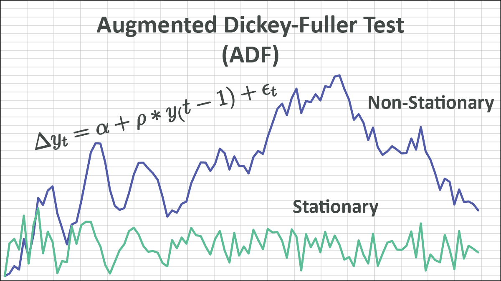

## Table of Contents

## What is the Augmented Dickey-Fuller (ADF) test?

The Augmented Dickey-Fuller (ADF) test is a statistical test used to check if a time series data set is stationary or not. Stationary means that the statistical properties of the series like mean, variance, and autocorrelation are constant over time. The ADF test does this by testing the null hypothesis that a unit root is present in a time series sample. If the null hypothesis is not rejected, it suggests that the time series is non-stationary and has a unit root.

The test works by running a regression that includes the original time series, its lagged values, and possibly the first difference of the time series. The test statistic from this regression is then compared to critical values from the Dickey-Fuller table. If the test statistic is more negative than the critical values, the null hypothesis of a unit root is rejected, suggesting the time series is stationary. The ADF test is widely used in econometrics and time series analysis to ensure that the data being used in models is stationary, which is often a requirement for many statistical methods.

## Why is the ADF test used in time series analysis?

The ADF test is used in time series analysis to check if the data is stationary. Stationary data means that the numbers in the series don't change their behavior over time. This is important because many statistical methods need the data to be stationary to work correctly. If the data isn't stationary, the results from these methods might be wrong.

The ADF test helps by testing a special idea called the "unit root." If the test finds a unit root, it means the data is not stationary. By using the ADF test, analysts can decide if they need to make changes to their data before using it in their models. This makes sure that the predictions and conclusions they draw from the data are more reliable.

## How does the ADF test differ from the original Dickey-Fuller test?

The ADF test and the original Dickey-Fuller test both check if a time series is stationary, but they do it in slightly different ways. The original Dickey-Fuller test looks at the time series and its lagged values to see if there's a unit root. It's pretty simple and works well for basic cases. But, it doesn't account for more complex patterns in the data, like when the data might be influenced by other factors over time.

The ADF test is an improvement because it includes extra lagged differences of the time series in its calculations. This helps to deal with more complicated patterns in the data, like autocorrelation. By including these extra terms, the ADF test can better tell if the time series is truly stationary or if it just looks stationary because of these other patterns. So, the ADF test is more versatile and widely used in practice than the original Dickey-Fuller test.

## What are the null and alternative hypotheses in the ADF test?

In the ADF test, the null hypothesis says that the time series has a unit root, which means it's not stationary. If the null hypothesis is true, it suggests that the data's behavior changes over time, and this can make it hard to use in many statistical models.

The alternative hypothesis says that the time series does not have a unit root, meaning it is stationary. If we can reject the null hypothesis and accept the alternative, it means the data's behavior stays the same over time, which is good for using in statistical models.

## What are the steps to perform an ADF test?

To perform an ADF test, you first need to set up your time series data. This means you have a list of numbers that change over time. Then, you decide if you want to include a trend or a constant in your test. A trend helps if your data goes up or down over time, and a constant helps if your data has a fixed average. After setting up, you run a special kind of math called a regression. This regression uses your time series, its past values, and the differences between these values to see if there's a pattern.

Once you run the regression, you get a number called the test statistic. You compare this number to special numbers called critical values. If your test statistic is more negative than the critical values, you can say the time series is likely stationary. This means you reject the idea that there's a unit root in your data. If the test statistic isn't more negative than the critical values, you can't reject the idea of a unit root, and your data might not be stationary. This helps you decide if you need to change your data before using it in other models.

## How do you interpret the results of an ADF test?

When you do an ADF test, you get a number called the test statistic. You compare this number to something called critical values. If your test statistic is more negative than the critical values, it means you can reject the idea that your data has a unit root. This is good because it suggests your data is stationary, which means it doesn't change its behavior over time. If the test statistic isn't more negative than the critical values, you can't reject the idea of a unit root, and your data might not be stationary.

Interpreting the results of an ADF test helps you decide what to do next with your data. If your data is stationary, you can use it directly in many statistical models because these models work best with data that doesn't change its behavior. But if your data isn't stationary, you might need to make changes to it, like taking differences between the values, to make it stationary before using it in your models. This way, you can make sure your analysis and predictions are more accurate.

## What is the significance of the test statistic in the ADF test?

The test statistic in the ADF test is a number that helps you figure out if your time series data is stationary or not. Stationary means the data doesn't change its behavior over time. The test statistic comes from a special math calculation called a regression. This calculation looks at your time series, its past values, and the differences between these values. The test statistic tells you how much evidence there is against the idea that your data has a unit root, which means it's not stationary.

To understand the test statistic, you compare it to something called critical values. If the test statistic is more negative than these critical values, it means you can reject the idea of a unit root. This suggests your data is stationary, which is good for using in many statistical models. If the test statistic isn't more negative than the critical values, you can't reject the idea of a unit root, and your data might not be stationary. Knowing this helps you decide if you need to change your data before using it in other models to make sure your analysis and predictions are accurate.

## Can you explain the concept of p-value in the context of the ADF test?

In the ADF test, the p-value is a number that tells you how likely it is that your data has a unit root, which means it's not stationary. The p-value is like a measure of surprise. If you get a small p-value, it means it would be surprising for your data to have a unit root, so you might believe your data is stationary. If the p-value is big, it means it wouldn't be surprising for your data to have a unit root, so you might think your data is not stationary.

To use the p-value in the ADF test, you compare it to a special number called the significance level, usually set at 0.05. If your p-value is smaller than this number, it means you can reject the idea of a unit root and think your data is stationary. If the p-value is bigger than 0.05, you can't reject the idea of a unit root, and your data might not be stationary. This helps you decide if you need to change your data before using it in other models to make sure your predictions are good.

## What are common pitfalls or misinterpretations when using the ADF test?

One common pitfall when using the ADF test is not understanding that it might give wrong results if the data has certain patterns. For example, if the time series has big jumps or changes in the middle, the ADF test might say it's stationary when it's not. Another mistake is picking the wrong number of past values, or lags, to use in the test. If you use too few or too many lags, you might get the wrong answer about whether your data is stationary.

Another misinterpretation happens when people only look at the test statistic or p-value without thinking about what the data looks like. Just because the ADF test says your data is stationary doesn't mean it's true. It's important to look at graphs and other ways to check if the data really is stationary. Also, some people forget that the ADF test works better with longer time series. If your data set is too short, the test might not give a good answer.

Lastly, people sometimes forget that rejecting the idea of a unit root doesn't mean your data is perfectly stationary. It just means there's enough evidence to think it might be. So, it's a good idea to use other tests and checks to make sure your data is really stationary before using it in models.

## How does the choice of lag length affect the ADF test results?

The choice of lag length in the ADF test is really important because it can change the test results a lot. Lag length means how many past values of the time series you include in the test. If you pick too few lags, you might miss important patterns in the data, and the test might say your data is stationary when it's not. On the other hand, if you pick too many lags, the test can become less powerful and might say your data isn't stationary when it actually is. So, choosing the right number of lags is key to getting a good answer from the ADF test.

To pick the right lag length, you can use different ways like looking at information criteria, such as the Akaike Information Criterion (AIC) or the Bayesian Information Criterion (BIC). These help you find a balance between not missing important patterns and not using too many lags. It's also a good idea to try different lag lengths and see how the test results change. This can give you a better understanding of your data and help you make a more reliable decision about whether your time series is stationary or not.

## What are some alternatives to the ADF test for testing stationarity?

Besides the ADF test, there are other ways to check if your time series data is stationary. One popular method is the KPSS test, which looks at the opposite idea from the ADF test. While the ADF test starts by thinking the data isn't stationary and tries to prove it wrong, the KPSS test starts by thinking the data is stationary and tries to prove it wrong. This can be helpful because it gives you a different view on your data. Another method is the Phillips-Perron test, which is similar to the ADF test but can handle more complicated data patterns without needing to pick the right number of past values, or lags.

You can also use visual methods like looking at graphs of your data. For example, you can plot the time series and its moving averages to see if there are any trends or big changes over time. Another visual method is to look at the autocorrelation function (ACF) and partial autocorrelation function (PACF) plots. If these plots show that the data's behavior changes over time, it might not be stationary. Using different methods together can give you a better idea if your data is really stationary or not, and help you make better decisions about how to use it in your models.

## How can the ADF test be implemented in a programming language like Python or R?

In Python, you can use the ADF test by using a special library called `statsmodels`. First, you need to install this library. Then, you can import the `adfuller` function from `statsmodels.tsa.stattools`. You run the test by giving your time series data to the `adfuller` function. This function will give you back a few numbers, like the test statistic, the p-value, and the number of lags used. You can then compare the test statistic to critical values or look at the p-value to decide if your data is stationary. If the p-value is less than 0.05, you can say your data is likely stationary.

In R, you can use the `tseries` package to do the ADF test. First, you need to install and load the `tseries` package. Then, you can use the `adf.test` function and give it your time series data. This function will give you the test statistic, the p-value, and some other useful information. Just like in Python, you can use the p-value to decide if your data is stationary. If the p-value is less than 0.05, it suggests your data is stationary. Both Python and R make it easy to run the ADF test and help you understand if your time series data is good to use in your models.

## What is the Understanding of the Augmented Dickey-Fuller (ADF) Test?

The Augmented Dickey-Fuller (ADF) test is a fundamental statistical test utilized in time series analysis to determine the presence of unit roots, which are indicative of non-stationary data. This test is of paramount importance in forecasting and [algorithmic trading](/wiki/algorithmic-trading), where stationarity is crucial for making reliable predictions based on historical data.

A time series is considered stationary if its statistical properties such as mean, variance, and autocorrelation are constant over time. This implies that the series does not exhibit trends or seasonality, making it predictable to an extent. In contrast, a non-stationary time series has statistical properties that change over time, rendering it unsuitable for prediction using standard statistical models. Non-stationary series often exhibit trends, unit roots, or other structures that complicate analysis. Identifying whether a time series is stationary or not is essential for selecting appropriate models in algorithmic trading.

The concept of unit roots is central to understanding non-stationarity. A unit root exists in a time series if shocks to the system have a permanent effect. In practical terms, if a time series has a unit root, it tends to wander with no tendency to revert to a long-term mean, resulting in stochastic trends. The presence of unit roots can make predictive modeling unreliable, necessitating transformations such as differencing to achieve stationarity.

Mathematically, the ADF test is an extension of the Dickey-Fuller test and addresses its limitations by including lagged difference terms of the dependent variable. The ADF test can be expressed as follows:

$$
\Delta y_t = \alpha + \beta t + \gamma y_{t-1} + \sum_{i=1}^{p} \delta_i \Delta y_{t-i} + \epsilon_t
$$

In this equation, $\Delta y_t$ represents the first difference of the series to be tested, $\alpha$ is a constant, $\beta t$ is a deterministic time trend (optional), $\gamma$ is a parameter to be estimated, $p$ is the number of lagged difference terms included, $\delta_i$ are the coefficients of these lagged terms, and $\epsilon_t$ is a white noise error term.

The null hypothesis of the ADF test posits that $\gamma = 0$, indicating a unit root and thus non-stationarity. If the test statistic is less than the critical values for the test, the null hypothesis is rejected, suggesting that the time series is stationary without a unit root.

Conducting an ADF test involves determining the optimal number of lagged difference terms $p$ to include. This typically requires empirical testing or using information criteria like AIC (Akaike Information Criterion) or BIC (Bayesian Information Criterion) to select the most suitable model.

Understanding these core principles and the mathematical formulation behind the ADF test equips researchers and traders with a powerful tool to transform non-stationary series into stationary ones, thus laying the groundwork for robust prediction models in algorithmic trading.

## What is the Technical Execution of an ADF Test?

Performing the Augmented Dickey-Fuller (ADF) test is crucial for analyzing time series data in algorithmic trading. This section provides step-by-step instructions for executing the ADF test using two accessible platforms: Microsoft Excel and Python.

### Step-by-Step Guide to Performing the ADF Test in Excel with Stock Data

To conduct the ADF test in Excel, follow these steps:

1. **Data Preparation**: Import historical stock price data into Excel. Ensure the data is in a single column, with each cell representing a time period (e.g., daily closing prices).

2. **Calculate Log Returns**: Convert the price data into log returns, which can be calculated as follows:
$$
   \text{Log Return} = \ln\left(\frac{P_t}{P_{t-1}}\right)

$$
   where $P_t$ is the price at time $t$.

3. **Create ADF Test Function**: Excel does not have a built-in ADF test function, so you'll need to use regression analysis. This can be done by applying Ordinary Least Squares (OLS) regression:
   - Construct a lagged difference series.
   - Use Excel's built-in regression tool found under "Data Analysis" if installed.

4. **Perform Regression**: Set up a regression equation of the form:
$$
   \Delta y_t = \alpha + \beta t + \gamma y_{t-1} + \delta_1 \Delta y_{t-1} + \cdots + \delta_p \Delta y_{t-p} + \epsilon_t

$$
   Here, $\Delta y_t$ is the difference between consecutive log returns. Use Excel to compute the regression [statistics](/wiki/bayesian-statistics).

5. **Evaluate Results**: After running the regression, check the t-statistic for $\gamma$. Use critical values to determine if the series is stationary.

### Detailed Tutorial on Implementing the ADF Test Using Python

Python provides a more efficient platform for performing the ADF test, especially with extensive data:

1. **Install Necessary Libraries**: Ensure you have `pandas` and `statsmodels` installed:
   ```python
   pip install pandas statsmodels
   ```

2. **Load Your Data**: Import stock price data into a Pandas DataFrame:
   ```python
   import pandas as pd

   data = pd.read_csv('stock_data.csv')
   ```

3. **Calculate Log Returns**:
   ```python
   data['LogReturn'] = (data['Close'] / data['Close'].shift(1)).apply(np.log)
   data.dropna(inplace=True)
   ```

4. **Perform the ADF Test**:
   ```python
   from statsmodels.tsa.stattools import adfuller

   result = adfuller(data['LogReturn'])
   print('ADF Statistic:', result[0])
   print('p-value:', result[1])
   ```

5. **Interpret Results**: Compare the ADF statistic and p-value to statistical thresholds (e.g., 0.05) to decide on stationarity. Lower p-values indicate a stationary series.

### Common Software Tools and Libraries Utilized for Executing the ADF Test

Several software tools and libraries facilitate the implementation of the ADF test in algorithmic trading:

- **R**: The `tseries` package provides robust options for performing ADF tests.
- **MATLAB**: Offers functions such as `adftest` for straightforward implementation.
- **Python**: The `statsmodels` library is widely used for conducting various statistical tests, including ADF.
- **Excel**: While not directly equipped for ADF testing, Excel's capabilities can be extended through data analysis add-ons.

These tools and libraries offer varying levels of sophistication and ease of use, making them suitable for a wide range of users, from casual traders to professional data scientists.

## References & Further Reading

[1]: Diebold, F.X. (2012). ["Unit Root Tests in Time Series Models."](https://www.nber.org/papers/w6928) Department of Economics, University of Pennsylvania.

[2]: Enders, W. (2014). ["Applied Econometric Time Series (4th Edition)."](https://www.wiley.com/en-us/Applied+Econometric+Time+Series%2C+4th+Edition-p-9781118808566) Wiley.

[3]: Hamilton, J.D. (1994). ["Time Series Analysis."](https://press.princeton.edu/books/hardcover/9780691042893/time-series-analysis) Princeton University Press.

[4]: Shumway, R.H., & Stoffer, D.S. (2017). ["Time Series Analysis and Its Applications: With R Examples (4th Edition)."](https://link.springer.com/book/10.1007/978-3-319-52452-8) Springer.

[5]: Tsay, R.S. (2010). ["Analysis of Financial Time Series (3rd Edition)."](https://onlinelibrary.wiley.com/doi/book/10.1002/9780470644560) Wiley.