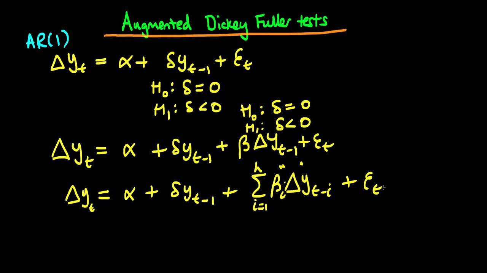

Algorithmic trading has revolutionized financial market operations by leveraging complex statistical methods to automate and enhance trading strategies. A fundamental component in these strategies is the analysis of time series data, which is crucial for making informed trading decisions. One key property of time series data used in algorithmic trading is stationarity. Stationarity refers to a process where statistical properties such as mean, variance, and autocorrelation structure are constant over time. This property is desirable since it allows for the consistent modeling and prediction of future values, which is vital for developing effective trading strategies.

Among the various tests for stationarity, the Augmented Dickey-Fuller (ADF) test is a widely adopted method. The ADF test is an extension of the basic Dickey-Fuller test designed to detect the presence of a unit root in a time series. The presence or absence of this unit root is indicative of whether a time series is non-stationary or stationary, respectively. By evaluating the null hypothesis that a unit root is present, the ADF test provides critical insights into the data's stationarity.



In algorithmic trading models, detecting stationarity through the ADF test is essential, as it helps analysts identify and extract consistent patterns from financial data. These insights enable the formulation of robust trading strategies that can capitalize on predictable trends or mean-reverting behaviors in asset prices. Such strategies are the cornerstone of successful algorithmic trading, ensuring that predictions and decisions are based on reliable and stable data.

By confirming the stationarity of financial time series data, traders and analysts can enhance the effectiveness and reliability of their trading models, ultimately contributing to the success in rapidly changing and competitive financial markets.

## Table of Contents

## Understanding the Augmented Dickey-Fuller (ADF) Test

The Augmented Dickey-Fuller (ADF) test is a vital tool in time series analysis, serving as an extension of the classical Dickey-Fuller test. Its primary purpose is to test for the presence of a unit root in a time series dataset, which helps to confirm or deny the stationarity of the series. Stationarity is essential because non-stationary data can lead to unreliable statistical inferences and model predictions.

The ADF test incorporates lagged difference terms to address the issue of autocorrelation that might be present in the data. This inclusion enables a more robust assessment compared to the standard Dickey-Fuller test. The presence of autocorrelation can otherwise result in inaccurate test statistics, leading to incorrect conclusions about the stationarity or non-stationarity of the data.

The mathematical formulation of the ADF test begins with the regression equation:

$$
\Delta y_t = \alpha + \beta t + \gamma y_{t-1} + \sum_{i=1}^{p} \delta_i \Delta y_{t-i} + \epsilon_t
$$

where:
- $\Delta y_t$ is the first difference of the series.
- $\alpha$ is a constant term.
- $\beta t$ accounts for a deterministic trend.
- $\gamma$ is the coefficient that indicates the presence of a unit root.
- $\delta_i$ represents the coefficients for the lagged differences that manage autocorrelation.
- $\epsilon_t$ is the error term.

In the context of the ADF test, the main hypothesis being tested is:
- Null hypothesis ($H_0$): The series has a unit root, implying it is non-stationary.
- Alternative hypothesis ($H_a$): The series does not have a unit root, which implies stationarity.

The test statistic calculated from this regression is compared against critical values to determine whether to reject the null hypothesis. The choice of lag length $p$ is critical as it can impact the test results. Various methods, such as the Akaike Information Criterion (AIC) or the Bayesian Information Criterion (BIC), are often employed to determine the optimal number of lags.

The interpretation of the test results is straightforward: if the test statistic is less than the critical value, the null hypothesis of a unit root is rejected, suggesting that the time series is stationary. Conversely, if the test statistic is greater than the critical value, the series is considered non-stationary.

By applying the ADF test, analysts and [algorithmic trading](/wiki/algorithmic-trading) systems can reliably ascertain the stationarity of financial time series data, ensuring that subsequent analyses and trading models remain robust and effective.

## Applications of ADF Test in Algorithmic Trading

Stationarity verification through the Augmented Dickey-Fuller (ADF) test is crucial for several algorithmic trading strategies, notably pairs trading. Pairs trading hinges on the concept of identifying co-integrated pairs of assets, which can lead to profitable trading opportunities through mean reversion strategies. A co-integrated pair of assets indicates a stable, long-term relationship despite short-term price movements, making it an attractive scenario for traders.

The process begins with the identification of a pair of assets whose price series exhibit co-integration, meaning their combined price series is stationary even if each individual series is not. The ADF test is employed to test for stationarity in the residuals of a regression model constructed on these asset prices. If the test confirms stationarity, the pair is considered co-integrated. A simple regression model between two asset log prices can be represented as:

$$
Y_t = \beta_0 + \beta_1 X_t + \epsilon_t
$$

Where $Y_t$ and $X_t$ are the log prices of the two assets at time $t$, $\beta_0$ and $\beta_1$ are coefficients, and $\epsilon_t$ represents the residuals. The ADF test is applied to these residuals to determine whether they follow a stationary process.

Case studies have demonstrated the successful application of the ADF test in practical trading scenarios. For instance, a strategy might involve initiating a long position in one asset and a short position in another whenever their price ratio deviates from the historical mean. When prices revert, profits can be realized from the reversal.

In Python, this process can be implemented using libraries such as `statsmodels` to perform the ADF test. Consider the following code snippet for identifying co-integration using the ADF test:

```python
import numpy as np
import pandas as pd
from statsmodels.tsa.stattools import adfuller

# Simulated asset price data
asset1 = np.cumsum(np.random.normal(size=1000))
asset2 = asset1 + np.random.normal(size=1000)

# Calculate the spread
spread = asset1 - asset2

# Apply ADF test on the spread
result = adfuller(spread)
print(f'ADF Statistic: {result[0]}')
print(f'p-value: {result[1]}')

if result[1] < 0.05:
    print("Reject the null hypothesis: The spread is stationary")
else:
    print("Fail to reject the null hypothesis: The spread is not stationary")
```

This snippet generates two synthetic time series, calculates the spread, and applies the ADF test. A low p-value indicates that the spread is stationary, suggesting a potential pairs trading opportunity.

While ADF provides valuable insights, its application is not without challenges. Misidentifying co-integrated pairs due to incorrect assumptions or lag selections can lead to unprofitable trades. Therefore, the prudent application of ADF, complemented by other analyses, is essential for robust algorithmic trading strategies.

## Technical Execution of the ADF Test

To perform the Augmented Dickey-Fuller (ADF) test effectively, one can utilize various tools, including spreadsheet software like Excel and programming environments such as Python, equipped with specialized libraries. This section will provide a comprehensive guide on executing the ADF test using both environments.

### Performing the ADF Test in Excel

To [carry](/wiki/carry-trading) out the ADF test in Excel using stock data, you can follow these steps, which capitalize on the regression capabilities of the software:

1. **Prepare Your Data**: 
   - Import your stock data into Excel. Ensure your time series data is organized chronologically in one column with the date in an adjacent column.

2. **Calculate Differences**:
   - Compute the first difference of the series to remove any potential linear trends by subtracting each value from its predecessor.

3. **Create Lagged Variables**:
   - Develop lagged terms of the differenced data. For instance, create a column for the first lag (i.e., the previous day's value of the first difference).

4. **Regression Analysis**:
   - Utilize Excel's Data Analysis Toolpak for regression. Set the differenced series as the dependent variable and its lagged value(s) as independent variables.
   - Include additional columns for lagged differences to account for higher lags, ensuring adequate control of autocorrelation.

5. **Interpret the Results**:
   - Examine the regression output. The focus is on the coefficient of the lagged level of the original series. If significantly different from zero (using t-statistics), it indicates stationarity.

### Implementing the ADF Test in Python

Python, with its robust libraries, streamlines the ADF test process. Here's a detailed walkthrough using the `statsmodels` library:

1. **Setup Environment**:
   - Ensure that Python and necessary libraries like `numpy`, `pandas`, and `statsmodels` are installed. Import these libraries as follows:
   ```python
   import numpy as np
   import pandas as pd
   from statsmodels.tsa.stattools import adfuller
   ```

2. **Load Data**:
   - Load your time series stock data into a DataFrame:
   ```python
   data = pd.read_csv('your_stock_data.csv')
   series = data['Close']  # Assuming 'Close' is your column of interest
   ```

3. **Execute the ADF Test**:
   - Utilize the `adfuller` function from `statsmodels`:
   ```python
   adf_result = adfuller(series)
   ```

4. **Interpret the Output**:
   - `adf_result` provides several values:
     - `adf_statistic`: The test statistic value.
     - `p-value`: Helps assess the significance of the test statistic.
     - `critical_value`: Critical values for different confidence levels.
   - Determine stationarity by checking if the ADF statistic is lower than the critical values, or if the p-value is below a predefined threshold (e.g., 0.05).

### Tools and Software Libraries

Python's `statsmodels` is a leading library for performing the ADF test. It delivers a streamlined and accurate assessment of stationarity. Additionally, other environments like R or software such as MATLAB offer similar functionalities through specific packages or built-in functions designed for time series analysis. Each tool typically requires careful selection and configuration of parameters, especially regarding lag order, to ensure valid test results.

## Advantages and Challenges of Using ADF Test

The Augmented Dickey-Fuller (ADF) test serves as a foundational tool in the verification of stationarity within time series data, critical for the development of algorithmic trading models. Its primary advantage lies in its rigorous statistical framework, enabling traders and analysts to ascertain the presence of a unit root, thus determining whether a time series can be considered stationary. This stationarity is essential, as it implies that the statistical properties of a series, such as its mean and variance, remain constant over time. This stability allows for more reliable modeling, forecasting, and strategic decision-making in trading contexts.

However, the ADF test is not without challenges. One significant limitation is its sensitivity to the selection of lag lengths. The determination of lag length is crucial; too few lags may fail to capture the autocorrelation in the data, while too many can lead to overfitting and reduced test power. This sensitivity necessitates a careful approach in the selection of lag parameters, which can be determined using various criteria such as the Akaike Information Criterion (AIC) or the Bayesian Information Criterion (BIC).

Furthermore, the test operates under assumptions that may not always hold in practical scenarios. For example, the ADF test assumes that the underlying data generating process is linear, an assumption not always justified in complex financial markets. In real-world data, nonlinearity, structural breaks, or sudden shocks can violate these assumptions, impacting the test's validity.

Prudent interpretation of ADF test results is paramount. It often requires complementary analyses to corroborate findings. For instance, before committing to a trading strategy based on ADF test results, additional statistical tests or robustness checks, such as the Kwiatkowski-Phillips-Schmidt-Shin (KPSS) test, may be necessary to confirm stationarity and guard against false conclusions.

In conclusion, while the ADF test is a vital component in the analysis of financial time series, its application demands careful consideration of its limitations and the context of the data. Effective use of this test, combined with complementary methods, can significantly enhance the reliability of algorithmic trading strategies.

## Conclusion

The Augmented Dickey-Fuller (ADF) test remains a foundational element in algorithmic trading by providing a reliable method for confirming the stationarity of time series data. Stationarity is crucial for the development of trading models that accurately reflect the underlying dynamics of financial markets. The ADF test identifies whether a time series dataset exhibits a unit root, which is a determinative [factor](/wiki/factor-investing) in understanding the predictability of financial instruments.

Implementing the ADF test effectively can significantly enhance the predictability and reliability of trading models. By ensuring that the statistical properties such as mean and variance remain consistent over time, the ADF test facilitates the creation of trading strategies that can withstand the volatile nature of financial markets. This contributes to achieving consistent trading success and reducing the risk associated with non-stationary data.

In the rapidly evolving financial markets, continual learning and adaptation of statistical techniques like the ADF test are essential. The dynamic nature of these markets requires traders and analysts to consistently update their skills and methodologies to maintain a competitive edge. As new technological advancements and analytical methods emerge, the core principles of time series analysis, epitomized by the ADF test, remain integral to forming robust and innovative trading strategies. 

In summary, while the ADF test is a critical tool for ensuring the stationarity of time series data, its true effectiveness lies in its application within a broader framework of continuous analysis, adaptation, and learning within the ever-changing environment of financial trading.

## References & Further Reading

1. Hamilton, J.D. (1994). *Time Series Analysis*. Princeton University Press. This textbook offers an extensive coverage of time series analysis techniques, with detailed chapters on stationarity and unit root tests, including the Augmented Dickey-Fuller test.

2. Enders, W. (2014). *Applied Econometric Time Series*. Wiley. Enders provides a thorough examination of econometric methods for time series data, emphasizing practical applications and including discussions on unit root testing.

3. Shumway, R.H., & Stoffer, D.S. (2017). *Time Series Analysis and Its Applications: With R Examples*. Springer. This book focuses on both the theory and practice of time series analysis, offering extensive R code samples and exercises related to stationarity and unit root testing.

4. Mills, T.C. (1990). *Time Series Techniques for Economists*. Cambridge University Press. Mills' work is a comprehensive introduction to time series analysis for economists, with substantial discussion of unit root processes and stationarity.

5. Brooks, C. (2019). *Introductory Econometrics for Finance*. Cambridge University Press. This book provides a practical approach to econometrics in finance, including a robust treatment of the ADF test among other key techniques for financial data analysis.

6. Fuller, W.A. (1976). *Introduction to Statistical Time Series*. Wiley. Fuller’s seminal work on statistical methods for time series provides a foundational understanding of the properties and testing procedures for unit roots and stationarity.

7. Harris, R., & Sollis, R. (2003). *Applied Time Series Modelling and Forecasting*. Wiley. A practical resource for applying time series models in forecasting, with comprehensive coverage of unit root and stationarity testing.

8. Python's `statsmodels` library documentation: https://www.statsmodels.org/stable/adf.html. This online resource provides an in-depth guide on implementing the ADF test using Python, with code examples and explanations of the test components.

9. Investopedia. "Stationarity." Available at: https://www.investopedia.com/terms/s/stationarity.asp. An online article offering a plain-language explanation of stationarity, its importance in time series analysis, and its relevance to financial modeling.

10. Dickey, D.A., & Fuller, W.A. (1979). "Distribution of the Estimators for Autoregressive Time Series with a Unit Root." *Journal of the American Statistical Association*, 74(366), 427-431. This influential paper introduces the Dickey-Fuller test, which is fundamental to understanding the ADF test.

