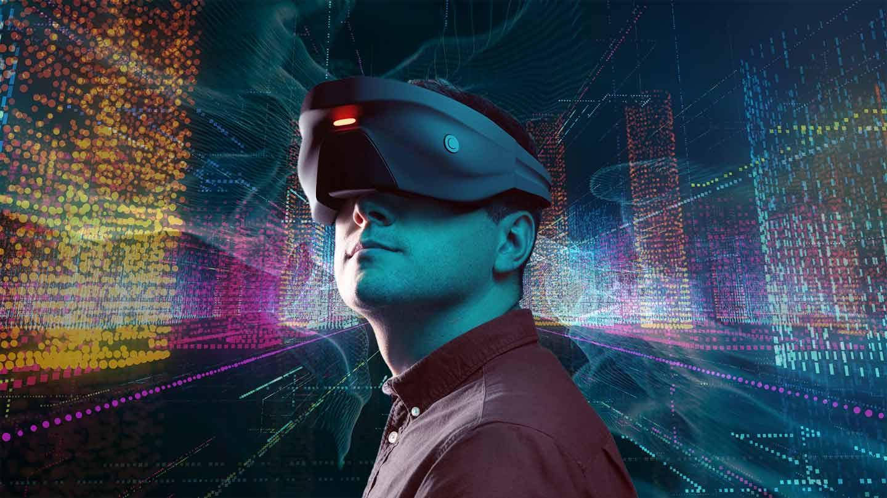

## Table of Contents

## What is Augmented Reality (AR) and how does it differ from Virtual Reality (VR)?

Augmented Reality (AR) is a technology that adds digital elements to a live view of the real world. It enhances what we see, hear, feel, and even smell by overlaying computer-generated images, sounds, or other data onto our real-world environment. For example, when using a smartphone to view a city street, AR can show you information about nearby restaurants or historical facts about buildings as you look at them through the camera.

Virtual Reality (VR), on the other hand, creates a completely immersive experience that shuts out the physical world. When you put on a VR headset, you are transported into a fully digital environment, where you can interact with and explore a world that feels real but is entirely created by a computer. Unlike AR, which adds to the real world, VR replaces it with a simulated one. This makes VR great for gaming, simulations, and virtual tours, but it requires specialized equipment like headsets and controllers.

## How does machine learning enhance Augmented Reality experiences?

Machine learning helps make augmented reality experiences better by teaching computers to recognize and understand the world around them. For example, when you use an AR app on your phone, machine learning can help the app recognize objects in the real world, like a coffee cup or a building. This means the app can place digital images or information right where they should be, making the AR experience feel more real and useful.

Another way machine learning improves AR is by personalizing the experience for each user. By learning from how you use the app, machine learning can show you things you might like or need. For instance, if you often look for restaurants, the AR app might start showing you restaurant suggestions more often. This makes the AR experience not just a cool trick, but something that can actually help you in your daily life.

## What are some common applications of AR that utilize machine learning?

One common application of AR that uses [machine learning](/wiki/machine-learning) is in retail and shopping. When you use an AR app to see how a piece of furniture would look in your room, machine learning helps the app recognize the space and place the digital furniture accurately. It can also suggest items that might match your style or the colors in your room. This makes shopping easier and more fun because you can see how things will look before you buy them.

Another application is in education and training. AR apps can use machine learning to recognize different objects or environments and then overlay educational information or instructions. For example, a student learning anatomy might use an AR app to see a 3D model of the human body. The app can recognize what part of the body the student is looking at and provide detailed information about it. This makes learning more interactive and helps students understand complex topics better.

In gaming and entertainment, AR games use machine learning to recognize the real world and create interactive experiences. For instance, a game might use your phone's camera to see your surroundings and then place digital characters or objects in your room for you to interact with. The machine learning part helps the game understand where to put these digital elements so they fit naturally into your space. This makes the games more immersive and fun to play.

## What are the basic components required to develop an AR system with machine learning?

To develop an AR system with machine learning, you need a few key components. First, you need a device with a camera and a screen, like a smartphone or a special AR headset. The camera captures the real world, and the screen shows the digital additions. Next, you need software that can process the images from the camera and add the AR elements. This software needs to be able to recognize objects and understand the environment, which is where machine learning comes in. Machine learning algorithms help the system learn to identify objects, track movements, and place digital images accurately in the real world.

Another important part is a strong computing system to handle all the processing. AR systems need to work quickly and smoothly, so they often use powerful processors or cloud computing to do the heavy lifting. Finally, you need good sensors and tracking technology to make sure the AR elements stay in the right place as you move around. This might include things like gyroscopes and accelerometers to track your movements and keep the AR experience stable and realistic. With these components working together, you can create an AR system that uses machine learning to enhance and personalize the user's experience.

## How does object recognition in AR work with machine learning algorithms?

Object recognition in AR works by using machine learning algorithms to identify and understand objects in the real world. When you use an AR app, the camera on your device captures images of your surroundings. These images are then analyzed by the machine learning model, which has been trained on a large dataset of images to recognize different objects. The model looks for patterns and features in the images, like the shape of a chair or the color of a book, and then matches these to what it has learned. Once it recognizes an object, the AR system can place digital elements in the right spot, making the experience feel more real and interactive.

The process of training the machine learning model involves feeding it thousands or even millions of images, each labeled with what the object is. The model learns to identify these objects by finding common features among the images. For example, if it's trained to recognize a coffee cup, it might learn that coffee cups often have a cylindrical shape and a handle. Once trained, the model can then be used in real-time to recognize objects in new images captured by the AR system. This allows the AR app to understand your environment and enhance it with digital information or graphics, making the AR experience more useful and engaging.

## What role do neural networks play in AR machine learning?

Neural networks are a key part of machine learning in AR. They help the AR system recognize and understand objects in the real world. Imagine a [neural network](/wiki/neural-network) like a brain made of math. It learns from lots of pictures to find patterns and shapes. When you use an AR app, the camera takes a picture, and the neural network looks at it. It tries to match what it sees with what it has learned before. If it sees a chair, it knows to place a digital object right on that chair. This makes the AR experience feel real and useful.

Training a neural network involves showing it many pictures and telling it what is in them. Over time, the network gets better at recognizing objects. For example, if you want it to recognize a coffee cup, you show it lots of pictures of coffee cups. The network learns that coffee cups usually have a round shape and a handle. When you use the AR app later, the neural network can spot a coffee cup in your room and add digital information or graphics right on it. This is how neural networks help make AR more interactive and smart.

## How can machine learning improve the tracking and mapping capabilities in AR?

Machine learning helps AR systems track your movements and map your surroundings better. When you move around with an AR app, the system needs to know where you are and what's around you. Machine learning algorithms can learn from past data to predict where you're going next. This makes the tracking smoother and more accurate. For example, if you're walking through a room, the AR system can use machine learning to guess your path and keep the digital elements in the right place, even if you move quickly or change direction.

Mapping in AR is also improved by machine learning. When you use an AR app, it needs to understand the space around you to place digital objects correctly. Machine learning helps the system recognize different parts of your environment, like walls, furniture, and floors. It can learn from lots of different rooms and spaces to get better at mapping new ones. This means the AR experience feels more real because the digital elements fit naturally into your world.

## What are the challenges faced when integrating machine learning into AR systems?

Integrating machine learning into AR systems can be tricky because it needs a lot of computing power. AR apps have to process images in real-time to recognize objects and track movements. This means the system has to be fast and smart, which can be hard to achieve. Machine learning models, especially big ones like neural networks, need a lot of data to learn from. Collecting and labeling this data takes time and effort. Also, running these models on a smartphone or AR headset can use up a lot of battery, which is not ideal for users who want their devices to last all day.

Another challenge is making sure the AR experience works well in different situations. Machine learning models trained on one set of data might not work as well in new places or with different lighting. This can make the AR app less accurate or even stop working. For example, if a model is trained mostly on images taken during the day, it might struggle at night. Developers need to keep training and updating their models to handle all kinds of environments. This ongoing work is important but can be tough to manage.

## How does real-time processing in AR benefit from machine learning techniques?

Real-time processing in AR benefits a lot from machine learning because it helps the system work faster and better. When you use an AR app, the camera takes pictures of the world around you. Machine learning helps the app understand these pictures quickly. It can recognize objects, like a chair or a book, and place digital things right where they should be. This makes the AR experience feel real and smooth. Without machine learning, the app would be slower and might not place things correctly, which would make the experience less fun and useful.

Machine learning also helps the AR app learn from how you use it. For example, if you often look at restaurants when using the app, it can start showing you more restaurant suggestions. This makes the AR experience more personal and helpful. The app gets better over time because it learns from what you do. This is why machine learning is so important for real-time processing in AR. It makes everything faster, more accurate, and more tailored to you.

## What advanced machine learning models are used to enhance AR experiences?

Advanced machine learning models like deep neural networks and convolutional neural networks (CNNs) are used to make AR experiences better. These models are good at recognizing objects in pictures. For example, a CNN can look at a photo and find a chair or a coffee cup. It does this by learning patterns from lots of pictures. When you use an AR app, the CNN helps the app know where to put digital things so they fit well in the real world. This makes the AR experience feel more real and useful.

Another advanced model used in AR is the recurrent neural network (RNN), which is good at understanding things that change over time. For example, if you're moving around a room, an RNN can help the AR app track your movements and keep the digital elements in the right place. This makes the AR experience smoother and more immersive. By using these advanced models, AR apps can do more complex things and make the experience better for users.

## How can AR and machine learning be used to create personalized user experiences?

AR and machine learning work together to make experiences that feel special for each person. When you use an AR app, machine learning helps it learn about you. It watches what you do and what you like. For example, if you often look at restaurants when using the app, it can start showing you more restaurant suggestions. This makes the AR experience more personal and helpful because it's based on what you're interested in.

Machine learning also helps the AR app understand the world around you better. It can recognize things like furniture or buildings and put digital information right where it should be. Over time, the app gets smarter and can show you things that fit well with your surroundings and your interests. This makes the AR experience not just a cool trick, but something that can actually help you in your daily life.

## What future developments can we expect in AR machine learning technology?

In the future, AR and machine learning will become even better at understanding and interacting with the world around us. We can expect AR systems to get smarter and faster, thanks to new machine learning models that can process information in real-time more accurately. These models will be able to recognize objects and environments with even greater detail, making the AR experience feel more real and immersive. For example, AR apps might be able to understand not just what objects are in a room, but also how you use them, leading to more personalized and helpful suggestions.

Another exciting development will be the integration of AR with other technologies like 5G and edge computing. This will allow AR systems to process data faster and more efficiently, reducing lag and improving the overall experience. With these advancements, AR could become a seamless part of our daily lives, helping us with tasks like shopping, learning, and even socializing. Imagine walking into a store and instantly seeing personalized product recommendations or visiting a new city and having AR guide you through its history and culture in real-time. These are just a few of the ways AR and machine learning could shape our future.