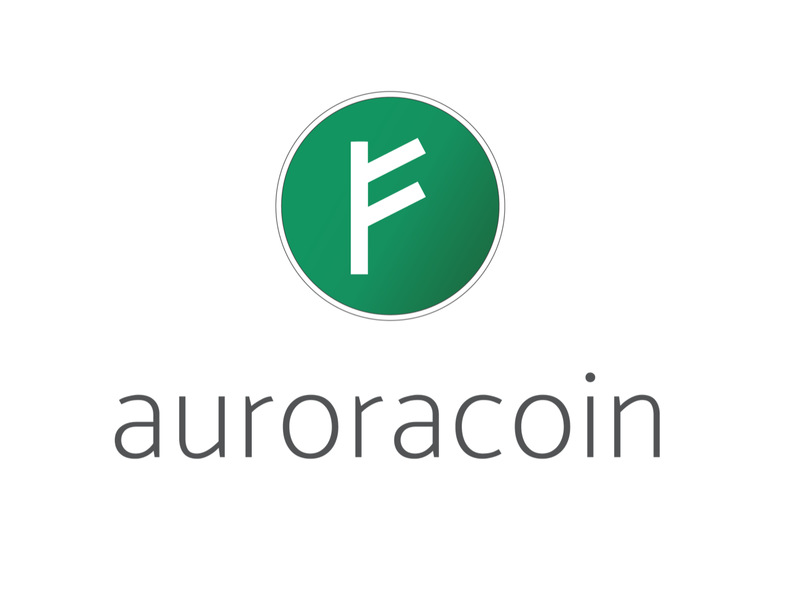

## Table of Contents

## What is Auroracoin?

Auroracoin is a type of digital money, like Bitcoin, that was created specifically for people living in Iceland. It started in 2014 and was meant to help give Icelanders a new way to use money that is not controlled by banks or governments. The idea was to give every person in Iceland some Auroracoin for free, hoping it would become popular and widely used.

The creator of Auroracoin, who goes by the name Baldur Friggjar Óðinsson, wanted to make a currency that would be safe from the financial problems that Iceland had faced before. By giving out Auroracoin to everyone, the hope was that people would start using it for buying things and trading, which could help grow a new kind of economy in Iceland. Even though it had a big start, Auroracoin is not used as much today as it was in the beginning.

## When was Auroracoin launched?

Auroracoin was launched on March 25, 2014. It was a special kind of digital money made just for people in Iceland. The person who made it wanted to give everyone in Iceland some free Auroracoin, hoping it would become a popular way to buy things and trade.

The idea behind Auroracoin was to help Icelanders have money that banks and governments couldn't control. This was important because Iceland had big money problems before. Even though a lot of people got excited about Auroracoin at first, it's not used as much anymore.

## Who created Auroracoin?

Auroracoin was created by a person named Baldur Friggjar Óðinsson. He used a made-up name because he wanted to keep his real identity a secret. Baldur thought that Iceland needed its own special kind of money that banks and governments couldn't control. He believed that giving everyone in Iceland some free Auroracoin would help start a new way of buying things and trading.

The idea behind Auroracoin was to help Iceland after it had big money problems. Baldur wanted to make sure that people in Iceland had a safe way to use money. Even though a lot of people were excited about Auroracoin when it started, it's not used as much today.

## What was the purpose behind creating Auroracoin?

The purpose behind creating Auroracoin was to give people in Iceland a new kind of money that they could use without banks or governments controlling it. The person who made it, Baldur Friggjar Óðinsson, wanted to help Iceland after it had big money problems. He thought that if everyone in Iceland got some free Auroracoin, they would start using it to buy things and trade with each other.

By giving out Auroracoin to everyone, Baldur hoped it would grow into a popular way for people in Iceland to handle their money. He wanted to make sure that Icelanders had a safe and new way to use money that couldn't be affected by the same financial troubles they had before. Even though a lot of people were excited about Auroracoin at first, it didn't become as popular as hoped and is not used as much today.

## How is Auroracoin distributed to the public?

Auroracoin was given out to people in Iceland in a special way. When it started in 2014, the creator, Baldur Friggjar Óðinsson, wanted to give some free Auroracoin to every person in Iceland. He did this by using a list of names from the national registry. People who wanted Auroracoin had to prove who they were with their ID and a special code. This way, they could get their free Auroracoin and start using it.

The idea was to make sure that everyone in Iceland had a chance to use this new kind of money. By giving it out for free, Baldur hoped that people would start using Auroracoin to buy things and trade with each other. This could help create a new way of handling money in Iceland, one that was not controlled by banks or governments. Even though a lot of people got excited about Auroracoin at first, it didn't become as popular as hoped and is not used as much today.

## What is the total supply of Auroracoin?

The total supply of Auroracoin is set to be 21 million coins. This is the same total amount as Bitcoin, which was a big influence on Auroracoin. The idea was to make sure there was a fixed amount of Auroracoin, so it wouldn't lose value because too many were made.

When Auroracoin started in 2014, the plan was to give some of these coins to everyone in Iceland for free. This was done to help people start using Auroracoin and to make it popular. Even though not all of the 21 million coins have been given out yet, the total number that will ever exist is set at 21 million.

## How does Auroracoin's technology work?

Auroracoin uses technology similar to Bitcoin, which is called blockchain. Blockchain is like a big notebook that keeps track of all the Auroracoin transactions. Every time someone sends or receives Auroracoin, it gets written down in this notebook. The cool thing about blockchain is that it's shared with everyone who uses Auroracoin, so no one can change the records without everyone knowing. This makes Auroracoin safe and hard to cheat.

To send and receive Auroracoin, people use special software called a wallet. This wallet helps keep your Auroracoin safe and lets you send it to other people. When you want to send Auroracoin, the wallet makes a request that gets checked by other people on the network. If everything looks good, the transaction gets added to the blockchain. This way, everyone can see that the Auroracoin was sent and received properly.

## What are the key features of Auroracoin that differentiate it from other cryptocurrencies?

Auroracoin is special because it was made just for people in Iceland. The person who made it, Baldur Friggjar Óðinsson, wanted to give everyone in Iceland some free Auroracoin. This was different from other cryptocurrencies because it was meant to help Iceland after it had big money problems. By giving out Auroracoin to everyone, Baldur hoped it would become a new way for Icelanders to buy things and trade without banks or governments controlling their money.

Another thing that makes Auroracoin different is how it was given out. Instead of people having to buy it, Auroracoin was given for free to anyone in Iceland who could prove who they were with their ID and a special code. This was a big deal because it meant that everyone had a chance to use this new kind of money. Even though Auroracoin uses the same kind of technology as Bitcoin, called blockchain, the way it was shared with the public is what makes it stand out.

## How has the value of Auroracoin fluctuated since its launch?

Since Auroracoin was launched in March 2014, its value has gone up and down a lot. At the beginning, when it was new and exciting, the value of Auroracoin went up quickly. A lot of people in Iceland were interested in it because they got free Auroracoin, and this made the price go up. But after a while, the excitement went down, and so did the value of Auroracoin. It didn't become as popular as people hoped, and the price started to drop.

Over the years, Auroracoin has not been used as much as other cryptocurrencies like Bitcoin. This means its value has stayed low compared to when it first came out. Sometimes, the price goes up a little bit, but it usually stays much lower than it was at the start. The big reason for this is that not many people use Auroracoin anymore, so there's not much demand for it. Even though it had a big start, Auroracoin's value has been up and down, mostly staying down.

## What impact has Auroracoin had on the economy of Iceland?

Auroracoin was made to help Iceland after it had big money problems. The person who made it, Baldur Friggjar Óðinsson, wanted to give everyone in Iceland some free Auroracoin so they could use it to buy things and trade without banks or the government controlling their money. When Auroracoin started in 2014, a lot of people got excited about it, and some even thought it might change the way money worked in Iceland. But even though many people got some free Auroracoin, it didn't become a big part of the economy.

The main reason Auroracoin didn't change Iceland's economy much is because not many people kept using it after the first excitement. Even though the value of Auroracoin went up at the start, it went down quickly when people lost interest. Today, Auroracoin is not used as much, and it doesn't have a big effect on Iceland's money system. So, while Auroracoin was a cool idea and got a lot of attention at first, it didn't end up making a big difference in Iceland's economy.

## What are the current challenges facing Auroracoin?

Auroracoin is facing some big challenges right now. One of the biggest problems is that not many people use it anymore. When it first came out, a lot of people in Iceland were excited about getting free Auroracoin, but after a while, they stopped using it. This means there isn't much demand for Auroracoin, and its value has gone down a lot since it started. Without many people using it, it's hard for Auroracoin to be a big part of Iceland's money system.

Another challenge is that there are other cryptocurrencies, like Bitcoin, that are more popular and easier to use. These other kinds of digital money have more people using them and more places where you can spend them. This makes it hard for Auroracoin to grow and become important again. The person who made Auroracoin wanted it to help Iceland after its money problems, but it hasn't been able to do that because it's not used enough.

## What are the future prospects for Auroracoin?

The future of Auroracoin looks tough right now. It's not used as much as it was when it first came out in 2014. A lot of people got excited about getting free Auroracoin back then, but now, not many people are using it. This means there isn't much demand for it, and its value has gone down a lot. Without more people using it, it's hard for Auroracoin to become important again in Iceland's money system.

There are also other cryptocurrencies, like Bitcoin, that are more popular and easier to use. These other kinds of digital money have more users and more places where you can spend them. This makes it even harder for Auroracoin to grow and become a big deal again. The person who made Auroracoin wanted it to help Iceland after its money problems, but for that to happen, more people would need to start using it again. Right now, that doesn't seem likely.

## References & Further Reading

[1]: Antonopoulos, A. M. (2014). ["Mastering Bitcoin: Unlocking Digital Cryptocurrencies."](https://books.google.com/books/about/Mastering_Bitcoin.html?id=IXmrBQAAQBAJ) O'Reilly Media.

[2]: Bjerg, Ole. (2016). ["How is Bitcoin Money?"](https://journals.sagepub.com/doi/abs/10.1177/0263276415619015) Theory, Culture & Society.

[3]: Grinberg, Reuben. (2011). ["Bitcoin: An Innovative Alternative Digital Currency."](https://www.researchgate.net/publication/228199328_Bitcoin_An_Innovative_Alternative_Digital_Currency) Hastings Science & Technology Law Journal.

[4]: Narayanan, A., Bonneau, J., Felten, E., Miller, A., & Goldfeder, S. (2016). ["Bitcoin and Cryptocurrency Technologies: A Comprehensive Introduction."](https://press.princeton.edu/books/hardcover/9780691171692/bitcoin-and-cryptocurrency-technologies) Princeton University Press.

[5]: Nakamoto, S. (2008). ["Bitcoin: A Peer-to-Peer Electronic Cash System."](https://nakamotoinstitute.org/library/bitcoin/) 

[6]: Sweeney, John. (2016). ["The Collapse of Iceland's Banks and the Failure of Financial Regulation: A Storm Without Precedent."](https://quizlet.com/464750565/econ-inside-jobs-flash-cards/) Routledge.