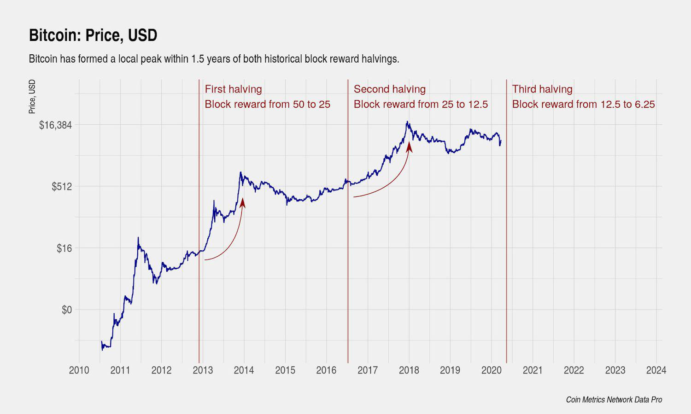

Auroracoin is a distinctive cryptocurrency, birthed from the economic challenges that beset Iceland's financial system following the 2008 financial crisis. As a digital currency, it presents an alternative to conventional banking methods, enabling secure and anonymous transactions without the need for traditional financial intermediaries. This decentralized nature is a core feature of Auroracoin, designed to empower users by removing reliance on centralized financial institutions, which had come under scrutiny during Iceland's economic turmoil.

The inception of Auroracoin was, in part, a reaction to global financial instability and the realization of the potential vulnerabilities inherent in traditional banking systems. By leveraging blockchain technology, Auroracoin enhances transaction security, increasing transparency while maintaining user privacy through complex cryptographic processes. These characteristics have made it an appealing option for those seeking financial transactions that are both secure and independent of banking oversight.



This article provides a comprehensive examination of Auroracoin, from its historical genesis as a national digital currency for Iceland to the innovative methods through which it has been revived. Particular attention is given to its use in algorithmic trading within Iceland, showcasing how it has evolved beyond a mere reaction to financial instability into a tool for sophisticated economic activities.

## Table of Contents

## What is Auroracoin?

Auroracoin is a decentralized cryptocurrency that emerged as a response to Iceland's unique economic challenges, particularly following the 2008 global financial crisis. This crisis had profound impacts on Iceland's banking system, leading to increased interest in alternative financial solutions outside of traditional banking mechanisms. 

Auroracoin operates as a peer-to-peer digital currency, offering users the ability to conduct transactions without reliance on conventional financial institutions. This independence is a core characteristic of many cryptocurrencies, but for Auroracoin, this functionality holds particular significance considering the Icelandic context. It provides a platform for financial transactions that can bypass the restrictions placed on traditional banking by local economic policies or international economic constraints.

The technological foundation of Auroracoin is based on the Scrypt algorithm, a cryptographic hashing function used to secure transactions and generate new coins through the process known as mining. The use of Scrypt is notable because it differs from the SHA-256 algorithm used by Bitcoin, another prominent cryptocurrency. Scrypt is designed to be ASIC-resistant, meaning it is less susceptible to mining with specialized hardware and thus, theoretically, more accessible for individual miners using general-purpose computers. This can lead to a more decentralized and democratic mining process.

In essence, Auroracoin provides a digital means for both transactions and investments. By facilitating the movement of value without needing intermediaries, it represents a significant departure from traditional financial systems. This framework not only appeals to individual users seeking privacy and autonomy in their financial dealings but also highlights its potential as a vehicle for investment. As a digital asset, Auroracoin opens pathways for secure, anonymous, and efficient financial activities, aligning with the broader objectives of cryptocurrencies in offering alternatives to conventional currency systems.

## History of Auroracoin

Auroracoin was introduced in 2014 with the ambitious aim of establishing a national digital currency for Iceland, rooted in the principles of decentralization and financial inclusivity. The inception of Auroracoin was a direct response to the economic turmoil that emerged from the 2008 financial crisis, which severely impacted Iceland's banking and financial systems. A key aspect of Auroracoin's initial distribution strategy was an airdrop, a novel method of disseminating [cryptocurrency](/wiki/cryptocurrency) directly to Icelandic citizens. This airdrop, known as the "Airdrop Phase I," began on March 25, 2014, and was designed to distribute half of the total 21 million Auroracoins to Iceland's population using national identification numbers. This initiative aimed to democratize access to cryptocurrency and encourage widespread adoption.

However, Auroracoin's value and popularity faced an early setback. Shortly after its launch, the coin experienced a significant value crash. Factors contributing to this decline included skepticism over its viability as a national currency, limited merchant acceptance, and competition from more established cryptocurrencies like Bitcoin. The [volatility](/wiki/volatility-trading-strategies) inherent in nascent cryptocurrency markets further exacerbated these challenges, leading to a sharp decline in investor confidence and currency value.

Despite these initial hurdles, 2015 marked a turning point for Auroracoin. A committed group of developers sought to revive and reposition the cryptocurrency by focusing on enhancing its practical utility in everyday transactions. This revival involved technical upgrades and a renewed emphasis on grassroots advocacy within Iceland to rebuild trust and foster a sustainable ecosystem for Auroracoin. By addressing the earlier limitations in network infrastructure and scalability, the developers aimed to bolster Auroracoin's role within Iceland's evolving digital economy.

The efforts to rejuvenate Auroracoin also included strategic collaborations with local businesses and stakeholders to increase acceptance and utility. These collective endeavors underscored the potential of Auroracoin to serve not merely as a speculative asset but as a viable medium of exchange, reinforcing its initial vision as a national digital currency tailored for Icelandic society.

## Auroracoin's Use in Algorithmic Trading

Algorithmic trading, also known as algo-trading, employs automated and pre-programmed trading instructions to execute trades on various cryptocurrencies, including Auroracoin. This method relies heavily on computer algorithms to analyze market data, determine trends, and execute trades at optimal times to maximize profits and minimize risks. Auroracoin can be traded algorithmically on platforms such as FreiExchange and YoBit, where traders leverage the latest technological advancements to gain competitive advantages in the volatile cryptocurrency market.

The core principle of [algorithmic trading](/wiki/algorithmic-trading) is to utilize mathematical models and computational algorithms to detect profitable trading opportunities, which are often elusive to human traders due to rapid changes in market conditions. Algorithms can process vast amounts of data in real time, allowing traders to capitalize on fleeting price discrepancies or trends. This capability is particularly important in the crypto markets, where prices can be highly volatile and influenced by a myriad of factors simultaneously.

An example of a simple algorithmic trading strategy in Python might involve buying Auroracoin when its price increases by a certain percentage within a specific timeframe, indicating a potential upward trend. A basic snippet of code could look like this:

```python
import time
import requests

def fetch_current_price():
    response = requests.get('https://api.freiexchange.com/public/ticker?currency=Auroracoin')
    data = response.json()
    return float(data['last'])

def check_price_movement(threshold=0.05, interval=60):
    initial_price = fetch_current_price()
    time.sleep(interval)
    new_price = fetch_current_price()
    price_change = (new_price - initial_price) / initial_price

    if price_change > threshold:
        print("Buy Auroracoin now!")
    else:
        print("Hold your position.")

# Example usage
check_price_movement(threshold=0.05, interval=60)
```

This script periodically checks the price of Auroracoin and triggers a buy signal if the price increase exceeds a predefined threshold. Such strategies, albeit simplistic, can be refined with [machine learning](/wiki/machine-learning) models and advanced data analytics to improve accuracy and profitability.

In practice, algorithmic trading platforms supporting Auroracoin offer robust APIs that allow traders to integrate complex trading strategies directly with the exchange's infrastructure. These strategies may employ machine learning for predictive modeling or leverage technical analysis indicators such as moving averages, Bollinger bands, and Relative Strength Index (RSI) to make informed trading decisions.

Given Auroracoin's smaller market and trading [volume](/wiki/volume-trading-strategy) compared to major cryptocurrencies like Bitcoin or Ethereum, algorithmic trading presents both opportunities and challenges. On the one hand, it offers the potential to exploit market inefficiencies and capture returns that might be unavailable to slower, manual trading methods. On the other hand, the limited [liquidity](/wiki/liquidity-risk-premium) might lead to increased price slippage, necessitating careful strategy calibration.

Overall, algorithmic trading plays a crucial role in the evolving landscape of cryptocurrency trading, offering Auroracoin traders a powerful tool to navigate and capitalize on market dynamics effectively.

## Auroracoin in Iceland's Financial Landscape

The collapse of Iceland's traditional financial systems during the 2008 financial crisis exposed significant vulnerabilities in the heavily centralized banking infrastructure. This event catalyzed interest in decentralized financial alternatives, paving the way for innovative solutions such as Auroracoin. As a peer-to-peer cryptocurrency, Auroracoin offers Icelanders an opportunity to participate in the global financial markets without the restrictions and dependencies associated with traditional banking systems. Its decentralized nature allows users to engage in secure and anonymous transactions, a particularly attractive feature in situations where privacy and independence from centralized financial oversight are prioritized.

Auroracoin's architecture is designed to facilitate seamless, cross-border financial transactions without government intervention. Such transactions can occur without the need for intermediaries, like commercial banks, which typically incur additional costs and time delays. By reducing these barriers, Auroracoin has the potential to streamline international trade and remittances for Icelanders, enhancing both the speed and cost-effectiveness of global financial exchanges.

Moreover, Auroracoin's role in Iceland's financial landscape highlights the growing paradigm shift towards digital currencies as viable financial instruments. The use of blockchain technology ensures transparency and security, which are pivotal in restoring confidence amongst users who may be weary of traditional banking systems' fragility. Through its decentralized platform, Auroracoin provides a resilient alternative that could mitigate the impacts of future financial downturns.

In essence, Auroracoin embodies the innovative spirit that emerges in response to systemic economic challenges. While adoption rates and market support continue to evolve, its existence affirms the significant potential of cryptocurrencies to reshape not just national, but global financial landscapes, offering a future where financial sovereignty is placed more in the hands of individuals than institutions.

## Challenges Facing Auroracoin

Auroracoin, despite its promise and unique positioning as Iceland's national cryptocurrency, faces significant challenges that hinder its widespread adoption and usage. One primary issue is its low trading volumes, which can be attributed to several factors.

Firstly, there is limited adoption among Icelandic citizens and businesses, which curtails the currency's liquidity – a critical component for any financial instrument's success. Without a substantial user base, Auroracoin struggles to maintain a stable and attractive market presence. This low volume leads to higher volatility and makes it less appealing for both daily transactions and as an investment vehicle.

Additionally, Auroracoin operates under an uncertain legal and regulatory framework in Iceland. The country's legislation on cryptocurrencies is not entirely clear, leaving investors and users uncertain about the legitimacy of their Auroracoin holdings and activities. This ambiguity poses a barrier to trust and confidence, crucial elements for the mass adoption of any currency. Legal clarity is required so that users can understand the tax implications, rights, and protections offered by using Auroracoin.

The cryptocurrency's future success will importantly depend on increased market confidence, which can be achieved through a clearer regulatory environment. Icelandic authorities need to establish comprehensive guidelines that address cryptocurrency use and trading. With clear regulations, Auroracoin can gain the credibility needed to boost public and institutional confidence.

Furthermore, marketing and outreach efforts could help in increasing its user base. Promoting the potential benefits of Auroracoin, such as facilitating cross-border transactions without government intervention, could attract more users to the platform. 

In conclusion, although Auroracoin faces critical challenges, particularly in trading volumes and regulatory clarity, strategic efforts to address these issues could bolster its position in the financial ecosystem. By cultivating trust through regulatory transparency and expanding its user community, Auroracoin might secure a more stable and impactful role in the cryptocurrency market.

## Conclusion

Auroracoin stands out as an innovative response to financial crises, particularly highlighting the potential of decentralized currencies in challenging economic environments. Initiated as a solution to the limitations of Iceland's traditional financial systems post-2008 crisis, Auroracoin underscores the growing importance of cryptocurrencies as alternatives to conventional banking. Despite setbacks, such as its initial value volatility and limited adoption, Auroracoin continues to hold a significant position in Iceland's financial landscape.

Its integration into crypto trading platforms amid the growth of algorithmic trading marks its relevance and potential for future financial applications. Algorithmic trading, which relies on automated trading instructions to optimize trade execution times and profits, benefits from cryptocurrencies like Auroracoin that can adapt to trading demands. The adaptability of Auroracoin in algorithmic trading not only highlights its current utility but also points to its potential for further integration into broader financial systems.

As the global cryptocurrency market evolves, Auroracoin's potential adaptability remains crucial. This adaptability could facilitate wider acceptance and integration, provided that market confidence increases and regulatory clarity is achieved. This trajectory could see Auroracoin not just as a national solution for Iceland but as a player in the global cryptocurrency market, where decentralized and secure transaction methods continue to gain traction. Consequently, Auroracoin's journey reflects both the challenges and potential of cryptocurrencies within modern financial ecosystems.

## References & Further Reading

[1]: Antonopoulos, A. M. (2014). ["Mastering Bitcoin: Unlocking Digital Cryptocurrencies."](https://books.google.com/books/about/Mastering_Bitcoin.html?id=IXmrBQAAQBAJ) O'Reilly Media.

[2]: Bjerg, Ole. (2016). ["How is Bitcoin Money?"](https://journals.sagepub.com/doi/abs/10.1177/0263276415619015) Theory, Culture & Society.

[3]: Grinberg, Reuben. (2011). ["Bitcoin: An Innovative Alternative Digital Currency."](https://www.researchgate.net/publication/228199328_Bitcoin_An_Innovative_Alternative_Digital_Currency) Hastings Science & Technology Law Journal.

[4]: Narayanan, A., Bonneau, J., Felten, E., Miller, A., & Goldfeder, S. (2016). ["Bitcoin and Cryptocurrency Technologies: A Comprehensive Introduction."](https://press.princeton.edu/books/hardcover/9780691171692/bitcoin-and-cryptocurrency-technologies) Princeton University Press.

[5]: Nakamoto, S. (2008). ["Bitcoin: A Peer-to-Peer Electronic Cash System."](https://nakamotoinstitute.org/library/bitcoin/) 

[6]: Sweeney, John. (2016). ["The Collapse of Iceland's Banks and the Failure of Financial Regulation: A Storm Without Precedent."](https://quizlet.com/464750565/econ-inside-jobs-flash-cards/) Routledge.