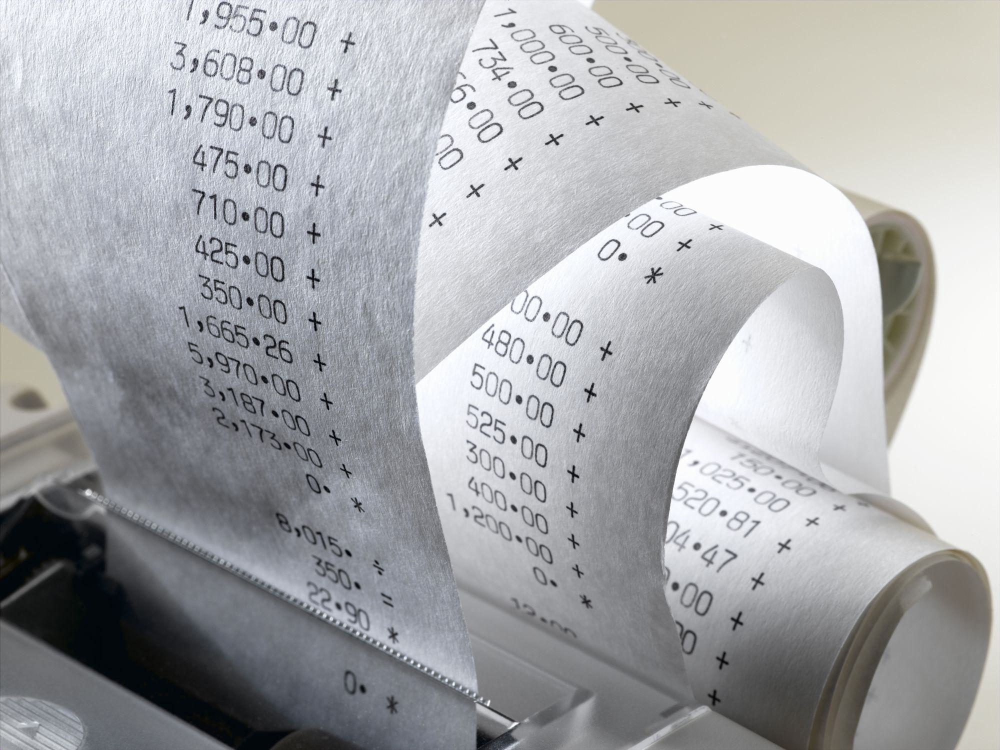

## Table of Contents

## What are austerity measures?

Austerity measures are actions taken by governments to reduce their spending and control their budgets. When a country has a lot of debt or is in an economic crisis, it might use these measures to try to fix its financial problems. This can include cutting back on public services like healthcare, education, and social programs. It might also mean raising taxes or making it harder for people to get benefits.

These measures can be tough for people because they often lead to less money and support from the government. For example, if a government cuts funding for schools, it might mean fewer teachers and resources for students. While the goal is to improve the country's financial health, austerity measures can cause a lot of debate. Some people believe they are necessary to avoid bigger problems later, while others think they hurt the economy and make life harder for citizens, especially those who are already struggling.

## Why do governments implement austerity measures?

Governments implement austerity measures mainly when they are facing big money problems, like having a lot of debt or being in an economic crisis. They use these measures to try to spend less money and get their budgets under control. By cutting back on things like healthcare, education, and social programs, and sometimes raising taxes, they hope to save money and pay off their debts. This is like a family deciding to spend less on eating out or buying new things to pay off their credit cards.

However, these measures can be hard on people because they often mean less help from the government. When funding for schools is cut, for example, there might be fewer teachers and less support for students. While the goal is to make the country's money situation better, it can cause a lot of debate. Some people think austerity measures are needed to avoid even bigger problems down the road. Others believe they hurt the economy and make life tougher for citizens, especially those who are already struggling.

## What are the common types of austerity measures?

Austerity measures are steps governments take to save money and reduce their debt. One common type is cutting back on public spending. This can mean less money for things like schools, hospitals, and social programs. For example, a government might decide to reduce the number of teachers or close some hospitals to save money. Another way is to freeze or cut the salaries of government workers, which means they get paid less or don't get raises.

Another type of austerity measure is raising taxes. Governments might increase taxes on things like income, sales, or property to bring in more money. This can make life harder for people because they have to pay more out of their own pockets. Sometimes, governments also make it harder to get benefits like unemployment help or welfare. They might change the rules so fewer people qualify or get less money.

These measures can have a big impact on people's lives. Cutting public spending often means fewer services and support, which can be tough on families and communities. Raising taxes and changing benefits can also make it harder for people to make ends meet. While the goal is to fix the government's money problems, austerity measures can cause a lot of debate about whether they are the best way to do this.

## How do austerity measures affect the economy?

Austerity measures can have a big impact on the economy. When a government cuts spending on things like schools and hospitals, it means less money is going into the economy. This can lead to fewer jobs and less money for people to spend. If people are spending less, businesses might make less money and could even close down. This can slow down the economy and make it harder for it to grow. Also, when governments raise taxes, people have less money to spend, which can make the economy weaker.

On the other hand, some people think austerity measures can help the economy in the long run. By cutting spending and raising taxes, a government can pay off its debts faster. This can make the country's money situation more stable and might make investors feel more confident about the economy. If investors feel good about the economy, they might put more money into it, which can help it grow. But this takes time, and in the short term, austerity measures can make things harder for people and businesses.

So, austerity measures can have both good and bad effects on the economy. They can slow down the economy in the short term by cutting spending and raising taxes, but they might help make the economy stronger and more stable in the long run. It's a tricky balance, and different people have different ideas about whether these measures are the best way to help the economy.

## Can austerity measures lead to social unrest?

Yes, austerity measures can lead to social unrest. When governments cut spending on things like healthcare and education, and raise taxes, it can make life harder for people. They might have less money to spend on basic needs like food and housing. This can make people angry and frustrated, especially if they feel the government isn't doing enough to help them. When people are struggling and feel ignored, they might protest or even riot to show their unhappiness.

For example, if a government cuts funding for schools, parents might worry about their children's future. If healthcare services are reduced, people might not be able to get the care they need. When these kinds of cuts happen, people often come together to voice their concerns. They might organize protests or strikes to try to change the government's mind. If the government doesn't listen, the unrest can grow, leading to more serious problems like violence or political instability.

## What are the short-term versus long-term effects of austerity?

In the short term, austerity measures can make life harder for people. When governments cut spending on things like schools and hospitals, there's less help for people who need it. This can lead to fewer jobs and less money for people to spend. If people have less money, they might not buy as much, which can hurt businesses and slow down the economy. Also, if taxes go up, people have even less money to spend. This can lead to more people struggling to pay for basic needs like food and housing, which can cause anger and even protests.

In the long term, some people believe austerity measures can help the economy. By cutting spending and raising taxes, a government can pay off its debts faster. This can make the country's money situation more stable and might make investors feel more confident about the economy. If investors feel good, they might put more money into the country, which can help the economy grow over time. But, it's a tricky balance. The short-term pain can be hard on people, and it's not always clear if the long-term benefits will be worth it. Different people have different ideas about whether austerity is the best way to help the economy in the long run.

## How do austerity measures impact public services?

Austerity measures often mean less money for public services like schools, hospitals, and social programs. When a government decides to cut spending, it might close some schools or reduce the number of teachers. This can make it harder for kids to get a good education. Hospitals might also get less money, so there could be fewer doctors and nurses, and people might have to wait longer to see them. Social programs, like help for people who can't find jobs or are struggling to make ends meet, might also get cut. This means fewer people can get the help they need, and they might have a harder time getting by.

These cuts can have a big impact on people's lives. When public services are reduced, it can be tough for families and communities. For example, if there are fewer teachers, kids might not get the attention they need to learn well. If hospitals are underfunded, people might not be able to get the care they need quickly. And if social programs are cut, people who are already struggling might find it even harder to make ends meet. While the goal of austerity measures is to help the government's money situation, the immediate effect is often less support and fewer services for the people who need them most.

## What are the political consequences of implementing austerity measures?

When governments choose to implement austerity measures, it can lead to big political changes. People often get upset when they see cuts to things like schools, hospitals, and help for those who need it. This can make them lose trust in the government. They might feel that the leaders don't care about their problems. As a result, people might protest or vote against the politicians who supported austerity. This can lead to new leaders or parties coming into power who promise to fix the problems caused by the cuts.

In the long run, the political impact of austerity can be complicated. If the measures help the country's money situation, the government might be seen as responsible and good at managing the economy. This could make them more popular over time. But if the cuts hurt people too much and the economy doesn't get better, the government might face a lot of anger and opposition. This could lead to more protests, strikes, and even bigger changes in who runs the country. It's a tricky balance, and the political fallout can be hard to predict.

## Are there alternatives to austerity measures for managing economic crises?

Yes, there are other ways to deal with money problems without using austerity measures. One way is to focus on growing the economy instead of cutting spending. Governments can invest in things like building roads, schools, and hospitals, which can create jobs and help people spend more money. This can make the economy stronger and bring in more money through taxes. Another way is to change tax rules to make sure that rich people and big companies pay more. This can help the government get more money without cutting services that people need.

Another option is to borrow money at low interest rates to help the economy recover. This can give the government more money to spend on helping people and businesses without making big cuts right away. Some countries also ask for help from international groups like the International Monetary Fund, which can give them loans or advice on how to fix their money problems. These alternatives can be less painful for people than austerity measures, but they also have their own challenges and risks.

## How have austerity measures been applied differently across various countries?

Different countries have used austerity measures in different ways to deal with their money problems. In Greece, for example, the government made big cuts to public spending and raised taxes a lot during the financial crisis in the 2010s. They had to do this because they had a lot of debt and needed help from other countries and the International Monetary Fund. These measures led to less money for schools, hospitals, and help for people who were struggling. It made life hard for many Greeks and caused a lot of protests and anger.

In the United Kingdom, the government also used austerity measures after the 2008 financial crisis. They cut spending on things like welfare and local services, and they froze the pay of many public workers. The goal was to reduce the country's debt and make the economy more stable. But these measures also meant less help for people who needed it, and it led to debates about whether they were the right thing to do. Each country's approach to austerity depends on its own money problems and what its leaders think will work best.

## What role do international organizations play in the implementation of austerity measures?

International organizations like the International Monetary Fund (IMF) and the European Union (EU) play a big role in helping countries decide on austerity measures. When a country has a lot of debt and can't pay it back, these organizations might step in to help. They often give the country loans, but in return, they ask the country to follow certain rules. These rules usually include cutting spending and raising taxes to help the country pay back its debts. The IMF and EU want to make sure the country's money problems get better, so they keep a close eye on how the country is doing.

Sometimes, the advice from international organizations can be tough for countries to follow. The measures they suggest, like cutting money for schools and hospitals, can make life harder for people. This can lead to protests and anger in the country. But the organizations believe these steps are needed to fix the country's money problems in the long run. They work with the country's leaders to make plans and check how well the plans are working. It's a tricky balance between helping the country's economy and making sure people don't suffer too much.

## How can the effectiveness of austerity measures be evaluated?

The effectiveness of austerity measures can be looked at by seeing if they help a country's money situation get better. This means checking if the country can pay off its debts more easily and if its budget is more balanced. For example, if a government cuts spending and raises taxes, it might be able to pay back what it owes faster. Economists and experts look at things like how much the country's debt goes down and if the economy starts to grow again. They also see if investors feel more confident about putting money into the country because it seems more stable.

But it's not just about the numbers. We also need to think about how these measures affect people's lives. If people have less help from the government and struggle more, then the measures might not be seen as effective, even if the country's debt goes down. It's important to look at things like unemployment rates, how well people can afford basic needs, and if there's more or less social unrest. The goal of austerity is to make the economy better in the long run, but if it causes too much pain in the short term, people might not think it's worth it.

## What are the pros and cons of austerity measures?

Austerity measures are often implemented with the aim of reducing public-sector debt and restoring fiscal balance. Proponents of austerity argue that high public debt levels can hinder economic growth by increasing borrowing costs, crowding out private investment, and decreasing investor confidence. By implementing spending cuts and increasing taxes, governments can demonstrate fiscal prudence, potentially lowering interest rates and creating a more stable macroeconomic environment conducive to private investment. Consequently, this approach is believed to ensure long-term fiscal health, setting the stage for sustainable economic growth.

Supporters also point out the risk of debt spirals, wherein unchecked borrowing leads to exponential growth in debt levels, eventually rendering debt servicing unsustainable without severe economic repercussions. In such scenarios, austerity measures are seen as necessary interventions to preemptively address fiscal imbalances before they reach crisis proportions.

However, critics highlight the adverse effects of austerity on economic growth, employment, and social welfare. They argue that during economic downturns or recessions, austerity can exacerbate economic contractions by reducing aggregate demand. For instance, cuts in government spending and public-sector employment can directly reduce income and consumption levels, leading to further declines in demand. Tax increases may similarly diminish disposable income, weakening consumer spending power.

Critics also emphasize the multiplier effect, which describes how an initial reduction in spending leads to a chain reaction of decreased economic activity. The formula for the multiplier effect is given by:

$$
\text{Multiplier} = \frac{1}{1 - MPC}
$$

where $MPC$ is the marginal propensity to consume. During recessions, where $MPC$ tends to be high due to curtailed savings, the negative multiplier effect of reduced government spending can be substantial, aggravating the economic decline.

Moreover, austerity-driven cuts to social services and welfare programs can disproportionately affect the most vulnerable groups, potentially increasing inequality and social unrest. This highlights the social and ethical dimensions of austerity measures, thereby fueling debates over the moral responsibility of fiscal policies.

The ongoing debate around austerity often centers on finding a balance between maintaining fiscal responsibility and providing adequate economic stimulus. Some economists advocate for a more strategic application of austerity, recommending its use in periods of economic expansion rather than contraction, thereby mitigating its potential to hamper recovery efforts. As such, the context within which austerity is applied significantly influences its outcomes, underscoring the complexity of its implementation.

## What is the economic impact of government spending cuts?

Government spending cuts often lead to significant economic implications, particularly in terms of reduced public-sector employment, decreased social service availability, and lowered aggregate demand. These consequences arise as essential government functions such as infrastructure investment, health care, and education face reductions, which can ripple through the economy, causing a decline in consumer and business confidence.

### Public-Sector Employment and Social Services

Public-sector jobs are directly affected by spending cuts, which frequently result in layoffs or hiring freezes. This reduction in public employment can increase unemployment rates, thereby diminishing consumers' disposable income. As a consequence, consumer spending, a critical component of aggregate demand, tends to decrease.

The downsizing of social services, including health care, education, and welfare programs, further compounds these economic challenges. Limited access to social services can impede human capital development and reduce overall economic productivity. This underscores the broader societal cost associated with austerity-driven expenditure reductions.

### Aggregate Demand and Economic Activity

The concept of aggregate demand is vital in understanding the economic impact of government spending cuts. Aggregate demand consists of consumer spending, business investments, government expenditures, and net exports. When government spending is curtailed, its direct contribution to aggregate demand declines, potentially leading to a contraction in economic activity.

Mathematically, we can express aggregate demand (AD) as:

$$
AD = C + I + G + (X - M)
$$

where $C$ is consumer spending, $I$ is investment, $G$ is government spending, and $X - M$ represents net exports. A reduction in $G$, without compensatory increases in the other components, typically results in a lower AD, leading to diminished economic output.

### The Multiplier Effect

The multiplier effect is crucial in determining how government spending cuts influence the broader economy. The fiscal multiplier measures the change in economic output resulting from a change in government spending. If the multiplier is greater than one, the initial change in spending has a magnified impact on national income.

For example, a multiplier of 1.5 implies that for every dollar cut from government spending, total economic output decreases by $1.50. The formula for the fiscal multiplier is:

$$
\text{Multiplier} = \frac{1}{1 - MPC(1 - t) + MPI}
$$

where $MPC$ is the marginal propensity to consume, $t$ is the tax rate, and $MPI$ is the marginal propensity to import. During recessions, the multiplier tends to be larger due to higher idle resources, meaning cuts can severely exacerbate economic downturns.

### Recession vs. Expansion

Economic contexts significantly influence the impact of spending cuts. During recessions, when the economy is already contracting, reductions can worsen the downturn by further decreasing aggregate demand and prolonging recovery, as observed in the 2008 financial crisis and ensuing austerity measures in Europe.

Conversely, in times of economic expansion, when resources are more fully employed, the negative impact of spending cuts may be mitigated. The private sector is often better equipped to offset reductions in public spending through increased investments and consumption.

In summary, government spending cuts have notable consequences for economic activity, particularly due to the reductions in public-sector employment, social services, and aggregate demand. The fiscal multiplier effect can amplify these impacts, especially during times of economic downturn, making careful consideration of the timing and scale of austerity measures crucial for minimizing economic disruptions.

## References & Further Reading

[1]: Featherstone, K. (2015). "External Conditionality and the Debt Crisis: The 'Troika' and Public Administration Reform in Greece". Available at [link](https://www.tandfonline.com/doi/full/10.1080/13501763.2014.955123)

[2]: Pappas, T. (2014). "Populism and Crisis Politics in Greece". Available at [link](https://link.springer.com/book/10.1057/9781137410580)

[3]: Blanchard, O. J., Griffiths, M., & Gruss, B. (2013). "Boom, Bust, Recovery: Forensics of the Latvia Crisis". Available at [link](https://www.brookings.edu/wp-content/uploads/2016/07/2013b_blanchard_latvia_crisis.pdf)

[4]: Aslund, A. (2011). "The Last Shall Be the First: The East European Financial Crisis". Available at [link](https://play.google.com/store/books/details/The_Last_Shall_Be_the_First_The_East_European_Fina?id=lPUjV1Mk4LwC&hl=en-US)

[5]: ["Advances in Financial Machine Learning"](https://www.amazon.com/Advances-Financial-Machine-Learning-Marcos/dp/1119482089) by Marcos Lopez de Prado.

[6]: ["Quantitative Trading: How to Build Your Own Algorithmic Trading Business"](https://www.amazon.com/Quantitative-Trading-Build-Algorithmic-Business/dp/1119800064) by Ernest P. Chan.