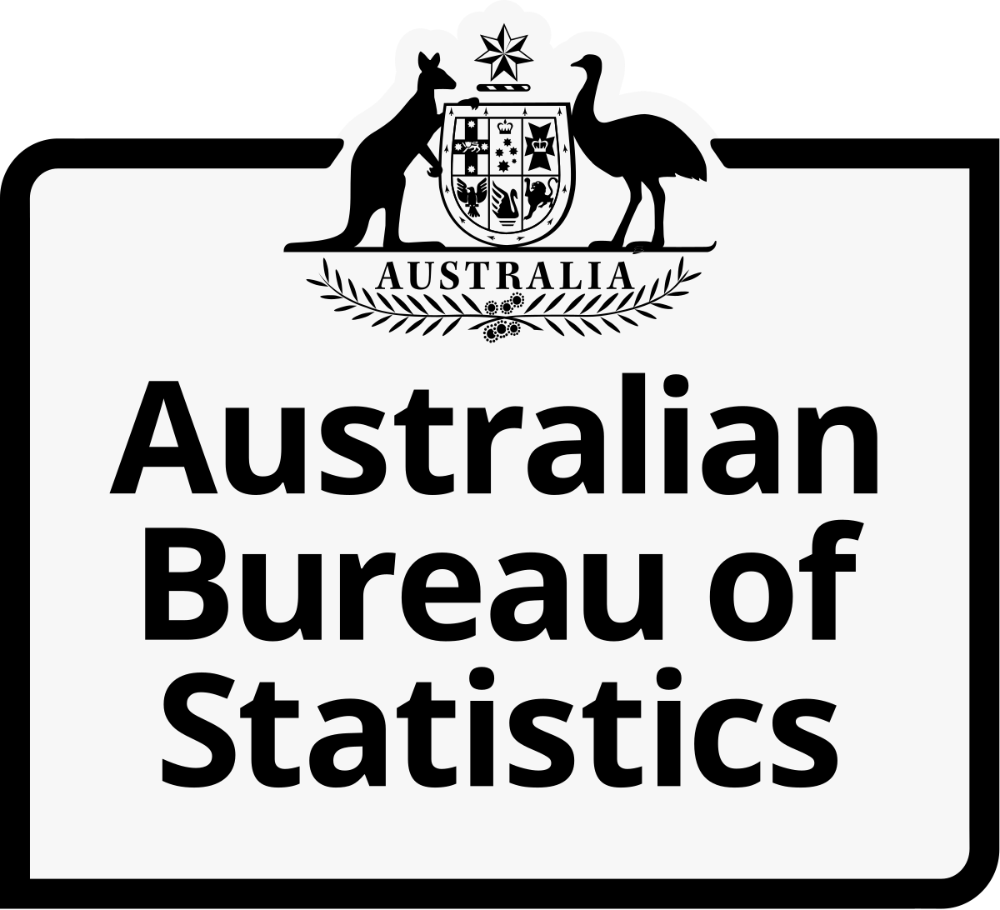

## Table of Contents

## What is the Australian Bureau of Statistics (ABS)?

The Australian Bureau of Statistics (ABS) is an important government organization in Australia. It collects and shares information about the country and its people. This information helps the government, businesses, and the public make good decisions. The ABS started in 1905 and is located in Canberra, the capital city of Australia.

The ABS does many things, like counting the population with a big survey called the Census. They do this every five years to learn about how many people live in Australia and where they live. The ABS also collects data on things like jobs, money people earn, and how prices change over time. This helps everyone understand what is happening in the country and plan for the future.

## When was the ABS established?

The Australian Bureau of Statistics (ABS) was established in 1905. It is a government organization that helps collect and share information about Australia and its people.

The ABS is important because it helps the government, businesses, and the public make good decisions. They do this by gathering data on things like population, jobs, and prices. The ABS is located in Canberra, the capital city of Australia.

## What are the main functions of the ABS?

The Australian Bureau of Statistics (ABS) has many important jobs. One of its main functions is to collect data about the population of Australia. Every five years, the ABS conducts a big survey called the Census. This helps them count how many people live in the country and where they are. This information is very useful for planning things like schools, hospitals, and roads.

Another key function of the ABS is to gather information about the economy. They collect data on jobs, how much money people earn, and how prices change over time. This helps everyone understand the economic situation in Australia. Businesses use this information to make decisions, and the government uses it to create policies that can help the country grow.

The ABS also shares all this information with the public. They make sure that the data is easy to understand and use. This helps people make informed decisions about their lives. By providing accurate and up-to-date information, the ABS plays a crucial role in helping Australia move forward.

## How does the ABS collect data?

The Australian Bureau of Statistics (ABS) collects data in many ways. One main way is through surveys. They send out questionnaires to people and businesses across Australia. These surveys ask about things like how many people live in a house, what jobs people have, and how much money they earn. The ABS also uses the Census, which happens every five years. During the Census, they try to count every person in Australia and collect detailed information about them.

Another way the ABS collects data is by working with other government agencies. They get information from places like the tax office and health departments. This helps them gather data without having to ask everyone directly. The ABS also uses technology to collect data. They have systems that can track things like prices in stores and how many people are coming into the country. By using these different methods, the ABS can get a complete picture of what is happening in Australia.

## What types of data does the ABS collect?

The Australian Bureau of Statistics (ABS) collects many different types of data about Australia and its people. They gather information about the population, which includes how many people live in the country, where they live, and their age. The ABS also collects data on families and households, like how many people live in each home and what their relationships are. This helps them understand how the population is changing over time.

The ABS also collects economic data. They gather information about jobs, like how many people are working and what kinds of jobs they have. They also collect data on how much money people earn and how prices change over time. This helps everyone understand the economy and make good decisions. Additionally, the ABS collects data on businesses, like how many there are, what they do, and how well they are doing.

Other types of data the ABS collects include information about health, education, and the environment. They gather data on things like how healthy people are, how many people are going to school, and what the air and water quality is like. All of this information helps the government, businesses, and the public make plans and decisions for the future.

## How is the data from the ABS used by the government and public?

The government uses the data from the Australian Bureau of Statistics (ABS) to make important decisions. They look at the population numbers to plan where to build new schools, hospitals, and roads. The economic data helps them understand how well the country is doing and what policies might help people get jobs and earn more money. The government also uses health and education data to make sure everyone has access to good healthcare and education. This helps them create programs that can improve the lives of Australians.

The public also uses the ABS data in many ways. People can look at the data to learn about their community and see how it is changing. For example, they might check the population data to see if their neighborhood is growing or getting smaller. Businesses use the economic data to make decisions about where to open new stores or what products to sell. Students and researchers use the data for school projects and to learn more about Australia. Overall, the ABS data helps everyone understand what is happening in the country and make better choices.

## What are some key statistical publications released by the ABS?

The Australian Bureau of Statistics (ABS) releases many important reports that help people understand Australia. One key publication is the Census, which happens every five years. The Census gives a detailed picture of the population, showing how many people live in the country, where they live, and what they do. This information helps the government plan for things like schools and hospitals.

Another important report is the Labour Force Survey, which comes out every month. This report tells us about jobs in Australia, like how many people are working and how many are looking for work. It helps everyone understand the economy and see if it is getting better or worse. Businesses use this information to make decisions about hiring and growing.

The Consumer Price Index (CPI) is another key publication from the ABS. It comes out every quarter and shows how prices are changing for things like food, housing, and clothes. This helps people understand if things are getting more expensive and helps the government make decisions about money and the economy.

## How does the ABS ensure the quality and accuracy of its data?

The Australian Bureau of Statistics (ABS) works hard to make sure its data is good and correct. They use many ways to check their data. First, they plan their surveys carefully to ask the right questions. Then, they choose who to ask in a way that represents everyone in Australia. They also train their workers well so they can collect information correctly. After collecting the data, the ABS checks it again to make sure it makes sense and matches what they expected.

The ABS also uses technology to help keep their data accurate. They use computers to look for mistakes and to make sure the numbers add up right. They also compare their new data with old data to see if it fits with what they know. If they find any problems, they fix them before sharing the data with everyone. By doing all these things, the ABS makes sure their data is trustworthy and useful for everyone in Australia.

## What role does the ABS play in international statistical activities?

The Australian Bureau of Statistics (ABS) helps with international statistics by working with other countries and groups. They share their data and methods with organizations like the United Nations and the Organisation for Economic Co-operation and Development (OECD). This helps make sure that data from different countries can be compared easily. By working together, they can learn from each other and improve how they collect and use data.

The ABS also takes part in international projects and studies. They help with surveys and research that look at things like global population trends, economic growth, and health issues. This work helps everyone understand what is happening around the world and how different countries are doing. By being involved in these activities, the ABS helps make international statistics better and more useful for everyone.

## How has the ABS adapted to technological changes in data collection and dissemination?

The Australian Bureau of Statistics (ABS) has changed a lot because of new technology. They now use the internet to collect data. People can fill out surveys online instead of on paper. This makes it easier and faster to get information. The ABS also uses special computer programs to check the data for mistakes. These programs help make sure the numbers are correct and easy to understand.

The ABS also uses technology to share data with everyone. They have a website where people can look at all the information they collect. They also use social media to tell people about new reports and data. This helps more people learn about what is happening in Australia. By using technology, the ABS can collect and share data better than before.

## What challenges does the ABS face in maintaining data privacy and security?

The Australian Bureau of Statistics (ABS) faces big challenges in keeping data private and safe. They collect a lot of personal information from people, like where they live and what they do for work. This information needs to be kept secret so no one can use it in a bad way. The ABS has to make sure their computers and systems are very secure to stop hackers from getting in. They also have to follow strict rules about how they can use and share the data.

Another challenge is making sure people trust them with their information. If people think their data is not safe, they might not want to share it. The ABS has to show everyone that they are doing everything they can to protect privacy. They do this by explaining their security measures and being open about how they use the data. It's a big job, but it's important for the ABS to keep people's information safe and private.

## How does the ABS collaborate with other national and international statistical agencies?

The Australian Bureau of Statistics (ABS) works with other statistical agencies in Australia and around the world to make their data better. They share their information and ways of doing things with groups like the Australian Institute of Health and Welfare and the Australian Taxation Office. This helps make sure the data from different parts of Australia can be compared easily. By working together, they can learn from each other and improve how they collect and use data.

The ABS also helps with international projects by working with organizations like the United Nations and the Organisation for Economic Co-operation and Development (OECD). They share their data and methods to help make global statistics better. This helps everyone understand what is happening around the world and how different countries are doing. By being involved in these activities, the ABS helps make international statistics more useful for everyone.

## What is the Role of ABS in Providing Economic Indicators?

The Australian Bureau of Statistics (ABS) plays a crucial role in providing economic indicators that are essential for various sectors, particularly within financial markets. Key indicators such as Gross Domestic Product (GDP), interest rates, property prices, and employment figures are meticulously compiled and published by the ABS. These indicators serve as a barometer for the health of the economy and are invaluable inputs for [algorithmic trading](/wiki/algorithmic-trading) models.

Algorithmic trading, which relies heavily on data-driven strategies, benefits significantly from the dependable and timely data the ABS provides. The insistence on consistent and updated economic data establishes a stable foundation upon which trading algorithms create predictive models. For example, changes in GDP can influence stock market trends and inform the strategic decisions of traders aiming to maximize returns. Models might incorporate GDP growth rates to forecast potential market movements, represented as follows:

$$
\text{Projected Market Movement} = f(\text{GDP growth rate}, \text{other variables})
$$

Such predictive models depend heavily on the reliability of the initial data inputs. By offering transparency through their data dissemination, the ABS helps instill trust within financial markets. This trust is pivotal when decision-makers use the data to refine their algorithmic trading strategies. Algorithms can be designed in Python to adjust rapidly to data releases, as demonstrated in the simplified code snippet below:

```python
import numpy as np

# Assume we have GDP growth data updated in real-time from the ABS
gdp_growth_rate = np.array([...])  # GDP growth rates over time

# Algorithmic adjustment based on GDP data
def adjust_trading_strategy(gdp_data):
    # Implement decision-making logic to alter trading positions
    if gdp_data[-1] > 0.02:  # Growth rate exceeds 2%
        # Increase investment in growth-sensitive stocks
        print("Adjusting strategy: Increase investment in growth sectors.")
    else:
        # Shift focus to defensive stocks
        print("Adjusting strategy: Increase investment in defensive sectors.")

# Simulate adjustment with new GDP data
adjust_trading_strategy(gdp_growth_rate)
```

The consistent flow of accurate economic [statistics](/wiki/bayesian-statistics) from the ABS thus enables trading algorithms to adjust swiftly to changing economic conditions, thereby promoting informed decision-making. Overall, the ABS’s role in economic indicator provision aligns with the ongoing demands of financial markets, offering essential support for the continued evolution and accuracy of algorithmic trading systems.

## References & Further Reading

[1]: ["Australian Bureau of Statistics Official Website"](https://www.abs.gov.au/)

[2]: Marcos López de Prado, ["Advances in Financial Machine Learning"](https://www.amazon.com/Advances-Financial-Machine-Learning-Marcos/dp/1119482089)

[3]: David Aronson, ["Evidence-Based Technical Analysis: Applying the Scientific Method and Statistical Inference to Trading Signals"](https://www.amazon.com/Evidence-Based-Technical-Analysis-Scientific-Statistical/dp/0470008741)

[4]: Stefan Jansen, ["Machine Learning for Algorithmic Trading"](https://github.com/stefan-jansen/machine-learning-for-trading)

[5]: Ernest P. Chan, ["Quantitative Trading: How to Build Your Own Algorithmic Trading Business"](https://www.amazon.com/Quantitative-Trading-Build-Algorithmic-Business/dp/0470284889)

[6]: Bergstra, J., Bardenet, R., Bengio, Y., & Kégl, B. (2011). ["Algorithms for Hyper-Parameter Optimization"](https://dl.acm.org/doi/10.5555/2986459.2986743). Advances in Neural Information Processing Systems.