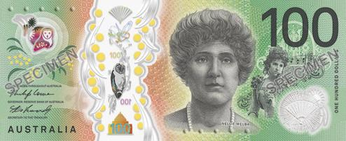

## Table of Contents

## What is the Australian Dollar and its symbol?

The Australian Dollar is the official currency of Australia. It is used every day by people in Australia to buy things like food, clothes, and other stuff. The Australian Dollar started being used in 1966. Before that, Australia used pounds, shillings, and pence.

The symbol for the Australian Dollar is a capital letter 'A' with a line through the middle, and it looks like this: $. This symbol is often written before the amount of money, for example, $100 means one hundred Australian Dollars. Sometimes, to avoid confusion with other currencies that use the same symbol, people write AUD before the amount, like AUD$100.

## How is the Australian Dollar abbreviated in forex markets?

In forex markets, the Australian Dollar is abbreviated as AUD. Forex markets are where people and businesses from different countries trade their money. When you see AUD in these markets, it means people are buying or selling Australian Dollars.

The abbreviation AUD helps everyone know they are talking about the Australian Dollar and not another currency. It's like a nickname that makes things easier and quicker when trading. So, if you hear someone say they are trading AUD/USD, they are trading Australian Dollars for US Dollars.

## What is the history of the Australian Dollar?

The Australian Dollar, or AUD, became Australia's official money in 1966. Before that, Australia used a different system called pounds, shillings, and pence, which was a bit like the British money at the time. The switch to the Australian Dollar was part of a big change to make money easier to use and understand. When the Australian Dollar started, it was worth a bit more than the US Dollar, but over time, its value has gone up and down compared to other currencies.

The Australian Dollar was first made of silver and was worth a lot because of the silver inside it. But now, Australian Dollars are made of different materials and don't have much value from the metal they're made of. The Reserve Bank of Australia is in charge of the Australian Dollar and decides how many should be made. They also try to keep the value of the Australian Dollar steady so that people can buy things from other countries without the price changing too much. Since it started, the Australian Dollar has become one of the most traded currencies in the world, especially in places like Asia.

## What are the key features of the Australian Dollar?

The Australian Dollar is the money used in Australia. It's known around the world because Australia is a big country with a strong economy. The symbol for the Australian Dollar is a capital 'A' with a line through it, which looks like this: $. When you see this symbol, it means you're dealing with Australian money. The Australian Dollar is also called AUD, which is short for Australian Dollar, and this is used a lot in places where people trade different kinds of money.

The Australian Dollar was first used in 1966, and it replaced the old system of pounds, shillings, and pence. This change made money easier to understand and use. The Reserve Bank of Australia is the group that looks after the Australian Dollar. They decide how many dollars should be made and try to keep its value steady. This helps people in Australia and other countries to buy and sell things without big changes in price. The Australian Dollar is one of the most traded currencies in the world, especially in Asia, because Australia does a lot of business there.

## How does the Australian Dollar's value fluctuate in forex markets?

The value of the Australian Dollar goes up and down in forex markets because of many reasons. One big reason is what's happening in Australia's economy. If Australia is doing well, with lots of jobs and people buying things, the Australian Dollar might go up in value. But if the economy is not doing so well, the value might go down. Another reason is the price of things Australia sells to other countries, like minerals and food. If these prices go up, the Australian Dollar often goes up too. Also, what the Reserve Bank of Australia does can affect the value. If they decide to make more Australian Dollars, the value might go down because there are more dollars around.

Another thing that can change the value of the Australian Dollar is what's happening in the world. If there's a lot of uncertainty or trouble in other countries, people might want to buy Australian Dollars because they think it's a safe choice. This can make the Australian Dollar go up in value. Also, how the Australian Dollar is doing compared to other big currencies like the US Dollar or the Euro can make a difference. If the US Dollar is doing really well, the Australian Dollar might go down in value compared to it. So, the value of the Australian Dollar in forex markets is always moving because of what's happening in Australia and around the world.

## What factors influence the value of the Australian Dollar?

The value of the Australian Dollar can change because of many things. One important thing is how well Australia's economy is doing. If lots of people have jobs and are buying things, the Australian Dollar might go up in value. But if the economy is not doing so well, the value might go down. Another big thing is the price of what Australia sells to other countries, like minerals and food. If these prices go up, the Australian Dollar often goes up too. The Reserve Bank of Australia also plays a big role. If they decide to make more Australian Dollars, the value might go down because there are more dollars around.

Another thing that can change the value of the Australian Dollar is what's happening in the world. If there's a lot of uncertainty or trouble in other countries, people might want to buy Australian Dollars because they think it's a safe choice. This can make the Australian Dollar go up in value. Also, how the Australian Dollar is doing compared to other big currencies like the US Dollar or the Euro can make a difference. If the US Dollar is doing really well, the Australian Dollar might go down in value compared to it. So, the value of the Australian Dollar is always moving because of what's happening in Australia and around the world.

## What role does the Reserve Bank of Australia play in the forex market?

The Reserve Bank of Australia (RBA) is really important in the forex market because it helps control the value of the Australian Dollar. One of the main things the RBA does is decide how much money should be in Australia. If they think there's too much money, they might take some away, and if there's not enough, they might add more. This can make the Australian Dollar go up or down in value. The RBA also sets the interest rate, which is like the price of borrowing money. If the interest rate goes up, it can make the Australian Dollar more attractive to people from other countries because they can earn more by keeping their money in Australia.

Another thing the RBA does is talk about what it thinks will happen with the economy. When the RBA says it thinks the economy will do well, it can make people feel more confident about the Australian Dollar, and its value might go up. But if the RBA says it's worried about the economy, people might not want to hold onto Australian Dollars, and its value might go down. So, the RBA's actions and words can really move the Australian Dollar in the forex market, helping to keep the economy stable.

## How does the Australian Dollar interact with commodity prices?

The Australian Dollar is closely tied to the prices of commodities like minerals and food because Australia sells a lot of these things to other countries. When the prices of these commodities go up, the Australian Dollar often goes up too. This happens because when commodities are more expensive, Australia makes more money from selling them, which can make its currency stronger. For example, if the price of iron ore, which Australia has a lot of, goes up, people from other countries might need more Australian Dollars to buy it, pushing up the value of the Australian Dollar.

On the other hand, if commodity prices go down, the Australian Dollar can lose value. When commodities are cheaper, Australia earns less money from selling them, and this can make the Australian Dollar weaker. For instance, if the price of coal drops, fewer people will want to buy Australian Dollars to pay for it, and the value of the Australian Dollar might fall. So, the ups and downs of commodity prices play a big role in how the Australian Dollar behaves in the forex market.

## What are the major trading partners of Australia and how do they affect the AUD?

Australia's biggest trading partners are countries like China, Japan, the United States, and South Korea. These countries buy a lot of things from Australia, like minerals, food, and other goods. China is the most important because it buys more from Australia than any other country. When these countries are doing well and buying more from Australia, it can make the Australian Dollar, or AUD, go up in value. This happens because more people need Australian Dollars to pay for the things they're buying.

On the other hand, if these trading partners are not doing so well and they buy less from Australia, the AUD might go down in value. For example, if China's economy slows down and it buys fewer minerals, the demand for Australian Dollars can drop, making the AUD weaker. So, the health of these major trading partners and how much they buy from Australia can have a big impact on the value of the AUD in the forex market.

## How can traders use technical analysis to predict movements in the Australian Dollar?

Traders can use technical analysis to predict movements in the Australian Dollar by looking at charts and patterns that show how the currency has moved in the past. They use things called indicators, like moving averages and the Relative Strength Index (RSI), to help them understand if the AUD might go up or down. For example, if the AUD has been going up and then it starts to go down, traders might look at the support and resistance levels on the chart. If the AUD falls below a support level, it might keep going down, and if it goes above a resistance level, it might keep going up.

Another way traders use technical analysis is by looking at patterns in the AUD's price movements. Patterns like 'head and shoulders' or 'double tops and bottoms' can give clues about future movements. For instance, if a 'head and shoulders' pattern appears, it might mean the AUD is about to go down. Traders also use trend lines to see if the AUD is in an uptrend or a downtrend. If the AUD keeps making higher highs and higher lows, it's in an uptrend, and traders might expect it to keep going up. But if it's making lower highs and lower lows, it's in a downtrend, and they might expect it to keep going down. By combining these tools, traders can make better guesses about where the AUD might be headed next.

## What are the common forex strategies involving the Australian Dollar?

Traders often use something called the carry trade when they deal with the Australian Dollar. This means they borrow money in a country where the interest rates are low, like Japan, and then use that money to buy Australian Dollars because the interest rates in Australia are usually higher. By doing this, they can make money from the difference in interest rates. But this strategy can be risky because if the value of the Australian Dollar goes down compared to the currency they borrowed in, they could lose money. So, traders need to watch the markets carefully and be ready to change their plans if things don't go as expected.

Another common strategy is to trade based on the news about Australia's economy and commodity prices. Since Australia sells a lot of minerals and food to other countries, the price of these things can affect the Australian Dollar. If the news says that the price of iron ore or coal is going up, traders might buy Australian Dollars because they think the currency will get stronger. But if the news is bad, like if the price of these commodities goes down, traders might sell Australian Dollars, expecting the currency to weaken. This strategy involves keeping up with economic reports and news from Australia and its trading partners, especially big ones like China.

## How does the Australian Dollar's performance compare to other major currencies in the forex market?

The Australian Dollar, or AUD, often moves differently compared to other big currencies like the US Dollar (USD), the Euro (EUR), and the Japanese Yen (JPY). One reason for this is that Australia's economy is closely tied to commodity prices, especially minerals like iron ore and coal. When these prices go up, the AUD usually gets stronger. On the other hand, currencies like the USD and EUR are more influenced by things like interest rates and overall economic health in their countries. So, if commodity prices are doing well, the AUD might do better than the USD or EUR, but if commodity prices drop, the AUD might not do as well.

Another thing that affects how the AUD performs compared to other currencies is what's happening with Australia's trading partners, especially China. China buys a lot from Australia, so if China's economy is doing well, it can help the AUD go up in value. But if China's economy slows down, it can make the AUD go down. This is different from currencies like the USD, which can be affected more by things happening in the US, or the EUR, which can be influenced by what's going on in Europe. So, the AUD's performance can be quite unique because it depends a lot on commodity prices and the health of economies like China.

## References & Further Reading

[1]: Bergstra, J., Bardenet, R., Bengio, Y., & Kégl, B. (2011). ["Algorithms for Hyper-Parameter Optimization."](https://dl.acm.org/doi/10.5555/2986459.2986743) Advances in Neural Information Processing Systems 24.

[2]: ["Advances in Financial Machine Learning"](https://www.amazon.com/Advances-Financial-Machine-Learning-Marcos/dp/1119482089) by Marcos Lopez de Prado

[3]: ["Evidence-Based Technical Analysis: Applying the Scientific Method and Statistical Inference to Trading Signals"](https://www.amazon.com/Evidence-Based-Technical-Analysis-Scientific-Statistical/dp/0470008741) by David Aronson

[4]: ["Machine Learning for Algorithmic Trading"](https://github.com/stefan-jansen/machine-learning-for-trading) by Stefan Jansen

[5]: ["Quantitative Trading: How to Build Your Own Algorithmic Trading Business"](https://www.amazon.com/Quantitative-Trading-Build-Algorithmic-Business/dp/1119800064) by Ernest P. Chan