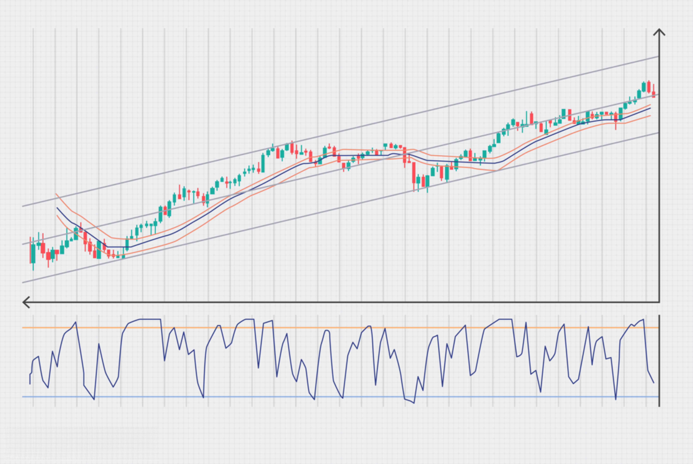

In today’s fast-paced financial environment, algorithmic trading has significantly transformed the Forex landscape by enabling traders to execute complex trading strategies with high precision and efficiency. This approach utilizes computer algorithms to analyze forex market conditions and execute trades, thus minimizing human error and emotional bias. Algorithmic trading empowers traders to capitalize on minute market movements, often unseen by human traders, leveraging these to optimize trading outcomes.

The Australian Dollar (AUD) holds a pivotal role in the Forex markets, being one of the most traded currencies globally. Its status as a 'commodity currency' reflects its close ties with global commodity markets, significantly influencing its value. Understanding the AUD's dynamics within forex trading is essential, as various factors such as economic indicators, commodity prices, and monetary policies deeply affect its performance.



This article aims to explore these influences on the AUD, focusing specifically on algorithmic trading strategies. By comprehending these factors and the methodologies of algorithmic trading, readers can gain a broader perspective on modern Forex trading involving the Australian Dollar. This analysis is vital for traders and financial institutions seeking to navigate the forex markets efficiently while considering the unique characteristics and trends of the AUD.

## Table of Contents

## Understanding the Australian Dollar (AUD)

The Australian Dollar (AUD), known colloquially as the 'Aussie', occupies a significant role in the global foreign exchange (Forex) markets. Before becoming a free-floating currency in 1983, the AUD was pegged to the US dollar. This shift to a floating exchange rate allowed the AUD to be driven by market forces, enhancing its appeal among Forex traders seeking dynamic trading opportunities. The transition facilitated a more accurate reflection of the Australian economy's performance relative to its global counterparts.

As one of the top five most traded currencies globally, the AUD's value is heavily influenced by multiple factors, primarily commodity prices, economic indicators, and monetary policy. Australia's economy is renowned for its rich natural resources, making commodity prices a notable influence on the AUD. Key exports include iron ore, coal, and gold, meaning fluctuations in these commodity markets directly impact the AUD's strength or weakness.

Economic indicators such as GDP growth rates, employment figures, and inflation rates also shape the AUD. The Australian Bureau of Statistics regularly publishes data that offer insights into the health and direction of the economy, influencing market participants' perceptions and subsequent trading decisions.

Monetary policy, as executed by the Reserve Bank of Australia (RBA), plays a critical role in shaping the AUD's trajectory. Changes in interest rates, through adjustments by the RBA, can attract or deter foreign investment, impacting the AUD's value. An increase in interest rates might attract more foreign capital, appreciating the AUD as investors seek higher returns. Conversely, a reduction could lead to depreciation.

In summary, the AUD’s integration into the free float system has rendered it susceptible to both domestic economic developments and global market dynamics. Its deep ties to commodity markets, coupled with the RBA's monetary policies and Australia's economic indicators, collectively determine its position within the Forex markets.

## Factors Influencing the AUD/USD Currency Pair

The AUD/USD currency pair, informally known as the 'Aussie', is shaped by several interrelated factors that reflect Australia's economic landscape and the global financial environment. One of the most significant determinants is the price of commodities, given Australia's position as a leading exporter of raw materials such as iron ore, coal, and gold. Fluctuations in these commodity prices can markedly impact the AUD/USD exchange rate. For instance, an increase in iron ore prices typically boosts the Australian dollar, as it raises the value of Australia's export revenues.

Interest rate differentials also play a critical role in influencing the AUD/USD pair. This involves comparing the interest rates set by the Reserve Bank of Australia (RBA) with those of the US Federal Reserve. A higher [interest rate](/wiki/interest-rate-trading-strategies) in Australia relative to the US makes the Australian dollar more attractive to investors seeking higher returns, potentially increasing demand for the AUD and appreciating its value against the USD.

Political stability is another essential component that affects the AUD/USD exchange rate. Stable governance encourages foreign investment, positively influencing the currency by increasing demand. Conversely, political uncertainty can lead to [volatility](/wiki/volatility-trading-strategies), discouraging investment and potentially depreciating the AUD.

Moreover, global market sentiments significantly affect this currency pair. Forex traders often use the Australian dollar as a proxy for risk appetite due to the country's economic structure heavily relying on commodity exports. Hence, during times of global economic optimism, riskier assets like the AUD tend to appreciate, while in periods of risk aversion, the AUD usually depreciates.

Economic indicators, such as GDP growth rates, employment figures, and inflation rates, are also vital. Positive economic data can boost confidence in the Australian economy, leading to an appreciation of the AUD. Conversely, negative indicators may result in a depreciation.

Fiscal and monetary policies, including government spending and RBA interventions, have further implications. Expansionary fiscal policies often lead to higher inflation, which might result in a depreciating currency unless offset by other factors such as increased economic expansion. Similarly, changes in monetary policy, such as adjustments in the cash rate or unconventional measures like quantitative easing, can influence investor perceptions and the AUD's value.

In essence, the performance of the AUD/USD currency pair is a complex interplay of domestic variables and international influences, where each [factor](/wiki/factor-investing) can have a profound impact on exchange rates.

## Algorithmic Trading in Forex Markets

Algorithmic trading, often referred to as 'algo trading', represents a significant shift in how trading is conducted within Forex markets. This approach employs computer programs to execute trades based on predefined strategies, which brings a host of benefits to traders. By leveraging algorithms, traders can achieve enhanced speed and precision in their operations, effectively reducing human errors and the emotional biases that can often impair manual trading processes.

In Forex markets, speed is of the essence, and [algorithmic trading](/wiki/algorithmic-trading) excels by executing trades at velocities far surpassing human capabilities. Algo trading systems are designed to analyze vast amounts of data in real time, identifying patterns and signals that may indicate lucrative trading opportunities. These systems can automatically execute trades at precisely the right moments, offering a substantial advantage in markets characterized by volatility.

The architecture of these algorithms is built upon mathematical models that evaluate potential trade scenarios. For instance, a basic trading algorithm might involve a simple moving average strategy, where the algorithm buys a currency when its short-term moving average crosses above a long-term moving average and sells when the reverse occurs. More sophisticated algorithms incorporate multiple indicators and are capable of processing live economic data and market news, adjusting their strategies accordingly.

Python, with its rich ecosystem of libraries such as NumPy, pandas, and scikit-learn, is often used for developing and testing algorithmic trading strategies due to its simplicity and robust data manipulation capabilities. For example, a Forex trader might employ a simple Python script to calculate moving averages and identify crossovers:

```python
import pandas as pd

# Load historical Forex data
data = pd.read_csv('forex_data.csv')

# Calculate short and long moving averages
data['Short_MA'] = data['Close'].rolling(window=50).mean()
data['Long_MA'] = data['Close'].rolling(window=200).mean()

# Signal generation
data['Signal'] = 0
data.loc[data['Short_MA'] > data['Long_MA'], 'Signal'] = 1
data.loc[data['Short_MA'] < data['Long_MA'], 'Signal'] = -1

# Display signals
print(data[['Date', 'Signal']].tail())
```

Overall, algorithmic trading represents a powerful tool for Forex traders, enabling them to maintain a competitive edge by harnessing technology to exploit fleeting opportunities in the market. As technological advancements continue, the sophistication and adaptability of trading algorithms are likely to grow, further cementing their indispensable role in modern trading strategies.

## Developing Algo Trading Strategies for AUD/USD

Successful algorithmic trading strategies for trading the AUD/USD pair require an adept combination of technical and [fundamental analysis](/wiki/fundamental-analysis). Technical analysis involves using historical price data to forecast future price movements. Among the technical indicators, moving averages and support and resistance levels are often pivotal.

**Moving Averages:**
Moving averages help smooth out price data by creating a constantly updated average price, providing the trader with a clearer view of the market trend. There are several types of moving averages used in Forex trading, such as the simple moving average (SMA) and the exponential moving average (EMA), each with its own benefits concerning responsiveness and lag.

For instance, a common strategy uses the crossover of two moving averages, such as the 50-day and the 200-day moving averages. When the shorter average crosses above the longer one, it signals a potential buying opportunity, known as a "golden cross." Conversely, a "death cross" indicates a potential sell when the shorter average crosses below the longer.

```python
import pandas as pd
import numpy as np

# Sample pandas DataFrame for prices
data = pd.DataFrame({
    'Price': [93.5, 94.2, 92.8, 93.7, 95.1, 95.6, 96.2, 97.1, 96.8, 97.5]
})

# Calculate moving averages
data['50_SMA'] = data['Price'].rolling(window=50).mean()
data['200_SMA'] = data['Price'].rolling(window=200).mean()

# Identify crossover points
data['Buy_Signal'] = np.where(data['50_SMA'] > data['200_SMA'], 1, 0)
data['Sell_Signal'] = np.where(data['50_SMA'] < data['200_SMA'], -1, 0)
```

**Support and Resistance Levels:**
Support and resistance levels represent price levels at which a currency pair tends to stop and reverse. These levels can be identified by looking for multiple touchpoints of a price level at which the currency pair has repeatedly reversed direction. The idea is to place buy orders at the support levels and sell orders at the resistance levels.

**Fundamental Analysis:**
Fundamental analysis for the AUD/USD pair involves evaluating macroeconomic variables such as interest rates, GDP growth rates, and employment figures, as well as geopolitical events that could impact the Australian Dollar. An algorithm might monitor real-time news feeds or economic calendars to react to announcements, adapting quickly to fluctuations driven by these fundamental factors.

**Backtesting:**
Before implementing an algorithmic strategy, [backtesting](/wiki/backtesting) against historical data is crucial to evaluate its potential performance and robustness. This involves simulating the trading strategy on past data to confirm its effectiveness. A well-designed backtesting process uses statistical analysis to ensure that the strategy can perform well across different market conditions, not just in a specific historical scenario.

The backtesting framework provides a clear idea of the strategy's expected win rate, average profit and loss, and drawdowns, ensuring it meets the trader's risk management criteria before executing live trades.

```python
# Example of a simple backtesting framework
def backtest_strategy(data):
    data['Strategy_Returns'] = data['Price'].pct_change() * data['Buy_Signal'].shift(1)
    total_return = data['Strategy_Returns'].cumsum()[-1]
    return total_return

print("Strategy Total Return:", backtest_strategy(data))
```

Developing a successful algorithmic trading strategy involves continuous refinement through both technical indicators and fundamental insights, alongside rigorous backtesting processes to verify its efficacy.

## Challenges of Algorithmic Trading

Algorithmic trading in the Forex markets presents several challenges that traders need to address to ensure effective operation and profitability. One of the primary concerns is data accuracy. High-quality, accurate data is crucial for the development and implementation of algorithmic strategies. Inaccurate or delayed data can lead to incorrect decisions and significant financial losses. Therefore, traders must source reliable data feeds and verify the integrity of the data being used in their algorithms.

Algorithm malfunction is another critical issue. Algorithms, being complex sets of rules and calculations, can fail due to coding errors, incorrect assumptions, or unforeseen market conditions. This can result in unintended trading behaviors, like executing trades too quickly or missing trades altogether, which can be costly. To mitigate these risks, thorough testing and debugging of algorithms are essential before live deployment. Regular updates and maintenance can help ensure that algorithms remain effective as market conditions evolve.

Market [liquidity](/wiki/liquidity-risk-premium) also significantly impacts the performance of algorithmic trading strategies. In low liquidity scenarios, algorithms may have a hard time executing trades at desired prices, leading to slippage, where the actual trading price deviates from the expected price. This challenge necessitates the development of liquidity-sensitive strategies that can adapt to changing market depths and ensure efficient trade execution.

Furthermore, the complexity of algorithms necessitates continuous monitoring and optimization. Algorithms must be fine-tuned to adapt to new data patterns and market trends. This process requires a solid understanding of both technical and fundamental aspects of the market, as well as the capability to iteratively refine the algorithm for enhanced performance.

Another challenge is over-optimization, commonly known as curve fitting. This occurs when an algorithm is excessively tailored to past data, resulting in high performance on historical backtests but poor results in live trading. Over-optimized strategies often fail to predict future market movements accurately. To counteract this, traders should incorporate robust validation techniques, such as out-of-sample testing and cross-validation, to ensure that their models generalize well to unseen data.

In summary, while algorithmic trading offers numerous advantages, these challenges highlight the importance of rigorous preparation and ongoing management. Addressing issues related to data accuracy, algorithm reliability, market liquidity, and over-optimization is critical for maintaining the viability and success of algorithmic strategies in the dynamic Forex market.

## Future Trends in Forex Algo Trading

The future of algorithmic trading in Forex markets is poised for significant evolution, driven primarily by advancements in [artificial intelligence](/wiki/ai-artificial-intelligence) (AI) and [machine learning](/wiki/machine-learning). These technological innovations are transforming how trading strategies are developed and executed, offering the potential for creating algorithms that adapt more dynamically to market conditions. 

AI and machine learning enable the processing and analysis of vast amounts of market data far beyond human capabilities. By leveraging these technologies, algorithms can identify complex patterns and correlations that were previously unnoticed, enhancing the precision and effectiveness of trading strategies. Machine learning models, such as neural networks, can be trained to recognize shifts in market dynamics and adjust trading algorithms accordingly, leading to more profitable and resilient outcomes. For instance, [reinforcement learning](/wiki/reinforcement-learning), a type of machine learning, allows algorithms to learn optimal strategies through trial and error in a simulated environment, mimicking real trading scenarios.

```python
import numpy as np
from sklearn.linear_model import LinearRegression
# Hypothetical example of using linear regression to predict currency movements
# Historical exchange rate data
X = np.array([[1], [2], [3], [4], [5]])
y = np.array([1.1, 1.9, 2.8, 4.1, 5.2])

# Fit the model
model = LinearRegression().fit(X, y)

# Predict future values
future_value = model.predict(np.array([[6]]))
```

As AI-driven strategies become prevalent, transparency and regulation in Forex markets are receiving heightened attention. Greater transparency helps build trust among traders, ensuring that algorithmic strategies operate without unfair advantages or manipulation. Enhanced regulatory frameworks also aim to protect the integrity of Forex markets by standardizing practices and reducing the risk of potential market abuse.

The increasing adoption of blockchain technology could further improve transparency in algorithmic trading. Blockchain's immutable ledger can provide auditable records of trading activities, fostering accountability and encouraging more ethical trading practices.

As technology advances and regulatory landscapes evolve, algorithmic trading is expected to become more popular, facilitating a more sophisticated trading environment. Traders and institutions that harness these developments will likely enjoy a competitive advantage, as adaptive algorithms offer the promise of greater efficiency and improved risk management in Forex markets.

## Conclusion

The convergence of the Australian Dollar's unique market circumstances with sophisticated algorithmic trading presents traders with intriguing opportunities in the Forex markets. By understanding the factors influencing the AUD, such as commodity prices and monetary policies, and by effectively harnessing algorithmic trading strategies, traders can navigate these markets with increased confidence. Algorithmic trading allows for the execution of trades with precision and speed, minimizing human errors and capitalizing on market opportunities that manual trading might miss.

Algorithmic trading strategies for the AUD/USD currency pair leverage both technical indicators and fundamental data. Technical indicators, like moving averages and support/resistance levels, help identify trading signals, while fundamental analysis considers macroeconomic data and geopolitical events influencing the currency pair. The synergy between technical and fundamental analysis heightens the efficacy of these strategies, offering traders a robust framework for decision-making.

As technology continues to evolve, embracing advances in areas like artificial intelligence and machine learning becomes increasingly crucial. These technologies enhance trading algorithms, enabling them to learn from market conditions and adapt trading strategies accordingly. The adoption of such sophisticated technologies can lead to more adaptive trading systems capable of achieving higher levels of performance.

Furthermore, as transparency and regulation in Forex markets improve, the appeal of algorithmic trading is expected to increase, potentially attracting more participants to this advanced trading approach. Traders who integrate these technological advancements into their operations not only gain a competitive edge but also position themselves favorably in the evolving landscape of Forex trading. 

Therefore, understanding the Australian Dollar's influencing factors and employing algorithmic trading strategies are essential steps for traders aiming to optimize their performance and maintain competitiveness in the dynamic Forex markets. As the technological landscape progresses, adopting these advances will be indispensable for traders seeking to thrive in future markets.

## References & Further Reading

[1]: Bergstra, J., Bardenet, R., Bengio, Y., & Kégl, B. (2011). ["Algorithms for Hyper-Parameter Optimization."](https://dl.acm.org/doi/10.5555/2986459.2986743) Advances in Neural Information Processing Systems 24.

[2]: ["Advances in Financial Machine Learning"](https://www.amazon.com/Advances-Financial-Machine-Learning-Marcos/dp/1119482089) by Marcos Lopez de Prado

[3]: ["Evidence-Based Technical Analysis: Applying the Scientific Method and Statistical Inference to Trading Signals"](https://www.amazon.com/Evidence-Based-Technical-Analysis-Scientific-Statistical/dp/0470008741) by David Aronson

[4]: ["Machine Learning for Algorithmic Trading"](https://github.com/stefan-jansen/machine-learning-for-trading) by Stefan Jansen

[5]: ["Quantitative Trading: How to Build Your Own Algorithmic Trading Business"](https://www.amazon.com/Quantitative-Trading-Build-Algorithmic-Business/dp/1119800064) by Ernest P. Chan