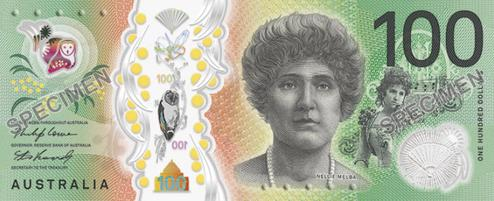

## Table of Contents

## What is the Australian Dollar (AUD) and why is it important in forex trading?

The Australian Dollar (AUD) is the official currency of Australia. It is used every day by people in Australia to buy things like food, clothes, and other goods. The AUD is also used in forex trading, which is when people buy and sell different currencies from around the world. The AUD is one of the major currencies in forex trading, along with currencies like the US Dollar, the Euro, and the Japanese Yen.

The AUD is important in forex trading because it is considered a commodity currency. This means its value can be affected by the prices of things like gold, iron ore, and other resources that Australia has a lot of. When these commodity prices go up, the AUD often goes up too. Traders watch the AUD closely because it can tell them about the health of the Australian economy and the global demand for commodities. This makes the AUD an important part of many trading strategies.

## How does the AUD compare to other major currencies in the forex market?

The Australian Dollar (AUD) is one of the major currencies in the forex market, but it's not as big as the US Dollar (USD) or the Euro (EUR). The USD and EUR are traded a lot more because they are used in more countries and more people use them for buying and selling things. The AUD is still important, though, because it is the fifth most traded currency in the world. It's often traded against the USD, making the AUD/USD pair one of the most popular in forex trading.

Compared to other major currencies like the Japanese Yen (JPY) and the British Pound (GBP), the AUD can be more volatile. This means its value can go up and down more quickly. This is because the AUD is closely tied to commodity prices, like gold and iron ore. When these prices change, the AUD can change a lot too. Traders who like to take risks might like trading the AUD because of this, but it can also be riskier than trading more stable currencies like the JPY.

## What are the key economic indicators that affect the value of the AUD?

The value of the Australian Dollar (AUD) is influenced by several key economic indicators. One important indicator is the price of commodities like gold, iron ore, and coal. Australia has a lot of these resources, so when their prices go up, the AUD often goes up too. Another key indicator is the [interest rate](/wiki/interest-rate-trading-strategies) set by the Reserve Bank of Australia (RBA). When the RBA raises interest rates, it can make the AUD more attractive to investors looking for better returns, which can increase its value.

Other important indicators include Australia's Gross Domestic Product (GDP), which shows how well the economy is doing. If GDP growth is strong, the AUD might go up because it shows the economy is healthy. The unemployment rate is also a big [factor](/wiki/factor-investing). If fewer people are out of work, it's a good sign for the economy, and this can help the AUD. Finally, trade balance data, which shows the difference between what Australia exports and imports, can affect the AUD. If Australia exports more than it imports, it's good for the AUD because it means more foreign money is coming into the country.

## How does the Reserve Bank of Australia (RBA) influence the AUD through monetary policy?

The Reserve Bank of Australia (RBA) influences the value of the Australian Dollar (AUD) mainly through its monetary policy, which includes setting interest rates. When the RBA decides to raise interest rates, it makes saving money in Australia more attractive because people can earn more interest. This can attract foreign investors who want to take advantage of the higher rates, which increases the demand for the AUD and can cause its value to go up. On the other hand, if the RBA lowers interest rates, it makes saving less attractive, and foreign investors might move their money to other countries with better returns, which can cause the AUD to go down.

The RBA also uses other tools like open market operations, where it buys or sells government bonds to control the amount of money in the economy. If the RBA wants to increase the money supply, it might buy bonds, which puts more money into circulation and can lead to lower interest rates and a weaker AUD. If it wants to decrease the money supply, it might sell bonds, which takes money out of circulation and can lead to higher interest rates and a stronger AUD. By using these tools, the RBA can influence economic conditions and, in turn, the value of the AUD.

## What role does Australia's commodity exports play in the forex value of the AUD?

Australia's commodity exports are really important for the value of the Australian Dollar (AUD) in the [forex](/wiki/forex-system) market. Australia has a lot of natural resources like gold, iron ore, and coal, which it sells to other countries. When the prices of these commodities go up, it's good for the AUD. This is because when other countries buy these resources, they need to use their own money to buy AUD first. So, more demand for AUD means its value goes up.

On the other hand, if the prices of these commodities go down, it can make the AUD weaker. When commodity prices drop, other countries might not want to buy as much from Australia. This means less demand for the AUD, and its value can go down. Traders in the forex market watch these commodity prices closely because they can tell them a lot about what might happen to the AUD.

## How can beginners start trading the AUD in the forex market?

If you're a beginner and want to start trading the Australian Dollar (AUD) in the forex market, the first thing you should do is find a good online forex broker. A broker is like a helper who lets you buy and sell currencies. Look for a broker that is easy to use and has low fees. Once you've picked a broker, you'll need to open an account with them. This usually involves filling out some forms and putting some money into your account.

After you have your account set up, you can start trading the AUD. It's a good idea to start small and learn as you go. Many brokers offer practice accounts where you can trade with pretend money. This is a great way to get used to how trading works without losing real money. When you're ready to trade for real, you can start with the AUD/USD pair, which is very popular. Remember, the value of the AUD can go up and down, so it's important to keep learning and be careful with your money.

## What are the common trading strategies used specifically for the AUD?

One common strategy for trading the AUD is called the [carry](/wiki/carry-trading) trade. This means borrowing money in a currency with low interest rates, like the Japanese Yen, and then using that money to buy AUD, which often has higher interest rates. The idea is to make money from the difference in interest rates. But, this strategy can be risky because if the AUD goes down in value compared to the Yen, you might lose more than you gain from the interest.

Another strategy is to watch commodity prices, especially those of gold and iron ore, because Australia exports a lot of these. When these prices go up, the AUD often goes up too. Traders might buy AUD when they think commodity prices will rise and sell it when they think those prices will fall. This strategy needs you to keep an eye on news about commodity markets and understand how it might affect the AUD.

A third strategy is to follow economic news from Australia, like interest rate decisions from the Reserve Bank of Australia or employment data. If the news is good, like lower unemployment or higher interest rates, the AUD might go up. Traders using this strategy will buy AUD when they think good news is coming and sell it when they think bad news might come. This strategy needs you to stay updated with economic news and understand how it can move the AUD.

## How do geopolitical events impact the AUD, and what should traders watch for?

Geopolitical events can have a big impact on the Australian Dollar (AUD) because they can change how other countries see Australia and its economy. For example, if there's a lot of tension between Australia and one of its big trading partners, like China, it might make people worried about Australia's exports. Since Australia sells a lot of things like iron ore and coal to other countries, if there's less demand for these things because of geopolitical problems, the AUD could go down. Also, if there's a global crisis, like a war or a big political change somewhere else in the world, it can make investors feel unsure and they might move their money to safer places, which can also make the AUD weaker.

Traders should watch for news about relationships between Australia and its big trading partners, like China or the United States. They should also keep an eye on any big changes happening in the world, like elections or conflicts, because these can shake up the global economy and affect the AUD. It's a good idea to stay updated with the news and understand how these events might make people feel about investing in Australia. By paying attention to these things, traders can make better guesses about what might happen to the AUD and plan their trades accordingly.

## What are the typical AUD currency pairs and their characteristics?

The most common AUD currency pair is AUD/USD, which means the Australian Dollar against the US Dollar. This pair is very popular because both countries have big economies and a lot of trade happens between them. The AUD/USD pair can move a lot because the AUD is affected by commodity prices like gold and iron ore, while the USD is influenced by things like US interest rates and economic data. Traders watch this pair closely because it can show what's happening in both the Australian and the US economies.

Another important pair is AUD/JPY, which is the Australian Dollar against the Japanese Yen. This pair is often used in carry trades, where traders borrow money in Japan, where interest rates are usually low, and use it to buy AUD, which often has higher interest rates. This can be a good way to make money from the difference in interest rates, but it's also risky because if the AUD goes down against the Yen, traders could lose money. The AUD/JPY pair can be more volatile than others because it combines the commodity-driven nature of the AUD with the safe-haven status of the Yen.

A third common pair is AUD/EUR, which is the Australian Dollar against the Euro. This pair is influenced by the economic health of both Australia and the Eurozone. The AUD/EUR pair can be affected by commodity prices on the AUD side and by economic news from countries like Germany and France on the EUR side. Traders who trade this pair need to keep an eye on both regions to understand what might happen to the exchange rate.

## How does the AUD behave during different global economic cycles?

During times when the global economy is growing, the Australian Dollar (AUD) often does well. This is because Australia sells a lot of things like iron ore and coal to other countries. When the world economy is strong, more countries want to buy these things, which means more people need to buy AUD to pay for them. This makes the AUD go up in value. Also, during good economic times, the Reserve Bank of Australia might raise interest rates to keep the economy from growing too fast. Higher interest rates can make the AUD more attractive to investors looking for better returns, which can also help the AUD go up.

On the other hand, when the global economy is not doing well, the AUD can go down. If other countries are not buying as much from Australia because their economies are struggling, there's less demand for the AUD. This can make its value go down. Also, during bad economic times, the Reserve Bank of Australia might lower interest rates to help the economy, which can make the AUD less attractive to investors. So, the AUD can be more volatile during these times because it's closely tied to what's happening in the world economy.

## What advanced technical analysis tools are effective for trading the AUD?

When trading the Australian Dollar (AUD), one effective advanced technical analysis tool is the use of moving averages. Traders often use two types of moving averages: the simple moving average (SMA) and the exponential moving average (EMA). The SMA gives you a smooth line that shows the average price over a certain period, like 50 or 200 days. The EMA is similar but puts more weight on recent prices, making it react faster to new trends. Traders might look for a "golden cross," where a short-term moving average crosses above a long-term one, as a sign to buy AUD, or a "death cross," where it crosses below, as a sign to sell. These signals can help traders spot trends and make better decisions.

Another useful tool is the Relative Strength Index (RSI), which measures how fast and how much prices are changing to see if a currency is overbought or oversold. The RSI ranges from 0 to 100. If the RSI goes above 70, it might mean the AUD is overbought and could go down soon, so traders might sell. If it drops below 30, it might mean the AUD is oversold and could go up, so traders might buy. Using the RSI can help traders figure out when the AUD might be ready for a price change. Combining RSI with moving averages can give traders a clearer picture of what might happen next with the AUD.

## How can expert traders use options and futures to hedge or speculate on the AUD?

Expert traders can use options to hedge or speculate on the Australian Dollar (AUD) by buying or selling contracts that give them the right, but not the obligation, to buy or sell AUD at a set price before a certain date. For hedging, if a trader thinks the AUD might go down, they can buy a put option, which lets them sell AUD at a higher price than the market if it drops. This can protect them from losing money if the AUD falls. For speculation, if a trader thinks the AUD will go up, they can buy a call option, which lets them buy AUD at a lower price than the market if it rises. This way, they can make money if the AUD goes up without having to buy the AUD itself right away.

Futures are another way expert traders can hedge or speculate on the AUD. A futures contract is an agreement to buy or sell AUD at a set price on a future date. For hedging, if a trader is worried the AUD will go down, they can sell a futures contract, locking in a higher price to sell AUD later. This can help them avoid losses if the AUD falls. For speculation, if a trader thinks the AUD will go up, they can buy a futures contract, agreeing to buy AUD at a lower price in the future. If the AUD rises, they can buy it at the lower price and then sell it at the higher market price, making a profit. Both options and futures can be complex, so it's important for traders to understand them well before using them.

## References & Further Reading

[1]: ["Advances in Financial Machine Learning"](https://www.amazon.com/Advances-Financial-Machine-Learning-Marcos/dp/1119482089) by Marcos Lopez de Prado

[2]: ["Machine Learning for Algorithmic Trading"](https://github.com/stefan-jansen/machine-learning-for-trading) by Stefan Jansen

[3]: ["Quantitative Trading: How to Build Your Own Algorithmic Trading Business"](https://github.com/LucindaYa/quant-resources/blob/master/Quantitative%20Trading%20How%20to%20Build%20Your%20Own%20Algorithmic%20Trading%20Business.pdf) by Ernest P. Chan

[4]: ["Evidence-Based Technical Analysis: Applying the Scientific Method and Statistical Inference to Trading Signals"](https://www.amazon.com/Evidence-Based-Technical-Analysis-Scientific-Statistical/dp/0470008741) by David Aronson

[5]: Bergstra, J., Bardenet, R., Bengio, Y., & Kégl, B. (2011). ["Algorithms for Hyper-Parameter Optimization."](https://dl.acm.org/doi/10.5555/2986459.2986743) Advances in Neural Information Processing Systems 24.