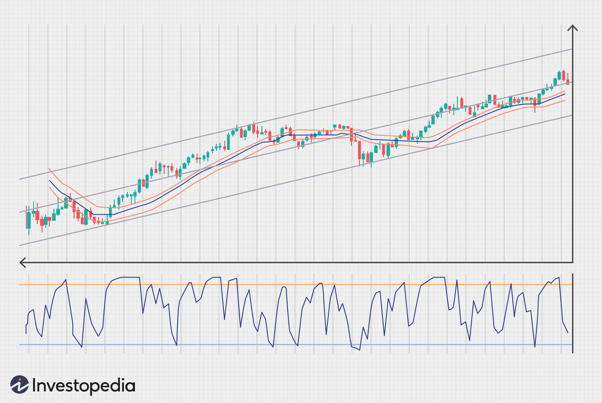

Forex trading represents a dynamic financial activity where currencies are exchanged against one another. Within this vast marketplace, the Australian Dollar (AUD) holds a prominent position, recognized as one of the major currencies actively traded. This can be attributed to Australia's strong economic foundations and its integral role in global trade, particularly in the commodities sector.

The advancement of technology has significantly transformed trading methodologies, with algorithmic trading, or algo trading, being a pivotal innovation. Algo trading has fundamentally altered the forex landscape by employing complex algorithms and computational power to execute trades. This method allows for analyzing vast datasets at unprecedented speeds, enabling traders to gain a competitive advantage by responding to market movements almost instantaneously.

Exploring the intersection of forex trading and algorithmic trading within the context of the AUD market offers a rich area of study for both novice and experienced traders. Understanding the intricate processes and strategies underlying these concepts is crucial for trading success. As the market continually evolves, keeping pace with these technological advancements and market trends remains imperative for those looking to capitalize on the opportunities present in today's forex trading environment.

## Table of Contents

## Understanding the Forex Market

The forex market, also known as the foreign exchange market, is the largest and most liquid financial market globally, with a daily trading volume exceeding $6 trillion. It operates on a decentralized basis, meaning that trading is conducted electronically over-the-counter (OTC) rather than on a centralized exchange. Forex trading fundamentally involves the exchange of one currency for another at an agreed-upon price. This trading activity is driven by the fluctuations in the exchange rates, allowing traders to capitalize on the differential movements in currency values.

In forex trading, transactions occur in currency pairs, such as EUR/USD or AUD/JPY, where the first currency is known as the base currency, and the second as the quote currency. The exchange rate represents how much of the quote currency is needed to purchase one unit of the base currency. Traders aim to profit from the changes in exchange rates, which are influenced by various factors, including economic indicators, geopolitical events, and market sentiment.

The forex market operates 24 hours a day, five days a week, thanks to its global nature, with major trading centers located in financial hubs like London, New York, Tokyo, and Sydney. This continuous operation is facilitated by overlapping trading sessions, ensuring liquidity at almost any time of day.

Participants in the [forex](/wiki/forex-system) market include a wide range of entities, from large financial institutions such as banks and hedge funds to individual retail traders. Banks and financial institutions account for a significant portion of the market's trading [volume](/wiki/volume-trading-strategy), engaging in both speculative and hedging activities. Corporations participate primarily to hedge against foreign exchange exposure related to international business operations. Meanwhile, individual retail traders, equipped with online trading platforms and improved access to market data, increasingly contribute to the market's dynamism.

Forex trading strategies vary widely, from [fundamental analysis](/wiki/fundamental-analysis) focusing on macroeconomic indicators to technical analysis employing chart patterns and indicators. Regardless of the approach, the ability to respond swiftly to market changes is crucial for success in the forex market, given its high [volatility](/wiki/volatility-trading-strategies) and rapid price movements.

## The Significance of the Australian Dollar in Forex Trading

The Australian Dollar (AUD) holds a significant position in the forex trading market, where it ranks as the fifth most traded currency globally. This prominence arises from several critical factors linked to Australia's economic structure and global ties. 

Australia's economy is one of the most robust and stable in the world, primarily due to its abundant natural resources, including coal, iron ore, gold, and natural gas. These commodities not only form a substantial part of Australia's export revenues but also tie the AUD to global commodity price fluctuations. Consequently, the Australian Dollar often reflects changes in global demand for these resources, making it a barometer for global economic health. This relationship makes the AUD a favorite among traders looking to hedge against or speculate on global economic conditions.

Political stability further bolsters the attractiveness of the Australian Dollar. Australia's stable governance and regulatory transparency provide confidence to investors and traders, ensuring the AUD remains a reliable currency in volatile markets. Furthermore, Australia's strategic trade relationships, especially with key economies like China and the United States, enhance its currency's [liquidity](/wiki/liquidity-risk-premium) and market depth.

Several factors directly impact the AUD's value. Commodity price changes can lead to significant currency fluctuations. For instance, a rise in iron ore prices can increase the AUD's value, reflecting higher revenue expectations from exports. Economic data releases, including GDP growth, employment figures, and trade balances, also influence the currency's movements by providing insights into the country's economic health. Additionally, the Reserve Bank of Australia's monetary policies, such as [interest rate](/wiki/interest-rate-trading-strategies) adjustments, can have immediate effects on forex trading activities involving the AUD.

Traders seeking to capitalize on the AUD's movements must remain vigilant about these economic indicators and international factors. By understanding and anticipating how these variables influence the Australian Dollar, traders can make informed decisions and potentially leverage their trading strategies for optimized returns.

## Exploring Algorithmic Trading in Forex

Algorithmic trading, often referred to as algo trading, utilizes computer programs to execute trades based on well-defined criteria. This approach enables the processing of vast amounts of data rapidly, offering traders significant competitive advantages in the fast-paced forex market.

One of the primary benefits of [algorithmic trading](/wiki/algorithmic-trading) in forex is its ability to handle and analyze large datasets at high speed. This capacity allows traders to identify and exploit opportunities that may be missed with traditional manual trading methods. Algorithmic trading can execute trades with precision and timing that human traders cannot achieve. This is crucial in the forex market, where slight price movements can lead to sizeable financial gains or losses.

Several strategies are employed in algorithmic trading. Trend following is a common strategy, where algorithms are designed to identify and capitalize on established currency pairs' patterns. Market making involves simultaneously posting buy and sell orders to capture spreads in the market, enhancing liquidity. Statistical [arbitrage](/wiki/arbitrage) takes advantage of pricing inefficiencies between related currency pairs, employing complex quantitative models to identify potential profitable trades.

The proliferation of algorithmic trading in the forex market has resulted in increased liquidity, as algorithms can execute high volumes of trades rapidly. This improved liquidity often corresponds with reduced transaction costs, benefiting traders by allowing them to enter and [exit](/wiki/exit-strategy) positions with minimal slippage.

Despite the advantages, algo trading's complexity necessitates meticulous testing and risk management. Strategies must be rigorously backtested on historical data to ensure their robustness under various market conditions. Additionally, risk management mechanisms are vital to prevent significant losses from unforeseen market events or algorithmic malfunctions. 

In summary, algorithmic trading has transformed the forex market, enhancing both efficiency and liquidity. However, the success of such trading systems heavily depends on the precise design and thorough testing of the algorithms, emphasizing the need for expertise and robust risk management practices.

## Strategies for Trading the Australian Dollar with Algorithms

Traders use algorithmic strategies to capitalize on the movements of the Australian Dollar (AUD), leveraging technology to make informed decisions swiftly and accurately. 

One popular approach is trend-following, which aims to profit from identifiable patterns in currency price movements. This strategy involves identifying and exploiting sustained directional price movements, often using technical indicators such as moving averages, the Relative Strength Index (RSI), or the Moving Average Convergence Divergence (MACD). For instance, a trader might use a moving average crossover strategy, where a short-term moving average crossing above a long-term moving average signals a potential buy opportunity.

High-frequency trading ([HFT](/wiki/high-frequency-trading-strategies)) is another strategy, exploiting small pricing inefficiencies that occur momentarily. HFT algorithms are programmed to execute a large number of orders at extremely fast speeds, often in milliseconds. These algorithms analyze market data and execute trades based on pre-set conditions, providing substantial liquidity and reducing bid-ask spreads for the currency pair.

Mean-reversion strategy is based on the statistical theory that currency prices will revert to their historical average over time. Traders identify deviations from the average, placing trades that bet on the price moving back to the mean. This strategy often involves calculating a currency's historical average price over a specific period and trading based on deviations from this average.

News-based algorithms react swiftly to global economic announcements that could impact the AUD. These algorithms monitor various news feeds and economic indicators, executing trades based on sentiment analysis or keyword recognition. For example, an algorithm might be designed to initiate a sell order for the AUD/USD pair if a negative GDP report for Australia is released, predicting a likely depreciation of the Australian Dollar due to the unfavorable economic data.

These algorithmic strategies not only enhance the precision and timing of trade execution but also allow traders to manage large datasets effectively, adapting to rapid market changes and optimizing their trading performance.

## Advantages and Challenges of Algo Trading in Forex

Algorithmic trading, or algo trading, in the Forex market stands out for its ability to significantly enhance the trading process. One of its primary advantages is the elimination of emotional biases in trading decisions. By utilizing preset rules and strategies, algorithms ensure that trades are executed based purely on objective criteria, thus potentially increasing profitability and consistency in outcomes.

Another crucial advantage is the capacity for the algorithm to operate 24/7. Given the global nature of the forex market, which spans multiple time zones and operates continuously throughout the week, this capability allows traders to seize opportunities at any time without needing constant manual intervention. Consequently, it maximizes the potential for profit by allowing traders to engage in the market round-the-clock.

Speed and accuracy are also markedly improved with algo trading. Algorithms can process and analyze vast datasets in fractions of a second, identifying and acting on trading signals far more swiftly than a human trader could. This rapid decision-making is particularly beneficial in high-frequency trading (HFT), where executing trades a split second faster than competitors can yield significant advantages.

However, algo trading comes with its set of challenges. A major concern is the risk of over-optimization, which occurs when an algorithm is too finely tuned to historical data, known as "curve fitting." Such systems may perform exceptionally well on past data but might fail to adapt to future market conditions, leading to poor performance and potential losses.

Regulatory considerations present another layer of complexity. Given that algo trading can impact market dynamics considerably, traders must ensure compliance with financial regulations which are continually evolving. Adherence to these legal standards is vital to maintain market integrity and avoid penalties.

Technological failures also pose significant risks. Dependence on complex software and trading platforms means that any system malfunction, such as hardware failures, network outages, or software bugs, can result in substantial financial losses. Therefore, robust risk management strategies, including fail-safes and backup systems, are essential to mitigate these risks and ensure seamless trading operations.

## Conclusion

The integration of algorithmic trading in the Forex market, particularly with the Australian Dollar (AUD), offers significant opportunities for traders. As technology advances, algorithmic trading is expected to become increasingly sophisticated and more prevalent in the market. This presents both opportunities and challenges for traders who must adapt to the rapidly changing landscape.

A successful algorithmic trader needs a comprehensive understanding of forex market dynamics and the algorithms utilized. This dual knowledge enables traders to create strategies that efficiently harness the power of computational trading. The development of robust trading systems requires not only technical skills in programming and data analysis but also insight into economic indicators and geopolitical events that can impact currency values.

For those aspiring to leverage algorithmic trading, investment in education and appropriate tools is essential. This includes programming skills in languages like Python, which is widely used for developing and [backtesting](/wiki/backtesting) trading strategies. Access to high-quality historical data and simulation tools allows traders to optimize and test their strategies thoroughly before deploying them in live market conditions.

Staying informed about market trends and technological innovations is crucial for traders seeking to position themselves effectively. This involves keeping up with the latest developments in financial technologies and regulatory frameworks, as well as understanding how global events can influence currency markets. By maintaining a continuous learning mindset and adapting to new tools and methods, traders can improve their competitive edge and enhance their trading performance in the forex market. 

Overall, the confluence of technology and trading in the forex market represents a dynamic and exciting landscape where informed and prepared traders can find success.

## References & Further Reading

[1]: ["Advances in Financial Machine Learning"](https://www.amazon.com/Advances-Financial-Machine-Learning-Marcos/dp/1119482089) by Marcos Lopez de Prado

[2]: ["Machine Learning for Algorithmic Trading"](https://github.com/stefan-jansen/machine-learning-for-trading) by Stefan Jansen

[3]: ["Quantitative Trading: How to Build Your Own Algorithmic Trading Business"](https://github.com/LucindaYa/quant-resources/blob/master/Quantitative%20Trading%20How%20to%20Build%20Your%20Own%20Algorithmic%20Trading%20Business.pdf) by Ernest P. Chan

[4]: ["Evidence-Based Technical Analysis: Applying the Scientific Method and Statistical Inference to Trading Signals"](https://www.amazon.com/Evidence-Based-Technical-Analysis-Scientific-Statistical/dp/0470008741) by David Aronson

[5]: Bergstra, J., Bardenet, R., Bengio, Y., & Kégl, B. (2011). ["Algorithms for Hyper-Parameter Optimization."](https://dl.acm.org/doi/10.5555/2986459.2986743) Advances in Neural Information Processing Systems 24.