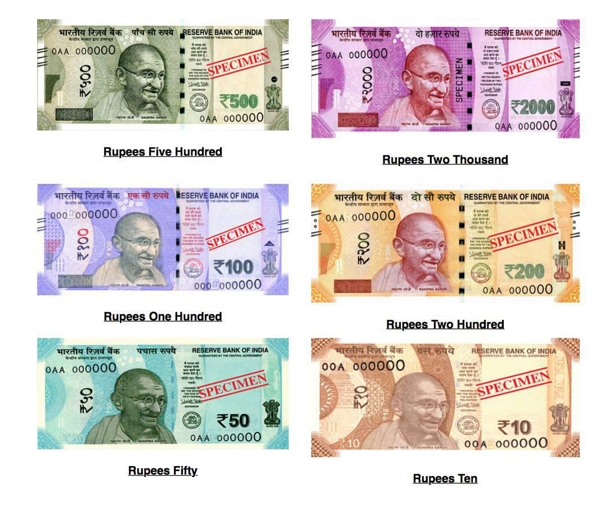

## Table of Contents

## What is the Australian Dollar and what is its symbol?

The Australian Dollar is the official currency of Australia. It is used every day by people in Australia to buy things like food, clothes, and other goods. The Australian Dollar is also used in some other places like Christmas Island, Cocos (Keeling) Islands, and Norfolk Island.

The symbol for the Australian Dollar is a capital letter "A" with a vertical line through it, which looks like this: $. But to tell it apart from the US Dollar, it is often written as "AUD" or with the symbol "A$" before the amount. So, if you see "A$50", it means fifty Australian Dollars.

## How is the Australian Dollar used within Australia?

In Australia, people use the Australian Dollar to buy things they need every day. When someone goes to a shop, they might use Australian Dollars to buy food, clothes, or toys. People can use cash, which are the physical Australian Dollar notes and coins, or they can use cards and online banking which take money directly from their Australian Dollar bank account. Sometimes, people also use the Australian Dollar to pay for services like haircuts or to ride buses and trains.

Businesses in Australia also use the Australian Dollar. When a store sells something, they receive Australian Dollars as payment. They use this money to buy more things to sell or to pay their workers. The government uses Australian Dollars to pay for things like building roads and schools. The Australian Dollar is important for everyone in Australia because it helps them buy what they need and helps the country's economy work smoothly.

## What is the history of the Australian Dollar?

The Australian Dollar, or AUD, started being used on February 14, 1966. Before that, Australia used the Australian pound. The change to the Australian Dollar was part of a big change called decimalisation. This meant that instead of using pounds, shillings, and pence, Australia would use dollars and cents. This made money easier to use because everything was based on tens, like 100 cents in a dollar. The first Australian Dollar coins and notes had pictures of important Australian people and places on them.

Over the years, the Australian Dollar has changed a bit. New coins and notes were made to stop people from copying them easily. In 1984, Australia was one of the first countries to use a special kind of plastic for their banknotes instead of paper. This made the notes last longer and harder to fake. The designs on the notes also changed to show more of Australia's history and culture. Today, the Australian Dollar is used all over Australia and some nearby places, and it's an important part of how the country's money works.

## Who issues the Australian Dollar and what is the role of the Reserve Bank of Australia?

The Australian Dollar is issued by the Reserve Bank of Australia (RBA). The RBA is like a big bank that looks after all the money in Australia. It decides how many Australian Dollars should be made and when new ones should be printed or old ones taken away. The RBA also makes sure that the money is safe and hard to copy.

The role of the Reserve Bank of Australia is very important. It helps to keep the country's money stable so that prices don't go up too fast. The RBA does this by setting something called the interest rate, which is what banks charge people to borrow money. They also watch over the banks to make sure they are doing a good job. This helps the whole country's money system work well and helps people trust that their money is safe.

## What are the different denominations of Australian Dollar banknotes and coins?

The Australian Dollar has banknotes in different amounts: 5 dollars, 10 dollars, 20 dollars, 50 dollars, and 100 dollars. Each note has a different color and pictures on it. The 5 dollar note is pink, the 10 dollar note is blue, the 20 dollar note is red, the 50 dollar note is yellow, and the 100 dollar note is green. These notes show important Australian people and places, like the Parliament House on the 5 dollar note and the Great Victoria Desert on the 10 dollar note.

Australian coins come in different sizes and amounts too: 5 cents, 10 cents, 20 cents, 50 cents, 1 dollar, and 2 dollars. The 5 cent coin is silver and has an echidna on it. The 10 cent coin is also silver and shows a lyrebird. The 20 cent coin, which is silver too, has a platypus. The 50 cent coin is bigger and has the Australian Coat of Arms. The 1 dollar coin is gold and has five kangaroos on it, while the 2 dollar coin is gold too and shows an Aboriginal elder. All these coins help people buy things every day in Australia.

## How does the value of the Australian Dollar fluctuate against other major currencies?

The value of the Australian Dollar (AUD) goes up and down compared to other major currencies like the US Dollar (USD), the Euro (EUR), and the Japanese Yen (JPY). This happens because many things can affect how much one currency is worth compared to another. For example, if Australia's economy is doing well and people want to buy more Australian things, the AUD might go up in value. But if the economy is not doing so well, or if other countries' economies are doing better, the AUD might go down. Also, the price of things Australia sells a lot of, like iron ore and coal, can change how much the AUD is worth.

The Reserve Bank of Australia (RBA) can also affect the AUD's value. They do this by changing the interest rate, which is what banks charge people to borrow money. If the RBA raises the interest rate, it can make the AUD more attractive to people from other countries because they can get a better return on their money. On the other hand, if the RBA lowers the interest rate, the AUD might become less attractive, and its value could go down. Other big events, like changes in global trade or big news stories, can also make the AUD move up or down quickly against other currencies.

## What economic factors influence the value of the Australian Dollar?

The value of the Australian Dollar (AUD) can go up or down because of many things that happen in Australia's economy. One big thing that affects the AUD is how much stuff Australia sells to other countries, like iron ore, coal, and gold. If the prices of these things go up, the AUD usually gets stronger because other countries need to use more of their money to buy Australian goods. Another thing that can change the AUD's value is how well Australia's economy is doing. If more people in Australia have jobs and are spending money, the AUD might go up. But if people are not spending and many are out of work, the AUD might go down.

The Reserve Bank of Australia (RBA) also plays a big role in what happens to the AUD. The RBA can change something called the interest rate, which is what banks charge people to borrow money. If the RBA makes the interest rate higher, it can make the AUD more attractive to people from other countries because they can earn more money by putting it in Australian banks. But if the RBA lowers the interest rate, the AUD might become less attractive, and its value could drop. Other big things that can shake the AUD include what's happening in the global economy, like if there's a big event or a change in how countries trade with each other.

## How does the Australian Dollar's value impact Australia's economy and trade?

The value of the Australian Dollar can have a big effect on Australia's economy and how it trades with other countries. When the Australian Dollar is strong, it means that things made in Australia cost more for people in other countries to buy. This can make it harder for Australian businesses to sell their goods abroad because they might be too expensive. On the other hand, a strong Australian Dollar makes it cheaper for Australians to buy things from other countries. This can be good for people in Australia because they can get more for their money when they buy things from overseas.

But if the Australian Dollar is weak, it can help Australian businesses sell more to other countries because their goods become cheaper for people in other places to buy. This can be good for Australia's economy because it means more money coming in from selling things abroad. However, a weak Australian Dollar also means that things from other countries cost more for Australians to buy. This can make life more expensive for people in Australia because they have to pay more for things like cars, electronics, and other imported goods. So, the value of the Australian Dollar is important for both how much Australia can sell to other countries and how much it costs to buy things from them.

## What are the key events that have historically affected the Australian Dollar's value?

The Australian Dollar's value has been affected by many big events over the years. One important time was during the global financial crisis in 2008. This was when many banks and businesses around the world had big problems, and it made the Australian Dollar lose a lot of its value. The Reserve Bank of Australia had to lower interest rates to help the economy, which made the Australian Dollar even weaker. Another big event was the mining boom in the early 2000s. Australia sells a lot of minerals like iron ore and coal, and when the prices for these went up, the Australian Dollar became stronger because other countries needed more Australian Dollars to buy these things.

Another event that affected the Australian Dollar was the Asian financial crisis in 1997. This crisis started in Thailand but spread to many countries in Asia. It made the Australian Dollar drop because Australia trades a lot with Asian countries. More recently, things like changes in global trade, like when there are new trade deals or big arguments between countries, can also move the Australian Dollar's value. For example, trade tensions between the United States and China in the late 2010s made the Australian Dollar go up and down a lot because Australia sells a lot of things to both of these big countries.

## How do investors view the Australian Dollar as an investment option?

Investors often see the Australian Dollar as a good choice because it's linked to Australia's economy, which is strong in mining and farming. When prices for things like iron ore and coal go up, the Australian Dollar usually gets stronger. This can be good for investors if they think these prices will keep going up. Also, the Reserve Bank of Australia's decisions about interest rates can affect how attractive the Australian Dollar is. If the RBA raises rates, it can make the Australian Dollar more appealing because investors can earn more money from it.

But the Australian Dollar can also be risky. It goes up and down a lot because Australia's economy depends a lot on what happens in other countries, especially in Asia. If there's a big problem in China or another big trading partner, the Australian Dollar can lose value quickly. Also, global events like financial crises can make the Australian Dollar weaker. So, while some investors like the Australian Dollar for its potential to grow, others might be careful because of the risks involved.

## What are the strategies used by investors to trade the Australian Dollar?

Investors use different ways to trade the Australian Dollar. One common way is to watch the prices of things Australia sells a lot of, like iron ore and coal. If these prices go up, investors might buy the Australian Dollar because they think it will get stronger. They also pay attention to what the Reserve Bank of Australia does with interest rates. If the RBA raises rates, it can make the Australian Dollar more attractive, so investors might buy it hoping to make money from the higher value.

Another strategy is to use something called a carry trade. This is when investors borrow money in a country with low interest rates and then use that money to buy the Australian Dollar, which might have higher interest rates. They hope to make money from the difference in interest rates. But this can be risky because if the Australian Dollar loses value, they could lose money. Investors also look at what's happening in big trading partners like China, because if China's economy does well, it can help the Australian Dollar. But if there are problems in China or other big events like financial crises, investors might sell the Australian Dollar to avoid losing money.

## How does the Australian Dollar fit into a diversified investment portfolio?

The Australian Dollar can be a good part of a diversified investment portfolio because it adds variety. When you have different kinds of investments, it can help lower the risk of losing money. The Australian Dollar often moves differently from other currencies like the US Dollar or the Euro. This means that if the US Dollar goes down, the Australian Dollar might go up, which can help balance out your investments. Also, Australia's economy is strong in mining and farming, so if these industries do well, the Australian Dollar can get stronger, adding value to your portfolio.

However, adding the Australian Dollar to your investments also comes with risks. The value of the Australian Dollar can go up and down a lot because it depends on what happens in other countries, especially in Asia. For example, if there's a big problem in China, which is a big trading partner for Australia, the Australian Dollar might lose value quickly. So, while the Australian Dollar can help spread out your investments and possibly make more money, you need to be careful and think about these risks. It's important to look at the whole picture of your investments and decide how much of the Australian Dollar you want to include based on how much risk you're okay with taking.

## What are the factors influencing the Australian Dollar?

Australia's economy is heavily reliant on its vast natural resource reserves, which play a significant role in influencing the Australian Dollar (AUD). As a nation rich in minerals such as iron ore, coal, and gold, fluctuations in global commodity prices have a direct impact on the value of the AUD. When demand for these commodities is high, the Australian export sector benefits, leading to an appreciation of the currency. Conversely, declining commodity prices can exert downward pressure on the AUD, reflecting reduced export revenues and economic growth prospects.

Interest rate differentials established by the Reserve Bank of Australia (RBA) are equally critical in shaping the currency's valuation. The RBA's monetary policy, through setting the official cash rate, influences interest rates across the economy. A higher [interest rate](/wiki/interest-rate-trading-strategies) tends to attract foreign capital, as investors seek higher returns, thereby increasing demand for the AUD and leading to currency appreciation. Conversely, lower interest rates can lead to capital outflows, depreciating the currency. The formula to describe the relationship between interest rates and currency value can be expressed in terms of covered interest rate parity:

$$
F = S \left( \frac{1 + i_d}{1 + i_f} \right)
$$

Where:
- $F$ is the forward exchange rate
- $S$ is the current spot exchange rate
- $i_d$ is the interest rate in the domestic country (Australia)
- $i_f$ is the foreign interest rate

Geopolitical events and trade relationships also play a significant role in determining the AUD's value. Australia's strong economic ties with China, its largest trading partner, mean that political or economic developments in China can directly influence the Australian economy and, by extension, the AUD. For instance, changes in China's import policies or economic slowdown can decrease demand for Australian exports, negatively impacting the currency. Geopolitical tensions, such as trade disputes or regulatory changes affecting trade between Australia and its key partners, also affect investor confidence and market perceptions, thereby influencing the currency's stability.

In summary, the interconnectedness of natural resource prices, interest rates determined by the RBA, and geopolitical factors collectively drive the fluctuations of the AUD. Investors and policymakers must continuously assess these variables to anticipate currency movements and make informed decisions regarding currency management and economic strategy.

## References & Further Reading

[1]: ["The Economics of Commodity Markets"](https://www.amazon.com/Economics-Commodity-Markets-Julien-Chevallier/dp/1119967910) by Julien Chevallier and Florian Ielpo

[2]: ["Australian Economic History: Economic Growth and Standard of Living"](https://en.wikipedia.org/wiki/Economic_history_of_Australia) Journal of Economic Literature, provides an in-depth analysis of Australia's economic transitions and policies impacting the AUD.

[3]: Frenkel, J. A., & Mussa, M. L. (1980). ["The Efficiency of Foreign Exchange Markets and Measures of Turbulence"](https://www.jstor.org/stable/1815501) National Bureau of Economic Research.

[4]: ["Algorithmic Trading and DMA: An Introduction to Direct Access Trading Strategies"](https://archive.org/details/algorithmictradi0000john) by Barry Johnson

[5]: ["Macrofinancial Modelling At Central Banks"](https://www.imf.org/en/Publications/WP/Issues/2016/12/31/Macrofinancial-Modeling-At-Central-Banks-Recent-Developments-and-Future-Directions-25663) by Douglas Laxton and Peter McAdam, International Monetary Fund, which provides insights into monetary policy frameworks relevant to the AUD.