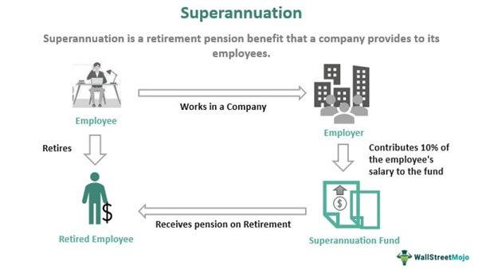

The Australian Future Fund (AFF), established in 2006, is a sovereign wealth fund with the primary objective of enhancing the long-term financial security of the nation. As one of Australia's most significant financial undertakings, the AFF was designed to support Australia's future by managing investments that address unfunded superannuation liabilities. Through strategic deployment of capital, the fund has evolved into a critical pillar of Australia's financial infrastructure.

One of the standout features of the AFF is its adoption of innovative investment strategies, including the employment of algorithmic trading to optimize returns. This technological approach allows for enhanced decision-making processes in trading activities, where computer algorithms assess market data to execute trades at high speed and precision. Such strategies contribute to the fund's ability to navigate complex markets, reduce human error, and maximize efficiency in investment execution.



With assets under management reaching significant figures, the AFF's importance is underscored by its impact on the nation's financial stability and future prosperity. This article explores the AFF's deployment of technology, particularly algorithmic trading, and its effect on enhancing the fund's performance. Understanding this integration provides insight into the AFF's governance structure and how it positions itself to achieve its financial objectives amidst a rapidly evolving economic landscape. By leveraging advanced algorithms and strategic management, the Australian Future Fund exemplifies a strategic approach to sovereign wealth management that could serve as a model for similar funds globally.

## Table of Contents

## What is the Australian Future Fund?

The Australian Future Fund (AFF) is a sovereign wealth fund instituted by the Australian Government to provide financial security by addressing unfunded superannuation liabilities and securing the nation's economic future. Established in 2006 under the Future Fund Act 2006, the AFF is a strategic initiative designed to mitigate the financial burdens on future generations, ensuring that Australia remains resilient in the face of economic fluctuations and uncertainties.

A key aspect of the AFF's creation was its initial funding, sourced from government surpluses and proceeds from the privatization of Telstra, the country's largest telecommunications company. This initial capital laid a robust foundation for the fund, allowing it to pursue a diverse range of investment opportunities aimed at maximizing long-term returns while managing risks effectively.

The AFF's operation reflects a commitment to safeguarding and growing national wealth, ultimately ensuring that future generations benefit from prudent fiscal management. Its investment approach is characterized by diversification across various asset classes and geographic regions, which helps to buffer the fund against market volatilities. This strategy positions the AFF as a cornerstone of Australia’s financial framework, contributing to the country's long-term economic stability and growth.

By deploying cutting-edge investment strategies and technologies, the AFF plays a critical role in enhancing Australia's financial resilience. The careful allocation of resources and the continuous evaluation of investment performance underscore the fund's mission to sustain economic prosperity for Australia’s future generations.

## The Role of Algorithmic Trading

Algorithmic trading, also known as 'algo trading,' employs computer programs and algorithms to make informed trading decisions. These algorithms autonomously analyze vast datasets to identify profitable opportunities and execute trades at optimal times, minimizing human intervention. 

The Australian Future Fund (AFF) has effectively incorporated [algorithmic trading](/wiki/algorithmic-trading) within its investment strategies, leveraging its capabilities to enhance efficiency and precision. By automating portfolio management processes, algorithmic trading aids in optimizing investment decisions, significantly reducing the likelihood of human error. This technology-driven approach allows the AFF to swiftly respond to market fluctuations, maintaining a competitive edge.

Advanced algorithms in the AFF's portfolio management employ multiple strategies to capitalize on diverse market conditions. One common method is statistical [arbitrage](/wiki/arbitrage), which uses quantitative models to identify price discrepancies between correlated financial instruments. By exploiting these discrepancies, the AFF can achieve sustained returns even amidst market [volatility](/wiki/volatility-trading-strategies).

The advantages of algorithmic trading over traditional methods are manifold. Algorithms operate around the clock, continuously monitoring the market without the constraints of human fatigue. This constant vigilance enables the immediate execution of trades whenever predefined conditions are met, often resulting in better prices and reduced transaction costs. Furthermore, the speed and precision of algorithms facilitate high-frequency trading, allowing the AFF to capitalize on minuscule price movements.

Python, a popular language for algorithmic trading due to its simplicity and robust library support, is often utilized to develop these algorithms. For instance, a simple mean-reversion strategy can be implemented using Python as follows:

```python
import numpy as np
import pandas as pd

def mean_reversion_strategy(prices, threshold=0.01):
    returns = prices.pct_change()
    mean_return = returns.mean()

    signals = np.where(returns > mean_return + threshold, -1, 0)
    signals = np.where(returns < mean_return - threshold, 1, signals)

    return pd.DataFrame({'Price': prices, 'Signal': signals})

# Example usage with hypothetical price data
prices = pd.Series([100, 101, 102, 101, 100, 99, 98, 99, 100, 101])
strategy_signals = mean_reversion_strategy(prices)
print(strategy_signals)
```

In this example, the algorithm generates buy (1) or sell (-1) signals based on deviations from the average return, helping to automate trading decisions based on historical data trends.

The integration of such sophisticated algorithms profoundly influences AFF's investment performance, allowing the fund to adapt swiftly to changing market dynamics and secure its long-term financial objectives. As algorithmic trading continues to evolve, its role in refining the strategic investment operations of the AFF is likely to expand, underscoring its importance in modern asset management.

## Investment Strategies and Management

The Australian Future Fund (AFF) employs a management structure influenced significantly by strategies typical in the [hedge fund](/wiki/hedge-fund-trading-strategies) industry. This approach facilitates effective risk management and aims to reach targeted financial outcomes. A key feature of this management strategy is the use of algorithmic trading. Algorithmic trading enables the automation of investment processes, which enhances decision-making efficiency and reduces the potential for human error. By leveraging advanced computational algorithms, the fund can respond to market changes more swiftly than traditional methods allow.

External investment managers are crucial to AFF’s strategic framework. By bringing in external managers, the fund limits potential conflicts of interest inherent in internally managed funds. This external management model introduces competitive pressures among managers. These managers are motivated to perform at optimal levels, thereby contributing positively to the fund's overall performance.

Algorithmic trading, when integrated with diverse management strategies, allows the AFF to capitalize on real-time data analytics, optimizing portfolio management by executing trades at the most opportune moments. Modern algorithmic strategies include [statistical arbitrage](/wiki/statistical-arbitrage), mean reversion, and [momentum](/wiki/momentum) strategies. For example, mean reversion is based on the statistical premise that asset prices and historical returns revert to the long-term mean over time, thereby identifying potential investment opportunities when prices deviate from their norm.

In addition to these strategies, the fund's governance model emphasizes risk-adjusted returns. Risk management techniques, similar to those utilized by hedge funds, involve hedging strategies and the use of derivatives to mitigate risk. The incorporation of such tactical tools ensures that the fund remains resilient in the face of market volatilities. Derivatives, like options and futures, are often used to manage exposure to currency and [interest rate](/wiki/interest-rate-trading-strategies) fluctuations, safeguarding the investment portfolio against unexpected financial downturns.

Thus, the combination of hedge fund-inspired management, external investment expertise, and cutting-edge algorithmic trading forms the backbone of the AFF’s strategy. These elements collectively contribute to its impressive performance, enhancing its ability to secure and grow wealth for future fiscal needs.

## Impact and Performance of the Future Fund

Since its inception, the Australian Future Fund (AFF) has consistently demonstrated substantial financial returns, underpinned by a dynamic and technology-oriented investment strategy. One of the pivotal components of this success is the implementation of algorithmic trading. By leveraging sophisticated algorithms, the AFF effectively automates its trading processes, enabling the fund to efficiently respond to market fluctuations and optimize its investment portfolio.

Algorithmic trading has been particularly beneficial in managing the inherent volatility of financial markets. These algorithms process vast datasets to identify trading opportunities, executing buy or sell orders at high speeds and with precision that surpasses human capabilities. This capability allows the AFF to maintain consistent growth even in tumultuous market conditions. A critical aspect of the algorithmic strategy is the use of predictive analytics, which helps forecast market trends and mitigate risks, thereby enhancing the fund's performance.

To illustrate the impact of algorithmic trading on the AFF's performance, we can refer to recent performance metrics. In the fiscal year ending June 2023, the AFF reported a return of approximately 8.5%, exceeding the benchmark target set by its Investment Mandate. This success is attributed to the fund's ability to efficiently reallocate capital in response to changing financial climates, a task made significantly easier via algorithmic mechanisms.

Moreover, the AFF employs a diversified range of algorithms tailored to different asset classes, including equities, fixed income, and alternative investments. This diversification not only spreads risk but also positions the fund to capitalize on various market opportunities. For instance, [machine learning](/wiki/machine-learning) algorithms are extensively utilized for equities trading, providing insights and trade signals that are both data-driven and adaptive to market dynamics.

Case studies further highlight the efficacy of the AFF's approach. For example, during the market downturn of 2020, largely due to the COVID-19 pandemic, the algorithmic systems implemented by the AFF successfully rebalanced portfolios to minimize losses while strategically positioning for recovery. The rapid decision-making capabilities of these systems ensured that the fund outperformed many of its global counterparts during this period.

In summary, the future-oriented investment techniques employed by the AFF, particularly algorithmic trading, have been instrumental in achieving robust financial outcomes. By continually refining these techniques and integrating emerging technologies, the AFF not only sustains strong returns but also sets a benchmark in sovereign wealth fund management. This continued focus on innovation ensures that the AFF remains well-positioned in the face of future market developments.

## Challenges and Future Outlook

The Australian Future Fund (AFF) has been recognized for its innovative approach to managing a sovereign wealth fund, yet it is not without its challenges. One of the primary challenges is adapting to evolving market conditions and regulatory changes, which can impact investment strategies and fund performance. As financial markets become increasingly globalized and interconnected, the need for flexibility in investment strategies becomes more critical.

Regulatory changes can impose restrictions on investment strategies, potentially affecting [liquidity](/wiki/liquidity-risk-premium) and returns. For instance, increased regulation concerning data privacy and algorithmic trading practices could necessitate adjustments in the AFF's algorithmic trading systems. Compliance with such regulations may require additional resources and affect operational efficiency.

The continued development of algorithmic trading capabilities is vital for the AFF to maintain its competitive edge. Algorithmic trading allows for rapid adjustments to market shifts and is instrumental in managing large-scale investments. The fund's ability to refine and optimize these algorithms will be crucial in addressing market volatility and maximizing returns.

Python, widely used in quantitative finance, offers robust libraries for developing algorithmic trading strategies. For instance, libraries like `pandas` and `NumPy` can be used to analyze large datasets, while `scikit-learn` allows for implementing machine learning models to predict market trends. Below is a simple example of how Python can be used to backtest a trading strategy:

```python
import pandas as pd
import numpy as np

# Load historical data
data = pd.read_csv('market_data.csv')
data['Returns'] = data['Close'].pct_change()

# Define a simple moving average strategy
data['SMA'] = data['Close'].rolling(window=20).mean()

# Generate trading signals: 1 for buy, -1 for sell
data['Signal'] = np.where(data['Close'] > data['SMA'], 1, -1)

# Calculate strategy returns
data['Strategy_Returns'] = data['Signal'].shift(1) * data['Returns']

# Calculate cumulative returns
cumulative_returns = (1 + data['Strategy_Returns']).cumprod()

print('Cumulative Strategy Returns: ', cumulative_returns[-1])
```
Looking ahead, the AFF may explore the integration of [artificial intelligence](/wiki/ai-artificial-intelligence) and machine learning to further enhance its predictive capabilities and decision-making processes. These technologies can analyze vast datasets and uncover patterns that may not be evident through traditional analysis, offering new insights into market behavior.

In conclusion, while the Australian Future Fund has demonstrated resilience and adaptability, the landscape in which it operates is ever-changing. The adoption and refinement of technology-driven strategies, particularly in algorithmic trading, will be essential for navigating future challenges. As the AFF continues to evolve, its ability to respond to regulatory and market dynamics will play a critical role in securing Australia's financial future.

## Conclusion

The Australian Future Fund represents a pioneering model of leveraging technology to enhance sovereign wealth fund management. By integrating advanced technological solutions, particularly algorithmic trading, the fund has successfully positioned itself as a benchmark for efficient and effective investment strategies. Algorithmic trading has played a significant role in the AFF's ability to achieve robust financial outcomes amidst complex global markets, reducing transaction costs and exploiting market inefficiencies.

Through the strategic use of sophisticated algorithms, the AFF has been able to adapt rapidly to market fluctuations, ensuring that the portfolio remains aligned with its long-term financial objectives. This adaptability is critical in mitigating risks and capitalizing on opportunities in an ever-changing economic landscape. As technology continues to advance, the AFF's commitment to innovation and strategic foresight positions it well to sustain and enhance its performance.

The ongoing evolution of the AFF indicates a strong trajectory towards maintaining its pivotal role within Australia's financial strategy. By embracing a blend of technology-driven investment strategies and prudent governance, the fund not only addresses current financial challenges but also lays a foundation for future economic resilience. This approach ensures that the fund will continue to be a critical instrument in securing prosperity for future generations, supporting Australia's financial stability, and showcasing the benefits of technologically advanced fund management.

## References & Further Reading

[1]: Bergstra, J., Bardenet, R., Bengio, Y., & Kégl, B. (2011). ["Algorithms for Hyper-Parameter Optimization."](https://dl.acm.org/doi/10.5555/2986459.2986743) Advances in Neural Information Processing Systems 24.

[2]: ["Advances in Financial Machine Learning"](https://www.amazon.com/Advances-Financial-Machine-Learning-Marcos/dp/1119482089) by Marcos Lopez de Prado

[3]: ["Evidence-Based Technical Analysis: Applying the Scientific Method and Statistical Inference to Trading Signals"](https://www.amazon.com/Evidence-Based-Technical-Analysis-Scientific-Statistical/dp/0470008741) by David Aronson

[4]: ["Machine Learning for Algorithmic Trading"](https://github.com/stefan-jansen/machine-learning-for-trading) by Stefan Jansen

[5]: ["Quantitative Trading: How to Build Your Own Algorithmic Trading Business"](https://www.amazon.com/Quantitative-Trading-Build-Algorithmic-Business/dp/1119800064) by Ernest P. Chan