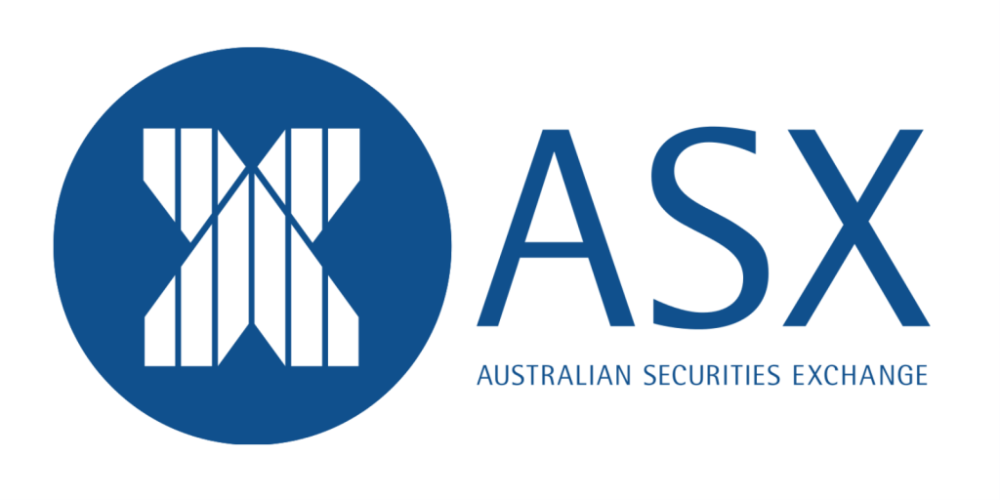

## Table of Contents

## What is the Australian Securities Exchange (ASX)?

The Australian Securities Exchange, or ASX, is the main stock exchange in Australia. It's a place where people and companies can buy and sell shares of Australian companies. The ASX helps companies get money by selling shares to the public, and it helps people invest in those companies. It's located in Sydney and is one of the biggest stock exchanges in the Asia-Pacific region.

The ASX also deals with other financial products, like bonds and futures. It makes sure that trading is fair and follows the rules. The exchange keeps track of the prices and trades, and it gives out information that helps people make smart choices about buying and selling. The ASX is important for the Australian economy because it helps money move around and helps businesses grow.

## When was the ASX founded and how has it evolved over time?

The ASX was founded in 1987 when two older exchanges, the Sydney Stock Exchange and the Australian Stock Exchange, joined together. Before that, Australia had many different stock exchanges in different cities. By coming together, they wanted to make trading easier and more efficient across the country.

Over the years, the ASX has grown a lot. It started using computers for trading in the 1990s, which made things faster and easier. The ASX also started offering more types of financial products, like futures and options. In 2006, the ASX merged with the Sydney Futures Exchange, making it even bigger. Today, the ASX is a big part of Australia's financial system and helps many people and businesses.

The ASX keeps changing to meet new needs. It has made its rules stricter to protect investors and make sure trading is fair. The ASX also uses new technology to keep up with the fast pace of the financial world. This helps it stay one of the leading stock exchanges in the Asia-Pacific region.

## What types of securities are traded on the ASX?

The ASX is where you can buy and sell different kinds of securities. The most common are shares, which are pieces of a company that people can own. When you buy a share, you become a part-owner of that company. The ASX also has exchange-traded funds (ETFs), which are like baskets of different investments that you can buy and sell like shares.

Besides shares and ETFs, the ASX also trades other things like bonds, which are loans that people give to companies or the government. There are also futures and options, which are agreements to buy or sell something at a future date. These can be used to protect against price changes or to try to make money from those changes. All these securities help people and businesses manage their money and investments.

## How does one start trading on the ASX?

To start trading on the ASX, you first need to open a trading account with a broker. A broker is a company that helps you buy and sell securities on the ASX. You can choose from different types of brokers, like full-service brokers who give you advice and help, or online brokers that let you trade on your own using their website or app. Once you pick a broker, you'll need to fill out an application form and provide some personal information, like your ID and bank details. After your account is set up, you can put money into it to start trading.

Once your account is ready and you have money in it, you can start buying and selling securities on the ASX. You can do this through your broker's trading platform, which is like a special website or app where you can see prices and make trades. To buy a security, you'll need to decide what you want to buy, how many you want, and at what price. You can place an order through the platform, and if it's accepted, you'll own the security. Selling works the same way, but you're getting rid of securities you already own. It's important to keep learning and stay updated on the market to make good trading decisions.

## What are the trading hours of the ASX?

The ASX is open for trading from Monday to Friday. The main trading hours are from 10:00 AM to 4:00 PM Australian Eastern Standard Time (AEST). This is when most of the buying and selling happens.

There is also a pre-market session from 7:00 AM to 10:00 AM AEST, where you can place orders but they won't be filled until the main session starts. After the main session, there's a post-market session from 4:10 PM to 4:40 PM AEST, where you can still trade but it's less busy.

## What are the main indices of the ASX and what do they represent?

The main index of the ASX is the S&P/ASX 200, often just called the ASX 200. This index shows how the 200 biggest and most important companies listed on the ASX are doing. It's like a report card for the Australian stock market. When people talk about how the Australian market is doing, they usually look at the ASX 200. It's a good way to see if the market is going up or down.

Another important index is the All Ordinaries, or All Ords. This index includes even more companies than the ASX 200, around 500 in total. It gives a broader picture of the Australian market because it includes smaller companies too. The All Ords is useful for people who want to see how the whole market is doing, not just the biggest companies. Both indices help investors understand the health of the Australian economy and make decisions about buying and selling shares.

## How does the ASX ensure market integrity and fairness?

The ASX works hard to make sure trading is fair and honest. They have strict rules that everyone has to follow. If someone breaks these rules, the ASX can punish them. They also watch the market all the time to catch any strange behavior. This helps stop people from cheating or doing things that are not fair. The ASX also makes sure that companies tell the truth about their business. If a company lies or hides important information, the ASX can take action against them.

Another way the ASX keeps things fair is by using technology. They have special computer systems that check for any unusual trading. If something looks off, they can stop it right away. The ASX also makes sure that everyone gets the same information at the same time. This stops some people from getting an unfair advantage. By doing all these things, the ASX helps make sure that the market is a fair place for everyone to trade.

## What role does the ASX play in the Australian economy?

The ASX is a big part of the Australian economy. It's where companies can get money to grow by selling shares to people. When a company sells shares, it gets money to build new things or start new projects. This helps the economy because it creates jobs and makes businesses bigger. People can also invest their money in the ASX, which helps them save for the future and maybe even make more money.

The ASX also helps keep the economy stable. It does this by making sure trading is fair and by giving out information that people can trust. When the market is fair and honest, more people want to invest. This brings more money into the economy, which helps it grow. The ASX also keeps track of how the economy is doing through its indices, like the ASX 200. This helps everyone understand what's happening and make smart choices about money.

## What are some of the major companies listed on the ASX?

The ASX has many big companies from different industries. Some of the biggest ones are in mining, like BHP Group and Rio Tinto. These companies dig up important stuff like iron ore and coal. Another big company is Commonwealth Bank of Australia, which is one of the biggest banks in the country. People use this bank to save money, borrow money, and do other banking stuff.

There are also big companies in other areas. For example, Woolworths Group is a huge supermarket chain where people buy food and other things they need every day. Telstra is a big company that helps people talk to each other with phones and internet. These companies are important because they help a lot of people and make the economy stronger.

Other notable companies include CSL Limited, which makes medicines and helps people stay healthy, and Wesfarmers, which owns many different businesses like stores and hardware shops. These companies show how the ASX has a mix of different kinds of businesses, all helping to make Australia's economy grow.

## How does the ASX handle corporate actions like mergers and acquisitions?

When companies want to merge or one wants to buy another, the ASX has rules they need to follow. These rules make sure that everyone knows what's happening and that it's fair. The companies have to tell the ASX about their plans, and then the ASX shares this information with everyone. This way, people who own shares in these companies can decide what to do. The ASX also checks to make sure the merger or acquisition follows all the rules and doesn't hurt anyone.

The ASX helps make these big changes go smoothly. If a company is merging or being bought, it might affect the price of its shares. The ASX keeps an eye on these prices and makes sure they stay fair. They also make sure that the shareholders get to vote on important decisions, like whether they want the merger or acquisition to happen. By doing all this, the ASX helps keep the market stable and trustworthy when big changes are happening.

## What technological advancements has the ASX implemented to improve trading?

The ASX has used new technology to make trading better and faster. One big change was switching to electronic trading in the 1990s. Before that, people had to call each other or meet in person to trade. Now, they can use computers to buy and sell shares quickly and easily. The ASX also made a special system called CHESS, which helps keep track of who owns what shares. This makes everything more organized and helps prevent mistakes.

Another important advancement is the use of high-tech tools to watch the market. The ASX uses computers to check for anything strange or unfair in trading. If they see something that doesn't look right, they can stop it before it causes problems. They also use technology to give everyone the same information at the same time. This helps make sure that no one gets an unfair advantage. By using these new tools, the ASX keeps trading fair and efficient.

## How does the ASX compare to other major stock exchanges around the world?

The ASX is one of the biggest stock exchanges in the Asia-Pacific region, but it's smaller than some of the world's biggest exchanges like the New York Stock Exchange (NYSE) and the NASDAQ in the United States. The NYSE and NASDAQ have more companies listed and more money changing hands every day. The ASX is also smaller than the Tokyo Stock Exchange in Japan and the London Stock Exchange in the UK. Even though it's smaller, the ASX is still important because it helps Australian companies grow and lets people invest in them.

The ASX is known for being a well-regulated exchange, which means it has strict rules to make sure trading is fair and honest. This is similar to other major exchanges around the world, like the NYSE and the London Stock Exchange, which also have strong rules to protect investors. The ASX uses modern technology to keep trading fast and efficient, just like other big exchanges. But the ASX is unique because it focuses on Australian companies and helps the Australian economy grow.

## What is Algorithmic Trading in the ASX?

Algorithmic trading on the Australian Securities Exchange (ASX) embodies the use of sophisticated algorithms and automated systems designed to execute trades with enhanced precision and speed compared to conventional methods. This approach leverages technology to systematically implement trading strategies, optimizing the execution of large orders by breaking them into smaller, more manageable parts, thereby minimizing market disruption.

One of the principal strategies employed in [algorithmic trading](/wiki/algorithmic-trading) is the Volume-Weighted Average Price (VWAP). VWAP calculates the average price a security has traded at throughout the day, based on both [volume](/wiki/volume-trading-strategy) and price. This is formulated as:

$$
VWAP = \frac{\sum (Price_i \times Volume_i)}{\sum Volume_i}
$$

Where $Price_i$ is the price of the trade and $Volume_i$ is the volume of the trade. VWAP is often used as a benchmark to ensure that trades are executed within acceptable price levels over a specified period.

Another vital strategy is the Time-Weighted Average Price (TWAP), which aims to execute orders evenly over a specified time frame, disregarding market volume and price fluctuations. This is particularly useful for steady entry into or [exit](/wiki/exit-strategy) from a position. The application of TWAP reduces the market impact by distributing the trade uniformly across the trading session.

Algorithmic trading on the ASX significantly reduces transaction costs by enhancing [liquidity](/wiki/liquidity-risk-premium) and smoothing out the execution process across market hours. This technology-driven trading has necessitated ongoing reviews and updates of trading regulations and technological frameworks to ensure that the market maintains efficiency and resilience. Continuous advancements in trading rules are vital to safeguard market integrity and protect against potential vulnerabilities such as market manipulation or technological failures.

The integration of sophisticated trading algorithms has ushered in a new era of efficiency in executing trades on the ASX, fostering a competitive environment while safeguarding market participants through stringent regulation and technological innovation. These developments are crucial in maintaining a robust marketplace that supports diverse investor needs.

## References & Further Reading

[1]: ["Advances in Financial Machine Learning"](https://www.amazon.com/Advances-Financial-Machine-Learning-Marcos/dp/1119482089) by Marcos Lopez de Prado

[2]: ["Quantitative Trading: How to Build Your Own Algorithmic Trading Business"](https://github.com/LucindaYa/quant-resources/blob/master/Quantitative%20Trading%20How%20to%20Build%20Your%20Own%20Algorithmic%20Trading%20Business.pdf) by Ernest P. Chan

[3]: ["Machine Learning for Algorithmic Trading"](https://github.com/stefan-jansen/machine-learning-for-trading) by Stefan Jansen

[4]: Linton, O., & Spiegelhalter, D. (2018). ["Artificial Intelligence and the Stock Market"](https://www.econstor.eu/bitstream/10419/189693/1/CWP061818.pdf). Cambridge Working Papers in Economics.

[5]: Australian Securities and Investments Commission (ASIC). ["Regulatory Guidance"](https://asic.gov.au/regulatory-resources/find-a-document/regulatory-guides/).