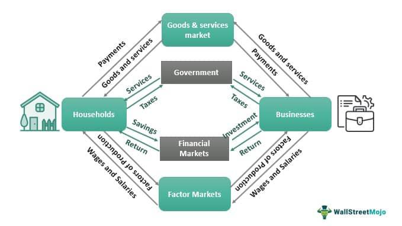

Economic policies and trading practices are vital components shaping both national and global economies in our interconnected world. Autarky, defined as economic self-sufficiency, is a concept that continues to hold significant relevance in discussions on how nations might navigate their economic paths. The idea is rooted in achieving economic independence by minimizing reliance on international trade, a pursuit often influenced by political and economic nationalism. This approach, historically seen in countries such as Nazi Germany and modern-day North Korea, highlights the drive for countries to secure essential goods internally.

However, the feasibility of complete economic self-reliance is constantly challenged by the intricate global supply chains that exist today. This complexity is further amplified by the modern trading landscape, which increasingly depends on technology-driven solutions such as algorithmic trading. Algorithmic trading, a process involving the use of algorithms to carry out high-speed trading strategies, has revolutionized financial markets by enhancing efficiency and minimizing human error. It exemplifies the shift towards utilizing technological advancements within the financial domain, encompassing a wide array of financial instruments such as stocks, commodities, and cryptocurrencies.



The intersection of these themes—autarky and algorithmic trading—illustrates a broader narrative of economic self-reliance juxtaposed with global market integration. As policymakers and investors navigate these dynamics, understanding their implications is crucial for effective decision-making in economic policy and trading strategies. The challenge lies in balancing self-sufficiency with technological progress to achieve sustainable economic outcomes at both national and global levels.

## Table of Contents

## Defining Autarky and Economic Self-Sufficiency

Autarky represents an economic framework focused on achieving self-sufficiency and minimizing dependence on international trade. This concept is rooted in the Greek words "autos," meaning "self," and "arkeia," meaning "sufficiency," highlighting a nation's quest for economic independence. Historically, autarky has been exemplified by economies such as Nazi Germany and contemporary North Korea, each adopting varying degrees of self-reliance. Nazi Germany, under Adolf Hitler, sought to create an economy that was minimally reliant on foreign imports by promoting domestic production and technological innovation. This was part of a broader strategy of economic nationalism, where securing essential resources internally was deemed fundamental.

North Korea provides a modern example of autarky in action. Following the Korean War, the nation adopted a policy of Juche, which emphasizes self-reliance and has driven its economic policies since the mid-20th century. This approach has led to the substantial development of domestic industries, albeit at the cost of significant economic isolation and inefficiencies. The pursuit of autarky is often driven by political motivations, such as the desire to maintain sovereignty and reduce vulnerability to foreign influence or economic coercion.

Despite its appeal, complete autarky remains unattainable for any nation, largely due to the intricacies of global supply chains. The modern economy is characterized by interconnectivity and interdependence, where resources, technology, and goods traverse borders, enabling nations to benefit from specialization and comparative advantages. For instance, global supply chains allow for the production of goods at reduced costs and increased efficiency, which are often unattainable through sole domestic production. Consequently, purely autarkic economic systems face barriers in achieving the same level of economic growth and innovation as those engaged in international trade.

While autarky theoretically offers the benefits of strategic independence and control over critical resources, it typically comes at the cost of losing access to the efficiencies and innovations afforded by global trade. As such, most nations opt for varying degrees of openness to international markets, finding a balance between self-sufficiency and the benefits of economic cooperation and specialization.

## Challenges and Downsides of Autarky

Adopting autarkic policies, which prioritize economic self-sufficiency over international trade, can lead to several economic inefficiencies and reduced wealth generation. At the core of these challenges is the limitation on exploiting comparative and absolute advantages, concepts rigorously defended by classical economists such as Adam Smith and David Ricardo. According to the theory of comparative advantage, countries can achieve more efficient production and higher total output by specializing in goods where they have lower opportunity costs, thus facilitating beneficial trade with other nations. Under autarkic policies, these synergies are often left unexplored, resulting in suboptimal resource allocation.

In a globalized economy, engaging in international trade acts as a catalyst for economic growth and innovation. By exchanging goods and services, countries benefit from economies of scale, access to a broader range of products, and the continuous exchange of ideas and technologies. Autarky, contrastingly, may result in higher opportunity costs. Nations that isolate themselves from global markets forego the chance to obtain resources and technologies at lower costs and may instead incur higher expenses in producing goods inefficiently.

Moreover, an isolationist economic stance restricts access to diverse markets, limiting both the import of innovative goods and services and the export potential of domestic products. Such restriction stifles economic dynamism and can impede a country's ability to adapt to shifting global market trends and technological advancements. The limited exposure reduces the competitive pressure on domestic industries to innovate and improve, potentially leading to stagnation.

While the pursuit of economic self-sufficiency provides certain strategic benefits, such as protection from global market shocks and increased control over the economy, these are often outweighed by the sacrifices made in terms of potential gains from international collaboration and trade. Strategic economic isolation disregards the compounding effects of interactive economic growth that global trade encourages, ultimately suppressing potential for greater economic prosperity.

## Algorithmic Trading: A Technological Leap

Algorithmic trading, commonly referred to as algo trading, utilizes computer algorithms to automate and execute trading strategies at high speeds. This technological advancement has significantly transformed financial markets by enhancing efficiency, minimizing human error, and enabling the analysis of vast data sets. Traditional trading, which relies on human decision-making, can be prone to delays and errors associated with emotional and psychological factors. In contrast, [algorithmic trading](/wiki/algorithmic-trading) leverages technology to execute trades based on predefined criteria, ensuring precision and consistency.

One of the key advantages of algorithmic trading is its ability to operate across multiple financial instruments, including stocks, commodities, and cryptocurrencies. By using algorithms to analyze market conditions, trends, and historical data, these systems can identify patterns and execute trades that align with specific financial strategies. This has led to increased [liquidity](/wiki/liquidity-risk-premium) in markets, allowing for smoother and more efficient price discovery processes.

The rise of [machine learning](/wiki/machine-learning) and [artificial intelligence](/wiki/ai-artificial-intelligence) has further enhanced the capabilities of algorithmic trading. Machine learning algorithms offer the ability to learn from data patterns and make predictions, adapting to new information without the need for constant reprogramming. This adaptability is particularly useful in dynamic markets, where conditions can change rapidly. Machine learning models can process unstructured data, such as news articles or social media posts, to gauge market sentiment, which can be incorporated into trading strategies. For instance, a simple implementation of machine learning in algorithmic trading could involve using a [neural network](/wiki/neural-network) to predict stock prices based on historical data:

```python
import numpy as np
from sklearn.model_selection import train_test_split
from sklearn.neural_network import MLPRegressor

# Sample data: historical stock prices
X = np.array([[85], [86], [87], [88], [89]])  # Features: previous prices
y = np.array([86, 87, 88, 89, 90])            # Targets: subsequent prices

# Splitting data into training and testing sets
X_train, X_test, y_train, y_test = train_test_split(X, y, test_size=0.2, random_state=42)

# Initializing and training the neural network
model = MLPRegressor(hidden_layer_sizes=(100,), max_iter=1000, random_state=42)
model.fit(X_train, y_train)

# Predicting future stock prices
predictions = model.predict(X_test)
print("Predicted Prices:", predictions)
```

While algorithmic trading offers numerous benefits, it also presents certain challenges. One of the primary concerns is market [volatility](/wiki/volatility-trading-strategies). The rapid execution of trades can lead to sudden price movements, particularly when large volumes are involved. Additionally, the competitive nature of high-speed trading has increased the pressure on financial institutions to continuously upgrade their technology to remain competitive. This has led to the emergence of high-frequency trading ([HFT](/wiki/high-frequency-trading-strategies)), where trades are executed in fractions of a second, raising concerns about market stability and fairness.

In summary, algorithmic trading represents a significant technological leap in financial markets, offering improved efficiency and precision. However, its integration into the financial ecosystem must be managed carefully to mitigate the risks associated with increased market volatility and competition.

## The Intersection of Autarky and Algorithmic Trading

The interplay between autarky and algorithmic trading presents a complex yet intriguing facet of contemporary economic strategies. Autarky emphasizes the minimization of reliance on external trade to foster economic self-sufficiency. In contrast, algorithmic trading epitomizes the interconnectedness and rapid evolution of global financial markets. On the surface, these two concepts might appear contradictory; however, they share a common objective: optimizing economic outcomes through different means.

Nations pursuing autarky can still leverage algorithmic trading to enhance internal market efficiencies. By employing sophisticated algorithms to manage and optimize domestic financial operations, countries can achieve significant cost reductions, improved transaction speeds, and enhanced decision-making processes—fostering an environment of economic efficiency without engaging extensively in international trade. For instance, national stock exchanges could utilize algorithmic trading technologies to improve liquidity and stabilize prices, thereby strengthening local economies.

The integration of these seemingly opposing strategies requires astute policy-making. Nations must devise strategic policies that embrace technological advancements without sacrificing the potential benefits derived from participating in the global economy. This involves a balanced approach—utilizing algorithmic trading to harness technological advancements domestically while maintaining selective engagement with international markets to reap the benefits of global trade networks.

Moreover, the successful blending of autarky and algorithmic trading necessitates a keen understanding of national priorities and technological capacities. Policymakers and economic strategists must evaluate the nation's technological infrastructure, financial market maturity, and broader economic goals. This includes assessing whether the existing technology can support sophisticated trading algorithms and if such integration aligns with the national aim of achieving greater economic self-reliance.

To illustrate, consider a scenario where a nation employs algorithmic trading to optimize the supply chains and financial operations of key industries deemed vital for national security or economic stability. This approach allows the nation to reduce external dependencies while maintaining a competitive edge through technological prowess.

In conclusion, both autarky and algorithmic trading offer distinct pathways to economic optimization. Merging these approaches effectively requires nuanced strategies that recognize the benefits of self-sufficiency alongside the advantages of technological and global market engagements. By striking this balance, nations can potentially achieve sustainable economic growth in an increasingly interconnected world.

## Conclusion

Understanding the dynamics of autarky and algorithmic trading is essential for navigating modern economic landscapes. Autarky provides valuable insights into policies aimed at achieving economic self-sufficiency, enabling nations to develop strategies centered around domestic resources and internal capabilities. This approach has notable implications for national independence in today’s globally interconnected world. On the other hand, algorithmic trading highlights the transformative power of technology in modern financial markets. With its ability to process vast datasets and execute trades at unprecedented speeds, algorithmic trading underscores the shift towards machine-driven decision-making, offering potential pathways for enhanced market efficiency and reduced human error.

Policymakers and investors face the delicate task of balancing the benefits of economic isolation inherent in autarkic policies against the gains attainable from embracing technological advancements and international trade. As national economies increasingly intertwine with global markets, this equilibrium becomes critical. The challenge lies in determining the extent to which a nation should rely on self-sufficiency without foregoing the economic growth potential offered by trade and technology. 

In an era marked by rapid globalization and technological innovation, finding the right balance between self-sufficiency and engagement in global markets is imperative for achieving sustainable economic growth. Crafting policies that harmonize these seemingly divergent paths requires a comprehensive understanding of both the national interests at stake and the broader global economic context. 

Future economic strategies will likely mandate a nuanced approach, recognizing the value of both maintaining a degree of self-sufficiency and fostering global collaboration. This balance will demand astute policy-making and strategic foresight from leaders aiming to harness the benefits of autarky while capitalizing on the opportunities provided by technological advancements and international trade. As such, understanding these dynamics will remain crucial for shaping the economic future in an interconnected world.

## References & Further Reading

[1]: Borschtsch, Michele. ["Nazi Economic Policy: 1933-1939."](http://www.laganhistory.com/uploads/5/4/0/4/5404032/nazi_economic_policy_1933-45.pdf) The Historical Journal, Cambridge University Press, 1995.

[2]: ["The Theories of International Trade"](https://open.lib.umn.edu/internationalbusiness/chapter/2-1-what-is-international-trade-theory/) by James E. Anderson

[3]: Kim, Suk Hi. ["North Korea's Juche Ideology: Its Origins and Development."](https://www.jstor.org/stable/43590970) North Korean Review, McFarland & Company, 2006.

[4]: Balasubramanian, S. & Sathyapriya, V. ["Algorithmic Trading and Securities: A Review."](https://www.researchgate.net/publication/378287610_Machine_learning_in_financial_markets_A_critical_review_of_algorithmic_trading_and_risk_management) 2019.

[5]: Gomber, P., Arndt, B., Lutat, M., & Uhle, T. ["High-frequency trading."](https://papers.ssrn.com/sol3/papers.cfm?abstract_id=1858626) Business & Information Systems Engineering, 2011.