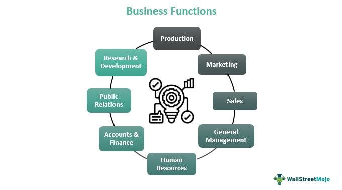

In the ever-evolving world of finance, technological advancements continue to revolutionize how trading is executed. A key participant in this transformation is Autex, an electronic platform designed to offer a seamless trading experience for brokers and their clients. This powerful tool has become integral to modern trading, allowing participants to navigate complex financial markets with increased efficiency and transparency.

Autex is not merely a trading platform; it stands out due to its distinct capabilities in facilitating communication between brokers and buy-side clients. By providing insights into market liquidity and offering trade advertisements, Autex ensures that buyers and sellers can connect effortlessly, enabling efficient execution of large transactions without significantly impacting the market price.

This article aims to explore the functionalities of Autex, its operational mechanisms, and the numerous advantages it offers, particularly in algorithmic trading. Autex's design is well-suited for handling substantial trades, thus providing transparency and offering a bird's eye view of the market landscape for traders seeking to make informed decisions.

Throughout this article, we will also consider practical scenarios illustrating how Autex is applied in real trading environments, offering a clearer picture of its capabilities. We begin by considering what makes Autex a significant player in the financial marketplace, setting the stage for examining its detailed workings and the specialized systems that enhance its utility.

## Table of Contents

## What is Autex?

Autex is an electronic trading platform initially developed by Thomson Reuters and now operated under the Refinitiv brand. This platform is instrumental for brokers in advertising both pre-trade and post-trade liquidity for equities to their buy-side clients. By utilizing Autex, brokers can effectively communicate market interest through various trade advertisements and indications of interest, which are crucial for understanding market liquidity dynamics.

The platform's design supports matching buyers and sellers, thereby facilitating the efficient handling of large transactions. Autex enhances trade execution by offering critical insights into market activity, allowing traders to gauge supply and demand conditions accurately. This information equips traders with the necessary visibility to make informed trading decisions, ultimately contributing to a more transparent and efficient trading environment.

Autex's role in the financial marketplace is to streamline the process of trade execution by ensuring that both market orders and block trades are executed with minimal market impact. By providing a platform where detailed [liquidity](/wiki/liquidity-risk-premium) data is readily accessible, Autex helps mitigate the risk of price distortions associated with large trade volumes. Therefore, its utilization is essential for brokers and traders seeking to optimize their trade strategies and capitalize on opportunities within the market.

## How Autex Works

Autex operates as a robust electronic platform that facilitates connectivity between brokers and buy-side clients through the use of real-time market data. This system enables traders to access critical information regarding indications of interest (IOIs) and liquidity before initiating sizable trades. By presenting a transparent view of market activity, Autex allows for more strategic decision-making and ensures that both parties can navigate the intricacies of large transactions with greater precision.

The platform is versatile, supporting an extensive range of financial instruments, including equities, options, and futures. This broad coverage allows for diversification and comprehensive engagement with various asset classes, aligning with the fluctuating demands and complexities of the markets. This enables traders to optimize their trading strategies across different market conditions.

Autex addresses some of the fundamental challenges in trading, such as managing market demand fluctuations and the inherent complexities associated with executing voluminous trades. By offering insights into market liquidity, it allows traders to anticipate and adjust to market conditions effectively, thus enabling them to execute trades that are both timely and strategically aligned with their goals. 

Integration with advanced tools is a key feature of Autex, supplying users with both real-time and historical trade data. Such data is crucial in constructing a well-informed view of the market, facilitating informed decision-making. For instance, traders can analyze past trading patterns to forecast future market movements and thus hone their trading strategies for better outcomes.

By leveraging this combination of real-time data, access to a variety of asset classes, and analytical tools, Autex empowers traders to make well-informed and timely trading decisions, thereby enhancing overall trading effectiveness and efficiency.

## Special Considerations: The Autex Trade Route System

The Autex Trade Route system represents a sophisticated extension of the Autex platform, which plays a pivotal role in modern trading by facilitating seamless connectivity and routing of order flows across global markets. This system significantly supports the trading of new asset classes and enhances the capabilities of [algorithmic trading](/wiki/algorithmic-trading), thereby contributing to efficient capital allocation by asset managers.

The architecture of the Autex Trade Route system is designed to dismantle technological barriers that have traditionally hindered the smooth execution of trades. By doing so, it enables a streamlined process where asset managers can more efficiently allocate their capital within an increasingly complex trading ecosystem. The system's infrastructure is robust, ensuring both resiliency and comprehensive network visibility. This aspect is crucial for institutional investors who demand a reliable trading experience that can withstand the volatilities and unpredictabilities inherent in financial markets.

The system's expansive network connectivity is another noteworthy feature, linking over 850 buy-side firms with more than 600 brokers worldwide. This extensive web of connections facilitates a diverse and dynamic trading environment wherein information flows freely and efficiently among market participants. Such connectivity is instrumental in ensuring liquidity, providing a rich pool of market participants that contributes to fairer pricing and reduced transaction costs.

Furthermore, the Autex Trade Route system enhances algorithmic trading by integrating tools that provide real-time insights and analytical capabilities. Traders can leverage these tools to optimize their trading strategies, ensuring they are not merely reactive but also strategically proactive. The integration simplifies complex transactions, aligns them with market movements, and mitigates risks associated with large-scale trading operations.

In summary, the Autex Trade Route system offers a comprehensive, resilient solution for routing order flows while supporting diverse asset classes and empowering algorithmic trading. Its extensive global network and cutting-edge technological infrastructure make it an indispensable tool for institutional investors seeking to maximize efficiency and achieve superior trading outcomes.

## Examples and Scenarios

Consider two traders dealing in Company XYZ's stock, each looking to buy and sell 100,000 shares. In this situation, Autex offers a unique advantage by enabling both parties to express their trading interests discretely through indications of interest (IOIs). This process minimizes market impact and avoids creating significant share imbalances, ensuring that the actions of these traders do not affect the stock's market price excessively.

Autex facilitates these transactions by providing a platform where traders can access real-time liquidity information. This access allows both buyers and sellers to gauge the market environment before executing large trades, whether on an exchange or over-the-counter (OTC). For instance, if both traders post their IOIs on Autex, they can assess the existing interest and market conditions before finalizing their trades.

Such scenarios underscore Autex's efficiency in streamlining large transactions. By providing critical market data and ensuring connectivity among market participants, Autex enables traders to manage large orders without the usual disruptions associated with high-[volume](/wiki/volume-trading-strategy) transactions. This makes the platform particularly valuable for institutional investors, who often need to execute substantial trades with minimal market impact.

The system's architecture ensures a secure and informed environment for significant transactions. Autex achieves this by integrating historical and real-time data analytics, allowing traders to make well-informed decisions about the timing and execution method for their trades. This capability reduces risks associated with large orders and enhances the efficiency of trade execution strategies.

In summary, the Autex platform exemplifies how electronic trading systems can transform the execution of large trades. By offering a comprehensive set of tools and data analytics, it provides a robust framework for managing substantial transactions effectively and efficiently.

## Conclusion

Autex signifies a remarkable development in electronic trading platforms, providing traders with substantial flexibility and functionality. Its ability to deliver real-time data and support efficient trade executions significantly narrows the gap between buyers and sellers. This functionality assists in maintaining market equilibrium and optimizing trading strategies. The extension of these capabilities through the Autex Trade Route further simplifies the adoption of innovative trading methods, integrating seamlessly into existing operations. 

Incorporating Autex into trading strategies yields considerable benefits, such as improved market insight and optimized trade executions. This enhancement stems from the platform's sophisticated tools that equip traders with comprehensive market data, thus enabling more informed decision-making. Such advantages are pivotal for both brokers and institutional investors, as they seek to navigate the complexities of modern financial markets. 

The platform transforms trading into a more dynamic and responsive process by facilitating quick adjustments to market conditions and fostering seamless interaction among market participants. Consequently, Autex stands out as an essential asset for those aiming to enhance the efficiency of their trading operations and achieve superior trading outcomes.

## References & Further Reading

[1]: Rubin, D. (2010). ["Trade Execution: A Vista of Algorithms"](https://www.researchgate.net/publication/228059126_Effective_Trade_Execution) The TRADE.

[2]: ["Advances in Financial Machine Learning"](https://www.amazon.com/Advances-Financial-Machine-Learning-Marcos/dp/1119482089) by Marcos Lopez de Prado

[3]: Fabozzi, F. J., Focardi, S. M., & Kolm, P. N. (2010). ["Quantitative Equity Investing: Techniques and Strategies"](https://www.semanticscholar.org/paper/Quantitative-Equity-Investing%3A-Techniques-and-Fabozzi-Focardi/1c49a2a53919f7e65cb96f16691b8ff726fd3cd7) Wiley.

[4]: Aldridge, I. (2013). ["High-Frequency Trading: A Practical Guide to Algorithmic Strategies and Trading Systems"](https://www.amazon.com/High-Frequency-Trading-Practical-Algorithmic-Strategies/dp/1118343506) Wiley.

[5]: ["Quantitative Trading: How to Build Your Own Algorithmic Trading Business"](https://www.amazon.com/Quantitative-Trading-Build-Algorithmic-Business/dp/1119800064) by Ernest P. Chan