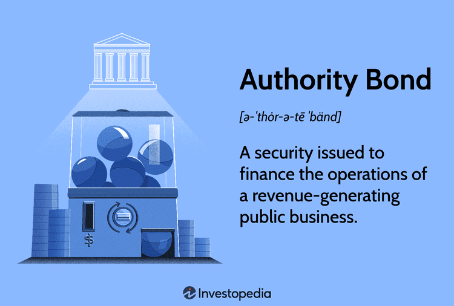

The financial world is abundant with various instruments tailored to satisfy a wide range of investment and funding requirements. Among these, bonds emerge as a fundamental tool through which entities worldwide secure capital. Bonds, essentially loans made by investors to borrowers, play multifaceted roles—from financing critical infrastructure projects like roads and bridges to facilitating expansive corporate strategies for growth and development.

For investors, bonds are particularly appealing due to the stability and predictable returns they provide, especially in comparison to more volatile equity markets. This predictability stems from the fixed interest payments, known as coupon payments, that are typically associated with bonds. As such, bonds are often considered a cornerstone in diversified investment portfolios for risk-averse investors seeking steady income streams.

In exploring the financial landscape, it's essential to understand the diverse array of bond types, including government bonds, corporate bonds, and authority bonds. Each type offers distinct characteristics and caters to specific funding needs and investment strategies. Furthermore, technological advancements, particularly algorithmic trading, are revolutionizing how trades are conducted in the bond market. Algorithmic trading, with its reliance on complex algorithms and rapid execution, is enhancing efficiency, providing data-driven insights, and reshaping bond trading practices.

This article aims to provide a comprehensive overview of the bond market's landscape, examining the distinct roles played by various bond types and the technological innovations shaping current and future trading practices. Through this exploration, we seek to illuminate how these instruments and advancements contribute to the ever-evolving world of finance.

## Table of Contents

## Understanding Financial Instruments

Financial instruments are foundational assets within financial markets that individuals and entities use to manage exposure, become financially stable, and achieve growth objectives. These instruments encompass a variety of types, including stocks, bonds, exchange-traded funds (ETFs), and derivatives. Each type plays a distinct role in the financial ecosystem, serving different needs and strategies for investors and issuers alike.

Bonds constitute a critical component of financial instruments, representing fixed-income securities through which the bond issuer commits to paying back the borrowed amount to the bondholder with interest over predetermined intervals. This commitment establishes bonds as a vehicle for raising substantial amounts of capital for diverse purposes, often spanning from government financing to corporate funding efforts.

1. **Government Bonds**: These are securities issued by national governments to support government spending. Among the most prevalent are Treasury bonds in the United States, which are considered low-risk due to governmental backing. Government bonds usually offer lower yields, reflecting their stability and lower risk of default.

2. **Corporate Bonds**: Issued by companies, these bonds are employed to finance a wide range of corporate actions such as expansions, acquisitions, or operational expenditures. Corporate bonds generally offer higher yields than government securities to compensate for increased risk. The credit rating of the issuing corporation plays a significant role in determining the bond's interest rates, with higher-rated bonds offering lower yields.

3. **Authority Bonds**: Also known as revenue bonds, these are issued by government agencies or corporations to fund projects that generate revenue. Authority bonds generally finance specific community or organizational projects, such as building a toll bridge or public university. They differ from general obligation bonds, which are backed by the issuing entity's taxing power, as their repayment is sourced from the revenue of the project they finance.

Understanding these types of bonds is crucial for investors seeking to optimize their portfolios according to risk tolerance, expected returns, and investment goals. Bonds offer a spectrum of opportunities that cater to both conservative and more risk-tolerant investors, influenced by factors such as maturity periods, yield curves, and credit ratings.

The study and strategic placement of these financial instruments are vital for diversification and risk management in investment portfolios, enabling investors to mitigate potential losses while capitalizing on interest-generated income.

## What is an Authority Bond?

An authority bond is a type of financial instrument issued by government agencies or corporations specifically tasked with managing public enterprises. Unlike general obligation bonds that are backed by the issuer’s full faith and credit, authority bonds are often secured by revenues generated from the projects they finance. This essential characteristic positions authority bonds as a distinct tool for funding public initiatives that are expected to produce income.

The key purpose of authority bonds is to finance projects that generate revenue through their operations. Examples of such projects include toll roads, airports, and utilities, where the generated revenues can be used to service the bond's debt. This independence from taxpayer funding makes authority bonds a favored choice for financing self-sufficient public infrastructure projects.

The issuance process of authority bonds typically involves multiple stages, including authorization, structuring, marketing, and closing. Initially, a government agency or public corporation identifies a project that necessitates funding. Upon approval, the bonds are structured, setting terms such as maturity date and [interest rate](/wiki/interest-rate-trading-strategies). These bonds are then marketed to potential investors, often through a bidding process. Finally, the transaction is closed, and funds are allocated to the project in question.

For investors, authority bonds offer several benefits. These include potential tax advantages, as interest earned on many authority bonds may be exempt from federal income tax, and sometimes state and local taxes, depending on the jurisdiction. Furthermore, the income generated from the underlying project provides a clear revenue stream for servicing the bond, which can enhance the bond's appeal due to the reduced default risk.

Authority bonds thus form a crucial segment in the bond market, underpinned by their unique purpose and structure. They enable the funding of essential public projects without directly impacting taxpayers' liabilities, while offering investors opportunities to diversify their portfolios with potentially tax-advantaged, income-producing securities.

## Comparison with Other Bonds

Authority bonds, municipal bonds, and general obligation (GO) bonds are integral components of the bond market, with each type serving distinct purposes and appealing to different investor needs. Understanding the differences and unique features of these bonds helps investors make informed decisions based on their financial goals and risk appetites.

**Authority Bonds**: Authority bonds are typically issued by government agencies or corporations to fund projects that generate revenue. These bonds are often associated with the management of public enterprises such as utilities, transportation systems, or housing projects. The revenue generated from these projects is used to pay the interest and principal on the bonds, which can make them appealing to investors seeking returns tied to specific economic activities. The issuance process usually involves detailed financial planning to ensure that the revenue from the project can cover bond obligations.

**Municipal Bonds**: Municipal bonds, known as "munis," are issued by state or local governments to fund public infrastructure projects like schools, roads, and hospitals. These bonds are attractive to investors, particularly because the interest earned is often exempt from federal income taxes, and may also be exempt from state and local taxes if the investor resides in the jurisdiction where the bond is issued. This tax advantage can result in higher effective yields for investors in higher tax brackets.

**General Obligation Bonds**: General obligation bonds are another type of municipal bond but different from authority and revenue bonds. GO bonds are backed by the full faith, credit, and taxing power of the issuing government entity rather than revenue from a specific project. This means that GO bonds are typically viewed as less risky compared to revenue-based bonds because they are supported by the general tax revenues of the municipality, providing a broader guarantee of repayment.

**Key Comparisons**:
- **Risk and Security**: GO bonds are generally considered less risky than authority or other revenue bonds due to their backing by tax revenues. Authority bonds carry project-specific risks, but also offer the potential for higher returns because they are dependent on the success of the revenue-generating projects they finance.
- **Tax Implications**: Municipal bonds, including both GO and revenue bonds, often provide tax benefits that do not usually apply to authority bonds. These tax exemptions can significantly influence an investor’s decision.
- **Purpose and Usage**: Authority bonds focus on specific projects or enterprises that are expected to be self-sustaining through their revenues. In comparison, municipal bonds broadly support public infrastructure without tying the repayment directly to specific project success.

Investors should evaluate the goals, risk tolerance, and tax situation when selecting bonds for their portfolios. Those looking for stable returns with minimal risk might lean towards GO bonds, while those interested in revenue growth and potentially higher yields may consider authority bonds. Ultimately, the decision should align with the investor’s broader financial strategy and market conditions.

## Mechanism of Bond Trading

Bonds are a cornerstone of the financial markets, providing a mechanism for entities to manage debt while offering investors a stable source of income. The trading of bonds occurs in two primary markets: the primary market, where new bonds are issued and sold to investors, and the secondary market, where existing bonds are traded among investors.

In the primary market, bonds are issued by entities such as governments, corporations, or municipal authorities to raise capital. The issuer determines the terms of the bond, including its face value, the coupon rate (interest rate), and the maturity date. The bond is then sold to investors who provide the issuer with the needed capital. The initial pricing of a bond is influenced by several factors, including the issuer's creditworthiness, prevailing interest rates, and the macroeconomic environment. Underwritten by investment banks, bond issues can be public offerings or private placements, the latter typically being more exclusive and less liquid.

Once issued, bonds enter the secondary market, where they can be bought and sold until maturity. In this market, the price of a bond fluctuates based on changes in interest rates, inflation expectations, and credit ratings. Bond prices and yields have an inverse relationship; when market interest rates rise, existing bond prices decline to align new issues offering higher yields, and vice versa. This relationship is fundamental and can be mathematically expressed as:

$$
P = \frac{C}{(1 + r)^1} + \frac{C}{(1 + r)^2} + \cdots + \frac{C + F}{(1 + r)^n}
$$

Here, $P$ is the bond price, $C$ is the annual coupon payment, $F$ is the face value of the bond, $r$ is the market interest rate, and $n$ is the number of years to maturity.

Bond trading dynamics are heavily influenced by the economic environment, including changes in monetary policy and fiscal measures. Central banks, through interest rate adjustments, can significantly impact bond yields and investor sentiment. A rise in interest rates typically leads to higher yields on newly issued bonds and a decrease in the prices of existing bonds.

Furthermore, investor behavior in the secondary market is shaped by factors such as [liquidity](/wiki/liquidity-risk-premium), credit risk perception, and macroeconomic indicators. Liquidity, the ease with which a bond can be bought or sold without affecting its price, is an essential consideration for investors. Highly liquid bonds typically belong to large, reputable issuers such as the U.S. Treasury.

Emerging technologies and innovations in trading methods are also reshaping bond trading. Platforms enabling electronic trading offer faster, more efficient transactions compared to traditional methods, which relied on broker-based negotiations. These advancements contribute to greater market transparency and lower transaction costs, benefiting investors and issuers alike.

In summary, bond trading mechanisms encompass issuance in primary markets and subsequent transactions in secondary markets. Influenced by interest rates, yield fluctuations, and technological advancements, the bond market remains a dynamic component of the global financial system, catering to diverse investor needs while providing vital capital-raising avenues for issuers.

## The Influence of Algorithmic Trading on Bonds

Algorithmic trading, commonly referred to as algo trading, involves the use of computer algorithms to perform trades at vast speeds, with precision and limited human intervention. The rise of [algorithmic trading](/wiki/algorithmic-trading) has had a transformative impact on various financial markets, including the bond market. This advancement offers several benefits, but also poses challenges and future potentials worthy of exploration.

**Benefits of Algorithmic Trading in Bond Markets**

Algorithmic trading in the bond market is beneficial primarily due to its efficiency. Traditional trading often involves manual processes requiring significant time and effort to execute a single trade. Algorithms, on the other hand, can scan market conditions, analyze real-time data, and execute trades in fractions of a second. This increase in speed not only reduces the time taken but also minimizes transaction costs.

Furthermore, algorithmic trading enhances data-driven decision-making. Algorithms are equipped to process vast amounts of historical and real-time data, allowing for more informed trading decisions. They can identify trends, assess risks, and price bonds more effectively than traditional methods. This analytical capability can lead to better pricing accuracy and decreased market impact costs.

**Challenges of Algorithmic Trading**

Despite these benefits, there are significant challenges associated with algorithmic trading in bond markets. One major issue is market [volatility](/wiki/volatility-trading-strategies). The speed and [volume](/wiki/volume-trading-strategy) of trades executed can lead to increased volatility, potentially destabilizing the market. This is particularly problematic in the bond market, where liquidity is generally lower compared to equity markets.

Another challenge is the risk of algorithmic failures. Errors in the algorithm logic or unforeseen market conditions can result in substantial financial losses. Ensuring the robustness and reliability of algorithms is crucial. Moreover, there is the issue of reduced transparency; since algorithms operate quickly and autonomously, it can be difficult for regulators and market participants to monitor and understand their actions.

**Future Potential**

Looking ahead, algorithmic trading holds significant potential to further transform bond markets. With advancements in [machine learning](/wiki/machine-learning) and [artificial intelligence](/wiki/ai-artificial-intelligence), future algorithms are expected to become even more sophisticated, capable of self-learning and adapting to dynamic market conditions. These technologies could enhance predictive analytics, optimizing trading strategies to unprecedented levels.

Moreover, as regulatory frameworks evolve to better accommodate and manage algorithmic trading, the initial challenges could be mitigated, leading to more stable and liquid bond markets. The adoption of blockchain technology may also play a role in increasing transparency and security of transactions, building greater trust among market participants.

In conclusion, while algorithmic trading introduces complexities to bond markets, its advantages in efficiency and data utilization are undeniable. As technology continues to advance, the need for careful regulation and oversight will be paramount to fully realize its potential.

## Conclusion

Bonds are essential financial instruments that serve as a vital source of capital for various sectors, allowing for both investment and growth. Among the diverse types of bonds, authority bonds stand out for their unique ability to support community-focused initiatives, often facilitating projects that yield long-term societal benefits. This specificity allows government agencies and corporations to fund revenue-generating projects that might otherwise struggle to secure financing through traditional means.

Algorithmic trading, characterized by its use of complex computer algorithms to execute trades with speed and precision, is transforming the bond market landscape. This technological advancement offers enhanced efficiency, allowing for quicker adaptation to market conditions and optimization of trading strategies. Algorithmic trading provides data-driven insights, enabling better decision-making in bond markets that were traditionally less dynamic compared to equities.

For investors and market participants, staying informed of these evolving trends is crucial. As the bond market continues to integrate algorithmic solutions, understanding the nuances of different bond types and the impact of technological innovations becomes increasingly important to navigate its complexities effectively. Being proactive and knowledgeable can lead to optimal investment choices and better management of one's portfolio in a market that is steadily advancing.

## References

Investopedia offers extensive articles on "Bonds" and "Authority Bonds," providing fundamental knowledge and insights into these financial instruments. These articles discuss the characteristics, benefits, and purposes of bonds, as well as the specific nuances of authority bonds, which are issued by government agencies or corporations to support public projects.

Further insights on algorithmic trading and its impact on financial markets can be found in academic journals and financial industry publications. These sources explore how algorithmic trading uses complex algorithms to execute trades at high speed, improving efficiency and providing precise market analysis. Industry reports highlight that algorithmic trading significantly influences bond markets by enhancing liquidity and reducing transaction costs.

Industry reports discussing the latest trends in the bond market indicate a growing interest in sustainable and green bonds, reflecting an increased focus on environmentally friendly investments. These reports also underline the role of technology and data analytics in shaping the future of bond trading, emphasizing a shift towards more automated and data-driven processes.

For the most up-to-date information and insights, financial news websites and research platforms are valuable resources, offering timely updates and expert analysis on the evolving bond market landscape.

## References & Further Reading

[1]: Fabozzi, F. J. (Ed.). (2005). ["Handbook of Fixed Income Securities."](https://www.amazon.com/Handbook-Fixed-Income-Securities-Ninth/dp/1260473899) McGraw-Hill.

[2]: Chincarini, L. B., & Kim, D. (2006). ["Quantitative Equity Portfolio Management."](https://archive.org/details/quantitativeequi0000chin_c9d6) McGraw-Hill.

[3]: Treynor, J. L. (1962). ["Toward a Theory of Market Value of Risky Assets."](https://papers.ssrn.com/sol3/papers.cfm?abstract_id=628187) The Institute of Finance and Economics.

[4]: Hasbrouck, J. (2007). ["Empirical Market Microstructure: The Institutions, Economics, and Econometrics of Securities Trading."](https://archive.org/details/empiricalmarketm0000hasb) Oxford University Press.

[5]: ["Algorithmic and High-Frequency Trading: Mathematics, Statistics, and Risk Management"](https://www.cambridge.org/wf/universitypress/subjects/mathematics/mathematical-finance/algorithmic-and-high-frequency-trading) by Álvaro Cartea, Sebastian Jaimungal, & José Penalva