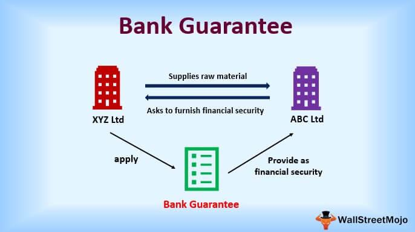

In the finance sector, medium term notes, bank guarantees, and algorithmic trading are pivotal in shaping the core operations of U.S. banks. This article aims to elucidate the functionality, importance, and interrelationship of these financial instruments within U.S. banking. Medium term notes (MTNs) are a critical means for raising capital, offering unique benefits and purposes. Bank guarantees serve as essential financial instruments that ensure the fulfillment of obligations by one party to another, providing necessary assurances in transactions. Algorithmic trading represents a significant advancement in investment strategy, allowing banks to optimize their trading operations through automation and speed. A comprehensive understanding of these components provides valuable insights into the intricate financial systems that underpin the functioning of U.S. banks.

## Table of Contents



## Understanding Medium Term Notes (MTNs)

Medium term notes (MTNs) are versatile financial instruments that resemble bonds and carry maturities typically ranging from nine months to 30 years. Introduced in 1983, MTNs offer companies a viable method for raising capital, acting as an alternative to traditional debt offerings. These notes are typically non-callable, unsecured, and come with fixed interest rates, which underscores their appeal as a stable investment option for investors.

The issuance of MTNs by U.S. banks adheres to regulations set forth by the Securities Exchange Commission (SEC). Banks usually coordinate with investment banks and brokerage houses to distribute these instruments. Once issued, MTNs often find their way into the hands of institutional investors, although they can eventually be traded to retail investors as well.

The structure of MTNs allows issuers to customize maturity and interest rates to suit their funding requirements, providing flexibility and cost-effectiveness. Unlike traditional bonds that are issued in large, singular offerings, MTNs can be issued incrementally, which can help issuers manage market conditions more dynamically.

In the context of financial markets, MTNs represent a significant channel for capital flow, offering advantages such as diverse maturity options and relatively lower issuance costs compared to typical bond offerings. These features make MTNs a preferred choice for a range of institutional investors who seek stable returns in volatile markets.

## Bank Guarantees and Their Functionality

Bank guarantees are vital financial instruments that function as a pledge from banks to fulfill a debtor's obligations should they default. Essentially, a bank guarantee serves as a bank's promise to assume the financial liabilities in case a party fails to uphold the terms of a contract. These guarantees provide security and trust in business transactions, ensuring that agreements are honored even if one party cannot meet their commitments.

In the United States, banks typically do not issue traditional bank guarantees. Instead, they provide a similar financial tool known as a standby letter of credit (SLOC). SLOCs are widely used in international trade as they offer a form of financial assurance across borders. This makes them an essential component of global commerce, as they mitigate the risk associated with cross-border deals by assuring suppliers that they will receive payment despite potential disruptions.

Unlike other financial instruments, the value and reliability of SLOCs are significantly influenced by the creditworthiness of the issuing bank. Consequently, banks with higher credit ratings are more desirable as issuers of such guarantees, as they provide greater security for the parties involved. Additionally, these instruments can be traded between financial institutions, adding a layer of complexity to their valuation.

The valuation of bank guarantees or SLOCs depends not only on the creditworthiness of the issuing entity but also on market conditions and the specific terms of the guarantee. For financial institutions engaging in the trade of these instruments, assessments often involve evaluating the issuing bank's financial health and the intrinsic risks associated with the underlying contract.

In summary, bank guarantees, particularly in the form of standby letters of credit in the U.S., play an integral role in facilitating secure transactions. They help businesses navigate financial uncertainties, ensuring that obligations are met even in the face of potential default, thereby fostering confidence in financial exchanges.

## Algorithmic Trading in U.S. Banks

Algorithmic trading utilizes sophisticated algorithms to execute trades automatically based on pre-determined criteria. Within U.S. banks, this approach represents a critical component of both investment strategy formulation and risk management. 

The adoption of [algorithmic trading](/wiki/algorithmic-trading) in banks allows for the execution of high-frequency trades with unmatched precision and speed, surpassing the capabilities of manual trading. This enhances the ability to seize market opportunities effectively. The algorithms function by analyzing vast datasets to identify patterns and predict future market movements. For instance, a trading algorithm may be designed to initiate a trade when certain conditions are met, such as the convergence of a moving average with a particular price threshold. Here’s a simple representation of a moving average crossover strategy in Python:

```python
import pandas as pd

def moving_average_strategy(data, short_window=40, long_window=100):
    signals = pd.DataFrame(index=data.index)
    signals['signal'] = 0.0

    # Create short and long simple moving averages
    signals['short_mavg'] = data['Close'].rolling(window=short_window, min_periods=1, center=False).mean()
    signals['long_mavg'] = data['Close'].rolling(window=long_window, min_periods=1, center=False).mean()

    # Generate signals
    signals['signal'][short_window:] = np.where(signals['short_mavg'][short_window:] > signals['long_mavg'][short_window:], 1.0, 0.0)   
    signals['positions'] = signals['signal'].diff()

    return signals

# Example usage
# Assume `data` is a DataFrame with closing prices
# signals = moving_average_strategy(data)
```

Algorithmic trading leverages cutting-edge technology, including [artificial intelligence](/wiki/ai-artificial-intelligence) and [machine learning](/wiki/machine-learning), to process and interpret market data with increased accuracy. Machine learning models are deployed to improve the adaptability of these algorithms, enabling them to learn from new data and adjust strategies accordingly.

As this domain continues to mature, its implications extend beyond traditional trade executions. It reshapes trading strategies by enhancing their efficiency and scope and influences the broader financial landscape. Banks use algorithmic trading to gain competitive advantages, manage risks more effectively, and ensure compliance with evolving regulatory standards.

The evolution of algorithmic trading reflects its ability to adapt to changing market conditions and the ongoing innovation in computational finance. This dynamic field is pivotal in shaping modern banking operations and financial services in the U.S., showcasing the profound impact of technology on economic activities.

## Conclusion

Medium term notes, bank guarantees, and algorithmic trading are integral to the functioning and strategic operations of U.S. banks. Medium Term Notes (MTNs) present a reliable avenue for raising capital, offering long-term financing stability to issuers. By doing so, they facilitate sustained funding without the immediate pressures associated with short-term debt, allowing banks to maintain [liquidity](/wiki/liquidity-risk-premium) and manage [interest rate](/wiki/interest-rate-trading-strategies) risk effectively. On the other hand, bank guarantees and their analogous instruments, standby letters of credit, are crucial in providing financial assurances across a myriad of transactions. These instruments enhance trust and reliability in both domestic and international dealings by assuring counterparties of financial obligations, thus supporting the seamless execution of trade agreements.

Algorithmic trading has revolutionized how banks execute trades, introducing an unprecedented level of speed and precision to market operations. This form of trading leverages sophisticated algorithms to analyze extensive datasets and execute trades at scales and speeds beyond human capability. As a result, algorithmic trading substantially improves the operational efficiency of banks, contributing to more strategic and informed decision-making processes. The integration of these elements underscores the complexity and interconnectedness of modern banking operations, reflecting a delicate balance between risk management, capital acquisition, and technological advancement.

Understanding the multifaceted roles of MTNs, bank guarantees, and algorithmic trading helps stakeholders navigate the intricacies of financial services within the U.S. banking sector. Their strategic application not only supports operational efficiency but also enhances the resilience and adaptive capacity of banks in the face of evolving financial landscapes. Thus, the comprehension of these instruments is vital for stakeholders aiming to engage effectively with the complexities of modern banking dynamics.

## References & Further Reading

[1]: ["Introduction to Structured Finance"](https://www.amazon.com/Introduction-Structured-Finance-Frank-Fabozzi/dp/0470045353) by Frank J. Fabozzi, Henry A. Davis, and Moorad Choudhry

[2]: ["Medium Term Notes: A Growing Market"](https://www.wallstreetmojo.com/medium-term-notes/) by Mark Gottdiener, Harvard Business Review

[3]: ["Standby Letters of Credit: A Comprehensive Guide"](https://www.amazon.com/Standby-Letters-Credit-Comprehensive-Finance/dp/0230212182) by Brooke Wunnicke, Paul Turner, and Virginia Milstead

[4]: ["Algorithmic Trading and DMA: An introduction to direct access trading strategies"](https://www.amazon.com/Algorithmic-Trading-DMA-introduction-strategies/dp/0956399207) by Barry Johnson

[5]: ["The Handbook of Fixed Income Securities"](https://www.amazon.com/Handbook-Fixed-Income-Securities-Ninth/dp/1260473899) by Frank J. Fabozzi