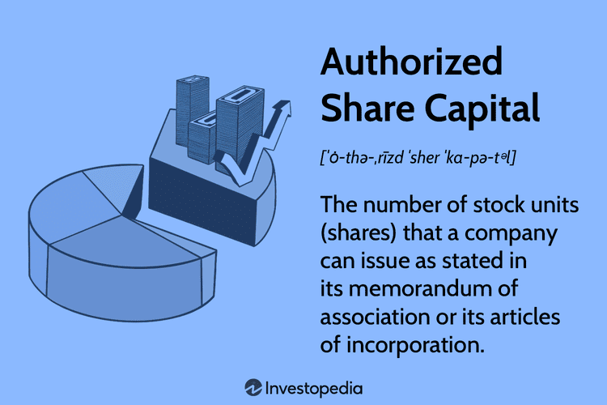

## Table of Contents

## What is an authorized currency?

An authorized currency is money that a government or a central bank says is okay to use in a country. It's the kind of money that people use every day to buy things, pay bills, and save. For example, in the United States, the authorized currency is the U.S. dollar. This means that shops, businesses, and people use the dollar for all their money needs.

Sometimes, a country might have more than one authorized currency. This can happen in places where different regions use different kinds of money, or when a country decides to use another country's money alongside its own. For example, some countries in Europe use the Euro, which is the authorized currency for the European Union. Using an authorized currency helps keep the economy stable and makes it easier for people to trade and do business with each other.

## How is an authorized currency different from other types of currencies?

An authorized currency is different from other types of currencies because it is the official money that a country's government or central bank says is okay to use. This means that everyone in the country uses it to buy things, pay bills, and save money. For example, in Japan, the authorized currency is the Yen. People in Japan use the Yen every day because it's the money their government says is good to use. Other types of currencies, like cryptocurrencies or foreign money, are not the official money of the country, so people might not use them as much or they might be harder to use.

Other types of currencies include things like cryptocurrencies, which are digital money that people can use online, but they are not backed by a government. For example, Bitcoin is a [cryptocurrency](/wiki/cryptocurrency) that some people use, but it's not an authorized currency in any country. There are also foreign currencies, which are the official money of other countries. If you travel to another country, you might need to use their authorized currency instead of your own. For example, if you go from the United States to Mexico, you would need to use Mexican Pesos instead of U.S. dollars because the Peso is Mexico's authorized currency.

## Who has the authority to issue an authorized currency?

The authority to issue an authorized currency usually belongs to a country's government or its central bank. The central bank is like a big bank that controls the money in a country. It makes sure there is enough money for everyone to use and that the money stays valuable. When the central bank issues new money, it's because the government says it's okay. This helps keep the economy stable and makes sure everyone can trust the money they use.

Sometimes, a group of countries might work together to issue an authorized currency. A good example is the European Union, where many countries use the Euro. The European Central Bank, which is like the central bank for all these countries, issues the Euro. This makes it easier for people in different countries to trade and do business with each other. Even though it's a bit more complicated, the idea is the same: the money is backed by the authority of the governments involved.

## What are the criteria for a currency to be considered authorized?

For a currency to be considered authorized, it needs to be officially recognized and backed by a country's government or central bank. This means the government says it's okay to use this money for buying things, paying bills, and saving. When a currency is authorized, everyone in the country knows they can trust it because it's supported by the people in charge of the country's money.

Sometimes, a group of countries might agree to use the same authorized currency. For example, many countries in Europe use the Euro, which is backed by the European Central Bank. This makes it easier for people in different countries to trade and do business with each other. Even though it involves more than one country, the key thing is that the currency is still officially recognized and supported by the governments involved.

## Can authorized currencies be used internationally?

Yes, authorized currencies can be used internationally. When people travel to different countries, they often need to exchange their home country's money for the authorized currency of the country they are visiting. For example, if someone from the United States goes to Japan, they would exchange their U.S. dollars for Japanese Yen, which is Japan's authorized currency. This way, they can buy things and pay for services while they are in Japan.

Some authorized currencies are used more widely around the world. The U.S. dollar, for example, is accepted in many countries because it's seen as a strong and stable currency. People in different countries might even use the U.S. dollar alongside their own authorized currency. This makes it easier for people to trade and do business with each other, no matter where they are from.

## How does the authorization process for a currency work?

The authorization process for a currency starts with the government or the central bank of a country. They decide that a certain type of money is going to be used by everyone in the country. This decision is important because it means the government is saying this money is okay to use for buying things, paying bills, and saving. Once the government or the central bank makes this decision, they start making the money. They print it, or if it's digital money, they create it in computers. They also make rules about how the money should be used and how much of it there should be.

Sometimes, a group of countries might work together to authorize a currency. For example, many countries in Europe use the Euro, which is managed by the European Central Bank. The European Central Bank works with the governments of all the countries that use the Euro to make sure the money stays valuable and that there is enough of it for everyone. When a group of countries does this, it can make it easier for people in different countries to trade and do business with each other. But the basic idea is the same: the money is officially recognized and backed by the governments involved.

## What are the benefits of using an authorized currency?

Using an authorized currency makes things easier for everyone. When a country has its own money that the government says is okay to use, people know they can trust it. They can use it to buy things, pay bills, and save without worrying. It also helps keep the economy stable. When everyone uses the same money, it's easier for businesses to trade and for people to know how much things cost.

Another benefit is that authorized currencies can be used in other countries too. When people travel, they can exchange their money for the authorized currency of the country they are visiting. Some authorized currencies, like the U.S. dollar, are even used in other countries because they are seen as strong and stable. This makes it easier for people from different countries to trade and do business with each other, no matter where they are from.

## What are the potential risks associated with authorized currencies?

Using an authorized currency can have some risks. One big risk is inflation, which means the money loses value over time. If the government or central bank prints too much money, it can make prices go up and the money worth less. This can make it hard for people to buy things and save money. Another risk is that the government might change the rules about the money, which can make people unsure about using it. If people start to think the money isn't good anymore, they might not want to use it, and this can hurt the economy.

Another risk is that the value of the authorized currency can change compared to other countries' money. If the currency becomes weaker, it can make things more expensive when people buy things from other countries. This can affect businesses that trade with other countries and can make it harder for people to travel or buy things from abroad. Also, if a country's economy has problems, it can make the authorized currency less stable, which can make people lose trust in it.

## How do authorized currencies impact global trade?

Authorized currencies play a big role in global trade because they help countries buy and sell things with each other. When countries use their own authorized currencies, they can set prices and make deals in a way that everyone understands. For example, if a company in Japan wants to buy something from a company in the United States, they might need to exchange their Yen for U.S. dollars. This makes it easier for both countries to do business because they know what the money is worth.

Some authorized currencies, like the U.S. dollar, are used a lot in global trade even in countries where they are not the official money. This is because the U.S. dollar is seen as strong and stable, so many countries trust it. When countries use the same currency for trade, it can make things simpler and faster. But if the value of one country's currency changes a lot compared to another's, it can make trade more complicated and expensive. This can affect how much countries trade with each other and how much things cost.

## What role do central banks play in managing authorized currencies?

Central banks are really important when it comes to managing authorized currencies. They are like big banks that control the money in a country. They decide how much money should be made and they make sure there is enough money for everyone to use. They also set rules about how the money should be used. If the central bank thinks there is too much money, they might make less of it. If they think there is not enough money, they might make more. This helps keep the money valuable and makes sure the economy stays stable.

Central banks also watch over the value of the authorized currency compared to other countries' money. If the currency is getting weaker, the central bank might do things to make it stronger. They might change interest rates or buy and sell other countries' money to keep their own money stable. This is important for global trade because it helps businesses know how much things will cost when they buy and sell things with other countries. By managing the authorized currency, central banks help keep the economy running smoothly and make sure people can trust the money they use.

## How have authorized currencies evolved historically?

Authorized currencies have changed a lot over time. A long time ago, people used things like shells, beads, or even salt to trade with each other. Then, they started using metal coins made from gold, silver, or bronze. These coins were easier to use and [carry](/wiki/carry-trading) around. Governments started to make these coins and say they were the official money. This was the start of authorized currencies. Later, paper money came along. It was easier to make and carry than heavy coins. Governments would print the paper money and say it was good to use, just like they did with coins.

As time went on, authorized currencies kept changing. In the 20th century, countries started using central banks to control their money. Central banks could print money and make rules about how it should be used. They also started using digital money, which is money that exists on computers and can be used online. This made it easier for people to buy things without using cash. Today, most countries have their own authorized currency, but some groups of countries, like those in the European Union, use the same currency, like the Euro. This makes it easier for them to trade with each other. Even though authorized currencies have changed a lot, they are still important for keeping the economy stable and helping people buy things.

## What future trends might affect the use and regulation of authorized currencies?

In the future, new technologies like digital money and cryptocurrencies might change how we use and control authorized currencies. Right now, most countries use money that their government says is okay to use. But more and more, people are starting to use digital money, like the money on their phones or computers. Some countries are even thinking about making their own digital versions of their authorized currency. This could make it easier for people to buy things without using cash. But it also means that governments and central banks will need to make new rules to make sure this digital money stays safe and valuable.

Another big change could come from cryptocurrencies like Bitcoin. These are digital money that people can use online, but they are not backed by any government. Some people think that cryptocurrencies might become more popular and even start to be used like authorized currencies. This could make it harder for governments to control the money in their country. They might need to make new laws to deal with cryptocurrencies and figure out how to keep their own authorized currency strong. As these trends keep changing, the way we use and control authorized currencies will probably keep changing too.

## References & Further Reading

[1]: Aldridge, I. (2013). ["High-Frequency Trading: A Practical Guide to Algorithmic Strategies and Trading Systems."](https://www.amazon.com/High-Frequency-Trading-Practical-Algorithmic-Strategies/dp/1118343506) Wiley.

[2]: Kissell, R. (2013). ["The Science of Algorithmic Trading and Portfolio Management."](https://www.sciencedirect.com/book/9780124016897/the-science-of-algorithmic-trading-and-portfolio-management) Academic Press.

[3]: Narang, R. K. (2013). ["Inside the Black Box: A Simple Guide to Quantitative and High Frequency Trading."](https://onlinelibrary.wiley.com/doi/book/10.1002/9781118662717) Wiley.

[4]: Securities and Exchange Commission & Commodity Futures Trading Commission Joint Report. ["Findings Regarding the Market Events of May 6, 2010."](https://www.sec.gov/news/studies/2010/marketevents-report.pdf) (2010).

[5]: Domowitz, I., & Madhavan, A. (2002). ["The Emergence of Electronic Communications Networks in the U.S. Equity Markets."](https://papers.ssrn.com/sol3/papers.cfm?abstract_id=295765) Financial Analysts Journal, 58(1), 18-27.