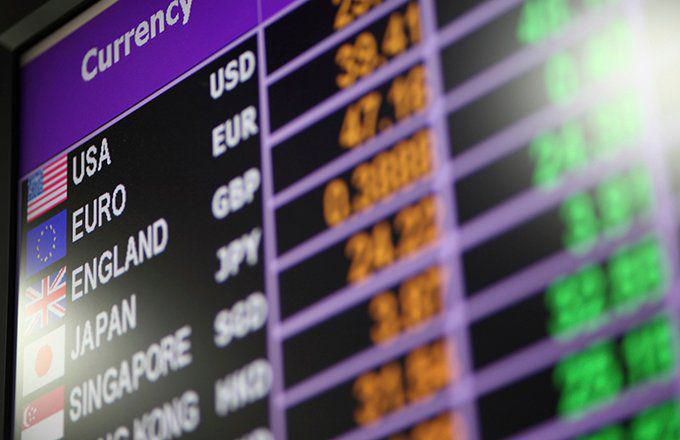

## Table of Contents

## What is an authorized forex dealer?

An authorized forex dealer is a person or company that the government has given permission to buy and sell foreign currencies. They help people and businesses exchange one country's money for another country's money. This is important for people who travel to different countries or for companies that do business in different parts of the world.

These dealers follow rules set by the government to make sure that the buying and selling of foreign money is done fairly and safely. They keep track of exchange rates and make sure that people get a fair price when they exchange their money. Authorized forex dealers can be found at banks, money exchange offices, or even online, making it easy for anyone to convert their money when needed.

## What are the primary functions of an authorized forex dealer?

An authorized forex dealer mainly helps people and businesses exchange one country's money for another's. They make sure that when someone wants to change their money, they get a fair price based on the current exchange rate. This is really helpful for travelers who need foreign money for their trips or for companies that do business in different countries and need to pay for things in different currencies.

These dealers also follow strict rules set by the government to keep everything safe and fair. They keep records of all the money exchanges they do, which helps prevent fraud and illegal activities. By doing this, they make sure that the process of buying and selling foreign money is trustworthy and secure for everyone who uses their services.

## How does one become an authorized forex dealer?

To become an authorized [forex](/wiki/forex-system) dealer, a person or company needs to get permission from the government. This usually involves applying to a financial regulatory authority, like a central bank or a ministry of finance. The application process can be detailed and might need the applicant to show they have enough knowledge about foreign exchange markets, good business practices, and the ability to follow strict rules and laws.

Once the application is submitted, it will be reviewed to make sure the applicant meets all the requirements. This might include checks on the applicant's financial stability, their background, and their plans for running a forex dealing business. If everything looks good, the applicant will be given a license or authorization to operate as a forex dealer. They will then need to follow ongoing rules and might have to report regularly to the regulatory authority to keep their status as an authorized forex dealer.

## What are the regulatory requirements for an authorized forex dealer?

To be an authorized forex dealer, you need to follow many rules set by the government. These rules make sure that the buying and selling of foreign money is done fairly and safely. You need to have a good understanding of the foreign exchange market and show that you can run your business well. You also need to prove that you have enough money to start and keep running your business. The government will check your background to make sure you are trustworthy and will follow all the laws.

Once you get your license, you have to keep following the rules to stay an authorized forex dealer. This means you need to keep good records of all the money exchanges you do. You also need to report regularly to the government about your business. This helps the government keep an eye on things and stop any illegal activities. If you do not follow these rules, you could lose your license and not be allowed to work as a forex dealer anymore.

## What services can an authorized forex dealer provide to clients?

An authorized forex dealer helps clients change one country's money into another country's money. This is really useful for people who are traveling to different countries and need foreign money for their trip. It's also important for businesses that work in different parts of the world and need to pay for things in different currencies. The dealer makes sure that clients get a fair price when they exchange their money, based on the current exchange rates.

Besides just exchanging money, an authorized forex dealer can also offer other services. They can help clients send money to other countries, which is helpful for people who want to send money to family or friends abroad. They can also give advice about the best times to exchange money and help clients understand how changes in exchange rates might affect their money. This way, clients can make smart decisions about when and how to exchange their money.

## How do authorized forex dealers manage currency exchange risks?

Authorized forex dealers manage currency exchange risks by keeping an eye on the foreign exchange market all the time. They watch how the value of different currencies changes and use this information to make smart decisions. They might use special tools and methods to predict how exchange rates will change in the future. This helps them know when it's a good time to buy or sell currencies for their clients, so they can get the best possible price.

Another way they manage risk is by using something called hedging. Hedging is like a safety net that protects them from big losses if the exchange rate suddenly changes in a bad way. For example, they might buy a special contract that guarantees they can exchange money at a certain rate, even if the actual rate goes down. By doing this, they can make sure that their clients don't lose a lot of money, and they can keep their business safe and stable.

## What are the differences between an authorized forex dealer and a money changer?

An authorized forex dealer and a money changer both help people exchange one country's money for another's, but they are different in some ways. An authorized forex dealer is a person or company that the government has given special permission to do this. They follow strict rules to make sure everything is fair and safe. They also offer more services like sending money to other countries and giving advice on the best times to exchange money. This makes them a good choice for people who need more than just a simple exchange.

On the other hand, a money changer is usually a smaller business that focuses mostly on exchanging money. They might not have the same level of government permission that an authorized forex dealer has. Money changers are often found in places like airports or tourist areas, and they mainly help travelers who need foreign money quickly. They might not offer extra services like sending money abroad or giving financial advice. So, while both help with currency exchange, an authorized forex dealer can do more and has to follow more rules.

## How do authorized forex dealers ensure compliance with anti-money laundering laws?

Authorized forex dealers follow strict rules to stop money laundering. They do this by keeping a close watch on all the money exchanges they handle. They check where the money comes from and where it's going. If something looks suspicious, they report it to the government. This helps catch people who might be using the forex market to hide illegal money.

They also have to train their workers to know the signs of money laundering. This way, everyone in the company knows what to look out for. They keep good records of all their transactions, so if the government needs to check, they can show everything clearly. By doing all these things, authorized forex dealers help make sure that the money they handle is clean and not being used for illegal activities.

## What role do authorized forex dealers play in international trade?

Authorized forex dealers help a lot in international trade. They let businesses change their money into the currency of the country they are trading with. This is important because when a company in one country wants to buy things from another country, they need to pay in the other country's money. The forex dealer makes sure the business gets a fair exchange rate, so they don't lose money on the deal.

Besides just changing money, authorized forex dealers also help businesses manage the risks of changing exchange rates. If the value of one currency goes up or down a lot, it can affect how much a business has to pay or how much they get paid. The forex dealer can use special tools to protect the business from these changes. This makes international trade safer and easier for everyone involved.

## How do authorized forex dealers impact the foreign exchange market?

Authorized forex dealers play a big role in the foreign exchange market. They help keep the market stable by making sure there's always someone ready to buy or sell different currencies. When people or businesses want to exchange money, they go to these dealers. This means there's always a lot of activity in the market, which helps keep exchange rates from changing too wildly. If there were no authorized forex dealers, it would be harder for people to exchange money, and the market might become less stable.

These dealers also help set the exchange rates. They watch the market all the time and use what they see to decide what prices to offer their clients. By doing this, they help make sure that the prices people pay to exchange money are fair. They also use special tools to protect themselves and their clients from big changes in exchange rates. This makes the whole foreign exchange market work better and helps people trust it more.

## What advanced trading strategies can authorized forex dealers employ?

Authorized forex dealers can use something called hedging to protect their clients' money from big changes in exchange rates. Hedging is like buying insurance for currency trades. For example, if a dealer thinks the value of a currency might go down, they can use a special contract to lock in a good exchange rate now. This way, even if the currency does go down, their clients won't lose as much money. Hedging helps dealers manage the risk of the foreign exchange market, making it safer for everyone.

Another strategy they might use is called [scalping](/wiki/gamma-scalping). Scalping means making a lot of small trades very quickly to take advantage of tiny changes in exchange rates. Dealers who use this strategy need to watch the market very closely and be ready to act fast. By making these small trades, they can earn a little bit of money from each one, and over time, these small profits can add up. Scalping requires a lot of skill and quick thinking, but it can be a good way for dealers to make money in the fast-moving world of forex trading.

## How do technological advancements affect the operations of authorized forex dealers?

Technological advancements have made a big difference in how authorized forex dealers work. Now, they can use special computer programs to watch the foreign exchange market all the time. These programs help them see changes in exchange rates quickly and make smart decisions about when to buy or sell currencies. They can also use the internet to offer their services online, which makes it easier for people all over the world to exchange money without having to go to a physical location. This means more people can use their services, and it's more convenient for everyone.

Another way technology helps is by making things safer and more secure. Forex dealers can use special security systems to protect their clients' money and information. They can also use technology to keep better records of all their transactions, which is important for following the rules and stopping illegal activities like money laundering. By using these new tools, authorized forex dealers can work more efficiently, offer better services, and make sure their clients' money is safe.

## References & Further Reading

[1]: Bank for International Settlements. (2019). ["Triennial Central Bank Survey of Foreign Exchange and Over-the-counter (OTC) Derivatives Markets in 2019."](https://www.bis.org/statistics/rpfx19.htm)

[2]: National Futures Association (NFA). ["Forex Dealer Members Information."](https://www.nfa.futures.org/members/fdm/index.html)

[3]: Commodity Futures Trading Commission (CFTC). ["Foreign Currency Trading"](https://www.cftc.gov/LearnAndProtect/AdvisoriesAndArticles/ForeignCurrencyTrading/index.htm)

[4]: Marcos López de Prado. (2018). ["Advances in Financial Machine Learning"](https://www.amazon.com/Advances-Financial-Machine-Learning-Marcos/dp/1119482089)

[5]: Stefan Jansen. (2020). ["Machine Learning for Algorithmic Trading"](https://github.com/stefan-jansen/machine-learning-for-trading)