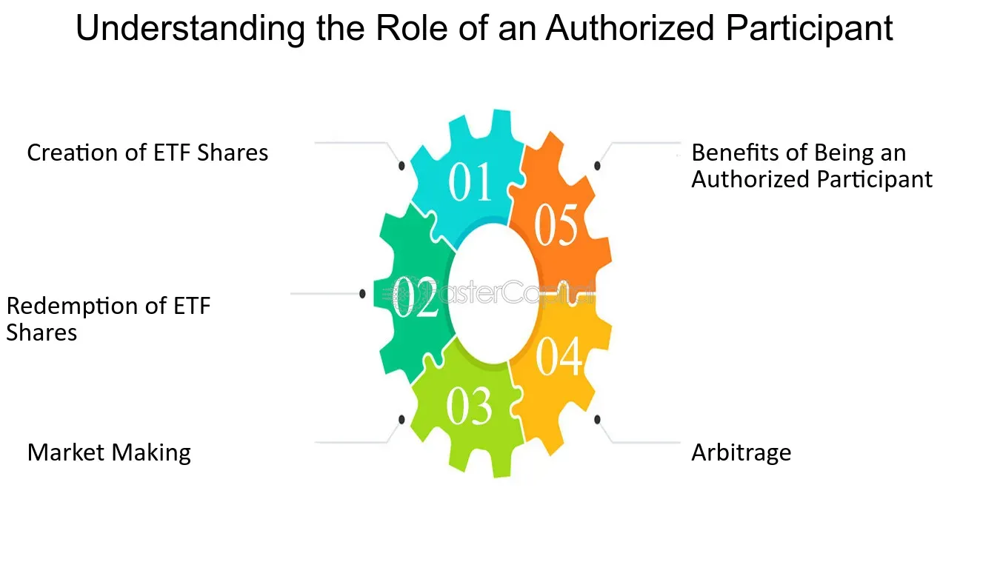

## Table of Contents

## What is an Authorized Participant (AP)?

An Authorized Participant (AP) is a special type of financial firm that works closely with exchange-traded funds (ETFs). These firms are usually big banks or investment companies. Their main job is to help create and redeem ETF shares. When an ETF wants to start or grow, the AP gathers the right mix of stocks or bonds, called a "creation unit," and gives it to the ETF. In return, the ETF gives the AP new ETF shares, which the AP can then sell to investors.

APs also help when investors want to cash out their ETF shares. If someone wants to sell a lot of ETF shares, the AP can take those shares back to the ETF. The ETF then gives the AP the equivalent value in stocks or bonds. This process is called "redemption." By doing this, APs help keep the ETF's price in line with the value of its underlying assets, making sure the ETF works smoothly in the market.

## What is the primary role of an Authorized Participant in the financial market?

The main job of an Authorized Participant (AP) in the financial market is to help create and manage exchange-traded funds (ETFs). An AP, usually a big bank or investment company, works with ETFs to gather the right mix of stocks or bonds. This mix is called a "creation unit." The AP gives this creation unit to the ETF, and in return, the ETF gives the AP new ETF shares. The AP can then sell these shares to investors. This process helps the ETF start or grow.

APs also play a key role when investors want to cash out their [ETF](/wiki/etf-trading-strategies) shares. If someone wants to sell a lot of ETF shares, the AP can take those shares back to the ETF. The ETF then gives the AP the equivalent value in stocks or bonds, a process known as "redemption." By doing this, APs help keep the ETF's price close to the value of its underlying assets. This keeps the ETF working smoothly in the market and ensures it stays a reliable investment option for people.

## How does an Authorized Participant interact with Exchange-Traded Funds (ETFs)?

An Authorized Participant (AP) works closely with Exchange-Traded Funds (ETFs) to help them grow and manage their shares. When an ETF wants to start or increase its size, the AP collects a specific mix of stocks or bonds, called a "creation unit." The AP then gives this creation unit to the ETF. In return, the ETF gives the AP new ETF shares. The AP can then sell these new shares to investors. This process helps the ETF to have more shares available for people to buy.

APs also help when investors want to sell their ETF shares. If someone wants to sell a lot of ETF shares, the AP can take those shares back to the ETF. The ETF then gives the AP the same value in stocks or bonds. This is called "redemption." By doing this, APs help keep the price of the ETF close to the value of the stocks or bonds it holds. This makes sure the ETF works well and stays a good choice for investors.

## What are the steps involved in the creation and redemption process of ETF shares by an AP?

When an ETF wants to create new shares, the Authorized Participant (AP) starts by gathering a specific mix of stocks or bonds, called a "creation unit." The AP then gives this creation unit to the ETF. In return, the ETF gives the AP new ETF shares. The AP can then sell these new shares to investors. This process helps the ETF to have more shares available for people to buy and helps the ETF grow.

When investors want to sell their ETF shares, the AP helps with the redemption process. If someone wants to sell a lot of ETF shares, the AP takes those shares back to the ETF. The ETF then gives the AP the same value in stocks or bonds that were in the creation unit. This is called "redemption." By doing this, the AP helps keep the price of the ETF close to the value of the stocks or bonds it holds. This makes sure the ETF works well and stays a good choice for investors.

## What qualifications are needed to become an Authorized Participant?

To become an Authorized Participant (AP), a firm usually needs to be a big bank or investment company. They need to have a lot of money and be able to handle big trades. They also need to have good relationships with the people who run ETFs. This is because they work closely with ETFs to create and redeem shares. They need to know a lot about the market and be able to handle the risks that come with trading big amounts of stocks or bonds.

APs also need to follow strict rules set by the ETF and the financial markets. They need to have the right systems and technology to manage the creation and redemption process smoothly. They also need to be able to keep the ETF's price close to the value of its underlying assets. This means they need to be good at trading and understanding how the market works. Being an AP is a big job that needs a lot of trust and skill.

## What are the benefits of being an Authorized Participant for financial institutions?

Being an Authorized Participant (AP) can help big banks and investment companies make more money. When they create new ETF shares, they can sell these shares to investors. This means they can earn money from the difference between the price they pay for the stocks or bonds and the price they sell the ETF shares for. Also, when investors want to sell their ETF shares, the AP can take these shares back and get the stocks or bonds in return. This can be another way for the AP to make money if they can sell those stocks or bonds at a good price.

Being an AP also helps these firms build strong relationships with ETF providers. This can lead to more business opportunities and make them important players in the financial market. By working closely with ETFs, APs can learn a lot about the market and use this knowledge to do better in their other trading activities. This can make them more successful and respected in the financial world.

## How do Authorized Participants impact the liquidity and pricing of ETFs?

Authorized Participants (APs) help keep ETFs liquid, which means it's easy to buy and sell ETF shares. When people want to buy ETF shares, APs can create new shares by giving the ETF a basket of stocks or bonds. This means there are always more shares available when people want them. On the other hand, when people want to sell their ETF shares, APs can take those shares back and give them the stocks or bonds in return. This makes it easy for people to sell their shares, which helps keep the ETF liquid.

APs also help keep the price of the ETF close to the value of the stocks or bonds it holds. If the ETF's price is too high, APs can create more shares and sell them, which can bring the price down. If the ETF's price is too low, APs can buy up the shares and redeem them for the stocks or bonds, which can push the price up. By doing this, APs make sure the ETF's price stays close to what it should be, which is good for investors.

## What are the risks associated with being an Authorized Participant?

Being an Authorized Participant (AP) can be risky because it involves handling large amounts of stocks or bonds. When an AP creates ETF shares, they have to buy the stocks or bonds first. If the prices of these stocks or bonds go down before the AP can sell the ETF shares, they might lose money. Also, if the market is not stable, it can be hard for the AP to predict what will happen, which adds more risk.

Another risk is that APs need to follow strict rules set by the ETF and the financial markets. If they make a mistake or do something wrong, they could face big fines or other problems. Also, being an AP means working closely with ETFs, and if something goes wrong with the ETF, it could affect the AP's business. So, APs need to be very careful and good at managing risks to do well in this role.

## Can you explain how arbitrage works in the context of an Authorized Participant's activities?

Arbitrage is a way for Authorized Participants (APs) to make money by taking advantage of small differences in prices. When an AP sees that the price of an ETF is a bit higher than the value of the stocks or bonds it holds, they can create new ETF shares. They do this by buying the stocks or bonds, giving them to the ETF, and getting new ETF shares in return. Then, they sell these new ETF shares at the higher price. This helps bring the ETF's price back down to match the value of the stocks or bonds.

On the other hand, if the ETF's price is lower than the value of its stocks or bonds, the AP can buy up the ETF shares. They take these shares back to the ETF and get the stocks or bonds in return. Then, they sell the stocks or bonds at a higher price. This helps push the ETF's price back up to match the value of the stocks or bonds. By doing this, APs help keep the ETF's price in line with what it should be, and they can make money from the small price differences.

## What is the relationship between Authorized Participants and market makers?

Authorized Participants (APs) and market makers both help keep the market running smoothly, but they do different jobs. APs work directly with ETFs to create and redeem shares. They gather stocks or bonds to give to the ETF and get new ETF shares in return. This helps the ETF grow and keeps its price close to the value of the stocks or bonds it holds. Market makers, on the other hand, help make it easy for people to buy and sell stocks or ETFs. They do this by always being ready to buy or sell at certain prices, which helps keep the market liquid.

Even though APs and market makers have different roles, they work together to help the market. When APs create or redeem ETF shares, it can affect the supply of those shares in the market. This can change the price of the ETF. Market makers watch these changes and adjust their buying and selling prices to keep the market stable. So, while APs focus on the creation and redemption of ETF shares, market makers focus on making sure there's always someone ready to trade, which helps keep the market working well for everyone.

## How do regulatory requirements affect the operations of Authorized Participants?

Regulatory requirements make sure that Authorized Participants (APs) follow strict rules when they work with ETFs. These rules come from financial regulators and the ETFs themselves. APs need to have enough money and the right systems to handle big trades. They also need to report what they are doing and make sure they are not taking too many risks. If they do not follow these rules, they could get in trouble and have to pay big fines.

These rules help keep the market fair and safe for everyone. They make sure that APs are doing their job the right way and not cheating. By following the rules, APs help keep the price of ETFs close to the value of the stocks or bonds they hold. This makes ETFs a good choice for people to invest in. Even though the rules can make things harder for APs, they are important for keeping the market working well.

## What advanced strategies can Authorized Participants use to optimize their role in the ETF ecosystem?

Authorized Participants (APs) can use smart trading strategies to make more money and help ETFs work better. One way they can do this is by using [arbitrage](/wiki/arbitrage). When they see that an ETF's price is a bit higher than the value of the stocks or bonds it holds, they can create new ETF shares and sell them at the higher price. This helps bring the ETF's price back down to where it should be. If the ETF's price is too low, they can buy up the shares, take them back to the ETF, and get the stocks or bonds in return. Then, they can sell those stocks or bonds at a higher price. This helps push the ETF's price back up. By doing this, APs can make money from small price differences and help keep the ETF's price in line with its value.

APs can also use technology to make their job easier and faster. They can use special computer programs to watch the market and see when it's a good time to create or redeem ETF shares. These programs can help them make quick decisions and handle big trades without making mistakes. By using technology, APs can do their job better and help keep the market running smoothly. This can also help them build strong relationships with ETF providers and other people in the market, which can lead to more business opportunities.

## What is the mechanism of authorized participants in ETF markets?

Authorized participants (APs) play a critical role in the functioning of the exchange-traded fund (ETF) markets by managing the creation and redemption of ETF shares. This mechanism is central to keeping the market prices of ETFs aligned with the net asset value (NAV) of their underlying assets, thereby ensuring market efficiency and [liquidity](/wiki/liquidity-risk-premium). 

### Creation and Redemption Process

APs are typically large financial institutions that have the capability to interact directly with the ETF's fund manager. The process begins when an AP wishes to create new ETF shares. The AP assembles a portfolio of the underlying securities that the ETF aims to hold. This portfolio is referred to as the "creation basket." The AP then delivers the creation basket to the ETF sponsor in exchange for newly minted ETF shares. This exchange ensures that the ETF's holdings replicate its underlying index.

Conversely, for the redemption of ETF shares, the AP presents a block of ETF shares to the fund sponsor, who in return provides the AP with the underlying securities. This reverse transaction is vital for maintaining the liquidity of ETFs in both primary and secondary markets.

### Arbitrage Mechanism

The arbitrage function is essential for maintaining the alignment between ETF prices and their NAV. Arbitrage opportunities arise due to discrepancies between the market price of an ETF and the NAV of its underlying assets. If an ETF is trading at a premium (market price above NAV), an AP can sell ETF shares short and simultaneously buy the underlying securities. Later, the AP creates ETF shares by surrendering the underlying securities for new ETF shares, which are then used to cover the short position. Conversely, if an ETF is trading at a discount (market price below NAV), an AP buys ETF shares, redeems them for underlying securities, and sells those securities for a profit.

This arbitrage mechanism can be represented as follows:

- Let $P_{\text{ETF}}$ be the market price of the ETF, and $\text{NAV}$ be the net asset value.
- If $P_{\text{ETF}} > \text{NAV}$ (premium), the AP performs a creation arbitrage:
$$
  \text{Profit} = P_{\text{ETF}} - \text{NAV}

$$
- If $P_{\text{ETF}} < \text{NAV}$ (discount), the AP performs a redemption arbitrage:
$$
  \text{Profit} = \text{NAV} - P_{\text{ETF}}

$$

This arbitrage process not only ensures price alignment but also stabilizes the market by eliminating pricing inefficiencies. The continuous engagement of APs in these transactions enables ETFs to remain attractive to investors, as they can reliably trade close to the NAV of the underlying portfolio.

In summary, authorized participants facilitate the seamless functioning of ETF markets through strategically executed creation and redemption transactions, underpinned by efficient arbitrage mechanisms. Their activities contribute significantly to market stability and liquidity, ultimately benefiting investors by ensuring that ETF prices closely reflect the value of their underlying assets.

## References & Further Reading

[1]: Madhavan, A. (2016). ["Exchange-Traded Funds, Market Structure, and the Flash Crash."](https://www.tandfonline.com/doi/abs/10.2469/faj.v68.n4.6) Financial Analysts Journal, 72(4), 6-20.

[2]: Fabozzi, F. J., Focardi, S. M., & Kolm, P. N. (2010). ["Quantitative Equity Investing: Techniques and Strategies."](https://www.semanticscholar.org/paper/Quantitative-Equity-Investing%3A-Techniques-and-Fabozzi-Focardi/1c49a2a53919f7e65cb96f16691b8ff726fd3cd7) Wiley.

[3]: Hasbrouck, J. (2007). ["Empirical Market Microstructure: The Institutions, Economics, and Econometrics of Securities Trading."](https://archive.org/details/empiricalmarketm0000hasb) Oxford University Press.

[4]: Easley, D., López de Prado, M. M., & O’Hara, M. (2012). ["The Volume Clock: Insights into the High Frequency Paradigm."](https://papers.ssrn.com/sol3/papers.cfm?abstract_id=2034858) Review of Financial Studies, 25(7), 2267-2300.

[5]: Petajisto, A. (2013). ["Inefficiencies in the Pricing of Exchange-Traded Funds."](https://www.tandfonline.com/doi/abs/10.2469/faj.v73.n1.7) Financial Analysts Journal, 69(6), 59-77.

[6]: Aldridge, I. (2013). ["High-Frequency Trading: A Practical Guide to Algorithmic Strategies and Trading Systems."](https://books.google.com/books/about/High_Frequency_Trading.html?id=6l0DDQAAQBAJ) Wiley.