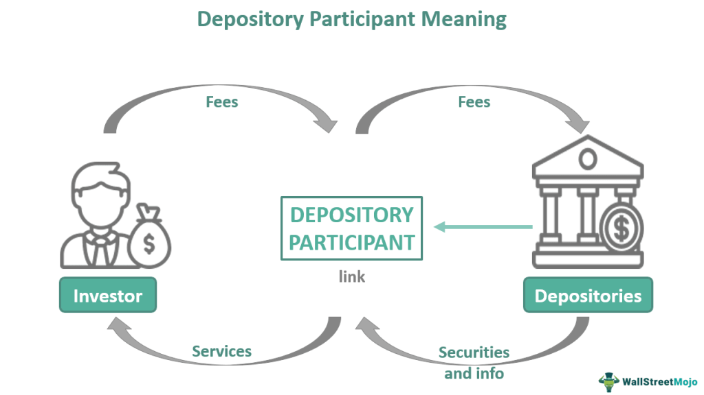

The financial markets represent intricate ecosystems where a diverse array of participants, from individual traders to large-scale institutional investors, interact. These markets are essential for the efficient allocation of capital, enabling entities to raise funds by trading assets such as stocks, bonds, and derivatives. As technological advancements continue to reshape these environments, investment strategies have undergone significant transformations. One of the most noteworthy developments in this domain is the rise of algorithmic trading, which utilizes advanced computational tools to execute trades at high speeds based on preset criteria.

Within this intricate system, authorized participants (APs) play a pivotal role, particularly in exchange-traded funds (ETFs). Authorized participants are crucial for ensuring liquidity and maintaining market efficiency. They are primarily large financial institutions such as banks and hedge funds, which are authorized to create and redeem ETF shares. This capacity allows them to maintain the equilibrium between the price of an ETF and the net asset value (NAV) of its underlying assets, thereby optimizing market operations and contributing to financial stability.

This article examines the critical intersections among financial market investments, the role of authorized participants, and the utilization of algorithmic trading. Understanding these components is vital for investors who aim to optimize their strategies and navigate the complexities of modern markets. By gaining insights into how these elements interact, investors can better equip themselves to make informed decisions, maximize returns, and mitigate risks.

## Table of Contents

## Understanding Financial Markets

Financial markets serve as critical platforms for the exchange of various financial instruments, including stocks, bonds, and derivatives. These markets facilitate price discovery, a process through which the prices of securities are determined by the interactions of buyers and sellers. The efficient allocation of capital within the economy greatly depends on the liquidity and transparency provided by these markets, enabling businesses to access necessary funding and investors to achieve returns on their capital.

Investors within financial markets vary significantly, ranging from individual retail investors to large institutional investors such as pension funds, mutual funds, and insurance companies. Each investor group implements diverse strategies to meet their specific objectives, which include profit maximization, risk management, and portfolio diversification.

The advent of technology has significantly altered the landscape of financial markets, introducing advanced trading platforms, electronic communication networks (ECNs), and algorithmic trading. These technological developments have increased the speed and efficiency of trading activities, reducing transaction costs and enhancing market accessibility. As a result, understanding the mechanisms that underpin market dynamics has become crucial for investors seeking to navigate this evolving environment effectively.

One of the most critical components of successful financial market interactions is [liquidity](/wiki/liquidity-risk-premium), which refers to the ease with which assets can be bought or sold without causing significant changes in their prices. High liquidity levels ensure market stability and attract a wide range of participants, fostering an environment conducive to efficient capital allocation. Moreover, technological advancements have enabled real-time data analysis, allowing investors to make informed decisions quickly based on the latest market information.

The transformation of market dynamics driven by technological advancements necessitates a comprehensive understanding of financial markets. Market participants must stay abreast of new developments and adapt their strategies to remain competitive and capitalize on emerging opportunities. Consequently, both individual and institutional investors are increasingly reliant on data-driven approaches and sophisticated analytical tools to interpret market trends and optimize their investment outcomes.

## The Role of Investment in Financial Markets

Investments in financial markets are pivotal for economic development, as they provide the necessary capital that businesses require for growth and expansion. Through investments, companies can fund new projects, acquire equipment, and drive innovation, thereby enhancing productivity and contributing to overall economic prosperity. 

A variety of investment instruments are available in financial markets to cater to different risk preferences and investment goals. Exchange-Traded Funds (ETFs) offer a diversified portfolio of assets, making them a popular choice for risk-averse investors. Stocks represent ownership in a company and are favored by those willing to bear higher risk for potentially higher returns. Bonds, being debt instruments, are generally considered safer investments, providing fixed income over time with lower risk.

The evolution of technology has introduced automated investing strategies that complement traditional methods. Algorithmic trading stands out as a prominent tool, allowing investors to execute trades based on specific criteria at high speed. This approach leverages complex algorithms to analyze market data, identifying profitable opportunities and optimizing trading decisions without human intervention. By automating these processes, investors can reduce emotional bias and enhance efficiency.

Balancing risk and return is a fundamental objective for investors, necessitating the deployment of diverse strategies that align with the prevailing market conditions. This balance involves analyzing various factors such as market trends, economic indicators, and geopolitical events to make informed decisions. Diversification is a common strategy employed to mitigate risk, spreading investments across different asset classes to minimize potential losses.

Ultimately, the role of investments in financial markets extends beyond individual portfolios. By channeling funds into businesses and industries, investments bolster economic expansion, foster innovation, and contribute to the creation of wealth across societies. Understanding the complex mechanisms of different investment strategies and instruments is crucial for optimizing outcomes in the modern financial landscape.

## Who Are Authorized Participants?

Authorized participants (APs) are crucial entities in the structure of exchange-traded funds (ETFs), tasked with the creation and redemption of [ETF](/wiki/etf-trading-strategies) shares to ensure market liquidity and efficiency. These entities include prominent financial institutions such as banks and hedge funds, which are granted the ability to transact directly with the ETF issuer. This unique capability enables APs to create or redeem ETF shares in large blocks, known as "creation units."

The primary mechanism through which APs operate involves aligning the ETF's market price with the net asset value (NAV) of its underlying assets. This alignment process is driven by an [arbitrage](/wiki/arbitrage) mechanism. When the market price of an ETF deviates from its NAV, APs can profit from arbitrage opportunities by buying or selling the ETF shares in conjunction with its underlying assets. For instance, if an ETF's market price is lower than its NAV, APs might purchase ETF shares and simultaneously sell the corresponding basket of securities, thus capitalizing on the price discrepancy.

By performing these functions, APs play an instrumental role in maintaining the price stability and integrity of ETFs. Their presence ensures that ETF prices closely reflect the value of the assets they represent, which is vital for investor confidence and market efficiency. Multiple APs operating within the market further enhance ETF liquidity and provide a buffer against significant price deviations. This multiplicity encourages competition, leading to narrower bid-ask spreads and better execution for investors.

The operational framework of authorized participants highlights their impact on both the liquidity provision and the stabilization of ETF markets. Their activities not only aid in the strategic management of ETFs but also contribute significantly to the robustness and reliability of financial markets.

## The Mechanism of Authorized Participants in ETF Markets

Authorized participants (APs) play a critical role in the functioning of the exchange-traded fund (ETF) markets by managing the creation and redemption of ETF shares. This mechanism is central to keeping the market prices of ETFs aligned with the net asset value (NAV) of their underlying assets, thereby ensuring market efficiency and liquidity. 

### Creation and Redemption Process

APs are typically large financial institutions that have the capability to interact directly with the ETF's fund manager. The process begins when an AP wishes to create new ETF shares. The AP assembles a portfolio of the underlying securities that the ETF aims to hold. This portfolio is referred to as the "creation basket." The AP then delivers the creation basket to the ETF sponsor in exchange for newly minted ETF shares. This exchange ensures that the ETF's holdings replicate its underlying index.

Conversely, for the redemption of ETF shares, the AP presents a block of ETF shares to the fund sponsor, who in return provides the AP with the underlying securities. This reverse transaction is vital for maintaining the liquidity of ETFs in both primary and secondary markets.

### Arbitrage Mechanism

The arbitrage function is essential for maintaining the alignment between ETF prices and their NAV. Arbitrage opportunities arise due to discrepancies between the market price of an ETF and the NAV of its underlying assets. If an ETF is trading at a premium (market price above NAV), an AP can sell ETF shares short and simultaneously buy the underlying securities. Later, the AP creates ETF shares by surrendering the underlying securities for new ETF shares, which are then used to cover the short position. Conversely, if an ETF is trading at a discount (market price below NAV), an AP buys ETF shares, redeems them for underlying securities, and sells those securities for a profit.

This arbitrage mechanism can be represented as follows:

- Let $P_{\text{ETF}}$ be the market price of the ETF, and $\text{NAV}$ be the net asset value.
- If $P_{\text{ETF}} > \text{NAV}$ (premium), the AP performs a creation arbitrage:
$$
  \text{Profit} = P_{\text{ETF}} - \text{NAV}

$$
- If $P_{\text{ETF}} < \text{NAV}$ (discount), the AP performs a redemption arbitrage:
$$
  \text{Profit} = \text{NAV} - P_{\text{ETF}}

$$

This arbitrage process not only ensures price alignment but also stabilizes the market by eliminating pricing inefficiencies. The continuous engagement of APs in these transactions enables ETFs to remain attractive to investors, as they can reliably trade close to the NAV of the underlying portfolio.

In summary, authorized participants facilitate the seamless functioning of ETF markets through strategically executed creation and redemption transactions, underpinned by efficient arbitrage mechanisms. Their activities contribute significantly to market stability and liquidity, ultimately benefiting investors by ensuring that ETF prices closely reflect the value of their underlying assets.

## Algorithmic Trading: An Overview

Algorithmic trading refers to the use of computer algorithms to automate the process of buying and selling financial instruments. These algorithms execute trades at high speed and high [volume](/wiki/volume-trading-strategy) based on predefined criteria, which may include price, timing, and volume triggers. The primary objective is to optimize trading decisions and capitalize on market inefficiencies. 

In modern financial markets, [algorithmic trading](/wiki/algorithmic-trading) is prevalent due to its ability to process vast amounts of data rapidly, allowing traders to respond to market movements more swiftly than a human trader ever could. This rapid execution can result in significant cost savings by reducing the impact of market movements between the decision to execute a trade and its finalization. For instance, a common technique employed is [statistical arbitrage](/wiki/statistical-arbitrage), where algorithms seek to identify temporary price discrepancies between related financial instruments and execute trades to profit from these differences. 

Despite its advantages, algorithmic trading systems must incorporate robust risk controls to mitigate potential market disruptions. Such risks include erroneous trades due to software bugs or algorithmic failures, which could lead to market distortions. To manage these risks, trading algorithms are often subject to rigorous [backtesting](/wiki/backtesting) against historical data to ensure their efficacy across varying market conditions. Moreover, techniques such as real-time monitoring and automatic shutdown mechanisms are implemented to halt trading if anomalies are detected.

Regulatory compliance is another critical facet for firms engaging in algorithmic trading. Regulatory bodies worldwide, including the Securities and Exchange Commission (SEC) in the United States and the European Securities and Markets Authority (ESMA), have established rigorous standards to ensure that algorithmic trading does not compromise market integrity. These standards typically require firms to maintain transparency regarding their algorithmic strategies and to implement measures that prevent manipulation or systemic risks.

Algorithmic trading has transformed financial markets by enhancing liquidity and efficiency. However, it necessitates substantial investment in technological infrastructure, continuous algorithmic improvement, and adherence to regulatory mandates to ensure markets remain fair and stable.

## Benefits and Challenges of Algorithmic Trading

Algorithmic trading, the use of computer algorithms to execute trades at high speed, has revolutionized the landscape of financial markets. One of its primary benefits is that it significantly enhances liquidity. By executing a large number of trades quickly, algorithmic trading ensures that buyers and sellers can readily find counterparts, helping to stabilize prices and reduce bid-ask spreads. This liquidity is crucial for the smooth functioning of markets, as it ensures that investors can buy and sell securities with minimal price impact.

Moreover, algorithmic trading reduces transaction costs. The automation and speed involved in this trading method decrease the reliance on manual intervention, lowering the likelihood of human error and the costs associated with traditional trading methods. The efficiency of algorithms in processing large volumes of data and swiftly executing trades also means fewer slippages—instances where the final trade execution price is different from the expected price—leading to cost savings for traders.

Market efficiency is further enhanced by algorithmic trading through the provision of accurate and timely information. Algorithms can analyze vast amounts of data in real-time, identifying price discrepancies and arbitraging opportunities across different markets. This activity helps in correcting prices rapidly, ensuring that markets reflect all available information more accurately and quickly. As a result, the price discovery process becomes more robust, and markets become more transparent.

However, despite these significant advantages, algorithmic trading is not without its challenges. It requires substantial technological infrastructure, including powerful computer systems and sophisticated software, to handle the complex calculations and extensive data processing required. This infrastructure poses substantial upfront and ongoing maintenance costs, potentially limiting access to large institutional investors with the necessary resources.

The risks associated with algorithmic trading can be substantial if not managed appropriately. Algorithms can malfunction or behave unexpectedly if not properly coded and tested, potentially leading to significant financial losses. For instance, "flash crashes," where markets plunge dramatically in minutes, can sometimes be attributed to malfunctioning algorithms. Additionally, algorithms are only as good as the data and instructions fed into them; poor data quality or flawed assumptions can lead to erroneous trades and financial damage.

To mitigate these risks, effective regulatory frameworks are essential. Regulators need to ensure that firms engaging in algorithmic trading have robust risk management systems and controls in place. Regulations may include requirements for system testing, controls to limit the financial exposure of trading algorithms, and mechanisms to halt trading in case of significant anomalies. Such frameworks can help prevent systemic risks, preserve market stability, and maintain investor confidence.

Overall, while algorithmic trading brings significant benefits to financial markets by enhancing liquidity, reducing costs, and increasing efficiency, it also presents challenges requiring careful management and robust regulatory oversight.

## The Intersection of Authorized Participants and Algo Trading

Authorized participants play a critical role in exchange-traded fund (ETF) markets by creating and redeeming ETF shares to maintain liquidity and pricing efficiency. They may employ algorithmic trading strategies to handle large volumes of trades swiftly and effectively, capitalizing on technological advancements to enhance their operational efficiency. Algorithmic trading involves the use of computer algorithms to automate trade execution based on predefined criteria. This approach can significantly improve liquidity provision by allowing authorized participants to rapidly respond to market demands and efficiently manage the creation and redemption of ETF shares.

The integration of algorithmic trading into the operations of authorized participants leads to several key benefits. Firstly, it enhances market responsiveness by enabling participants to quickly adjust to fluctuations in supply and demand. This agility in trade execution ensures that ETF prices remain closely aligned with the net asset value (NAV) of the underlying securities, thereby minimizing arbitrage opportunities and maintaining market equilibrium.

Furthermore, the use of algorithmic trading helps authorized participants optimize ETF management. It allows them to execute trades at optimal prices and times, reducing the overall transaction costs. This cost efficiency is particularly advantageous in markets with high trading volumes, where even small inefficiencies can lead to significant discrepancies over time.

The synergy between authorized participants and algorithmic trading contributes positively to the robustness of financial markets. By improving liquidity and price stability, this combination supports efficient capital allocation and enhances investor confidence. It also promotes market transparency, as algorithmic strategies are subject to stringent regulatory frameworks designed to ensure fair trading practices.

In summary, the partnership between authorized participants and algorithmic trading is instrumental in reinforcing the efficiency and stability of ETF markets. This collaboration not only optimizes the management of ETFs but also fosters healthier and more resilient financial markets.

## Conclusion

Understanding the roles of authorized participants and algorithmic trading is essential for participants in financial markets. These mechanisms significantly contribute to the efficient operation of modern markets by ensuring liquidity and price stability. Authorized participants, by creating and redeeming ETF shares, play a vital role in maintaining market equilibrium, while algorithmic trading optimizes trade execution and capitalizes on market inefficiencies. 

Both mechanisms are not without challenges; they require a deep understanding of technological and regulatory landscapes. For instance, algorithmic trading demands substantial technological infrastructure and carries risks such as potential market disruptions if not properly managed. As financial markets continue to evolve, regulatory bodies are increasingly focused on establishing effective frameworks to mitigate such risks and maintain stability. 

Investors and market participants must remain vigilant and informed about ongoing developments in these areas. This includes staying updated on advancements in technology that drive algorithmic strategies and understanding regulatory changes that affect market operations. By doing so, they can better leverage the opportunities presented by these mechanisms, while also safeguarding against potential pitfalls. Engaging with these complexities is critical for optimizing investment strategies and ensuring robust market participation in the long term.

## References & Further Reading

[1]: Madhavan, A. (2016). ["Exchange-Traded Funds, Market Structure, and the Flash Crash."](https://www.tandfonline.com/doi/abs/10.2469/faj.v68.n4.6) Financial Analysts Journal, 72(4), 6-20.

[2]: Fabozzi, F. J., Focardi, S. M., & Kolm, P. N. (2010). ["Quantitative Equity Investing: Techniques and Strategies."](https://www.semanticscholar.org/paper/Quantitative-Equity-Investing%3A-Techniques-and-Fabozzi-Focardi/1c49a2a53919f7e65cb96f16691b8ff726fd3cd7) Wiley.

[3]: Hasbrouck, J. (2007). ["Empirical Market Microstructure: The Institutions, Economics, and Econometrics of Securities Trading."](https://archive.org/details/empiricalmarketm0000hasb) Oxford University Press.

[4]: Easley, D., López de Prado, M. M., & O’Hara, M. (2012). ["The Volume Clock: Insights into the High Frequency Paradigm."](https://papers.ssrn.com/sol3/papers.cfm?abstract_id=2034858) Review of Financial Studies, 25(7), 2267-2300.

[5]: Petajisto, A. (2013). ["Inefficiencies in the Pricing of Exchange-Traded Funds."](https://www.tandfonline.com/doi/abs/10.2469/faj.v73.n1.7) Financial Analysts Journal, 69(6), 59-77.

[6]: Aldridge, I. (2013). ["High-Frequency Trading: A Practical Guide to Algorithmic Strategies and Trading Systems."](https://books.google.com/books/about/High_Frequency_Trading.html?id=6l0DDQAAQBAJ) Wiley.