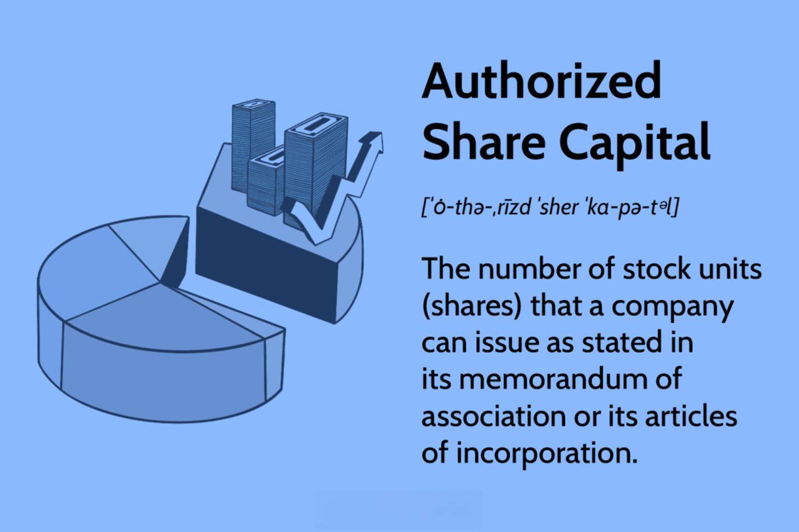

In the intricate world of finance, understanding the jargon and various components that drive the market is crucial for investors and businesses alike. This article discusses key concepts such as capital stock, share capital, authorized shares, and algorithmic trading. These elements significantly shape a company's structure and inform investment strategies, making it essential to comprehend their roles and interactions.

Capital stock and share capital represent the core financial resources companies utilize to conduct and expand their operations. These terms are often confused but carry distinct meanings and implications within corporate finance. Similarly, authorized shares define a company's capacity to issue stock and, ultimately, influence shareholder equity and control mechanisms.



Algorithmic trading is another critical component transforming the financial landscape. With the advancement of technology, the ability to execute trades using sophisticated computer algorithms has revolutionized market activity, introducing efficiencies and complexities that were previously unimaginable.

Understanding these concepts not only aids in grasping a company's financial structure but also provides insight into the broader market dynamics. By unpacking how these elements interact within the financial ecosystem, we aim to illuminate their impact on corporate decisions and investor outcomes.

Join us as we explore the foundations of these financial instruments and technological advancements, which fundamentally shape modern markets. This article is designed to equip readers with a clearer understanding of these concepts, enhancing their decision-making and strategic planning in the ever-evolving world of finance.

## Table of Contents

## Understanding Capital Stock and Share Capital

Capital stock and share capital are fundamental concepts in corporate finance, each playing a distinct yet interconnected role in a company's financial structure. Capital stock represents the total amount of capital that a company can raise through issuing shares. It acts as a financial reservoir from which a company can draw resources to support operations, expansion, and to absorb potential losses. In essence, capital stock provides a safety net, ensuring that a company has adequate financial backing to withstand adverse business conditions.

On the other hand, share capital is the portion of a company's equity derived from the sale of shares to shareholders. It is a critical component of a company's equity and reflects the initial amount of money investors are willing to provide in exchange for ownership stakes. Share capital is documented on a company's balance sheet and serves as an indicator of the financial commitment of the shareholders. Unlike capital stock, share capital directly represents the funds raised through shareholder investments and forms a part of the company's permanent capital base.

While often used interchangeably, capital stock and share capital have distinct implications in corporate finance. Capital stock encompasses the broader financial capacity a company can leverage, whereas share capital specifically denotes the equity raised from shareholders. The distinction lies chiefly in their financial reporting and strategic significance. Companies might decide to alter their capital stock or share capital in response to varying strategic goals, such as embarking on new investment ventures or fortifying their market position.

Adjustments to capital stock and share capital can include actions like stock splits, issuance of new shares, or buybacks. Stock splits, for example, increase the number of shares outstanding and can make shares more affordable for investors without changing the company's market capitalization. Conversely, a share buyback reduces the number of shares outstanding, potentially boosting earnings per share (EPS) and increasing shareholder value.

Companies leverage these tools to optimize their growth potential, carefully balancing the need to raise sufficient capital while maintaining shareholder value. For instance, a firm aiming for rapid expansion might issue new shares to finance its projects, thereby increasing its share capital. Conversely, a firm focusing on consolidating its market standing might engage in share buybacks, thereby signaling confidence in its future prospects.

Understanding these nuances provides investors and corporate managers with the insights necessary to navigate financial decisions effectively. The interplay between capital stock and share capital underscores the strategic options available to firms and highlights the importance of these concepts in shaping corporate strategies and fostering sustainable growth.

## What Are Authorized Shares?

Authorized shares represent the maximum number of shares a corporation is permitted to issue, as defined in its corporate charter. This component of the corporate structure is fundamental, allowing companies the flexibility to adapt to financial and strategic needs over time. Importantly, the limit set by authorized shares can be modified, typically requiring approval from the shareholders. This modification process provides an avenue for companies to align their equity structure with evolving business objectives.

The strategic decision of whether to issue all authorized shares or to keep a portion in reserve is influenced by various considerations. Companies may choose to reserve shares for future opportunities such as stock options, mergers, or other corporate actions that could require additional equity issuance. This strategic reserve allows a company to be agile, responding quickly to growth opportunities or changing market conditions without having to undergo the lengthy process of obtaining shareholder approval each time new shares are needed.

From an investor's perspective, understanding authorized shares is vital as it pertains to dilution risks and maintaining shareholder control. When a company issues additional shares, the ownership percentage of existing shareholders decreases, potentially impacting their control over corporate decisions and reducing the value of their holdings. This process, known as dilution, can impact stock prices and shareholder sentiment, thereby influencing market perceptions of the company's governance and financial health.

The determination of the number of authorized shares involves a careful balance between company strategy, shareholder interests, and market perceptions. It is typically decided at the company's inception and stipulated in the articles of incorporation. However, subsequent changes to the authorized share count require a vote among shareholders, reflecting the importance of this decision in corporate governance.

In terms of governance implications, the authorized share structure plays a role in shaping shareholder influence and voting power. The potential for future share issuance can affect takeover defenses and corporate control dynamics, making it a critical consideration for both corporate boards and investors.

In summary, authorized shares are a pivotal aspect of a corporation's equity framework, offering flexibility and strategic benefits while necessitating careful management to mitigate dilution risks and maintain shareholder trust. Understanding how these shares fit into the broader corporate picture is essential for stakeholders navigating the complexities of modern financial markets.

## The Rise of Algorithmic Trading

Algorithmic trading, or algo trading, utilizes sophisticated computer algorithms to execute trades at speeds and accuracies beyond human capability, based on pre-established criteria. This innovative technology has significantly reshaped financial markets. It streamlines trading processes, reduces transaction costs, and exploits small price differentials in the market to generate profits. Algorithms analyze extensive datasets, enabling swift decision-making within milliseconds, which optimizes trading strategies and minimizes human error.

Primarily adopted by investment firms, hedge funds, and individual traders, [algorithmic trading](/wiki/algorithmic-trading) is driven by profitable returns and the ability to operate at a [high frequency](/wiki/high-frequency-trading). By automating trading functions, these entities can efficiently execute large orders without disrupting market equilibrium. The principles of algo trading include multiple strategies such as [arbitrage](/wiki/arbitrage), [market making](/wiki/market-making), and [trend following](/wiki/trend-following), each designed to capitalize on disparities within the financial exchange system.

Here’s a simplified illustration of an algorithmic trading strategy using Python, focusing on mean reversion—a tactic where the algorithm buys or sells assets when they deviate from their average price:

```python
import numpy as np
import pandas as pd

# Simulated price data
prices = np.random.normal(loc=100, scale=10, size=100)  # mean: 100, std: 10

# Convert to Pandas DataFrame
data = pd.DataFrame(prices, columns=['Price'])

# Calculate moving average
data['Moving Average'] = data['Price'].rolling(window=5).mean()

# Create a signal to buy (1) when price is below moving average
# and sell (-1) when price is above moving average
data['Signal'] = 0
data['Signal'][data['Price'] < data['Moving Average']] = 1
data['Signal'][data['Price'] > data['Moving Average']] = -1

print(data.head(10))
```

The impact of algorithmic trading on market stability and efficiency continues to spark debate. On the one hand, algo trading enhances [liquidity](/wiki/liquidity-risk-premium), reduces bid-ask spreads, and reflects information more swiftly in prices. On the other hand, it introduces risks such as flash crashes, where rapid trading discrepancies can lead to temporary market collapses. Algorithmic trading's dependence on high-speed connectivity and technology infrastructure also raises concerns about systemic risks and the potential for significant disruptions due to technical failures.

Overall, while algorithmic trading presents profound advantages in efficiency and performance within financial markets, its complexities and potential downsides necessitate stringent regulatory oversight and sophisticated risk management practices to safeguard market integrity and participant interests. Understanding its dynamic nature and evolving intricacies is crucial for investors and institutions navigating today's financial environment.

## Interplay Between These Financial Concepts

The interplay between capital stock, share capital, authorized shares, and algorithmic trading is a pivotal aspect of modern financial markets. These elements, while seemingly distinct, form a cohesive system that influences corporate strategies and market dynamics.

Capital stock and authorized shares represent the potential and limits of a company’s ability to raise funds. The capital stock, which encompasses both common and preferred shares, acts as a buffer against financial uncertainties, thus attracting investors who seek stability and growth. On the other hand, share capital accounts for the total equity derived from the issuance of shares, serving as an indicator of a company's financial health and its ability to undertake new ventures.

Authorized shares, defined by a company's charter, represent the ceiling on shares that can be issued. This potential expansion tool is critical in corporate strategies aimed at mergers or fulfilling employee stock options. Adjusting the number of authorized shares, with shareholder approval, allows a company to react dynamically to market demands, maintain control, or mitigate dilution risks.

Algorithmic trading interfaces with these concepts by providing a robust mechanism to execute trades rapidly and with precision. It enhances market liquidity, offering investors the ability to transact large volumes with minimal impact on stock prices. For instance, a company may increase its authorized shares ahead of an algorithm-driven trading strategy to capitalize on favorable market conditions, thereby stabilizing prices and enhancing investor confidence.

A hypothetical scenario presents a company, TechCorp, that issues additional authorized shares to fund an acquisition. Algorithmic traders could exploit arbitrage opportunities during this period, ensuring that the increased share supply impacts the stock price minimally. Through algorithms, trading volumes adjust in response to investor behavior, maintaining liquidity and reflecting the updated valuation post-acquisition swiftly.

Real-world examples highlight these interactions further. Consider a tech firm executing a stock split to increase liquidity and attract retail investors. Here, the role of algorithmic trading is instrumental in stabilizing the resulting price fluctuations by balancing buy and sell orders automatically.

In essence, the synergy among capital stock, share capital, authorized shares, and algorithmic trading allows for efficient capital movement and strategic corporate decision-making. Understanding these interactions is vital for developing informed investment strategies and corporate policies that align with market conditions.

## Conclusion

Understanding the intricacies of capital stock, share capital, authorized shares, and algorithmic trading is fundamental for participants in the financial markets. These components collectively comprise the core framework of corporate finance and investment strategies, shaping how firms acquire capital and the manner in which investors interact with the market.

Capital stock and share capital are pivotal in determining a company's financial resilience and shareholder equity. Adjustments in these areas can significantly affect a company's capacity to grow and adapt to market conditions. Authorized shares, while often overlooked, play a crucial role in corporate governance and can influence investor confidence via dilution risks and shareholder control dynamics.

Algorithmic trading represents a significant technological evolution within finance, enhancing market efficiency through speedy and precise trade executions. Its integration into trading strategies has transformed market interactions, enabling participants to capitalize on market inefficiencies.

By mastering these elements, businesses and investors are better equipped to craft robust financial strategies that align with competitive market demands. These insights foster a more profound understanding of market dynamics, empowering stakeholders to leverage opportunities effectively and mitigate risks.

The financial landscape continues to evolve, driven by technological advancements and shifting regulatory environments. We encourage readers to further investigate these areas to remain competitive and informed in the fast-paced world of finance and trading. Understanding these foundational financial concepts is not just an academic exercise; it is a crucial step towards achieving financial success and sustainability. Thank you for exploring these essential topics with us.

## References & Further Reading

[1]: ["Advances in Financial Machine Learning"](https://books.google.com/books/about/Advances_in_Financial_Machine_Learning.html?id=oU9KDwAAQBAJ) by Marcos Lopez de Prado

[2]: ["Evidence-Based Technical Analysis: Applying the Scientific Method and Statistical Inference to Trading Signals"](https://www.amazon.com/Evidence-Based-Technical-Analysis-Scientific-Statistical/dp/0470008741) by David Aronson

[3]: ["Machine Learning for Algorithmic Trading"](https://github.com/PacktPublishing/Machine-Learning-for-Algorithmic-Trading-Second-Edition) by Stefan Jansen

[4]: ["Quantitative Trading: How to Build Your Own Algorithmic Trading Business"](https://books.google.com/books/about/Quantitative_Trading.html?id=j70yEAAAQBAJ) by Ernest P. Chan

[5]: ["Corporate Finance"](https://www.investopedia.com/terms/c/corporatefinance.asp) by Jonathan Berk and Peter DeMarzo

[6]: ["The Essentials of Trading: From the Basics to Building a Winning Strategy"](https://onlinelibrary.wiley.com/doi/book/10.1002/9781119202059) by John Forman