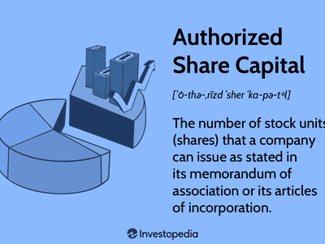

In the world of corporate finance and stock trading, understanding various stock terms is essential for both investors and business owners. Grasping the differences between issued stock and authorized stock is crucial for navigating financial statements and evaluating a company's potential for growth and investor returns. Authorized stock represents the maximum number of shares a company can issue as specified in its corporate charter, providing flexibility for future capital-raising activities. In contrast, issued stock is the actual number of shares distributed to shareholders, encompassing both public and insider holdings. These distinctions influence company decisions regarding stock dilution and control, affecting investor strategies and perceptions of a company’s value.

Moreover, the advent of algorithmic trading has transformed how stocks are managed in modern markets. Algorithmic trading employs computer algorithms to execute trades at high speeds, optimizing the buying and selling process and minimizing human error. This technological advancement impacts both authorized and issued stocks, affecting how they are traded on global markets and offering strategic advantages in exploiting market movements. Consequently, an understanding of these stock types and the role of algorithmic trading is indispensable for making informed investment decisions and comprehending market dynamics.



## Table of Contents

## Understanding Authorized Stock

Authorized stock, also known as authorized shares or authorized capital stock, represents the maximum number of shares that a corporation is legally permitted to issue as specified in its articles of incorporation or charter. This figure acts as an upper limit on the potential number of shares the company can offer to investors and signifies the company's planned scale of equity distribution.

Corporations often establish a higher number of authorized shares than they initially intend to issue. This strategic choice allows the company flexibility to raise additional capital in the future. For instance, a company may reserve extra shares to accommodate future stock issuances, mergers and acquisitions, or employee stock options. Such flexibility is crucial for enabling the company to respond swiftly to changing financial needs or investment opportunities without having to amend its foundational documents frequently.

Understanding authorized stock is vital for evaluating potential stock dilution. Stock dilution occurs when a company issues new shares, decreasing existing shareholders' ownership percentage. If a corporation frequently issues new shares that approach the limit of its authorized stock, this could lead to dilution. Dilution affects the value of existing shares by reducing their proportional claim on earnings and assets, potentially impacting shareholder value over time.

For shareholders and potential investors, analyzing the authorized stock figure is key to assessing the company's potential for future stock issuances and the possible impact on share value and voting power. Such analysis helps in determining whether the corporation has ample room to maneuver with its current capital structure or if any future stock issuance might necessitate an increase in authorized stock, which typically requires shareholder approval.

By understanding the concept and strategic application of authorized stock, investors can make more informed decisions regarding their investments in corporations and better anticipate changes in the share structure that might affect their holdings.

## Exploring Issued Stock

Issued stock signifies the actual number of shares a corporation has distributed to its shareholders, encompassing both public investors and internal stakeholders such as employees and executives. It is a crucial metric for assessing a company's current shareholder distribution and potential influence on corporate governance.

The quantity of issued stock can never exceed the threshold set by the authorized stock, as stipulated in the company's founding documents, such as its articles of incorporation. The relationship between authorized and issued stock is fundamental; if a company seeks to issue additional shares beyond its authorized limit, it must first obtain approval to amend its charter.

Issued stock has several implications for corporate governance and investor strategy. For instance, each share typically comes with voting rights, thus influencing decision-making processes at shareholder meetings. A higher [volume](/wiki/volume-trading-strategy) of issued shares can dilute individual shareholder power, potentially impacting control over company decisions.

Additionally, issued stock is an integral [factor](/wiki/factor-investing) in analyzing stock dilution—a process where issuing additional shares reduces the percentage ownership of existing shareholders. This can occur when a company issues more shares to raise capital or provide for stock options. While aiming to expand resources or collect new talent through options, firms must carefully balance the benefits against the potential negative impacts on existing shareholders' equity percentages.

For analysts, the number of issued stocks is vital in evaluating financial ratios. For instance, earnings per share (EPS) is calculated by dividing a company's net income by its average outstanding shares:

$$
\text{EPS} = \frac{\text{Net Income}}{\text{Average Outstanding Shares}}
$$

Where the average outstanding shares correspond to the issued shares minus any treasury shares the company may hold. Understanding changes in the issued stock helps investors gauge earnings performance and compare the financial health relative to other firms. 

Overall, issued stock plays an essential role in the financial analysis and strategic planning of companies, impacting governance, market perception, and shareholder value.

## Authorized Stock vs. Issued Stock: Key Differences

Authorized stock and issued stock are two fundamental concepts in corporate finance, each serving distinct purposes within a company's equity structure. Authorized stock represents the maximum number of shares a corporation is legally permitted to issue, as stipulated in its articles of incorporation. In contrast, issued stock signifies the portion of authorized stock that has been distributed to shareholders, encompassing both public investors and corporate insiders.

The relationship between authorized and issued stock is pivotal in several strategic corporate actions. Corporations often authorize a significant number of shares beyond their immediate issuance needs. This approach provides flexibility for future [capital raising](/wiki/hedge-fund-capital-raising), mergers, acquisitions, and stock-based compensation plans. By maintaining a surplus of authorized but unissued shares, companies can swiftly respond to financial opportunities or strategic requirements without seeking shareholder approval for new share issuances.

From a financial statement perspective, the distinction between authorized and issued stock is crucial for evaluating a company's financial strategy. It reveals insights into the company's potential for expansion or dilution, affecting shareholder value. For instance, an increase in issued stock could signal fundraising efforts, impacting ownership dilution and voting rights. Conversely, a large discrepancy between authorized and issued shares might indicate future fundraising potential or readiness for strategic ventures.

Strategic management of the authorized and issued stock disparity can also influence employee stock options. Companies can allocate unissued shares for employee stock options, thereby attracting and retaining talent while aligning employee interests with corporate goals. This proactive management ensures companies can capitalize on stock-based compensation without altering their capital structure significantly.

In summary, understanding the differences between authorized and issued stock is essential for analyzing a company's market positioning and financial strategy. A judicious balance between the two types allows firms to maintain control, plan for future financial activities, and leverage stock options to their advantage.

## Algorithmic Trading: Modern Stock Management

Algorithmic trading, commonly known as algo trading, utilizes computer algorithms to execute trades with exceptional speed and precision. This technological advancement has reshaped modern stock management by optimizing the buying and selling process, reducing human error, and capitalizing on minute market movements that occur within fractions of a second. Algo trading systems are designed to perform tasks ranging from basic automation of repetitive trading processes to executing complex strategies that assess multiple market variables simultaneously.

The integration of [algorithmic trading](/wiki/algorithmic-trading) into global markets profoundly influences both issued and authorized stocks. Algorithmic systems can evaluate vast datasets in real-time, enabling traders to make informed decisions about stock transactions. This rapid assessment and execution capability mean that large volumes of trades can occur without the delays associated with human decision-making, thereby increasing market [liquidity](/wiki/liquidity-risk-premium) and reducing transaction costs.

The impact of algo trading extends to authorized and issued stocks by influencing the conditions under which they are traded. For instance, algorithms can be programmed to react to certain triggers or market indicators, such as price changes or trading volumes, which can affect how stocks are bought or sold in rapidly shifting market environments. This capacity for high-frequency trading can lead to increased [volatility](/wiki/volatility-trading-strategies) in stock prices, as trades are executed in quick succession based on predetermined criteria.

Moreover, algorithmic trading systems can manage the supply and demand dynamics of issued stock by swiftly adjusting trading strategies in response to market trends. This capability aids in maintaining an optimal balance of stock distribution among investors, effectively managing portfolio risks associated with stock price fluctuations.

From a global perspective, the implementation of algo trading fosters greater integration amongst financial markets, allowing for more efficient cross-border transactions. Traders can leverage algorithms to navigate different time zones and regulatory environments, increasing their ability to engage in [arbitrage](/wiki/arbitrage) opportunities that arise from discrepancies in stock valuations across various markets.

The widespread use of algorithmic trading algorithms signifies an evolution in stock market operations, where computational speed and data-driven strategies lead the way. As these systems continue to evolve, they are likely to further influence how authorized and issued stocks are managed and traded, contributing to a continuously transforming financial landscape.

## Practical Examples: Case Studies and Scenarios

Two leading corporations, Amazon and Google, provide illustrative examples of how authorized and issued stocks can influence strategic corporate actions and market dynamics.

### Amazon's Strategic Stock Planning

Amazon, a key player in the tech industry, has utilized its authorized and issued stocks to maneuver through various strategic initiatives. For example, Amazon frequently authorizes a significant number of shares beyond the issued stock. This difference allows Amazon flexibility in raising capital, acquiring companies, or compensating employees with stock options. In these instances, when Amazon decides to issue more shares, market reaction often hinges on the purpose of that issuance. If the issuance aims to fund new growth opportunities, such as expanding cloud services, investors may react positively, anticipating greater future profitability. Conversely, if the issuance is perceived as a measure to cover operational deficits, stock prices could face downward pressure due to potential dilution of existing shares.

### Google's Capital Structure Management

Google, under its parent company Alphabet Inc., provides another example, often adjusting its authorized shares without immediately issuing them. This strategic approach enables the company to prepare for large-scale engagements, such as mergers or new product lines, without immediately impacting share value. Google's substantial authorized shares act as a reserve, ensuring readiness for rapid and significant capital deployment, which, when made public, can lead to increased investor confidence and potentially elevate stock prices.

### Scenarios Involving Authorized Shares

1. **Mergers and Acquisitions (M&A):** Both Amazon and Google use their authorized shares strategically during mergers and acquisitions. By issuing new shares, they can finance deals without dipping into cash reserves. Such decisions often lead to careful market scrutiny. If investors believe an acquisition will yield strategic advantage, stock prices may rise; otherwise, they may decline amid concerns over share dilution.

2. **Stock Splits:** Google has engaged in stock splits, where the number of shares outstanding is increased by issuing more shares, which affects price by making shares more affordable without changing market cap. This often boosts liquidity and broadens investor base, attractively adjusting their authorized shares accordingly.

### Algorithmic Trading and Market Influence

Algorithmic trading plays a significant role in how stocks are traded and priced in real-time. When major companies like Amazon or Google announce changes in authorized or issued shares, algorithms can quickly analyze and react to these announcements. Algorithms evaluate the potential impact on earnings per share (EPS) and return on equity (ROE), swiftly executing trades to capitalize on anticipated stock movements. This rapid execution can lead to immediate fluctuations in stock price and volume.

Consider Python code implementing a simple trading algorithm:

```python
def evaluate_impact(EPS_change, market_reaction):
    if EPS_change > 0 and market_reaction == "positive":
        action = "buy"
    elif EPS_change < 0 and market_reaction == "negative":
        action = "sell"
    else:
        action = "hold"
    return action

EPS_change = calculate_EPS_change(new_issued_shares=10000, profit=50000)
market_reaction = "positive"
trade_action = evaluate_impact(EPS_change, market_reaction)
print(f"Trade action: {trade_action}")
```

The algorithm considers changes in EPS due to new share issuance and market reaction, directing trades accordingly. This aspect of algorithmic trading underscores its relevance in handling massive stock strategies across global markets, influencing how issued and authorized stocks are perceived and valued.

## Conclusion

The intricate relationship between authorized stock, issued stock, and algorithmic trading forms a crucial aspect of corporate stock strategy. Understanding these elements enables investors to make informed decisions, enhancing their capacity to adapt to potential changes in the stock market landscape. Authorized stock represents the ceiling of shares a company can legally issue, offering potential for future capital expansion, while issued stock mirrors the company's current allotment of shares distributed to shareholders.

Algorithmic trading introduces a layer of technological sophistication, transforming how stocks are managed and traded globally. By using advanced algorithms, trades can be executed at remarkable speeds and efficiencies, minimizing human error and enabling the exploitation of minute market fluctuations. This evolution in trading technology influences the behavior of both authorized and issued stocks, affecting market dynamics such as stock prices and liquidity.

Investors equipped with an understanding of these concepts can better assess a company's strategy, predict stock performance, and refine their investment portfolio. As algorithmic trading continues to evolve with advancements in technology, its influence on the dynamics between authorized and issued stock will become increasingly significant. This synergy between traditional stock concepts and advanced technological methods highlights the progressive nature of modern stock markets, wherein informed strategies are key to navigating this ever-changing environment.

## References & Further Reading

[1]: ["Introduction to Corporate Finance"](https://www.coursera.org/learn/wharton-finance) by William L. Megginson

[2]: Bodie, Zvi, et al. ["Investments"](https://www.mheducation.com/highered/product/Investments-Bodie.html), McGraw-Hill Education, 11th edition.

[3]: ["Advances in Financial Machine Learning"](https://www.amazon.com/Advances-Financial-Machine-Learning-Marcos/dp/1119482089) by Marcos Lopez de Prado

[4]: ["Quantitative Trading: How to Build Your Own Algorithmic Trading Business"](https://www.amazon.com/Quantitative-Trading-Build-Algorithmic-Business/dp/1119800064) by Ernest P. Chan

[5]: Hasbrouck, Joel. ["Empirical Market Microstructure: The Institutions, Economics, and Econometrics of Securities Trading"](https://academic.oup.com/book/52241), Oxford University Press. 

[6]: Brunnermeier, Markus K. ["Asset Pricing under Asymmetric Information: Bubbles, Crashes, Technical Analysis, and Herding"](https://www.princeton.edu/~markus/research/papers/book0.pdf), Oxford University Press. 

[7]: ["The Handbook of Corporate Finance: A Business Companion to Financial Markets, Decisions, and Techniques"](https://archive.org/details/handbookofcorpor0000arno_j5v8) by Glen Arnold

[8]: Parasuraman, Kiran, et al. ["Algorithmic Trading and Computational Finance"] (https://arxiv.org/), arXiv preprint arXiv:1004.3149 (2010).

[9]: ["Algorithmic Trading: Winning Strategies and Their Rationale"](https://books.google.com/books/about/Algorithmic_Trading.html?id=WAlFDwAAQBAJ) by Ernie Chan