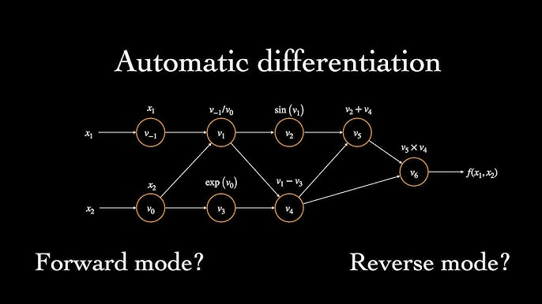

## Table of Contents

## What is auto-differentiation and why is it important in finance?

Auto-differentiation, often called automatic differentiation, is a way computers can figure out how to calculate the slope of a function very quickly and accurately. Imagine you have a complicated math problem, and you need to know how changing one number affects the whole thing. Auto-differentiation breaks down the problem into tiny steps and uses the rules of calculus to find the answer without making big mistakes.

In finance, auto-differentiation is really important because it helps with things like pricing options and managing risk. When banks and investors want to know how a small change in interest rates or stock prices might affect their investments, they use auto-differentiation to get precise answers fast. This helps them make better decisions and manage their money more safely. Without auto-differentiation, they would have to use slower and less accurate methods, which could lead to mistakes and bigger risks.

## How does auto-differentiation differ from traditional numerical differentiation methods?

Auto-differentiation and traditional numerical differentiation both help find the slope of a function, but they do it in different ways. Numerical differentiation usually uses small changes in the input to guess the slope. For example, it might change the input a tiny bit, see how the output changes, and then use that to estimate the slope. This method can be simple but it's not always very accurate, especially if the function is complicated or if the change in input is too big or too small.

On the other hand, auto-differentiation breaks down the function into smaller parts and applies the rules of calculus to each part. It keeps track of how each tiny piece affects the whole, building up the exact slope without guessing. This makes auto-differentiation much more accurate and reliable, especially for complex functions. It's like taking apart a puzzle and putting it back together to understand it perfectly, instead of just looking at the whole picture and making a guess.

Because of these differences, auto-differentiation is often preferred in fields like finance where precision is crucial. It can handle the complex models used in financial calculations without losing accuracy, which is something traditional numerical methods struggle with. This makes it a powerful tool for tasks like risk management and option pricing, where even small errors can lead to big problems.

## What are the basic concepts of forward and reverse mode auto-differentiation?

Forward mode auto-differentiation works by going through a function step-by-step, keeping track of how each little part affects the whole. Imagine you're cooking a recipe and you want to know how adding a bit more salt changes the taste. You add the salt, mix it in, and see how it changes each step of the recipe. In forward mode, you do the same with a math function. You go through the function, keeping track of how each tiny change affects the final result. This is good when you want to know how changing one input affects the output, but it can be slow if you want to know about many inputs.

Reverse mode auto-differentiation, on the other hand, starts from the end of the function and works backward. It's like tasting the finished dish and figuring out how each ingredient affected the flavor. You start with the final result and trace back through all the steps to see how each part contributed. This method is really useful when you have lots of inputs and you want to know how they all affect the output at once. It's much faster for this kind of problem than forward mode, which makes it very useful in areas like [machine learning](/wiki/machine-learning) and finance where you often need to understand the impact of many variables.

## Can you explain how auto-differentiation is applied in financial modeling?

In financial modeling, auto-differentiation helps banks and investors figure out how small changes in things like interest rates or stock prices might affect their investments. Imagine you have a big math problem that shows how much money you might make or lose. Auto-differentiation breaks this problem into tiny steps and uses the rules of calculus to see how changing one number changes the whole thing. This way, banks can see how sensitive their investments are to changes in the market without making big mistakes.

For example, when pricing options, which are contracts that give the right to buy or sell an asset at a certain price, auto-differentiation can quickly and accurately calculate how the option's price changes with different market conditions. This is really important because even a small mistake can lead to big losses. By using auto-differentiation, financial experts can make better decisions and manage their money more safely, making sure they understand the risks and rewards of their investments.

## What are some common financial applications that benefit from auto-differentiation?

One common financial application that benefits from auto-differentiation is option pricing. Options are contracts that give the buyer the right, but not the obligation, to buy or sell an asset at a set price. To price these options correctly, financial experts need to know how sensitive the option's value is to changes in things like stock prices, interest rates, or time until the option expires. Auto-differentiation helps them calculate these sensitivities, called "Greeks," quickly and accurately. This is crucial because even small mistakes can lead to big losses or missed opportunities.

Another important application is risk management. Banks and financial institutions use complex models to understand and manage the risks of their investments. These models often involve many variables, and auto-differentiation allows them to see how changes in any of these variables affect the overall risk. By using auto-differentiation, they can make better decisions about how to protect their investments and reduce potential losses. This makes the financial system safer and more stable, as institutions can react more effectively to changing market conditions.

In portfolio optimization, auto-differentiation also plays a key role. Investors want to find the best mix of assets that will give them the highest return for the least risk. This involves solving complex optimization problems where the impact of each asset on the portfolio's performance needs to be precisely calculated. Auto-differentiation helps in solving these problems efficiently, allowing investors to adjust their portfolios quickly in response to new information or market changes. This leads to better investment strategies and improved financial outcomes.

## How can auto-differentiation improve the efficiency of risk management in finance?

Auto-differentiation helps make risk management in finance more efficient by quickly and accurately figuring out how changes in things like interest rates or stock prices affect investments. Imagine you're trying to keep a big ship steady in rough waters. You need to know how every little wave or gust of wind will move the ship. Auto-differentiation is like having a super-fast and precise tool that tells you exactly how to adjust the ship's [course](/wiki/best-algorithmic-trading-courses) to stay safe. This way, banks and investors can see the risks they face without waiting a long time or making big mistakes.

By using auto-differentiation, financial experts can handle complex models that have lots of variables much faster than before. It's like having a map that updates itself instantly as the terrain changes. This helps them react quickly to new information or market changes, making sure they can protect their investments better. Without auto-differentiation, they would have to use slower and less accurate methods, which could lead to bigger risks and losses. So, auto-differentiation makes risk management smoother and more reliable, keeping the financial system safer and more stable.

## What are the challenges of implementing auto-differentiation in financial systems?

One challenge of using auto-differentiation in financial systems is the need for a lot of computing power. Financial models can be very complicated, with lots of numbers and steps to keep track of. Auto-differentiation needs to go through all these steps carefully to get the right answers. This means banks and investors need strong computers that can handle all this work quickly. If the computers are not fast enough, it can slow down the whole process and make it hard to react to changes in the market on time.

Another challenge is making sure the auto-differentiation works well with the existing systems. Many banks already use old software that might not be set up to use auto-differentiation easily. Adding this new tool can be like trying to fit a new puzzle piece into an old puzzle. It can take a lot of time and effort to make everything work together smoothly. If it's not done right, there could be mistakes or problems that mess up the important calculations needed for managing risks and pricing options.

Lastly, there's the challenge of training people to use auto-differentiation. Not everyone in finance knows about this new tool or how to use it correctly. It's like learning a new language. Employees need to be taught how to use auto-differentiation to make the most of it. This training can take time and money, and if people don't understand it well, they might make mistakes that could cost the bank a lot. So, making sure everyone is on the same page is really important for using auto-differentiation successfully in finance.

## How does auto-differentiation integrate with existing financial software and libraries?

Auto-differentiation can be tricky to add to the old software that banks and investors already use. Imagine you have a favorite toy that you've played with for a long time, and now you want to add a new part to it. This new part, or auto-differentiation, needs to fit perfectly with the old toy, or the existing software. Sometimes, the old software is not built to work with auto-differentiation easily. So, people have to spend a lot of time and effort to make sure everything works together smoothly. If they don't do it right, there could be mistakes or problems that mess up important calculations for managing risks and pricing options.

To make auto-differentiation work well with existing financial software, special tools and libraries are used. These tools act like translators, helping the old software understand and use the new auto-differentiation methods. For example, there are libraries like TensorFlow or PyTorch that are good at auto-differentiation and can be connected to financial software. This helps banks and investors use auto-differentiation without having to completely change their old systems. It's like adding a new gadget to your favorite toy that makes it even better, but you still get to keep all the parts you love.

## What are the performance considerations when using auto-differentiation in large-scale financial computations?

When using auto-differentiation in big financial calculations, you need to think about how fast your computer can work. Auto-differentiation can be slow because it has to go through a lot of steps to get the right answers. If your computer is not powerful enough, it might take a long time to finish all the calculations. This can be a problem because in finance, you often need quick answers to make decisions about buying or selling things. If the calculations take too long, you might miss out on important opportunities or make choices based on old information.

Another thing to consider is how much memory your computer needs. Auto-differentiation keeps track of a lot of numbers as it goes through the calculations, and this can use up a lot of space. If your computer doesn't have enough memory, it might slow down or even stop working. This is really important in finance because the models used can be very big and complicated. So, making sure you have enough memory is key to using auto-differentiation effectively in large-scale financial computations.

## Can you discuss any case studies where auto-differentiation has significantly impacted financial decision-making?

One great example of auto-differentiation making a big difference in finance is how it's used by big banks to price options. A bank called JPMorgan Chase used auto-differentiation to make their option pricing models faster and more accurate. Options are like special contracts that let you buy or sell things at a set price. The bank needed to know how changes in things like stock prices or interest rates would affect the value of these options. By using auto-differentiation, they could figure this out quickly and without making big mistakes. This helped them make better decisions about buying and selling options, which saved them money and reduced their risks.

Another case is from a company called BlackRock, which manages a lot of money for people. They used auto-differentiation to improve their risk management models. These models help them understand how safe their investments are. With auto-differentiation, BlackRock could see how different things, like changes in the economy, would affect their investments. This made their models work faster and more accurately. As a result, BlackRock could make smarter choices about where to put their money, helping them protect their clients' investments better and make more money for them.

## What future developments in auto-differentiation technology are expected to influence the finance sector?

In the future, auto-differentiation technology is expected to get even better and faster, which will be a big help in finance. One big change might be the development of more powerful computers and better software that can handle even more complicated math problems. This means banks and investors will be able to use auto-differentiation to make decisions even quicker and with more accuracy. They will be able to understand how changes in the market affect their investments in real-time, helping them react faster and make smarter choices.

Another exciting development could be the use of auto-differentiation in new areas of finance, like machine learning and [artificial intelligence](/wiki/ai-artificial-intelligence). These technologies are already changing how banks and investors work, and auto-differentiation can make them even better. For example, auto-differentiation could help create smarter models that predict how the market will move or how risky an investment might be. This would make financial decisions more reliable and help banks and investors manage their money more safely and effectively.

## How can financial professionals start learning and applying auto-differentiation techniques in their work?

Financial professionals can start learning auto-differentiation by taking online courses or workshops that teach the basics of calculus and how computers use it to solve problems. Many universities and platforms like Coursera or edX offer classes on numerical methods and machine learning, which often include lessons on auto-differentiation. These courses can help you understand how to break down complex financial models into smaller steps and use auto-differentiation to see how changes in one part affect the whole model. It's also a good idea to practice with software tools like TensorFlow or PyTorch, which have built-in auto-differentiation features and are widely used in finance.

Once you have a good understanding of the basics, you can start applying auto-differentiation in your work. Begin by using it in small projects or parts of your existing models to see how it works. For example, you might use auto-differentiation to calculate the sensitivity of an option's price to changes in interest rates or stock prices. As you get more comfortable, you can integrate auto-differentiation into larger and more complex models, like those used for risk management or portfolio optimization. Collaborating with colleagues who are already familiar with these techniques can also help you learn faster and apply auto-differentiation more effectively in your financial work.

## References & Further Reading

[1]: Baydin, A. G., Pearlmutter, B. A., Radul, A. A., & Siskind, J. M. (2018). ["Automatic Differentiation in Machine Learning: A Survey."](https://arxiv.org/abs/1502.05767) The Journal of Machine Learning Research, 18(1).

[2]: Bartholomew-Biggs, M. (1998). ["Automatic Differentiation of Algorithms."](https://www.sciencedirect.com/science/article/pii/S0377042700004222) Journal of Computational and Applied Mathematics, 100(1-2).

[3]: Griewank, A., & Walther, A. (2008). ["Evaluating Derivatives: Principles and Techniques of Algorithmic Differentiation."](https://epubs.siam.org/doi/book/10.1137/1.9780898717761) Society for Industrial and Applied Mathematics.

[4]: Giles, M. B., & Glasserman, P. (2006). ["Smoking Adjoints: Fast Monte Carlo Greeks."](https://www.semanticscholar.org/paper/Smoking-Adjoints%3A-fast-evaluation-of-Greeks-in-Giles-Glasserman/f98ee77e67c9c64c35be83abdb9968de58a0a826) Risk Magazine, 13(3).

[5]: Hecht-Nielsen, R. (1992). ["Theory of the Backpropagation Neural Network."](https://www.sciencedirect.com/science/article/pii/B9780127412528500108) In Neural Networks for Perception.

[6]: ["TensorFlow: Large-Scale Machine Learning on Heterogeneous Systems."](https://arxiv.org/abs/1603.04467) (2015). Research Paper by Google Brain Team.

[7]: Sharp, B. (2015). ["Implementing Derivatives Models in Python."](https://link.springer.com/content/pdf/10.1057/9780230392687_10.pdf?pdf=preview) Expert's Voice in Python.

[8]: ["Foundations of High-Frequency Trading."](https://forexbrokerlisting.com/education/high-frequency-trading/) by Nashat M. Mann, 2015.

[9]: ["Hands-On Machine Learning for Algorithmic Trading: Design and implement investment strategies based on smart algorithms that learn from data using Python."](https://www.amazon.com/Hands-Machine-Learning-Algorithmic-Trading/dp/178934641X) by Stefan Jansen.