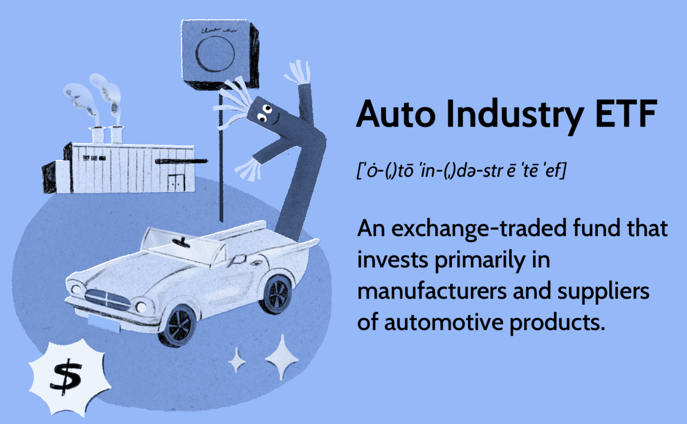

## Table of Contents

## What is an ETF?

An ETF, or Exchange-Traded Fund, is a type of investment that works like a mutual fund but trades on a stock exchange like a stock. It's a basket of different investments, like stocks, bonds, or commodities, that you can buy and sell throughout the day. This makes it easy for people to invest in a wide range of assets without having to buy each one separately.

ETFs are popular because they offer diversification, which means they spread out the risk by holding many different investments. They also tend to have lower fees than mutual funds, making them a cost-effective way to invest. Whether you're saving for retirement, trying to grow your wealth, or just want to invest in a specific market, ETFs can be a great tool to help you reach your financial goals.

## What is the auto industry ETF?

An auto industry ETF is a type of investment fund that focuses on companies involved in making and selling cars and car parts. This ETF lets you invest in many car companies at once, instead of picking just one. It's like buying a basket of car stocks, which can include big names like Ford and General Motors, as well as smaller companies that make tires or car electronics.

These ETFs are a good choice if you believe the car industry will do well in the future. They spread out the risk because they hold many different companies, so if one car maker has a bad year, the whole fund won't suffer as much. Plus, they are easy to buy and sell on the stock market, just like regular stocks. This makes it simple for anyone to invest in the auto industry without needing to know a lot about cars or the stock market.

## How does an auto industry ETF work?

An auto industry [ETF](/wiki/etf-trading-strategies) works by pooling money from many investors to buy shares in different car companies. This ETF will have a mix of big car makers like Ford and Toyota, and smaller companies that make car parts or technology. When you buy a share of the ETF, you're basically buying a little bit of all these companies at once. This is easier than buying each company's stock separately, and it helps spread out the risk because if one car company does badly, the whole ETF won't be affected as much.

The ETF trades on the stock market just like a regular stock, so you can buy and sell it whenever the market is open. The price of the ETF goes up and down based on how well the car companies inside it are doing. If people think the auto industry will do well in the future, they might buy more of the ETF, which can push the price up. But if they think the industry will struggle, they might sell, which can make the price go down. This makes it easy for anyone to invest in the auto industry without needing to know a lot about cars or the stock market.

## What are the benefits of investing in an auto industry ETF?

Investing in an auto industry ETF can be a smart move because it lets you spread your money across many car companies instead of betting on just one. This is called diversification, and it helps lower the risk. If one car maker has a bad year, your whole investment won't be in trouble because the ETF holds lots of different companies. This way, you can still benefit from the good times in the auto industry without worrying too much about one company's ups and downs.

Another benefit is that auto industry ETFs are easy to buy and sell. They trade on the stock market just like regular stocks, so you can buy or sell them anytime the market is open. This makes it simple for anyone to invest in the car industry, even if they don't know a lot about cars or the stock market. Plus, these ETFs usually have lower fees than buying each car company's stock separately, which means you get to keep more of your money.

## What are the risks associated with auto industry ETFs?

Investing in an auto industry ETF can be risky because it depends on how well the car industry is doing. If the whole industry has a tough time, like during an economic downturn or if there are big changes in how people buy cars, the value of your ETF can go down. For example, if fewer people are buying cars because they are too expensive or if new laws make it harder for car companies to make money, your investment might lose value.

Another risk is that even though an ETF spreads your money across many companies, if a big part of the auto industry struggles, it can still hurt the whole ETF. This means that if electric cars become much more popular and traditional car makers can't keep up, the ETF might not do well. Also, like any investment, the price of the ETF can go up and down a lot, so you might lose money if you need to sell your shares when the price is low.

## Which are some popular auto industry ETFs?

Some popular auto industry ETFs are the First Trust S-Network Future Vehicles & Technology ETF (CARZ) and the Global X Autonomous & Electric Vehicles ETF (DRIV). The CARZ ETF focuses on companies that are working on future vehicles and technology, including electric and self-driving cars. It includes big names like Tesla and smaller companies that make parts for these new types of vehicles. The DRIV ETF, on the other hand, invests in companies involved in making electric and self-driving cars, as well as the technology and parts that go into them. This ETF also includes companies like Tesla, along with other car makers and tech firms.

Another popular choice is the iShares MSCI Global Automobiles & Components ETF (BATS:AXED). This ETF gives you a broad look at the auto industry by investing in companies all over the world that make cars and car parts. It includes big car makers like Toyota and Ford, as well as smaller companies that supply parts and technology. By investing in this ETF, you get a piece of the global auto industry, which can be a good way to spread out your risk.

## How do you choose the right auto industry ETF for your portfolio?

When you're thinking about adding an auto industry ETF to your portfolio, the first thing to look at is what the ETF invests in. Some ETFs focus on big car makers like Ford and Toyota, while others might include smaller companies that make parts or work on new technology like electric and self-driving cars. Think about what part of the auto industry you believe will do well in the future. If you're excited about electric cars, you might want an ETF that has a lot of those companies. If you want a safer bet, an ETF that includes a mix of big and small car companies from around the world could be a good choice.

Next, think about the costs. ETFs have fees, which are called expense ratios. These fees can eat into your returns over time, so it's smart to pick an ETF with low fees. Also, consider how easy it is to buy and sell the ETF. Some ETFs are more popular and trade a lot, which can make it easier to buy or sell them without big price changes. Lastly, think about how this ETF fits with the rest of your investments. If you already have a lot of money in car companies, you might not need another auto industry ETF. But if you want to spread your risk and get into the auto industry, an ETF can be a great way to do that.

## What factors influence the performance of auto industry ETFs?

The performance of auto industry ETFs is influenced by how well the car industry is doing. If more people are buying cars, the companies in the ETF will do better, and the ETF's value will go up. But if fewer people are buying cars, maybe because they are too expensive or there's an economic downturn, the ETF's value can go down. Things like new laws, changes in gas prices, and new technology like electric cars also play a big role. If the government makes new rules that help or hurt car companies, it can affect the ETF.

Another [factor](/wiki/factor-investing) is how well the specific companies in the ETF are doing. If big companies like Ford or Toyota are making a lot of money, the ETF will likely do well too. But if these companies struggle, the ETF can suffer. Also, the ETF's performance can be influenced by how much it costs to own it. ETFs have fees, and if these fees are high, they can eat into your returns over time. So, it's important to look at the overall health of the auto industry, the performance of the companies in the ETF, and the costs when thinking about how an auto industry ETF might perform.

## How do global economic conditions affect auto industry ETFs?

Global economic conditions can have a big impact on auto industry ETFs. When the world economy is doing well, people have more money to spend on cars, which means car companies make more money. This can make the value of the ETF go up because the companies inside it are doing better. But if the global economy is struggling, like during a recession, people might not want to buy new cars. This can hurt car companies' profits, and the ETF's value can go down.

Also, things like changes in currency values and trade policies can affect auto industry ETFs. If a country's currency gets weaker, it can make cars more expensive for people in that country, which can hurt sales. Trade policies, like tariffs on car parts, can also make it harder for car companies to make money. If countries put up barriers to trade, it can slow down the auto industry, which can make the ETF's performance worse. So, keeping an eye on the global economy is important when investing in auto industry ETFs.

## What is the historical performance of auto industry ETFs?

The historical performance of auto industry ETFs has been a bit of a roller coaster. Over the years, these ETFs have gone up and down based on how the car industry is doing. For example, when the economy is doing well and people are buying more cars, auto industry ETFs usually do better. But during tough times, like the 2008 financial crisis or the early days of the COVID-19 pandemic, these ETFs can lose a lot of value because people aren't buying as many cars. So, looking at the past, you can see that auto industry ETFs can be a good investment when the car industry is doing well, but they can also be risky when things aren't going so great.

Another thing to think about is how new technology and changes in the industry affect these ETFs. For instance, the rise of electric vehicles has been a big deal for auto industry ETFs. ETFs that focus on companies making electric cars, like Tesla, have done really well in recent years as more people want to buy these kinds of cars. But ETFs that only have traditional car makers might not do as well if they can't keep up with the new technology. So, the historical performance of auto industry ETFs shows that they can be a good way to invest in the car industry, but you have to be ready for ups and downs and keep an eye on what's happening in the industry.

## How do auto industry ETFs compare to other sector ETFs?

Auto industry ETFs focus on companies that make cars and car parts, while other sector ETFs might focus on different areas like technology, healthcare, or energy. Each type of sector ETF can go up and down based on what's happening in that specific industry. For example, if people are buying a lot of new cars, an auto industry ETF might do well, but if there's a new technology trend like smartphones, a tech ETF might do better. So, the performance of auto industry ETFs can be different from other sector ETFs because they depend on different things.

When you compare auto industry ETFs to other sector ETFs, you also have to think about how risky they are. Some industries, like technology, can change really fast, so tech ETFs might be more risky but can also grow a lot. Auto industry ETFs might be less risky because cars are something people always need, but they can still go down if the economy is bad or if there are big changes in how cars are made. So, choosing between an auto industry ETF and another sector ETF depends on what you think will happen in the future and how much risk you're okay with.

## What advanced strategies can be used when investing in auto industry ETFs?

When investing in auto industry ETFs, one advanced strategy is to use dollar-cost averaging. This means you invest a fixed amount of money into the ETF at regular times, like every month. This can help you buy more shares when the price is low and fewer when the price is high, which can lower your overall cost over time. Another strategy is to use stop-loss orders. This is where you set a price at which you will automatically sell your ETF if it drops to that level. This can help you limit your losses if the auto industry has a big downturn.

Another advanced strategy is to look at the ETF's holdings and see if you can predict how they will do in the future. For example, if you think electric cars will become more popular, you might choose an ETF that has a lot of companies working on electric vehicles. You can also use options to try to make more money or protect your investment. Options let you bet on whether the ETF will go up or down without having to buy the ETF itself. These strategies can be more complicated and risky, so it's important to understand them well before you start using them.

## References & Further Reading

[1]: Bergstra, J., Bardenet, R., Bengio, Y., & Kégl, B. (2011). ["Algorithms for Hyper-Parameter Optimization."](https://dl.acm.org/doi/10.5555/2986459.2986743) Advances in Neural Information Processing Systems 24.

[2]: ["Advances in Financial Machine Learning"](https://www.amazon.com/Advances-Financial-Machine-Learning-Marcos/dp/1119482089) by Marcos Lopez de Prado

[3]: ["Evidence-Based Technical Analysis: Applying the Scientific Method and Statistical Inference to Trading Signals"](https://www.amazon.com/Evidence-Based-Technical-Analysis-Scientific-Statistical/dp/0470008741) by David Aronson

[4]: ["Machine Learning for Algorithmic Trading"](https://github.com/stefan-jansen/machine-learning-for-trading) by Stefan Jansen

[5]: ["Quantitative Trading: How to Build Your Own Algorithmic Trading Business"](https://www.amazon.com/Quantitative-Trading-Build-Algorithmic-Business/dp/1119800064) by Ernest P. Chan