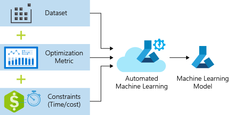

## Table of Contents

## What are Auto Parallel Methods in the context of machine learning?

Auto Parallel Methods in machine learning are techniques used to automatically distribute the workload of training large models across multiple processing units, such as GPUs or TPUs. This is important because training complex models can be very time-consuming and resource-intensive. By using auto parallel methods, the computational load is divided, allowing the training process to be completed faster and more efficiently. These methods analyze the model's structure and the available hardware to determine the best way to split the tasks without the need for manual configuration by the user.

One common approach in auto parallel methods is data parallelism, where the same model is replicated across multiple devices, and each device processes a different subset of the data. Another approach is model parallelism, where different parts of the model are assigned to different devices. For instance, if a neural network is too large to fit on a single GPU, model parallelism can distribute different layers of the network across multiple GPUs. Auto parallel methods often combine these approaches to optimize performance, making it easier for machine learning practitioners to scale their models and handle large datasets effectively.

## How do Auto Parallel Methods help in training large-scale machine learning models?

Auto Parallel Methods make it easier to train big machine learning models by spreading the work across many computers or processors. When a model is too big or the data is too much for one computer to handle, these methods break down the job into smaller pieces. This way, each piece can be worked on at the same time by different computers, making the whole process much faster. For example, if you have a huge amount of data, the method can split it up so that each computer only needs to process a part of it, and then combine the results later.

These methods also help by figuring out the best way to divide the work without the user having to do it manually. They look at the model's structure and the available hardware to decide how to split the tasks. This can be done through data parallelism, where the same model works on different parts of the data, or model parallelism, where different parts of the model are assigned to different computers. By doing this automatically, Auto Parallel Methods save time and make it easier for people to train large models without needing to be experts in parallel computing.

## What is AutoSync and how does it facilitate parallel processing in machine learning?

AutoSync is a tool that helps make parallel processing easier in [machine learning](/wiki/machine-learning). When you're training a big model and using many computers at the same time, you need to make sure they all stay in sync. AutoSync does this automatically, so the computers can work together smoothly without you having to do extra work to keep them aligned.

By using AutoSync, you can focus more on building your model and less on managing the computers. It takes care of making sure all the parts of your model that are spread across different computers stay updated and work together correctly. This makes the whole process of training large models faster and more efficient.

## Can you explain the basic principles behind KungFu and its role in auto parallelization?

KungFu is a system designed to help make training big machine learning models easier by automatically figuring out how to use multiple computers at the same time. It works by looking at the model and the available computers, then deciding the best way to split up the work. This means you don't have to spend time setting up how each computer should work; KungFu does it for you. It's like having a smart helper that knows how to get the job done quickly and efficiently.

One key part of KungFu is how it manages to keep all the computers working together smoothly. It does this through something called automatic synchronization, or AutoSync. This feature makes sure that all the parts of the model that are spread across different computers stay updated and work together correctly. By handling this automatically, KungFu lets you focus more on building your model and less on managing the computers, making the whole process of training large models faster and more efficient.

## What makes FlexFlow unique among Auto Parallel Methods?

FlexFlow stands out among Auto Parallel Methods because it uses a special way to figure out the best way to split up the work on different computers. It does this by looking at all possible ways to distribute the work and then choosing the one that will make the model train the fastest. This is different from other methods that might just split the work in a simple way without thinking too much about speed. FlexFlow uses something called a "search algorithm" to find the best way, which can be more complicated but leads to better results.

Another thing that makes FlexFlow unique is how it can handle different kinds of models and hardware. It's not just made for one type of model or computer; it can work well with many different setups. This means you can use FlexFlow whether you're working with a small model on a few computers or a huge model on a lot of powerful machines. This flexibility makes FlexFlow a very useful tool for many different kinds of machine learning projects.

## How do Auto Parallel Methods compare to traditional parallel processing techniques in machine learning?

Auto Parallel Methods and traditional parallel processing techniques both aim to speed up the training of machine learning models by using multiple computers at the same time. Traditional parallel processing often requires the user to manually decide how to split up the work among the computers. This can be tricky and time-consuming, especially for complex models. Users might use data parallelism, where the same model runs on different parts of the data, or model parallelism, where different parts of the model are assigned to different computers. But setting this up can be hard and might not always be the best way to use the available resources.

Auto Parallel Methods make things easier by doing this work automatically. They look at the model and the computers available, then figure out the best way to divide the tasks without the user having to do anything extra. For example, a method like FlexFlow uses a search algorithm to find the fastest way to train the model. This means users can focus more on building their models and less on managing the computers. While traditional methods can be effective, Auto Parallel Methods often lead to better use of resources and faster training times because they adapt to the specific situation more intelligently.

## What are the key challenges faced when implementing Auto Parallel Methods?

One big challenge with Auto Parallel Methods is making sure they work well with all kinds of models and computers. Different models have different structures, and computers can have different amounts of power. Auto Parallel Methods need to be smart enough to figure out the best way to split up the work no matter what kind of model or computer you're using. This can be hard because what works well for one model might not work well for another. Also, if the method doesn't use the computers in the best way, it might not make the training faster, which defeats the purpose of using it in the first place.

Another challenge is keeping everything in sync. When you're using many computers at the same time, you need to make sure they all stay updated with each other. If one computer gets ahead or falls behind, it can cause problems with the model's training. AutoSync helps with this, but making sure it works well with different setups can be tricky. Also, figuring out the best way to split up the work can take a lot of time and computer power. This means that while Auto Parallel Methods can make training faster, the process of setting them up might slow things down at first.

## How does the choice of Auto Parallel Method impact the performance of a machine learning model?

The choice of Auto Parallel Method can really change how fast and well a machine learning model trains. Different methods have different ways of splitting up the work among computers. For example, some methods like FlexFlow use smart algorithms to find the best way to make the training as fast as possible. This can lead to much faster training times, especially for big models. But if the method doesn't match well with the model or the computers you're using, it might not help as much, or even make things slower.

Keeping everything in sync is another big part of how well the Auto Parallel Method works. If the method can't keep all the computers working together smoothly, the model's training can get messed up. This is where tools like AutoSync come in, helping to make sure all the parts of the model stay updated. So, choosing the right Auto Parallel Method means thinking about how well it can handle your specific model and setup, which can make a big difference in how quickly and accurately your model trains.

## What are some real-world applications where Auto Parallel Methods have significantly improved model training?

Auto Parallel Methods have made a big difference in training models for big companies like Google and Microsoft. For example, Google uses these methods to train huge language models that power their search and translation services. By spreading the work across many computers, they can train these models much faster than if they used just one computer. This means they can update their services more often and make them better for users. Microsoft also uses Auto Parallel Methods to train models for their Azure cloud services, helping them handle large amounts of data and improve their AI tools.

In the field of healthcare, Auto Parallel Methods have helped researchers train models to predict diseases and analyze medical images. For instance, a team at a big hospital used these methods to train a model on thousands of X-ray images to spot early signs of lung cancer. By using many computers at the same time, they could train the model quickly and start using it to help doctors make better decisions. This shows how Auto Parallel Methods can speed up important work in healthcare, making it possible to use AI to improve patient care.

## How can one evaluate the effectiveness of different Auto Parallel Methods in a specific machine learning task?

To evaluate the effectiveness of different Auto Parallel Methods for a specific machine learning task, you need to look at how well they make the training process faster and use the computers efficiently. Start by measuring the total time it takes to train the model using each method. This can be done by running the training process several times and taking the average time. Also, check how well the method uses the available computers by looking at things like CPU and GPU usage. If a method can train the model quickly while keeping all the computers busy, it's probably a good choice.

Another important thing to consider is how well the method keeps everything in sync. You can check this by looking at how often the computers need to wait for each other and how much this slows down the training. If one method keeps the computers working together smoothly without much waiting, it might be more effective than another method that causes a lot of delays. By comparing these factors for different Auto Parallel Methods, you can figure out which one works best for your specific task and helps you train your model the fastest and most efficiently.

## What future developments can we expect in the field of Auto Parallel Methods for machine learning?

In the future, we can expect Auto Parallel Methods to become even smarter and easier to use. Researchers are working on making these methods better at figuring out the best way to split up the work for different kinds of models and computers. This means they will be able to handle even bigger and more complex models without needing a lot of manual setup. Also, new algorithms and techniques might be developed to make the training process even faster and more efficient. These improvements could help more people use big models for things like understanding language, predicting diseases, or even creating new kinds of AI.

Another thing we might see is Auto Parallel Methods becoming more flexible and able to work well with different types of hardware. Right now, these methods are good, but they can struggle with very new or unusual computer setups. In the future, they might be able to adapt to any kind of computer system, making it easier for companies and researchers to use the latest technology. This could lead to faster progress in machine learning, as people will be able to train models on whatever computers they have, without worrying about whether the Auto Parallel Method will work well with them.

## Can you discuss any advanced techniques used in AutoSync, KungFu, or FlexFlow for optimizing parallel computations?

AutoSync uses a technique called dynamic synchronization to make sure all the computers stay in sync while they work on the model. It does this by constantly checking how far along each computer is and making adjustments so they don't get too far ahead or behind. This helps to keep the training process smooth and fast, even when the computers are working on different parts of the model. By doing this automatically, AutoSync saves time and makes it easier for users to focus on building their models instead of managing the computers.

KungFu uses a smart way to decide how to split up the work among computers. It looks at the model and the available hardware to figure out the best way to do this, using something called an optimization algorithm. This algorithm tries different ways of splitting the work and picks the one that will make the training process the fastest. By doing this automatically, KungFu helps users train big models quickly without having to figure out the best way to use their computers.

FlexFlow goes a step further by using a search algorithm to find the best way to split up the work. It looks at all possible ways to distribute the work and then chooses the one that will make the model train the fastest. This can be more complicated but leads to better results. FlexFlow also makes sure it can work well with different kinds of models and hardware, making it a very useful tool for many different kinds of machine learning projects.

## References & Further Reading

[1]: Mirhoseini, A., Goldie, A., Yazgan, M., & others (2017). ["Device Placement Optimization with Reinforcement Learning."](https://arxiv.org/abs/1706.04972) arXiv:1706.04972.

[2]: Dean, J., & Ghemawat, S. (2008). ["MapReduce: Simplified Data Processing on Large Clusters."](https://dl.acm.org/doi/10.1145/1327452.1327492) OSDI '04: Proceedings of the 6th Conference on Symposium on Operating Systems Design & Implementation.

[3]: Sergeev, A., & Del Balso, M. (2018). ["Horovod: fast and easy distributed deep learning in TensorFlow."](https://arxiv.org/abs/1802.05799) arXiv:1802.05799.

[4]: Krizhevsky, A., Sutskever, I., & Hinton, G.E. (2012). ["ImageNet Classification with Deep Convolutional Neural Networks."](https://dl.acm.org/doi/10.1145/3065386) Advances in Neural Information Processing Systems.

[5]: Abdolrashidi, A., Ribeiro, M., van Renesse, R., & Weatherspoon, H. (2020). ["Datacentric Parallel Processing for Data Mining"](https://ieeexplore.ieee.org/author/37085516620) IEEE International Conference on Cluster Computing.