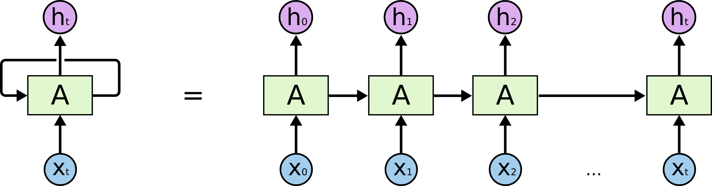

## Table of Contents

## What is an Auto-Regressive (AR) model in machine learning?

An Auto-Regressive (AR) model is a type of time series model used in machine learning and statistics to predict future values based on past values. It works on the principle that the current value of a variable can be explained as a function of its previous values. In an AR model, the next value in the series is predicted using a linear combination of past values. For example, if we want to predict tomorrow's temperature, we might use the temperatures from the past few days. The order of the AR model, denoted as AR(p), indicates how many past values are used in the prediction. For instance, an AR(2) model uses the two most recent values to make predictions.

Mathematically, an AR(p) model can be expressed as $$Y_t = c + \phi_1 Y_{t-1} + \phi_2 Y_{t-2} + ... + \phi_p Y_{t-p} + \epsilon_t$$, where \(Y_t\) is the value at time t, \(c\) is a constant, \(\phi_1, \phi_2, ..., \phi_p\) are the parameters of the model, and \(\epsilon_t\) is the error term at time t. The coefficients \(\phi\) determine how much weight is given to each past value. AR models are widely used in various fields such as finance for stock price prediction, economics for forecasting economic indicators, and meteorology for weather forecasting. They are particularly useful because they can capture patterns in data over time, making them a powerful tool for time series analysis.

## How does an AR model differ from other time series models?

An AR model is different from other time series models because it only uses past values of the same variable to make predictions. For example, if we are predicting tomorrow's temperature, an AR model would look at past temperatures, not other factors like humidity or wind speed. This makes AR models simpler and easier to understand, but they might not be as accurate if other factors are important. Other models, like ARIMA (AutoRegressive Integrated Moving Average), can include these other factors and also handle trends and seasonality in the data, making them more complex but potentially more accurate.

Another key difference is how AR models handle errors. In an AR model, the error term $$ \epsilon_t $$ is assumed to be independent and identically distributed. This means that past errors don't affect future predictions directly. In contrast, models like the Moving Average (MA) model use past errors to make predictions. An MA model looks at the errors from past predictions to improve future ones, which can be useful if errors tend to follow a pattern. ARIMA models combine both AR and MA approaches, using past values and past errors to make predictions, which can lead to better results in many situations.

## What are the basic components of an AR model?

An AR model has a few basic parts that help it work. The main part is the past values of the thing you want to predict. For example, if you're trying to guess tomorrow's temperature, an AR model will look at temperatures from the past few days. The number of past values it uses is called the order of the model, and it's written as AR(p). The "p" tells you how many past values the model uses. Each past value has a special number, called a coefficient, that tells the model how important that past value is for making a prediction.

The other important part of an AR model is the error term, which is written as $$ \epsilon_t $$. This part shows the mistakes the model makes. The model assumes these mistakes are random and don't affect future predictions. There's also a constant term, written as "c," which is like a starting point for the model. All these parts together help the AR model make a guess about what will happen next, using the formula $$ Y_t = c + \phi_1 Y_{t-1} + \phi_2 Y_{t-2} + ... + \phi_p Y_{t-p} + \epsilon_t $$. In this formula, $$ Y_t $$ is the value you're trying to predict, and the $$ \phi $$ numbers are the coefficients for the past values.

## How do you determine the order of an AR model?

To determine the order of an AR model, you need to figure out how many past values are useful for making predictions. This is done by looking at the data and using special tools like the Partial Autocorrelation Function (PACF). The PACF shows how each past value is related to the current value, without being influenced by the values in between. By looking at the PACF plot, you can see which past values have a big impact. If the plot shows a big spike at lag 2 and then drops off, an AR(2) model might be good because it uses the two most recent values.

Another way to choose the order is by using information criteria like the Akaike Information Criterion (AIC) or the Bayesian Information Criterion (BIC). These tools help you compare different AR models with different orders. You fit several AR models with different numbers of past values and then see which one has the lowest AIC or BIC score. The model with the lowest score is usually the best one because it balances how well the model fits the data with how simple the model is. This way, you can pick the right number of past values, or the order, for your AR model.

## What is the mathematical formula for an AR model?

An AR model predicts future values using past values of the same thing. The order of the model, written as AR(p), tells you how many past values it uses. Each past value has a special number called a coefficient, which shows how important that value is for making a prediction. There's also a constant term and an error term that shows the mistakes the model makes.

The mathematical formula for an AR model is $$ Y_t = c + \phi_1 Y_{t-1} + \phi_2 Y_{t-2} + ... + \phi_p Y_{t-p} + \epsilon_t $$. In this formula, \( Y_t \) is the value you want to predict at time t, \( c \) is the constant term, \( \phi_1, \phi_2, ..., \phi_p \) are the coefficients for the past values, and \( \epsilon_t \) is the error term at time t. This formula helps the model make a guess about what will happen next by using the past values and their coefficients.

## How do you estimate the parameters of an AR model?

To estimate the parameters of an AR model, you can use a method called the least squares method. This method tries to find the values of the coefficients and the constant term that make the model's predictions as close as possible to the actual values. You do this by calculating how far off the predictions are from the real values, squaring those differences, and then adding them up. The goal is to make this total as small as possible. The formula for the AR model is $$ Y_t = c + \phi_1 Y_{t-1} + \phi_2 Y_{t-2} + ... + \phi_p Y_{t-p} + \epsilon_t $$. By using the least squares method, you can find the best values for \( c \) and the coefficients \( \phi_1, \phi_2, ..., \phi_p \).

Another way to estimate the parameters is by using maximum likelihood estimation. This method looks at how likely it is that the model's predictions match the actual data, given certain values for the parameters. It tries to find the values of the coefficients and the constant term that make the data most likely to occur. This method can be a bit more complicated, but it's very useful, especially when you're dealing with more complex models. Both methods help you find the best parameters for your AR model, so you can make good predictions about what will happen next.

## What are common methods for validating an AR model?

To validate an AR model, you can use a method called cross-validation. This means you split your data into two parts: one part for training the model and the other part for testing it. You use the training data to find the best values for the coefficients and the constant term in the formula $$ Y_t = c + \phi_1 Y_{t-1} + \phi_2 Y_{t-2} + ... + \phi_p Y_{t-p} + \epsilon_t $$. Then, you use the testing data to see how well the model predicts new values. If the model's predictions are close to the actual values in the testing data, it's a good sign that your AR model is working well.

Another common method for validating an AR model is to check the residuals, which are the differences between the actual values and the model's predictions. You want the residuals to be random and not show any patterns. If you see patterns in the residuals, it means your model might be missing something important. You can use plots like the autocorrelation function (ACF) plot to check for patterns in the residuals. If the ACF plot shows that the residuals are not correlated with each other, it's a good sign that your AR model is valid.

## Can you explain the concept of stationarity in the context of AR models?

Stationarity is an important idea when you're working with AR models. It means that the pattern of the data stays the same over time. For an AR model to work well, the data it uses needs to be stationary. If the data is stationary, the average value and how spread out the values are don't change as time goes on. This makes it easier for the AR model to predict future values because the relationships between the past and future values stay the same.

To check if your data is stationary, you can look at things like the mean and variance of the data over time. If they don't change much, your data might be stationary. You can also use tests like the Augmented Dickey-Fuller (ADF) test to see if your data is stationary. If your data isn't stationary, you might need to make it stationary by taking differences between the values. For example, if you have a time series $$ Y_t $$, you can make it stationary by using $$ \Delta Y_t = Y_t - Y_{t-1} $$. Once your data is stationary, your AR model can make better predictions.

## How do AR models handle seasonality in time series data?

AR models by themselves don't handle seasonality very well. Seasonality means that the data has patterns that repeat over time, like higher sales during the holidays or warmer temperatures in the summer. An AR model looks at past values to predict future ones, but it doesn't know about these repeating patterns. So, if your data has strong seasonal patterns, an AR model might not give you very accurate predictions.

To deal with seasonality, you can use a special type of AR model called SARIMA, which stands for Seasonal ARIMA. SARIMA combines the AR model with other parts that can handle trends and seasonality. It uses a formula like $$ Y_t = c + \phi_1 Y_{t-1} + \phi_2 Y_{t-2} + ... + \phi_p Y_{t-p} + \Theta_1 Y_{t-s} + \Theta_2 Y_{t-2s} + ... + \Theta_P Y_{t-Ps} + \epsilon_t $$, where the new terms with $$ \Theta $$ help account for the seasonal patterns. By using SARIMA, you can make better predictions because it takes into account both the past values and the repeating patterns in your data.

## What are the limitations of AR models and how can they be addressed?

AR models have some limitations that can make them less effective in certain situations. One big problem is that AR models assume the data is stationary, meaning the patterns in the data don't change over time. If your data has trends or seasonal patterns, an AR model might not work well because it can't handle these changes. Another limitation is that AR models only use past values of the same thing you're trying to predict. This means they don't consider other factors that might be important, like weather affecting sales or economic indicators influencing stock prices. If these other factors are important, an AR model might not give you accurate predictions.

To address these limitations, you can use more advanced models like ARIMA or SARIMA. ARIMA stands for AutoRegressive Integrated Moving Average, and it can handle trends in the data by using a process called differencing. This makes the data stationary, so the AR part of the model can work better. The formula for an ARIMA model is $$ Y_t = c + \phi_1 Y_{t-1} + \phi_2 Y_{t-2} + ... + \phi_p Y_{t-p} + \theta_1 \epsilon_{t-1} + \theta_2 \epsilon_{t-2} + ... + \theta_q \epsilon_{t-q} + \epsilon_t $$, where the new terms with $$ \theta $$ help account for past errors. SARIMA, or Seasonal ARIMA, goes a step further by also handling seasonal patterns. It adds terms to the model that look at past values from the same time in previous seasons, helping to capture repeating patterns in the data. By using these more advanced models, you can get better predictions even when your data has trends or seasonal patterns.

## How can AR models be integrated with other machine learning techniques?

AR models can be integrated with other machine learning techniques to improve their predictive power and handle more complex data patterns. One common way to do this is by combining AR models with machine learning algorithms like Random Forests or Neural Networks. For example, you can use an AR model to capture the time-dependent patterns in your data and then use a Random Forest to include other factors that might influence the predictions. The AR model would provide the time series component, and the Random Forest would add the ability to consider multiple variables and their interactions. This hybrid approach can lead to more accurate predictions because it combines the strengths of both methods.

Another way to integrate AR models with other machine learning techniques is through ensemble methods. You can create an ensemble model where an AR model is one of several models used to make predictions. For instance, you might use an AR model alongside a Support Vector Machine (SVM) and a Gradient Boosting Machine (GBM). Each model would make its own prediction, and then these predictions could be combined using techniques like averaging or weighted voting. This approach can help reduce the risk of overfitting and improve the overall robustness of the predictions. By using AR models in combination with other machine learning techniques, you can build more flexible and powerful models that can handle a wider range of data patterns and complexities.

## What are some advanced applications of AR models in various industries?

AR models are used in many industries to help predict future values based on past data. In finance, AR models are used to forecast stock prices and other financial indicators. For example, a bank might use an AR model to predict future interest rates, helping them make better decisions about loans and investments. The formula for an AR model is $$ Y_t = c + \phi_1 Y_{t-1} + \phi_2 Y_{t-2} + ... + \phi_p Y_{t-p} + \epsilon_t $$, where past values of the stock price help predict future prices. By using AR models, financial analysts can get a better idea of what might happen in the market, which can lead to smarter investment strategies.

In the energy sector, AR models help predict electricity demand and prices. Power companies use these models to plan how much energy they need to produce and when. For instance, an AR model can look at past electricity usage to predict how much power will be needed on a hot summer day. This helps the company avoid shortages and keep the power grid stable. By using AR models, energy companies can make more accurate forecasts, which can save money and improve service for customers.