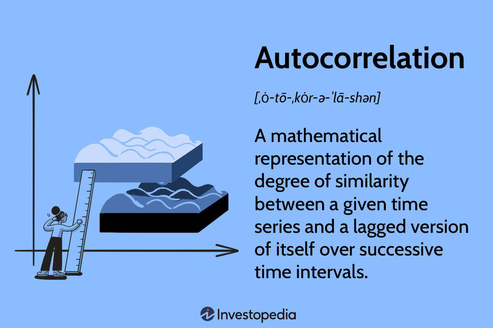

## Table of Contents

## What is autocorrelation?

Autocorrelation is a way to see how similar a set of data is to itself over different time periods. Imagine you have a list of numbers that change over time, like daily temperatures. Autocorrelation helps you understand if the temperature today is related to the temperature a few days ago. It does this by comparing the data with a shifted version of itself. If the temperatures are similar after a certain number of days, the autocorrelation is high, meaning there's a pattern or cycle in the data.

This concept is useful in many fields, like finance, where people look at stock prices over time, or in weather forecasting, where they study temperature patterns. By understanding autocorrelation, we can make better predictions about future events based on past data. For example, if stock prices tend to go up or down in a certain pattern, knowing this pattern can help in making investment decisions. Autocorrelation helps us see these patterns clearly and use them to our advantage.

## Why is autocorrelation important in data analysis?

Autocorrelation is important in data analysis because it helps us understand if there are patterns in our data over time. Imagine you're looking at the number of people visiting a store each day. If you see that the number of visitors today is similar to the number of visitors a week ago, that's autocorrelation. Knowing this can help store owners plan better, like making sure they have enough staff on busy days.

In fields like finance or weather forecasting, autocorrelation is key for making predictions. If stock prices or temperatures show a pattern, we can use that information to guess what might happen next. For example, if it's usually hot after a few warm days, knowing this pattern can help farmers plan their work. By understanding autocorrelation, we can make smarter decisions based on past data, which is really useful in many areas of life.

## How does autocorrelation affect statistical models?

Autocorrelation can make statistical models less accurate if it's not taken into account. Imagine you're trying to predict the number of ice creams sold each day based on the temperature. If the temperature today is similar to yesterday's, and you don't consider this, your model might think the temperature is the only thing affecting sales. But really, it's the pattern of temperatures over time that matters. If you ignore autocorrelation, your predictions might be off because you're not seeing the whole picture.

To fix this, statisticians use special techniques to handle autocorrelation. They might adjust their models to account for the patterns in the data over time. For example, they could use time series analysis methods like ARIMA models, which are designed to deal with autocorrelation. By doing this, they can make their predictions more accurate and reliable. Understanding and correcting for autocorrelation helps make sure that statistical models give us the best possible insights from our data.

## What are the different types of autocorrelation?

There are mainly two types of autocorrelation: positive and negative. Positive autocorrelation happens when data points that are close together in time or space tend to be similar. For example, if it's hot today, it's likely to be hot tomorrow too. This is common in things like weather patterns or stock prices, where today's value often depends on yesterday's. Negative autocorrelation is the opposite. It happens when data points close together tend to be different. For instance, if a stock price goes up one day, it might go down the next day. This can happen in situations where there's a back-and-forth pattern.

Another type of autocorrelation is called partial autocorrelation. This looks at the relationship between data points while removing the effects of other data points in between. Imagine you're looking at the temperature every three days. Partial autocorrelation helps you see if the temperature on day one is related to the temperature on day four, without being influenced by the temperature on day two or three. This is useful for understanding more complex patterns in data over time.

## Can you explain positive and negative autocorrelation with examples?

Positive autocorrelation is when things that happen close together in time or space are similar. Imagine you're looking at the daily temperatures in summer. If it's hot today, it's likely to be hot tomorrow too. This is because weather patterns tend to stick around for a few days. In finance, if a stock price goes up today, it might go up again tomorrow because investors might keep buying it. Positive autocorrelation helps us see these patterns and make better guesses about what might happen next.

Negative autocorrelation is the opposite. It happens when things close together in time or space are different. Think about a game of tennis. If the ball goes to the left side of the court, the next shot might go to the right side. This back-and-forth pattern is negative autocorrelation. In the stock market, if a stock price goes up one day, it might go down the next day as investors sell it off. Understanding negative autocorrelation can help us see these opposite patterns and plan accordingly.

## What is the difference between autocorrelation and partial autocorrelation?

Autocorrelation is when you look at how similar data points are to each other over time or space. Imagine you're checking the temperature every day. If it's hot today and also hot tomorrow, that's positive autocorrelation. It helps us see if there's a pattern in the data, like how temperatures or stock prices might stay the same over a few days.

Partial autocorrelation is a bit different. It looks at the relationship between two data points while ignoring the influence of the data points in between. Think of it like this: if you're looking at the temperature every three days, partial autocorrelation helps you see if the temperature on day one is related to the temperature on day four, without being affected by the temperatures on day two or three. This helps us understand more complex patterns in data, by focusing on the direct relationships between points that are further apart.

## How can autocorrelation be detected in time series data?

To detect autocorrelation in time series data, you can use something called a correlogram or autocorrelation function (ACF) plot. Imagine you're looking at the daily temperatures over a month. You make a graph where you compare today's temperature with the temperature from a few days ago, a week ago, and so on. If the lines on the graph stay high for a while, it means there's positive autocorrelation, showing that the temperatures are similar over time. If the lines go up and down a lot, it might mean there's no autocorrelation, or the temperatures are not related to each other over time.

Another way to detect autocorrelation is by using statistical tests like the Durbin-Watson test. This test looks at the differences between data points to see if they follow a pattern. If the test shows a value close to 2, it means there's little to no autocorrelation. But if the value is far from 2, it suggests there is autocorrelation. These methods help us understand if our data has patterns over time, which is useful for making better predictions and decisions based on past information.

## What are the common tests used to measure autocorrelation, such as the Durbin-Watson test?

One common test to measure autocorrelation is the Durbin-Watson test. This test looks at the differences between the data points in a time series to see if there's a pattern. If the test gives a result close to 2, it means there's not much autocorrelation. But if the result is far from 2, it suggests there is autocorrelation. Imagine you're checking the daily sales of ice cream. The Durbin-Watson test helps you see if today's sales are related to yesterday's sales, which can be useful for planning how much ice cream to stock.

Another test is the Ljung-Box test, which checks if there's autocorrelation at different time lags. It's like looking at the sales of ice cream not just day by day, but also week by week or month by month. The test calculates a statistic and compares it to a critical value. If the statistic is higher than the critical value, it suggests there is autocorrelation in the data. This test is helpful for understanding longer patterns in time series data, making it easier to predict future trends based on past behavior.

## How does one interpret the results of autocorrelation tests?

When you use tests like the Durbin-Watson test to check for autocorrelation, you're looking at a number that tells you if there's a pattern in your data over time. For the Durbin-Watson test, if the number is close to 2, it means there's not much autocorrelation. Your data points are not very related to each other over time. But if the number is far from 2, like close to 0 or 4, it means there is autocorrelation. This tells you that what happens today might be similar to what happened yesterday, or it might be the opposite.

The Ljung-Box test works a bit differently. It looks at different time lags to see if there's autocorrelation. You get a statistic from this test, and you compare it to a critical value. If the statistic is bigger than the critical value, it means there's autocorrelation in your data. This test helps you understand if there are patterns not just day by day, but also over longer periods like weeks or months. Both tests help you see if your data has patterns over time, which can be really useful for making predictions or planning ahead.

## What methods can be used to correct for autocorrelation in regression models?

To correct for autocorrelation in regression models, one common method is to use a technique called "Cochrane-Orcutt procedure." Imagine you're trying to predict how many ice creams you'll sell based on the temperature. If today's sales are similar to yesterday's because of the temperature pattern, you can adjust your model to account for this. The Cochrane-Orcutt procedure does this by transforming your data to remove the autocorrelation, making your predictions more accurate. It's like adjusting your recipe to make sure it works well no matter the weather pattern.

Another method is to use "ARIMA models," which stand for AutoRegressive Integrated Moving Average. These models are designed to handle time series data where autocorrelation is common. Think of it like trying to predict the temperature for the next few days. If it's been hot lately, an ARIMA model can use this pattern to make better guesses about future temperatures. By including terms that account for past values and errors, ARIMA models can correct for autocorrelation and give you more reliable predictions. Both methods help make sure your model sees the whole picture, not just part of it.

## How can advanced techniques like spectral analysis help in understanding autocorrelation?

Spectral analysis is like using a special tool to look at the patterns in your data over time. Imagine you're listening to music and trying to figure out which instruments are playing. Spectral analysis helps you break down the music into different parts, so you can see the patterns more clearly. In the same way, when you use spectral analysis on time series data, it helps you see the different cycles or patterns that might be hidden. This can show you if there are regular ups and downs in your data, like how the temperature might go up and down every year.

By using spectral analysis, you can understand autocorrelation better because it shows you the strength of these patterns at different time periods. For example, if you're looking at daily temperatures, spectral analysis can tell you if there's a strong weekly pattern or a yearly pattern. This helps you see how today's temperature might be related to temperatures from a week ago or a year ago. By understanding these patterns, you can make better predictions and plans based on what you see in your data.

## What are the latest research developments in autocorrelation analysis and their applications?

Recent research in autocorrelation analysis has focused on developing new methods to better understand and handle patterns in data over time. One exciting development is the use of machine learning techniques to detect and correct for autocorrelation more accurately. Researchers are using algorithms like deep learning to find complex patterns in data that traditional methods might miss. This can help in fields like finance, where understanding the patterns in stock prices can lead to better investment decisions, or in climate science, where predicting weather patterns can help with planning and disaster management.

Another area of advancement is the application of autocorrelation analysis in health and medical research. Scientists are using autocorrelation to study patterns in health data, like heart rate variability or brain activity, to better understand diseases and improve treatments. For example, by looking at the autocorrelation in heart rate data, doctors can detect early signs of heart conditions and intervene sooner. These developments show how autocorrelation analysis is becoming more powerful and useful in helping us understand and predict patterns in various aspects of life.

## What is Understanding Autocorrelation?

Autocorrelation, commonly referred to as serial correlation, is a crucial statistical measure in time series analysis. It quantifies the correlation of a time series with a lagged version of itself over successive time intervals. This property is instrumental in detecting patterns and trends within financial data, enabling analysts to make predictions based on historical behavior.

Mathematically, autocorrelation is expressed as:

$$

r_k = \frac{\sum_{t=1}^{N-k} (x_t - \bar{x})(x_{t+k} - \bar{x})}{\sum_{t=1}^{N} (x_t - \bar{x})^2} 
$$

where $r_k$ is the autocorrelation coefficient at lag $k$, $x_t$ represents the data point at time $t$, $\bar{x}$ is the mean of the time series, and $N$ is the total number of observations.

In financial markets, autocorrelation is often used to identify potential trends or cycles within price series. For instance, a high positive autocorrelation may indicate a strong trend where past price movements are likely to continue in the same direction. Conversely, a negative autocorrelation might suggest a reversal pattern, where previous price movements could be followed by opposite movements.

To accurately analyze time series data, it is essential to understand the distinction between autocorrelation and partial autocorrelation. Partial autocorrelation measures the correlation between the time series and a lagged version of itself, accounting for the relationships explained by intervening lags. This distinction becomes particularly important when applying models like the Autoregressive Integrated Moving Average (ARIMA), where both autocorrelation and partial autocorrelation play roles in determining the order of autoregressive and moving average components.

For instance, in Python, the `statsmodels` library offers functions such as `acf()` and `pacf()` to compute autocorrelation and partial autocorrelation, respectively. These tools help in visualizing patterns:

```python
import numpy as np
import matplotlib.pyplot as plt
from statsmodels.tsa.stattools import acf, pacf

# Sample time series data
data = np.random.normal(size=100)

# Calculate autocorrelation and partial autocorrelation
auto_corr = acf(data, nlags=20)
partial_auto_corr = pacf(data, nlags=20)

# Plotting
plt.figure(figsize=(12, 5))
plt.subplot(121)
plt.stem(auto_corr)
plt.title('Autocorrelation')

plt.subplot(122)
plt.stem(partial_auto_corr)
plt.title('Partial Autocorrelation')

plt.show()
```

This example illustrates how to visualize the autocorrelation and partial autocorrelation functions using Python. Such visualizations are vital in identifying significant lags that influence the time series, aiding in model selection and refinement.

In summary, understanding autocorrelation and its partial counterpart is essential for analyzing financial time series. These concepts allow traders and analysts to identify and leverage inherent patterns within data, enhancing predictive accuracy and informing strategic decision-making.

## What are Statistical Tests for Autocorrelation?

Various statistical tests are employed to detect autocorrelation within a dataset, an essential [factor](/wiki/factor-investing) in ensuring the validity and reliability of time series models used in trading strategies. The most widely recognized test is the Durbin-Watson test, commonly applied in regression analysis to identify the presence of autocorrelation in the residuals. The Durbin-Watson statistic is calculated as:

$$

DW = \frac{\sum_{t=2}^{n} (e_t - e_{t-1})^2}{\sum_{t=1}^{n} e_t^2} 
$$

where $e_t$ represents the residuals from the regression model at time $t$. The value of the Durbin-Watson statistic ranges between 0 and 4, with a value around 2 indicating no autocorrelation, values less than 2 suggesting positive autocorrelation, and values greater than 2 indicating negative autocorrelation.

Another significant test is the Ljung-Box test, which is a portmanteau test assessing whether any of a group of autocorrelations of a time series is significantly different from zero. Unlike the Durbin-Watson test, the Ljung-Box test is not limited to checking only first-order autocorrelation but rather evaluates multiple lags simultaneously. The test statistic is given by:

$$

Q = n(n+2) \sum_{k=1}^{m} \frac{\hat{\rho}_k^2}{n-k} 
$$

where $n$ is the sample size, $\hat{\rho}_k$ represents the autocorrelation at lag $k$, and $m$ is the number of lags being tested. The Ljung-Box test is particularly useful for more comprehensive autocorrelation analysis in trading strategies, providing insights into the systematic patterns within data.

The Breusch-Godfrey test is another powerful tool, which extends the Durbin-Watson test to higher-order autocorrelation. This test is performed by regressing the residuals of the estimated model on the original regressors and lagged values of residuals. The null hypothesis of no autocorrelation is tested using the chi-squared distribution of the resulting statistic. This adaptability makes the Breusch-Godfrey test suitable for complex models frequently encountered in [algorithmic trading](/wiki/algorithmic-trading).

These statistical tests are critical for verifying the assumptions of time series models, as overlooking autocorrelation can lead to inefficient estimates and misleading inferences. In trading strategies, accurately identifying and correcting for autocorrelation improves model reliability and trading signal precision. This process aids traders in optimizing their strategies based on robust statistical foundations, ultimately enhancing trading performance.

## What is Autocorrelation in Algorithmic Trading?

In algorithmic trading, understanding the autocorrelation of time series data is critical for making informed predictions about future price movements and enhancing trading strategies. Autocorrelation helps traders detect patterns and persistence in market data, which can be invaluable for forecasting trends and optimizing algorithms.

### Predicting Future Price Movements and Market Trends

Autocorrelation indicates the degree to which past values in a time series predict future values. When positive autocorrelation is present, a positive change in a time series is likely to be followed by another positive change, suggesting a continuation of a trend. Conversely, negative autocorrelation may indicate a reversal of current trends.

To quantify autocorrelation mathematically, the autocorrelation function (ACF) is used. The ACF at lag $k$ for a time series $X_t$ is defined as:

$$
\rho(k) = \frac{\sum_{t=k+1}^{T} (X_t - \bar{X})(X_{t-k} - \bar{X})}{\sum_{t=1}^{T} (X_t - \bar{X})^2}
$$

where:
- $\bar{X}$ is the mean of the series.
- $T$ is the number of observations.

This function allows traders to examine how current and lagged values relate, thereby helping predict future price changes accurately.

### Optimizing Trading Algorithms

Traders integrate autocorrelation analyses into their algorithms to refine forecasting models, filter noise, and identify genuine trading signals. By incorporating autocorrelation insights, trading systems can be calibrated to better adapt to market conditions and [volatility](/wiki/volatility-trading-strategies).

### Risk Management and Volatility Analysis

In risk management, autocorrelation is instrumental in assessing the persistence of asset returns, a vital factor for estimating risk and understanding market behavior. High autocorrelation in asset returns may suggest volatility clustering, which is the tendency for high volatility events to cluster together. This phenomenon can be modeled and predicted using GARCH (Generalized Autoregressive Conditional Heteroskedasticity) models, which are particularly adept at capturing autocorrelation in volatility.

For instance, a simple GARCH(1,1) model, which incorporates past variances, can be expressed as:

$$
\sigma_t^2 = \omega + \alpha \epsilon_{t-1}^2 + \beta \sigma_{t-1}^2
$$

where:
- $\sigma_t^2$ is the current period's variance.
- $\omega$, $\alpha$, and $\beta$ are coefficients that need to be estimated.

### Enhancing Signal Accuracy and Reliability

The use of autocorrelation in refining signal accuracy and reliability is another cornerstone of its application in algorithmic trading. By recognizing recurring patterns in price data, traders can formulate strategies that exploit these signals, reducing false trades and improving the Sharpe ratio of their portfolios.

In conclusion, autocorrelation provides a robust framework for traders to forecast price movements, manage risk, and optimize their trading algorithms. By leveraging these insights, traders can develop more resilient and profitable trading systems.

## How can you calculate autocorrelation using Python?

Python's extensive libraries like NumPy, pandas, and statsmodels facilitate the calculation and visualization of autocorrelation, serving as invaluable tools for traders aiming to analyze time series data effectively. This section guides users through the essential steps for computing autocorrelation and visualizing the results using the Autocorrelation Function (ACF) plot.

### Step-by-Step Instructions

**Step 1: Importing Required Libraries**

Start by importing the necessary libraries. NumPy will be crucial for numerical operations, pandas for data manipulation, and statsmodels for statistical analysis.

```python
import numpy as np
import pandas as pd
import matplotlib.pyplot as plt
from statsmodels.graphics.tsaplots import plot_acf
```

**Step 2: Preparing the Data**

Load or generate your time series data. For demonstration, let's assume a simple synthetic time series or load a dataset using pandas.

```python
# Generating synthetic data
np.random.seed(42)
data = np.cumsum(np.random.randn(1000))

# Alternatively, load data using pandas
# data = pd.read_csv('your_data_file.csv')
```

**Step 3: Calculating Autocorrelation**

Utilize pandas to calculate the autocorrelation for a specific lag. Autocorrelation for lag $k$ is calculated as:

$$
\rho_k = \frac{\sum_{t=k+1}^n (x_t - \bar{x})(x_{t-k} - \bar{x})}{\sum_{t=1}^n (x_t - \bar{x})^2}
$$

where $\bar{x}$ is the mean of the time series.

```python
def autocorrelation(data, lag):
    return data.autocorr(lag=lag)

# Example: Calculate autocorrelation for lag 1
lag_1_autocorr = autocorrelation(pd.Series(data), 1)
print(f"Autocorrelation at lag 1: {lag_1_autocorr}")
```

**Step 4: Visualizing with ACF Plots**

Create an ACF plot to visually analyze the autocorrelation across multiple lags.

```python
plot_acf(data, lags=40)
plt.title('Autocorrelation Function')
plt.show()
```

**Step 5: Applying Autocorrelation in Trading Strategies**

Autocorrelation helps identify persisting trends or reversal patterns, useful for developing trading signals. High autocorrelation at lower lags can indicate a potential trend, whereas an abrupt drop suggests possible mean reversion. 

In a trading strategy, autocorrelation might be used to adjust weighting schemes in a moving average crossover strategy, or to recalibrate risk models based on changing autocorrelation patterns.

```python
def trading_signal(data, thresholds=(0.05, -0.05)):
    autocorr = autocorrelation(pd.Series(data), 1)
    if autocorr > thresholds[0]:
        return "Buy"  # Indicates a continuing trend
    elif autocorr < thresholds[1]:
        return "Sell"  # Indicates potential reversal
    else:
        return "Hold"

signal = trading_signal(data)
print(f"Trading Signal: {signal}")
```

### Conclusion

Understanding and calculating autocorrelation with Python provides a significant advantage in [quantitative trading](/wiki/quantitative-trading). By employing libraries such as NumPy, pandas, and statsmodels, traders can assess the predictability of price movements, aiding in the formulation of effective trading strategies. The integration of Python for these calculations offers both simplicity and depth, equipping traders with the ability to refine strategies based on detailed time series analyses.

## References & Further Reading

[1]: Durbin, J., & Watson, G. S. (1950). ["Testing for Serial Correlation in Least Squares Regression."](https://www.jstor.org/stable/pdf/2332391.pdf) Biometrika, 37(3-4), 409-428.

[2]: Box, G. E. P., & Pierce, D. A. (1970). ["Distribution of Residual Autocorrelations in Autoregressive-Integrated Moving Average Time Series Models."](https://www.tandfonline.com/doi/abs/10.1080/01621459.1970.10481180) Journal of the American Statistical Association, 65(332), 1509-1526.

[3]: ["Time Series Analysis: Forecasting and Control"](https://www.wiley.com/en-us/Time+Series+Analysis%3A+Forecasting+and+Control%2C+5th+Edition-p-9781118675021) by George E. P. Box, Gwilym M. Jenkins, Gregory C. Reinsel, and Greta M. Ljung

[4]: Hamilton, J. D. (1994). ["Time Series Analysis."](https://press.princeton.edu/books/hardcover/9780691042893/time-series-analysis) Princeton University Press.

[5]: ["Introduction to Time Series and Forecasting"](https://link.springer.com/book/10.1007/978-3-319-29854-2) by Peter J. Brockwell and Richard A. Davis

[6]: Tsay, R. S. (2010). ["Analysis of Financial Time Series."](https://onlinelibrary.wiley.com/doi/book/10.1002/9780470644560) Wiley Series in Probability and Statistics.