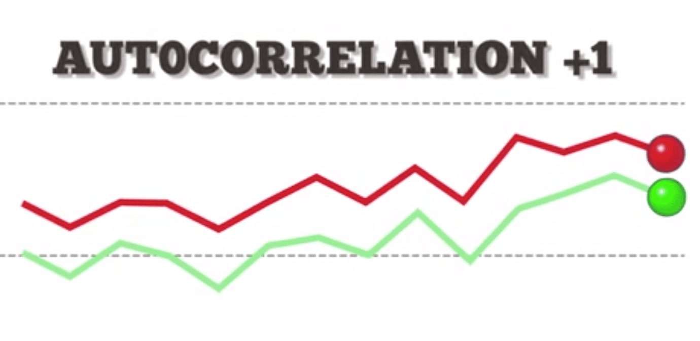

Python is a versatile programming language extensively used in algorithmic trading due to its simplicity, ease of use, and a rich ecosystem of libraries that support data analysis, machine learning, and statistical computation. Its capabilities for automating trading strategies have made it a preferred choice among financial analysts and traders. Algorithmic trading involves developing mathematical models and writing computer algorithms to execute trades at optimal moments based on market signals and pre-set rules. Python facilitates this by providing robust tools to handle large datasets, perform complex calculations, and implement machine learning models for predictive analytics.

Autocorrelation is a statistical measure used in time series data to quantify the degree of similarity between a given time series and a lagged version of itself over successive time intervals. This concept is foundational in the analysis of time-dependent phenomena where the order or sequence of data points is crucial. Mathematically, the autocorrelation function (ACF) at a lag $k$ is the correlation between the series and its lag, typically expressed as:



$$
r_k = \frac{\sum_{t=k+1}^{T}(y_t - \bar{y})(y_{t-k} - \bar{y})}{\sum_{t=1}^{T}(y_t - \bar{y})^2}
$$

where $r_k$ is the autocorrelation at lag $k$, $y_t$ is the value at time $t$, $\bar{y}$ is the mean of the series, and $T$ is the total number of observations. Autocorrelation helps reveal how past values in the series influence future values, thus allowing traders to recognize patterns and potential market trends that are not immediately obvious in raw data.

In the context of trading, identifying such patterns is crucial for predicting future price movements and making informed trading decisions. Autocorrelation plays a critical role in recognizing repetitive patterns or cycles in the financial data, which can be exploited to optimize trading positions. By understanding the strength and direction of trends through autocorrelation, traders can adjust their strategies, improving decision-making processes.

Choosing Python for performing autocorrelation analysis in trading is driven by a few key factors. Python offers a range of scientific libraries, such as NumPy, pandas, and statsmodels, which simplify the computation and visualization of autocorrelation in time series data. These libraries provide built-in functions for calculating autocorrelation and generating Autocorrelation Function (ACF) plots, aiding in the quick interpretation of data patterns. Moreover, Python's intuitive syntax and the availability of extensive documentation and community support make it accessible even to those new to programming, facilitating the rapid prototyping and deployment of trading algorithms. Thus, Python's combination of ease of use and powerful analytical capabilities makes it an ideal tool for implementing autocorrelation analysis in algorithmic trading.

## Table of Contents

## Understanding Autocorrelation

Autocorrelation, often referred to as serial correlation, is a statistical measure that represents the degree to which a given time series is correlated with a lagged version of itself. The mathematical foundation of autocorrelation is expressed through the autocorrelation function (ACF), which quantifies the similarity between observations as a function of the time lag between them. Mathematically, the autocorrelation coefficient $r_k$ for a lag $k$ in a time series $x_t$ can be expressed as:

$$
r_k = \frac{\sum_{t=1}^{N-k} (x_t - \bar{x})(x_{t+k} - \bar{x})}{\sum_{t=1}^{N} (x_t - \bar{x})^2}
$$

where $\bar{x}$ represents the mean of the time series, and $N$ is the total number of observations.

A crucial difference between autocorrelation and partial autocorrelation lies in how they account for indirect relationships. Autocorrelation considers all lagged relationships, while partial autocorrelation measures the direct relationship between an observation and its lag, controlling for the influence of intermediate lags. Partial autocorrelation is useful in identifying the order of autoregressive models (AR models), focusing only on the direct correlation with intermediate factors removed.

Autocorrelation is significant in time series analysis as it helps in understanding the internals of data series, assessing patterns that persist over time. A consistent autocorrelation at lag $k$ indicates a repetitive and predictable pattern at that interval. In time series forecasting, such patterns facilitate the application of models like ARIMA (Autoregressive Integrated Moving Average) where the autocorrelation and partial autocorrelation plots aid in selecting appropriate model parameters.

Examples of autocorrelation are prevalent in financial markets where asset prices often exhibit autocorrelated behavior. For instance, stock prices may demonstrate [momentum](/wiki/momentum) where past returns linger, suggesting future price continuities or reversals. This behavior underpins strategies like momentum trading, where investors capitalize on the continuation of recent trends. Additionally, autocorrelation is employed in seasonal stock market patterns, where certain months or days consistently exhibit specific trends, such as stronger gains or losses.

In summary, understanding autocorrelation is essential for effective time series analysis, allowing analysts to detect and exploit underlying patterns in data, crucial for forecasting and strategic decision-making in the financial markets.

## Uses of Autocorrelation in Algo Trading

Autocorrelation is a pivotal concept in [algorithmic trading](/wiki/algorithmic-trading), primarily due to its ability to analyze and predict time series data effectively. By quantifying how a variable is correlated with a lagged version of itself over successive time intervals, traders can glean insights into future price movements, identify market trends, optimize trading strategies, and enhance risk management.

### Forecasting Future Price Movements

Autocorrelation aids in forecasting by evaluating how past price patterns may influence future values. A significant positive autocorrelation suggests that a current trend is likely to persist, whereas a negative autocorrelation may indicate a reversal. For instance, in Python, traders can employ libraries such as pandas and statsmodels to determine autocorrelation:

```python
import pandas as pd
from statsmodels.tsa.stattools import acf

# Assuming `prices` is a pandas Series of stock prices
autocorr_values = acf(prices, nlags=20)
```

Here, `autocorr_values` provides insights into the persistence of price movements, informing buy or sell decisions based on past trends.

### Spotting Market Trends

Identifying trends is crucial in trading, and autocorrelation serves as an essential indicator of market momentum. When used in conjunction with other metrics, such as moving averages, autocorrelation can validate the strength and direction of market trends. If the autocorrelation at certain lags is strong, it suggests a trend, guiding traders in devising strategies accordingly.

### Developing and Testing Trading Strategies

Autocorrelation provides a backbone for testing hypothesis-driven strategies in an algorithmic trading framework. By analyzing the correlation patterns, traders can backtest strategies under the assumption that certain patterns will recur. This is accomplished by simulating trading rules within a [backtesting](/wiki/backtesting) environment to assess the viability of these strategies.

For example, if daily closing prices exhibit positive autocorrelation at a lag of one day, a potential strategy may involve buying at the close and selling the next day, assuming the trend continues.

### Risk Management and Volatility Analysis

In risk management, understanding [volatility](/wiki/volatility-trading-strategies) through autocorrelation allows traders to be aware of the persistence of price changes. High autocorrelation might suggest prolonged volatility, necessitating risk mitigation tactics such as adjusted leverage or hedging strategies. By modeling the variance of returns, traders can anticipate periods of increased risk:

```python
import numpy as np

# Calculate rolling volatility using autocorrelation
rolling_volatility = prices.rolling(window=20).std() * np.sqrt(252)

# Analyze autocorrelation of rolling volatility
rolling_acf = acf(rolling_volatility.dropna(), nlags=5)
```

These calculations reveal how volatility persists over time, equipping traders with the necessary foresight to manage their risk exposure effectively.

In summary, autocorrelation is an invaluable tool in algorithmic trading, enabling traders to forecast market dynamics, identify trends, develop robust strategies, and manage potential risks in volatile markets. By leveraging Python’s analytical capabilities, traders can perform comprehensive autocorrelation analyses to enhance their trading systems.

## Calculating Autocorrelation

Calculating autocorrelation is a crucial step in time series analysis for algorithmic trading, as it identifies the relationship of a variable with its own past values. In a financial context, this helps traders understand potential future movements of market data. Here, we outline the steps and tools required to compute autocorrelation using Python, along with a demonstration of sample code and visualization techniques.

### Steps Involved in Computing Autocorrelation for Trading Data

1. **Data Collection and Preparation**: 
   - Obtain historical trading data. This can include prices such as open, close, high, and low values of financial instruments.
   - Clean and preprocess the data to ensure consistency, such as handling missing values and ensuring proper time indexing.

2. **Calculating Autocorrelation**:
   - Choose the lag value that defines the period over which the autocorrelation is calculated.
   - Compute the autocorrelation coefficients using mathematical formulas or built-in functions from libraries.

The autocorrelation coefficient for a lag $k$ is calculated as:

$$
r_k = \frac{\sum_{t=k+1}^{n} (x_t - \bar{x})(x_{t-k} - \bar{x})}{\sum_{t=1}^{n} (x_t - \bar{x})^2}
$$

where $x_t$ is the time series, $\bar{x}$ is the mean of the series, $k$ is the lag, and $n$ is the total number of observations.

### Tools and Libraries in Python to Calculate Autocorrelation

Python offers several libraries that simplify the calculation of autocorrelation:

- **NumPy**: Provides efficient array operations and statistical functions.
- **Pandas**: Handles time series data and comes equipped with utilities for time-based operations.
- **Statsmodels**: Contains advanced statistical models, including functions to compute autocorrelation.

### Demo with Sample Python Code to Compute Autocorrelation

Below is a demonstration of how to calculate the autocorrelation using Python:

```python
import numpy as np
import pandas as pd
import matplotlib.pyplot as plt
from statsmodels.tsa.stattools import acf

# Simulate some trading data, e.g., closing prices
np.random.seed(0)
data_length = 100
price_data = pd.Series(np.random.randn(data_length).cumsum())

# Calculate autocorrelation
autocorr_values = acf(price_data, nlags=20)

print("Autocorrelation values:", autocorr_values)
```

### Visualization of Autocorrelation with ACF Plots in Python

Autocorrelation Function (ACF) plots provide a visual representation of the autocorrelation coefficients across different lags. This is useful for detecting patterns and periodicities in the data:

```python
from statsmodels.graphics.tsaplots import plot_acf

plt.figure(figsize=(10, 6))
plot_acf(price_data, lags=20)
plt.title('Autocorrelation Function')
plt.xlabel('Lag')
plt.ylabel('Autocorrelation')
plt.show()
```

The plotted ACF helps traders identify lags where the series has significant autocorrelation, signifying potential trends or seasonality in the data. Leveraging Python and its powerful libraries, calculating and visualizing autocorrelation becomes highly accessible and informative for improving trading strategies.

## Implementing Autocorrelation in Python

Implementing autocorrelation analysis in Python involves several steps, including setting up the environment, acquiring and preparing data, writing scripts for analysis, and using the results to generate trading signals. This process is crucial for leveraging the power of autocorrelation to make informed trading decisions.

### Setting Up the Python Environment for Data Analysis
To perform autocorrelation analysis, it's essential to have a Python environment that includes libraries for numerical computation, data manipulation, and visualization. The following libraries are commonly used:

- **NumPy**: Provides support for large, multi-dimensional arrays and matrices, along with a collection of mathematical functions.
- **Pandas**: Offers data structures and data analysis tools that make it easy to store and manipulate structured data.
- **Matplotlib** and **Seaborn**: Used for creating static, animated, and interactive visualizations.
- **statsmodels**: Contains a range of statistical models and tests, including tools for time series analysis.

To install these libraries, use the following pip command:

```bash
pip install numpy pandas matplotlib seaborn statsmodels
```

### Fetching and Preparing Financial Market Data Using Python
Financial market data can be sourced from various APIs or downloaded from websites offering historical data. One popular API for obtaining financial data is provided by Yahoo Finance, which can be accessed through the `yfinance` library. Here’s how to fetch and prepare data:

```python
import yfinance as yf  # For more datasets, visit: https://paperswithbacktest.com/datasets
import pandas as pd

# Fetch historical data for a given stock
ticker = 'AAPL'
data = yf.download(ticker, start='2020-01-01', end='2023-01-01')

# Display the first few rows of the dataframe
print(data.head())

# Prepare the data: selecting the 'Close' price and filling missing values
close_prices = data['Close'].fillna(method='ffill')
```

### Illustration of Python Scripts for Autocorrelation Analysis
With the data prepared, the next step is to calculate autocorrelation. The `statsmodels` library provides tools to compute autocorrelation and generate plots for visual analysis.

```python
import statsmodels.api as sm
import matplotlib.pyplot as plt

# Calculate autocorrelation for the 'Close' price series
autocorrelation = sm.tsa.acf(close_prices, fft=False)

# Plot autocorrelation function
plt.figure(figsize=(10, 5))
plt.stem(autocorrelation, use_line_collection=True)
plt.title('Autocorrelation of Close Prices')
plt.xlabel('Lag')
plt.ylabel('Autocorrelation')
plt.show()
```

### Generating Trading Signals Based on Autocorrelation Results
Autocorrelation analysis can help generate trading signals by identifying repeating patterns that may indicate future price movements. An example trading strategy could involve buying when positive autocorrelation is detected at a certain lag, as this might suggest a continuation of a price trend.

```python
# Example strategy: Buy signal if autocorrelation at lag 1 is significantly positive
lag = 1
if autocorrelation[lag] > 0.5:
    print("Buy Signal: Positive autocorrelation detected.")
else:
    print("No strong buy signal detected.")
```

This script provides a starting point for developing more sophisticated trading algorithms. By combining autocorrelation analysis with other statistical tools, traders can design robust strategies that adapt to various market conditions.

## Technical Analysis and Autocorrelation

Autocorrelation plays a significant role in technical analysis by offering insights into the patterns and trends present within financial time series data. By measuring the degree of correlation between current and past values in a dataset over various time lags, autocorrelation helps traders determine the predictability and persistence of a trend. This can be pivotal for trend confirmation and signal validation, as a strong autocorrelation might indicate that a current trend is likely to continue.

### Using Autocorrelation for Trend Confirmation and Signal Validation

In technical analysis, trend confirmation is essential to ensure that a detected trend is valid and not simply a result of random market fluctuations. Autocorrelation can be used to confirm trends by identifying repetitive patterns and quantifying their strength. For instance, if the autocorrelation function indicates a positive correlation at various lags, a trader can infer that recent price movements are likely to persist, thereby confirming the trend.

Moreover, autocorrelation can be coupled with other technical indicators to validate trading signals. For example, if a moving average crossover generates a buy signal, checking the autocorrelation of the asset's price can provide additional confirmation. If the autocorrelation is also strongly positive, the signal is reinforced, suggesting a higher probability of the trend continuing.

### Impact on Developing Algorithmic Trading Systems

In developing algorithmic trading systems, autocorrelation serves as an essential component for constructing robust models. Algorithms can be designed to exploit periods of high autocorrelation by placing trades that align with the detected patterns. This makes it possible to automate decision-making processes based on statistical evidence of price movements.

For instance, if historical data shows that certain stocks exhibit high autocorrelation during specific market conditions, a trading algorithm can be programmed to detect and capitalize on these conditions. Furthermore, algorithms can be fine-tuned by continuously monitoring and adjusting the response to autocorrelation changes, thereby optimizing strategies for different market environments.

### Case Studies Demonstrating the Use of Autocorrelation in Trading

Case studies in financial markets underscore the practical application of autocorrelation in trading. For example, during certain macroeconomic events, currencies or commodities may show heightened autocorrelation, indicating persistent trends that algorithms can harness for profit. A [quantitative trading](/wiki/quantitative-trading) firm might analyze historical data to reveal periods when the autocorrelation of an asset was notably high, allowing them to devise strategies that align with these temporal opportunities.

Another case might involve equities during [earning](/wiki/earning-announcement) season, where stocks often temporarily exhibit strong autocorrelation due to investor sentiment and market anticipation. By recognizing this pattern, a trading system could dynamically adjust its strategy, enhancing return potential while mitigating risk.

In summary, integrating autocorrelation into technical analysis fosters more reliable trend predictions and enhances the development of algorithmic trading systems. By leveraging the insights provided by autocorrelation, traders and algorithms can achieve more informed and statistically supported decisions, ultimately improving trading performance in complex financial markets.

## Pros and Cons of Using Autocorrelation

Autocorrelation serves as a valuable tool in algorithmic trading by enabling traders to identify and leverage repetitive patterns in market data. This statistical measure provides insights into the degree of similarity between a given time series and a lagged version of itself over successive time intervals. 

**Advantages of Employing Autocorrelation in Trading Strategies:**

1. **Pattern Recognition and Forecasting:**
   Autocorrelation facilitates the identification of cycles and trends in financial data. By analyzing past price movements, traders can infer potential future fluctuations, thus enhancing the predictive accuracy of their trading models. This can be especially useful when forecasting stock prices, exchange rates, or other market indicators that exhibit cyclical behavior.

2. **Improved Trading Signal Accuracy:**
   Incorporating autocorrelation analysis can substantiate trading signals by confirming whether observed patterns are statistically significant rather than random noise. This leads to more reliable strategies, reducing the likelihood of false signals.

3. **Enhanced Risk Management:**
   By understanding the persistence of volatility and return patterns, traders can make more informed risk management decisions. Autocorrelation allows for better assessment of risk exposure and adjustment of trading positions accordingly.

**Potential Drawbacks and Limitations of Relying on Autocorrelation:**

1. **Autocorrelation is Not Always Present:**
   Not all financial time series exhibit significant autocorrelation. In efficient markets, price changes may follow a random walk, where past movements are not indicative of future prices. Relying solely on autocorrelation in such cases can lead to misguided assumptions and trading decisions.

2. **Overfitting and Model Complexity:**
   Traders might fall into the trap of overfitting their models to historical data, relying too heavily on autocorrelation patterns that may not persist in the future. This complexity can obscure model effectiveness and make it difficult to apply in live trading environments.

**Mitigating Challenges Through Complementary Tools and Methods:**

1. **Combining Autocorrelation with Other Analytical Techniques:**
   To overcome its limitations, autocorrelation should be used in conjunction with other statistical measures such as partial autocorrelation, cross-correlation, and spectral analysis. This multipronged approach enables a more comprehensive analysis of market conditions.

2. **Integrating Fundamental Analysis:**
   Combining technical insights from autocorrelation with [fundamental analysis](/wiki/fundamental-analysis)—examining economic indicators, corporate earnings, and market sentiment—can provide a more holistic trading strategy.

**Best Practices for Enhancing Autocorrelation Analysis Outcomes:**

1. **Robust Data Preprocessing:**
   Ensure that data is clean and preprocessed appropriately, removing any anomalies or biases that could skew autocorrelation results. This includes handling missing data and normalizing non-stationary time series.

2. **Use of ACF and PACF Plots:**
   Employ Autocorrelation Function (ACF) and Partial Autocorrelation Function (PACF) plots to visually assess the significance and order of autocorrelation in time series data. This aids in selecting the appropriate lag intervals for analysis.

3. **Continual Model Validation:**
   Regularly validate trading models against new data to ensure they are robust to changing market conditions. This helps maintain the reliability and adaptability of trading strategies over time.

By strategically leveraging autocorrelation in algorithmic trading, traders can refine their strategies, enhance predictive accuracy, and manage risks more effectively. However, it is crucial to acknowledge its limitations and complement it with additional analytical methods and sound judgment to realize its full potential.

## Conclusion

Throughout this article, we have explored the pivotal role of autocorrelation in the domain of algorithmic trading, particularly when employing Python as a tool for analysis. Autocorrelation is instrumental in enhancing trading performance by allowing traders to identify patterns and trends that could signal future price movements. It provides the statistical foundation required to discern the relationships within time series data, aiding in the development and fine-tuning of trading strategies.

The integration of Python for autocorrelation analysis not only offers a powerful and flexible framework but also enables traders to construct more robust models through extensive libraries and tools specifically designed for data analysis. Python's capabilities allow for the efficient computation and visualization of autocorrelation metrics, which are crucial for validating trading signals and assessing market conditions. This computational power is vital for improving the accuracy and reliability of algorithmic trading strategies.

Looking ahead, the application of autocorrelation in financial markets is poised for significant advancements. As data analytics and [machine learning](/wiki/machine-learning) techniques evolve, the potential to harness autocorrelation for more sophisticated and predictive trading models continues to grow. The ongoing development and refinement of Python tools will further streamline the integration of autocorrelation in trading systems, offering new opportunities for traders and analysts to enhance decision-making processes.

In conclusion, understanding and utilizing autocorrelation effectively can lead to better-informed trading strategies and improved financial outcomes. Traders and analysts are encouraged to leverage Python's extensive capabilities to explore and implement autocorrelation in their algo trading endeavors, keeping a keen eye on future innovations that promise to transform these practices.

## References & Further Reading

[1]: Hyndman, R. J., & Athanasopoulos, G. (2018). ["Forecasting: Principles and Practice."](https://otexts.com/fpp2/) OTexts.

[2]: Box, G. E. P., Jenkins, G. M., Reinsel, G. C., & Ljung, G. M. (2015). ["Time Series Analysis: Forecasting and Control."](https://onlinelibrary.wiley.com/doi/book/10.1002/9781118619193) Wiley.

[3]: Hamilton, J. D. (1994). ["Time Series Analysis."](https://press.princeton.edu/books/hardcover/9780691042893/time-series-analysis) Princeton University Press.

[4]: R. Shumway & D. Stoffer (2017). ["Time Series Analysis and Its Applications: With R Examples."](https://link.springer.com/book/10.1007/978-3-319-52452-8) Springer.

[5]: ["Python for Data Analysis: Data Wrangling with Pandas, NumPy, and IPython"](https://wesmckinney.com/book/) by Wes McKinney

[6]: Hyndman, R. J. (2020). ["A Brief Introduction to Time Series Analysis."](https://otexts.com/fpp3/) Monash University EBS Journal Articles.