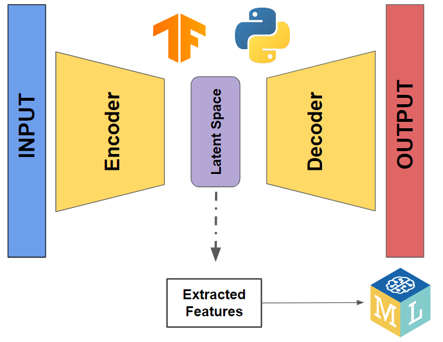

Machine learning has become an integral component of algorithmic trading, offering sophisticated techniques for processing and interpreting vast arrays of financial data. One of the critical challenges in this domain is the extraction and utilization of informative features to drive predictive models. Autoencoders, a type of neural network architecture, have emerged as valuable tools in this context due to their ability to efficiently perform nonlinear dimensionality reduction and manifold learning. These capabilities enable the extraction of essential features from complex datasets, providing deeper insights into the underlying factors that affect market movements.

Autoencoders function primarily by compressing input data into a lower-dimensional representation and then reconstructing the original data from this compressed form. This process aids in identifying critical patterns and structures within data, which may not be apparent through traditional statistical methods. Within the financial realm, these patterns are crucial for developing robust models that can anticipate market behavior and manage risk more effectively. By leveraging autoencoders, traders can derive latent factors that impact asset returns, allowing for more accurate predictions and improved risk assessments.



Recent advancements in computational power and algorithmic frameworks have sparked renewed interest in utilizing autoencoders for crafting innovative trading strategies. Researchers and practitioners have started exploring how these models can be integrated into trading systems to enhance decision-making processes. This resurgence in interest is evidenced by studies such as the one by Gu, Kelly, and Xiu (2020), which highlight the potential of machine learning techniques, including autoencoders, in improving predictive accuracy and strategic executions in financial markets. Consequently, autoencoders are now viewed not just as tools for feature extraction but as critical components in the development of advanced, data-driven trading methodologies.

## Table of Contents

## What are Autoencoders?

Autoencoders are a class of neural networks designed for the primary purpose of learning efficient representations of data, typically for the task of dimensionality reduction. Unlike traditional linear techniques such as Principal Component Analysis (PCA), autoencoders excel in capturing nonlinear relationships within the data, making them particularly useful for understanding complex patterns and structures hidden in high-dimensional datasets.

### Nonlinear Dimensionality Reduction and Manifold Learning

The power of autoencoders lies in their ability to perform nonlinear dimensionality reduction. This capability is essential for manifold learning, where the objective is to unfold complex, high-dimensional structures into simpler, lower-dimensional manifolds. By doing so, autoencoders preserve essential characteristics of the data in a reduced form, allowing for more efficient processing and analysis. This process aids in uncovering underlying patterns that are not apparent in the original high-dimensional space.

### Architecture: Encoder and Decoder

The architecture of an autoencoder comprises two primary components: the encoder and the decoder. 

- **Encoder**: The encoder transforms the input data $x$ into a compressed representation $z$. This is often achieved through a series of layers that apply nonlinear transformations, typically using activation functions like ReLU (Rectified Linear Unit) or sigmoid. The output $z$, often called the latent space or bottleneck representation, contains the essential features necessary to reconstruct the original data.

$$
z = f(x) = \text{Encoder}(x)
$$

The process of encoding allows the autoencoder to distill input data into a more compact form, capturing the most valuable features needed for reconstruction.

- **Decoder**: The decoder aims to reconstruct the original input $x$ from the encoded representation $z$. It operates as an inverse function to the encoder, expanding the compressed data back into its original dimensionality through nonlinear transformations.

$$
\hat{x} = g(z) = \text{Decoder}(z)
$$

The goal of the decoder is to produce an output $\hat{x}$ that is as close as possible to the original input $x$. The difference between $x$ and $\hat{x}$ forms the basis for the loss function used during training, typically measured using the mean squared error (MSE):

$$
\text{Loss} = \left\| x - \hat{x} \right\|^2
$$

Optimization algorithms like stochastic gradient descent are employed to minimize this loss, enabling the network to learn optimal representations of the input data. Through the integration of nonlinear transformations, the encoder-decoder architecture of autoencoders makes them robust tools for generating meaningful data representations, a capability central to various applications, including [algorithmic trading](/wiki/algorithmic-trading) and risk assessment.

## Autoencoders in Algorithmic Trading

Autoencoders serve a critical function in algorithmic trading by facilitating the extraction of meaningful trading features from complex and high-dimensional financial data. Their ability to encode and decode information allows for more accurate representation of data, which is essential for identifying subtle patterns that traditional methods might miss. This capability is particularly useful in the context of predicting equity returns, where understanding intricate market dynamics and risk factors is crucial.

Autoencoders contribute to equity return predictions by acting as nonlinear dimensionality reduction tools that capture the underlying structure of data. They efficiently extract latent features that represent various risk factors inherent in financial markets. These extracted features can be leveraged to enhance predictive models, enabling traders to make more informed decisions. By analyzing historical price movements, [volume](/wiki/volume-trading-strategy) metrics, and other financial indicators, autoencoders help in modeling the complex relationships within the data, thus providing insights into future asset price movements.

A notable study highlighting the efficacy of autoencoders in financial modeling is by Gu, Kelly, and Xiu (2020). This study demonstrates how [machine learning](/wiki/machine-learning) techniques, including autoencoders, can significantly improve the prediction of stock returns. They show that features extracted through autoencoders capture a wide range of risk factors that are often overlooked by traditional linear models. The findings of this study underscore the potential of autoencoders to transform the approach to financial forecasting and risk management by offering a more nuanced understanding of market behavior.

In practical applications, the integration of autoencoders into trading systems involves training the models on vast datasets composed of historical financial data. These datasets typically include price series, volume, and various financial metrics that describe market conditions. Once trained, the autoencoders provide a reduced-dimensionality representation of the data, capturing essential features without losing critical information.

Autoencoders' ability to distill complex datasets into manageable and insightful features positions them as a key component in the development of advanced trading strategies. By enabling more accurate equity return predictions, they help traders enhance performance, manage risk, and gain a competitive edge in increasingly data-driven financial markets.

## Types of Autoencoders for Feature Extraction

Autoencoders are versatile tools widely employed for feature extraction in various domains, including algorithmic trading. Several types of autoencoders serve distinct purposes, with each offering unique capabilities in processing and analyzing data.

### Basic Autoencoders

Basic autoencoders consist of a simple [neural network](/wiki/neural-network) structure with three primary components: an input layer, an encoder, and a decoder. The encoder compresses the input data into a latent space representation, while the decoder reconstructs the original data from this representation. The primary objective is to minimize the reconstruction error, typically measured by mean squared error (MSE):

$$
\text{MSE} = \frac{1}{n} \sum_{i=1}^{n} (x_i - \hat{x}_i)^2
$$

where $x_i$ is the original input and $\hat{x}_i$ is the reconstructed output.

### Convolutional Autoencoders

Convolutional autoencoders (CAEs) are particularly effective for image data due to their ability to capture spatial hierarchies through convolutional layers. These layers extract high-level features by sliding filters over the input data, thus preserving spatial information. In trading, CAEs can be leveraged to analyze patterns in financial charts or market heatmaps, providing insights into asset price movements.

### Variational Autoencoders

A variational autoencoder (VAE) differs from a basic autoencoder by incorporating probabilistic elements into the model. Instead of learning a fixed representation, VAEs learn the parameters of a probability distribution (usually Gaussian), enabling the generation of new data samples. This characteristic is particularly useful in trading for generating synthetic data that mirrors real market conditions, aiding in stress-testing trading strategies under various scenarios.

### Sequence-to-Sequence Autoencoders

Sequence-to-sequence (Seq2Seq) autoencoders are designed to handle sequential data, making them ideal for time-series analysis. They consist of two Recurrent Neural Networks (RNNs), or their variants such as Long Short-Term Memory (LSTM) networks. The encoder processes the input sequence and summarizes it into a context vector, which the decoder uses to generate an output sequence. This mechanism is beneficial for extracting temporal patterns in stock prices or trading volumes, providing input for predictive models.

### Conditional Autoencoders

Conditional autoencoders extend the functionality of basic autoencoders by incorporating conditional variables into the learning process. This approach enables the model to take into account additional information (e.g., macroeconomic indicators) when reconstructing data. In trading, conditional autoencoders can condition their outputs on specific market factors, enhancing forecasts and trading signals by integrating broader economic contexts into model predictions.

In summary, the choice of autoencoder type depends on the nature of the data and the specific requirements of the trading application. Each type offers valuable capabilities for extracting and processing features, which can significantly enhance the performance of algorithmic trading strategies.

## Implementing Autoencoders in Trading Platforms

Creating datasets for training autoencoders on trading platforms requires careful consideration of the data's relevance and reliability. The primary focus should be on assembling a dataset that effectively reflects the underlying market dynamics and predictive asset characteristics. These characteristics include price trends, [volatility](/wiki/volatility-trading-strategies), trading volumes, and macroeconomic indicators.

Predictive asset characteristics are critical in shaping the efficacy of the autoencoder model. These features could include historical prices, moving averages, [momentum](/wiki/momentum) indicators, volatility indices, and other derived financial metrics. The selection of these features should be driven by their expected influence on the asset's price movements and their ability to capture non-linear relationships in financial data.

The construction of an autoencoder-based trading model involves several steps. Initially, data collection and preprocessing are paramount. This involves gathering historical market data and applying techniques such as normalization or standardization to ensure that the data is scaled appropriately for neural network training.

Once the dataset is prepared, the next step is designing the autoencoder architecture. This typically consists of an encoder and a decoder. The encoder compresses the input data into a lower-dimensional latent space representation, while the decoder attempts to reconstruct the original input from this compressed format. The architecture can be constructed using a framework such as TensorFlow or PyTorch in Python. Here is an example code snippet for constructing a basic autoencoder using TensorFlow:

```python
import tensorflow as tf
from tensorflow.keras.layers import Input, Dense
from tensorflow.keras.models import Model

# Define the dimensions
input_dim = 100  # For example
encoding_dim = 32  # Dimensions for latent space

# Input layer
input_layer = Input(shape=(input_dim,))

# Encoding layer
encoded = Dense(encoding_dim, activation='relu')(input_layer)

# Decoding layer
decoded = Dense(input_dim, activation='sigmoid')(encoded)

# Autoencoder model
autoencoder = Model(inputs=input_layer, outputs=decoded)

# Compile the autoencoder with a loss function and optimizer
autoencoder.compile(optimizer='adam', loss='mean_squared_error')

# Training the autoencoder
autoencoder.fit(training_data, training_data, epochs=50, batch_size=256, shuffle=True, validation_split=0.2)
```

After training the autoencoder, it is crucial to evaluate its performance. This evaluation typically involves measuring the reconstruction error and ensuring that the latent space representation effectively captures the essential features of the dataset. The reconstruction error provides insights into how well the autoencoder can learn and compress the data without losing significant information.

Additionally, the latent representations derived from the encoder can be used as input features for predictive models. These features can augment predictive accuracy by capturing complex underlying patterns in the data. Evaluating the effectiveness of these features within algorithmic trading strategies involves [backtesting](/wiki/backtesting) them with historical data to determine their potential impact on trading performance.

In summary, the implementation of autoencoders on trading platforms encompasses the selection and preprocessing of relevant financial data, the design of an appropriate model architecture, training the autoencoder, and evaluating its utility in feature extraction and enhancing trading strategies.

## Advantages and Challenges

Autoencoders have emerged as powerful tools in the domain of feature extraction, especially within the sphere of algorithmic trading. They facilitate the identification and extraction of meaningful patterns from complex and high-dimensional market data. One of the foremost advantages of using autoencoders in trading lies in their ability to perform nonlinear dimensionality reduction, allowing traders to unveil hidden structures in vast datasets. By effectively compressing input data into meaningful representations, autoencoders help in highlighting patterns that can be predictive of financial asset movements, thereby aiding in the development of more sophisticated trading strategies.

Despite these advantages, the implementation of autoencoders in trading is not without its challenges. Data limitations present a significant hurdle, as high-quality and comprehensive datasets are vital for training effective autoencoders. Financial market data is often plagued by noise and missing values, which can impede the learning process of these neural networks. Moreover, obtaining sufficient historical data that captures all market conditions is crucial for building robust models. 

Another challenge lies in the tuning and architecture design of autoencoders. Selecting the appropriate layer configuration, activation functions, and learning parameters is essential to achieve optimal performance. Improper tuning can lead to issues such as overfitting, where the model learns the noise in the training data rather than the underlying patterns, or underfitting, where the model fails to capture the complexity of the data. 

To overcome these challenges, several strategies can be employed. Addressing data limitations involves rigorous preprocessing steps, such as noise filtration and data imputation techniques, to enhance the quality of input datasets. Additionally, enriching datasets with external factors or synthetic data generated through simulation can help create a more comprehensive training environment for the autoencoders.

As for tuning, employing techniques like grid search or randomized search can aid in systematically exploring different hyperparameter configurations to identify the best performing model setup. Furthermore, utilizing model validation strategies such as cross-validation can help in mitigating overfitting, ensuring that the model generalizes well to unseen data. Experimenting with different encoder-decoder architectures, such as convolutional or recurrent networks, based on the nature of the data (e.g., temporal or spatial) can also enhance model performance.

In conclusion, while autoencoders offer significant benefits in feature extraction for algorithmic trading, addressing their inherent challenges through meticulous data handling and model fine-tuning is critical for harnessing their full potential.

## Conclusion

Autoencoders have emerged as powerful tools for enhancing algorithmic trading strategies by providing sophisticated methods for feature extraction and dimensionality reduction. Their ability to capture complex, nonlinear relationships within financial data enables traders to uncover hidden patterns and gain insights into risk factors influencing asset returns. This capability allows for the development of predictive models that can optimize trading decisions, offering a competitive edge in the financial markets.

The adaptability of autoencoders in handling diverse data types, such as time-series and high-dimensional financial datasets, further enhances their utility in trading contexts. By employing various autoencoder architectures—such as convolutional autoencoders for spatial hierarchies and variational autoencoders for capturing latent variables—quantitative traders can leverage these models to unearth critical trading features and enhance forecast accuracy.

Despite their potential, the application of autoencoders in algorithmic trading is not without challenges. Issues such as data constraints, the necessity for careful model tuning, and computational intensity require consideration and innovative approaches to address. However, advancements in machine learning frameworks and computational resources are continually mitigating these obstacles, paving the way for broader adoption and experimentation.

Encouraging further research in this evolving field is crucial for uncovering new methodologies and strategies that incorporate autoencoders. Collaborative efforts between academia and industry can drive innovation, resulting in more sophisticated models that push the boundaries of what's possible in algorithmic trading. As machine learning techniques advance, autoencoders are poised to play a vital role in shaping the future of [quantitative trading](/wiki/quantitative-trading), making the exploration of their capabilities a promising endeavor for researchers and practitioners alike.

## References & Further Reading

[1]: Gu, S., Kelly, B., & Xiu, D. (2020). ["Empirical Asset Pricing via Machine Learning."](https://www.nber.org/papers/w25398) Journal of Finance, 75(3), 1483-1541.

[2]: ["Advances in Financial Machine Learning"](https://www.amazon.com/Advances-Financial-Machine-Learning-Marcos/dp/1119482089) by Marcos Lopez de Prado 

[3]: Kingma, D. P., & Welling, M. (2014). ["Auto-Encoding Variational Bayes."](https://arxiv.org/abs/1312.6114) arXiv preprint arXiv:1312.6114.

[4]: Hinton, G. E., & Salakhutdinov, R. R. (2006). ["Reducing the Dimensionality of Data with Neural Networks."](https://www.science.org/doi/10.1126/science.1127647) Science, 313(5786), 504-507.

[5]: Bengio, Y., Courville, A., & Vincent, P. (2013). ["Representation Learning: A Review and New Perspectives."](https://ieeexplore.ieee.org/document/6472238) IEEE Transactions on Pattern Analysis and Machine Intelligence, 35(8), 1798-1828.

[6]: ["Machine Learning for Algorithmic Trading - Second Edition: Predictive models to extract signals from market and alternative data for systematic trading strategies with Python"](https://github.com/stefan-jansen/machine-learning-for-trading) by Stefan Jansen

[7]: Goodfellow, I., Bengio, Y., & Courville, A. (2016). ["Deep Learning."](https://link.springer.com/article/10.1007/s10710-017-9314-z) MIT Press.