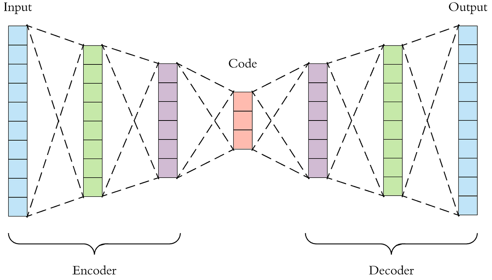

## Table of Contents

## What is an autoencoder in machine learning?

An autoencoder is a type of neural network used in machine learning to learn how to efficiently compress and encode data, then decode it to reproduce the original input as closely as possible. It works by taking an input, like an image, and passing it through an encoder to create a compressed representation, called the latent space. This compressed version is then passed through a decoder to reconstruct the original input. The goal is to minimize the difference between the input and the output, which is done by adjusting the weights of the network during training.

Autoencoders are useful for tasks like data denoising, where you want to remove noise from images or signals, and dimensionality reduction, where you want to simplify complex data while retaining its important features. For example, if you have a high-resolution image, an autoencoder can learn to represent it in a lower-dimensional space, which can be useful for storage or further processing. By training the network to reconstruct the input accurately, it learns to capture the most important aspects of the data, which can then be used for other machine learning tasks.

## How does an autoencoder work?

An autoencoder works by taking in some data, like an image, and trying to make a copy of it. It does this by first squeezing the data into a smaller form, which is called encoding. This smaller form is like a summary of the original data. Then, it takes this summary and tries to rebuild the original data from it, which is called decoding. The autoencoder learns how to do this by comparing the rebuilt data to the original data and adjusting itself to make the rebuilt data as close to the original as possible.

To train an autoencoder, you feed it lots of examples. Each time, it tries to make the output as close to the input as it can. If the output is not very close, the autoencoder changes a bit to try to do better next time. This process keeps going until the autoencoder gets really good at making copies. The difference between the input and the output is measured using a loss function, like the mean squared error $$ \text{MSE} = \frac{1}{n} \sum_{i=1}^{n} (y_i - \hat{y}_i)^2 $$, where $y_i$ is the original data and $\hat{y}_i$ is the reconstructed data. By minimizing this loss, the autoencoder learns to capture the most important parts of the data.

## What are the main components of an autoencoder?

An autoencoder has two main parts: the encoder and the decoder. The encoder takes the original data and squeezes it into a smaller form, called the latent space or bottleneck. This smaller form is like a summary of the original data. For example, if the original data is a picture, the encoder might turn it into a set of numbers that represent the most important parts of the picture. The encoder learns to do this by figuring out which parts of the data are the most important to keep.

The decoder takes the smaller form from the encoder and tries to rebuild the original data. It does the opposite of what the encoder does, expanding the summary back into something that looks like the original data. The decoder learns to do this by comparing the rebuilt data to the original data and adjusting itself to make the rebuilt data as close to the original as possible. The goal is to make the difference between the original data and the rebuilt data as small as possible, which is often measured using a loss function like the mean squared error $$ \text{MSE} = \frac{1}{n} \sum_{i=1}^{n} (y_i - \hat{y}_i)^2 $$, where $y_i$ is the original data and $\hat{y}_i$ is the reconstructed data.

## What is the difference between an encoder and a decoder in an autoencoder?

The encoder in an autoencoder takes the original data and squeezes it into a smaller form, called the latent space or bottleneck. Think of it like taking a big picture and turning it into a short summary. The encoder's job is to figure out which parts of the data are the most important to keep, so it can make a good summary. It does this by learning from lots of examples and adjusting itself to make the summary as useful as possible.

The decoder takes the smaller form from the encoder and tries to rebuild the original data. It's like taking the short summary and turning it back into a big picture. The decoder's job is to expand the summary back into something that looks like the original data. It learns to do this by comparing the rebuilt data to the original data and adjusting itself to make the rebuilt data as close to the original as possible. The goal is to make the difference between the original data and the rebuilt data as small as possible, which is often measured using a loss function like the mean squared error $$ \text{MSE} = \frac{1}{n} \sum_{i=1}^{n} (y_i - \hat{y}_i)^2 $$, where $y_i$ is the original data and $\hat{y}_i$ is the reconstructed data.

## What are the common applications of autoencoders?

Autoencoders are used for many things in [machine learning](/wiki/machine-learning). One common use is data denoising. This means they can take a noisy image or signal and clean it up. For example, if you have a picture that's full of static, an autoencoder can learn to remove the static and show you a clearer picture. They do this by learning what the important parts of the image are and ignoring the noise. Another use is dimensionality reduction. This means they can take complex data and make it simpler while keeping the important parts. For instance, if you have a high-resolution image, an autoencoder can turn it into a smaller set of numbers that still represent the image well. This can help save space and make it easier to work with the data.

Another application of autoencoders is anomaly detection. This means they can find things that are unusual or different from what they've seen before. For example, in a factory, an autoencoder can learn what normal machine sounds are like. If a machine starts making a strange noise, the autoencoder can notice that it's different and alert someone to check it. Autoencoders are also used in generative models. This means they can create new data that looks like the data they've been trained on. For instance, if you train an autoencoder on pictures of faces, it can generate new faces that look real but are actually made up. This can be useful for things like creating new images or even music.

## How do autoencoders help in data compression?

Autoencoders help in data compression by learning to take a big piece of data and turn it into a smaller piece, which is called the latent space or bottleneck. Imagine you have a big picture that takes up a lot of space. An autoencoder can learn to make a short summary of the picture, like a list of numbers, that still keeps the most important parts of the picture. This summary takes up much less space than the original picture. By training the autoencoder on lots of examples, it gets better at making these summaries and can compress data really well.

When you want to use the compressed data again, the autoencoder's decoder part takes the small summary and turns it back into something that looks like the original data. The decoder learns how to do this by comparing what it makes to the original data and trying to make them as close as possible. The difference between the original data and the rebuilt data is measured using a loss function, like the mean squared error $$ \text{MSE} = \frac{1}{n} \sum_{i=1}^{n} (y_i - \hat{y}_i)^2 $$, where $y_i$ is the original data and $\hat{y}_i$ is the reconstructed data. By minimizing this loss, the autoencoder learns to compress and decompress data efficiently, which can save a lot of space and make it easier to work with big data sets.

## What is the role of autoencoders in denoising data?

Autoencoders help in denoising data by learning to remove noise from images or signals. Imagine you have a picture that's full of static. An autoencoder can learn to take this noisy picture and make it clean. It does this by figuring out what the important parts of the picture are and ignoring the noise. The autoencoder is trained on lots of examples, where some pictures are clean and others are noisy. By comparing the noisy input to the clean output, the autoencoder learns to focus on the important parts and leave out the noise.

When you use an autoencoder for denoising, it works by first encoding the noisy data into a smaller form, called the latent space. This smaller form is like a summary of the picture that doesn't include the noise. Then, the decoder part of the autoencoder takes this summary and turns it back into a clean picture. The difference between the original noisy picture and the clean picture is measured using a loss function, like the mean squared error $$ \text{MSE} = \frac{1}{n} \sum_{i=1}^{n} (y_i - \hat{y}_i)^2 $$, where $y_i$ is the original noisy data and $\hat{y}_i$ is the denoised data. By minimizing this loss, the autoencoder gets better at removing noise and keeping the important parts of the data.

## How can autoencoders be used for anomaly detection?

Autoencoders can be used for anomaly detection by learning what normal data looks like and then spotting when something is different. Imagine you have a factory where machines make a certain sound when they're working right. An autoencoder can learn what these normal sounds are like. When a machine starts making a strange noise, the autoencoder can notice that it's different from what it's learned. This difference, or error, between what the autoencoder expects and what it actually sees, can tell you that something unusual is happening. The autoencoder does this by trying to rebuild the data it gets. If it can't rebuild it well, that means the data might be an anomaly.

To do this, the autoencoder first takes the data and turns it into a smaller form, called the latent space. This smaller form is like a summary of the data. Then, it tries to rebuild the original data from this summary. If the data is normal, the autoencoder can rebuild it well, and the difference between the original and the rebuilt data will be small. But if the data is an anomaly, the autoencoder will have a harder time rebuilding it, and the difference will be bigger. This difference is often measured using a loss function like the mean squared error $$ \text{MSE} = \frac{1}{n} \sum_{i=1}^{n} (y_i - \hat{y}_i)^2 $$, where $y_i$ is the original data and $\hat{y}_i$ is the reconstructed data. By setting a threshold for this error, you can tell when something is an anomaly.

## What are variational autoencoders and how do they differ from traditional autoencoders?

Variational autoencoders (VAEs) are a special type of autoencoder that not only learn to compress and reconstruct data but also learn how to generate new data that looks like the original. They do this by adding a bit of randomness to the way they compress the data. Instead of making a single summary of the data, VAEs make a summary with some randomness added to it. This randomness helps them create new, similar data when you ask them to. For example, if you train a VAE on pictures of faces, it can make new faces that look real but are actually made up.

The main difference between VAEs and traditional autoencoders is how they handle the latent space. Traditional autoencoders just try to make the best summary of the data they can, but VAEs make sure the summaries follow a specific pattern, like a normal distribution. This is done by adding a special loss term to the training process, called the KL divergence, which makes sure the summaries are not just good at rebuilding the data but also fit this pattern. The total loss for a VAE is a combination of the reconstruction loss, like the mean squared error $$ \text{MSE} = \frac{1}{n} \sum_{i=1}^{n} (y_i - \hat{y}_i)^2 $$, and the KL divergence. This extra step makes VAEs better at generating new data, but it can also make them a bit worse at rebuilding the exact original data compared to traditional autoencoders.

## How do you train an autoencoder and what are the typical loss functions used?

To train an autoencoder, you feed it lots of examples of data, like pictures or sounds. The autoencoder tries to make a copy of each example by first squeezing the data into a smaller form, called the latent space, and then trying to rebuild the original data from this smaller form. If the rebuilt data is not very close to the original, the autoencoder changes a bit to try to do better next time. This process keeps going until the autoencoder gets really good at making copies. The difference between the original data and the rebuilt data is measured using a loss function. By trying to make this loss as small as possible, the autoencoder learns how to compress and rebuild the data well.

The typical loss function used in autoencoders is the mean squared error (MSE), which measures how different the rebuilt data is from the original data. The formula for MSE is $$ \text{MSE} = \frac{1}{n} \sum_{i=1}^{n} (y_i - \hat{y}_i)^2 $$, where $y_i$ is the original data and $\hat{y}_i$ is the rebuilt data. Another common loss function is the binary cross-entropy, which is used when the data is made up of numbers between 0 and 1, like in black and white images. The formula for binary cross-entropy is $$ \text{BCE} = -\frac{1}{n} \sum_{i=1}^{n} [y_i \log(\hat{y}_i) + (1 - y_i) \log(1 - \hat{y}_i)] $$. These loss functions help the autoencoder learn by telling it how well it's doing at rebuilding the data.

## What are some advanced architectures of autoencoders, such as sparse or convolutional autoencoders?

Sparse autoencoders are a type of autoencoder that makes the latent space, or the summary of the data, have a lot of zeros. This means that only a few numbers in the summary are important, and the rest are not used. By doing this, sparse autoencoders can find the most important parts of the data and ignore the rest. They do this by adding a special term to the loss function, called the sparsity penalty, which makes the autoencoder try to use as few numbers as possible in the summary. This can be helpful for making the data simpler and easier to understand.

Convolutional autoencoders are used a lot for images. They use special layers called convolutional layers, which are good at finding patterns in pictures, like edges or shapes. In a convolutional autoencoder, the encoder part uses these layers to turn the picture into a smaller summary, and the decoder part uses them to turn the summary back into a picture. This can help the autoencoder learn to compress and rebuild images really well. For example, if you train a convolutional autoencoder on pictures of cats, it can learn to make a good summary of what a cat looks like and then rebuild the picture from that summary.

## How can one evaluate the performance of an autoencoder?

To evaluate the performance of an autoencoder, you look at how well it can rebuild the data it gets. You use something called a loss function to measure the difference between the original data and the rebuilt data. A common loss function is the mean squared error, which is calculated as $$ \text{MSE} = \frac{1}{n} \sum_{i=1}^{n} (y_i - \hat{y}_i)^2 $$, where $y_i$ is the original data and $\hat{y}_i$ is the rebuilt data. If the MSE is small, that means the autoencoder is doing a good job at rebuilding the data. Another way to check is by looking at the data visually. If you're working with pictures, you can compare the original picture to the rebuilt one and see if they look the same.

Another way to evaluate an autoencoder is by looking at how it does on new data that it hasn't seen before. This is called testing on a validation set. You train the autoencoder on one set of data, and then you test it on another set to see how well it can rebuild that data. If it does well on the new data, that means it has learned to compress and rebuild data in a way that works for different examples, not just the ones it was trained on. You can also use other measures like the peak signal-to-noise ratio (PSNR) or structural similarity index (SSIM) to see how good the rebuilt data is compared to the original.

## References & Further Reading

[1]: Goodfellow, I., Bengio, Y., & Courville, A. (2016). ["Deep Learning."](https://www.deeplearningbook.org/) MIT Press.

[2]: Hinton, G. E., & Salakhutdinov, R. R. (2006). ["Reducing the Dimensionality of Data with Neural Networks."](https://www.science.org/doi/10.1126/science.1127647) Science, 313(5786), 504-507.

[3]: Vincent, P., Larochelle, H., Lajoie, I., Bengio, Y., & Manzagol, P. A. (2010). ["Stacked Denoising Autoencoders: Learning Useful Representations in a Deep Network with a Local Denoising Criterion."](https://dl.acm.org/doi/10.5555/1756006.1953039) Journal of Machine Learning Research, 11, 3371-3408.

[4]: Kingma, D. P., & Welling, M. (2014). ["Auto-Encoding Variational Bayes."](https://arxiv.org/abs/1312.6114) arXiv:1312.6114 [stat.ML].

[5]: Alain, G., & Bengio, Y. (2014). ["What Regularized Auto-Encoders Learn from the Data Generating Distribution."](https://arxiv.org/abs/1211.4246) Journal of Machine Learning Research, 15(1), 3563-3593.

[6]: Masci, J., Meier, U., Cireşan, D., & Schmidhuber, J. (2011). ["Stacked Convolutional Auto-Encoders for Hierarchical Feature Extraction."](https://link.springer.com/chapter/10.1007/978-3-642-21735-7_7) International Conference on Artificial Neural Networks, 52-59.

[7]: Olshausen, B. A., & Field, D. J. (1997). ["Sparse Coding with an Overcomplete Basis Set: A Strategy Employed by V1?"](https://pubmed.ncbi.nlm.nih.gov/9425546/) Vision Research, 37(23), 3311-3325.