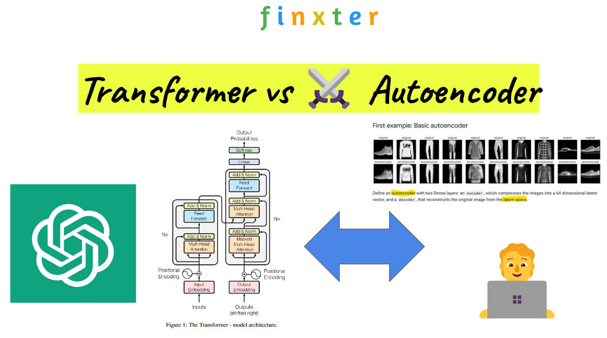

## Table of Contents

## What is an Autoencoding Transformer and how does it differ from other types of Transformers?

An Autoencoding Transformer is a type of neural network model that combines the architecture of Transformers with the concept of autoencoders. In simple terms, an autoencoder is a model that learns how to efficiently compress and encode data, then decode it to reproduce the original input as closely as possible. The Autoencoding Transformer uses the self-attention mechanism of Transformers to process and understand the input data, and then it tries to reconstruct the input. This is useful for tasks like denoising, where the model can learn to remove noise from corrupted inputs, or for data compression and generation.

The main difference between an Autoencoding Transformer and other types of Transformers, like those used in language translation or text generation, is its focus on reconstructing the input rather than generating new outputs. For example, a standard Transformer in a language model might take a sentence in one language and translate it into another language. In contrast, an Autoencoding Transformer would take a sentence, perhaps with some words missing or corrupted, and try to fill in or correct those parts to recreate the original sentence. This makes Autoencoding Transformers particularly useful for tasks where the goal is to preserve and restore the input data, rather than transform it into something new.

## How does an Autoencoding Transformer like BERT work?

BERT, which stands for Bidirectional Encoder Representations from Transformers, is a type of Autoencoding Transformer. It works by taking in a piece of text and trying to predict missing words. Imagine you have a sentence with some words hidden, like "The cat sat on the [MASK]." BERT looks at the whole sentence, including the words before and after the missing part, to guess what word should go in the blank. It does this by using a special attention mechanism that allows it to consider all the words in the sentence at once, which helps it understand the context better.

To train BERT, you give it lots of sentences with some words randomly hidden and ask it to fill in the blanks. Over time, BERT gets better at understanding language and context. This makes it useful for many tasks, like answering questions or understanding the meaning of sentences. Unlike other models that read text from left to right, BERT reads the whole sentence together, which makes it very good at understanding the full context of what it's reading.

## What are the main components of an Autoencoding Transformer?

The main components of an Autoencoding Transformer include an encoder and a decoder. The encoder takes in the input data and processes it using multiple layers of self-attention and feed-forward neural networks. Self-attention allows the model to weigh the importance of different parts of the input relative to each other. This helps the encoder to create a rich representation of the input data. The decoder then uses this representation to reconstruct the original input. It does this by also using self-attention, but in a way that helps it predict the next part of the data based on what it has already generated.

In addition to the encoder and decoder, Autoencoding Transformers use a masking mechanism. This means that during training, some parts of the input are hidden or "masked" from the model. The model then tries to guess what the masked parts should be. This is what makes it an autoencoder - it learns to recreate the input it was given. The model is trained using a loss function that measures how well it reconstructs the input. If the reconstruction is close to the original input, the loss is low, and if it's far off, the loss is high. The model adjusts its parameters to minimize this loss over many training examples.

## What are some popular Autoencoding Transformer models and their specific applications?

BERT, or Bidirectional Encoder Representations from Transformers, is a popular Autoencoding Transformer model. It's used for understanding and working with text. BERT is great at tasks like answering questions, understanding the meaning of sentences, and even filling in missing words in a sentence. It does this by looking at all the words in a sentence at the same time, which helps it understand the full context. For example, if you give BERT a sentence with a missing word, it can guess what word should go there by considering the whole sentence.

Another popular model is the T5, or Text-to-Text Transfer Transformer. T5 can be used for many different tasks, like translating languages, summarizing text, and even answering questions. What's special about T5 is that it treats every task as a text-to-text problem. This means it can take in text and give out text, no matter what the task is. For example, if you want to translate a sentence from English to French, you give T5 the English sentence, and it gives you back the French translation.

Lastly, there's the BART model, which stands for Bidirectional and Auto-Regressive Transformer. BART is good at tasks like summarizing text and fixing sentences that have errors. It works by first messing up the input text in different ways, like shuffling the words or adding noise, and then trying to fix it back to the original text. This helps BART learn how to understand and fix different kinds of text problems. For example, if you give BART a messy summary of a news article, it can clean it up and make it better.

## How does RoBERTa improve upon the original BERT model?

RoBERTa, which stands for Robustly Optimized BERT Approach, is an improved version of the original BERT model. The main way RoBERTa improves upon BERT is by training on much more data and for a longer time. BERT was trained on a certain amount of text, but RoBERTa uses a lot more text from different places, like [books](/wiki/algo-trading-books) and websites. This helps RoBERTa understand language better. Also, RoBERTa changes how it trains the model a bit. It uses bigger batches of text at once and doesn't use the next sentence prediction task that BERT used. This makes the training more efficient and helps RoBERTa perform better on many tasks.

Another way RoBERTa improves on BERT is by making small changes to the model's settings. For example, RoBERTa uses a larger vocabulary and different ways of handling text. These changes help the model understand different kinds of words and sentences better. By making these tweaks and training on more data, RoBERTa can understand and work with text more accurately than the original BERT model. This makes RoBERTa a powerful tool for tasks like answering questions, understanding the meaning of sentences, and even helping with language translation.

## What is the significance of T5 in the landscape of Autoencoding Transformers?

T5, or Text-to-Text Transfer Transformer, is a very important model in the world of Autoencoding Transformers. It stands out because it can handle many different tasks using the same approach. T5 treats every task as a text-to-text problem. This means it can take in text and give out text, no matter what you want it to do. For example, if you want to translate a sentence from English to French, you give T5 the English sentence, and it gives you back the French translation. This makes T5 very flexible and useful for things like language translation, summarizing text, and answering questions.

The significance of T5 also comes from how it was trained. T5 was trained on a huge amount of data, which helps it understand language really well. It also uses a special way of training that makes it better at learning from the data. This approach has shown that you can use one model for many different tasks, which is a big step forward in the field of Autoencoding Transformers. By showing that a single model can be good at many things, T5 has helped researchers and developers think about new ways to use these models in real-world applications.

## How does ALBERT reduce the computational complexity of BERT?

ALBERT, or A Lite BERT, makes BERT easier to use by reducing how much computer power it needs. It does this by sharing the same set of weights across all layers of the model. This means instead of having different weights for each layer, ALBERT uses the same weights for all layers. This makes the model smaller and faster to train. Also, ALBERT breaks down the big vocabulary into smaller pieces, which helps the model understand words better without needing as much memory.

Another way ALBERT reduces complexity is by using a technique called parameter sharing. This means that instead of learning a new set of parameters for each layer, ALBERT learns one set and uses it across all layers. This not only makes the model smaller but also helps it learn faster. By doing these things, ALBERT can work well on tasks like understanding sentences and answering questions, but it uses less computer power than BERT.

## What are the key differences between ELECTRA and other Autoencoding Transformers?

ELECTRA, or Efficiently Learning an Encoder that Classifies Token Replacements Accurately, is different from other Autoencoding Transformers like BERT because of how it trains. Instead of masking words like BERT does, ELECTRA replaces some words with wrong ones and then tries to find these mistakes. This is called replaced token detection. By doing this, ELECTRA can use all the words in a sentence to learn, not just the ones it tries to guess. This makes ELECTRA more efficient because it can learn from more of the text at once.

Another key difference is that ELECTRA needs less computer power to train. While models like BERT and RoBERTa need a lot of data and time to train, ELECTRA can get good results with less. This is because its training method, replaced token detection, is more efficient. So, ELECTRA can be a good choice when you don't have a lot of resources but still want a strong model for understanding text.

## How does DeBERTa enhance the performance of BERT?

DeBERTa, or Decoding-enhanced BERT with Disentangled Attention, makes BERT better by changing how it pays attention to words in a sentence. Instead of looking at words as whole units, DeBERTa looks at the content of the words and their positions separately. This helps the model understand the meaning of sentences more accurately. For example, if you have a sentence like "The cat sat on the mat," DeBERTa can better understand that "cat" and "mat" are important because of what they mean, not just where they are in the sentence.

Another way DeBERTa improves on BERT is by using a special way to predict the next word in a sentence. This method, called disentangled attention, helps the model make better guesses about what word should come next. By doing this, DeBERTa can perform better on tasks like answering questions and understanding the meaning of text. Overall, these changes make DeBERTa a more powerful tool for working with language, even though it's based on the same basic ideas as BERT.

## What makes Longformer suitable for processing longer sequences?

Longformer is designed to handle longer sequences of text than models like BERT. It does this by using a special attention mechanism called "sliding window attention" and "global attention." Sliding window attention means that the model only looks at a small part of the text at a time, instead of the whole thing. This makes it much faster and able to handle longer texts. Global attention lets the model pay special attention to certain important words or parts of the text, no matter where they are. This helps the model understand the overall context of the text better.

By using these attention methods, Longformer can process much longer sequences than other models. For example, while BERT might struggle with texts longer than 512 tokens, Longformer can easily handle texts with thousands of tokens. This makes Longformer very useful for tasks like document summarization, where you need to understand and work with long pieces of text.

## How does mT5 support multilingual tasks and what are its advantages?

mT5, or multilingual T5, is a version of the T5 model that can work with many different languages. It was trained on a huge amount of text from lots of languages, so it can understand and generate text in many different languages. This makes mT5 really useful for tasks like translating text from one language to another, or understanding text written in different languages. For example, if you want to translate a sentence from English to Spanish, you can give mT5 the English sentence, and it will give you back the Spanish translation.

One of the big advantages of mT5 is that it can handle many languages at once, without needing separate models for each language. This makes it very efficient and saves a lot of time and resources. Also, because mT5 was trained on so much data, it can understand the context and meaning of text very well, no matter what language it's in. This makes it a powerful tool for things like answering questions in different languages or summarizing long texts from different parts of the world.

## What are the latest advancements in Autoencoding Transformers and their impact on the field of machine learning?

The latest advancements in Autoencoding Transformers have significantly pushed the boundaries of what these models can do. One major development is the introduction of models like FLAN-T5, which is a fine-tuned version of T5 that has been trained on a diverse set of tasks. This allows FLAN-T5 to perform better on a wide range of applications, from answering questions to generating text, making it more versatile than its predecessors. Another advancement is the use of techniques like sparse attention mechanisms, which allow models to handle longer sequences of text more efficiently. This is important for tasks like document summarization or processing long conversations, where understanding the entire context is crucial.

These advancements have had a big impact on the field of [machine learning](/wiki/machine-learning). For example, the ability of models like FLAN-T5 to handle multiple tasks with high performance has made them valuable tools for businesses and researchers who need to process and understand large amounts of text data. Additionally, the improved efficiency of models with sparse attention mechanisms means that they can be used on devices with less computing power, making advanced language processing more accessible. Overall, these developments are helping to make machine learning models more powerful, efficient, and applicable to real-world problems.