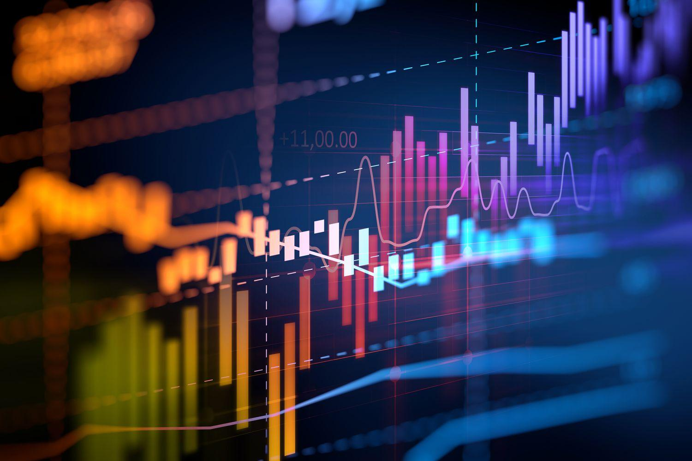

## Table of Contents

## What is an Automated Bond System?

An Automated Bond System is a computer program that helps with buying and selling bonds without people having to do everything by hand. It makes the process faster and easier because it can handle a lot of trades at the same time. This system is used by banks, investment firms, and other financial institutions to manage their bond portfolios more efficiently.

Bonds are like loans that you give to a company or government, and in return, they pay you back with interest over time. The Automated Bond System keeps track of all these bonds, making sure they are bought and sold at the right times and prices. This helps investors make money and reduces the chance of mistakes that can happen when people do everything manually.

## How does an Automated Bond System work?

An Automated Bond System works by using computer programs to handle the buying and selling of bonds. When someone wants to buy or sell a bond, they enter the details into the system. The system then looks at the current market prices and decides the best time and price to make the trade. It does all this very quickly, much faster than a person could, and it can handle many trades at the same time.

The system also keeps track of all the bonds that an investor owns. It makes sure that the investor gets paid the interest on time and that the bonds are sold when they need to be. This helps investors manage their money better because they don't have to worry about missing important dates or making mistakes with their trades. The system does all the hard work for them, making it easier to invest in bonds.

## What are the main components of an Automated Bond System?

The main parts of an Automated Bond System are the trading platform, the database, and the algorithms. The trading platform is where people enter their orders to buy or sell bonds. It's like a big online store where you can pick what you want to trade. The database keeps track of all the bonds that are being traded and all the information about them, like the prices and when they pay interest. This helps the system know what's happening in the market all the time.

The algorithms are the smart part of the system. They use math to figure out the best times and prices to buy or sell bonds. They look at a lot of information very quickly and make decisions based on that. The algorithms help make sure that the trades are done in a way that makes the most money for the investors. Together, these parts work to make buying and selling bonds easy and efficient.

## What are the benefits of using an Automated Bond System?

Using an Automated Bond System makes trading bonds much easier and faster. Instead of people having to do everything by hand, the system can handle lots of trades at the same time. This means that investors can buy and sell bonds quickly, without having to wait. The system also helps to make sure that trades are done at the best possible prices, which can save investors money and help them make more profit.

Another big benefit is that the system reduces the chance of making mistakes. When people do things manually, they can sometimes get things wrong, like entering the wrong price or missing an important date. The Automated Bond System keeps track of everything and makes sure that all the trades are done correctly. This helps investors feel more confident that their money is being managed well.

## How can an Automated Bond System improve efficiency in trading?

An Automated Bond System makes trading bonds much faster and easier. Instead of people having to do everything by hand, the system can handle lots of trades at the same time. This means that investors can buy and sell bonds quickly, without having to wait. The system looks at the market all the time and decides the best times and prices to make trades. This helps investors get the best deals and makes the whole process smoother and quicker.

The system also helps to make sure that trades are done correctly. When people do things manually, they can sometimes make mistakes, like entering the wrong price or missing an important date. The Automated Bond System keeps track of everything and makes sure that all the trades are done right. This reduces the chance of errors and helps investors feel more confident that their money is being managed well. By doing all this work automatically, the system saves time and effort, making trading more efficient.

## What are the risks associated with using an Automated Bond System?

Using an Automated Bond System can have some risks. One big risk is that the system might make mistakes. Even though the system is designed to reduce errors, it can still get things wrong because of problems with the software or data. If the system makes a bad trade, it could cost investors money. Another risk is that the system might be hacked. If someone breaks into the system, they could steal information or change trades, which could be very harmful to investors.

Another risk is that the system might not work well during times when the market is very busy or changing a lot. If lots of people are trying to buy and sell bonds at the same time, the system might slow down or even stop working. This could make it hard for investors to make trades when they need to. Also, if the system relies on algorithms to make decisions, there's a chance that these algorithms might not always make the best choices, especially if the market is doing something unexpected.

## How is security managed within an Automated Bond System?

Security in an Automated Bond System is very important to keep the system safe from hackers and to protect the information of investors. The system uses strong passwords and special codes to make sure only the right people can get in. It also uses something called encryption, which is like a secret code that keeps the information safe even if someone does get into the system. The system is always watched by security experts who look for any signs of trouble and fix problems quickly.

Another way the system stays secure is by having regular checks and updates. These checks help find any weak spots that hackers might try to use. The system is also set up to work in different places, so if one part has a problem, the others can keep working. This helps make sure that the system keeps running smoothly and safely, even if something goes wrong.

## What are the key differences between manual and automated bond trading systems?

Manual bond trading systems require people to do all the work by hand. This means someone has to look at the market, decide when to buy or sell bonds, and enter all the orders themselves. It can be slow and there's a higher chance of making mistakes, like entering the wrong price or missing an important date. Manual trading also takes a lot of time and effort, which can be tiring for the people doing it.

Automated bond trading systems use computers to do the work instead. The system can handle many trades at the same time, making it much faster than manual trading. It uses special math formulas, called algorithms, to decide the best times and prices to buy or sell bonds. This can help investors get better deals and make more money. The system also keeps track of everything and reduces the chance of errors, making trading safer and more efficient.

## How can an Automated Bond System be integrated with existing financial software?

An Automated Bond System can be connected to other financial software to make trading even easier. This is done by using special codes that let the systems talk to each other. For example, the bond system can share information with accounting software to keep track of money coming in and going out. It can also work with risk management tools to help investors understand how safe their investments are. By connecting these systems, everything works together smoothly, and investors can see all their financial information in one place.

The integration process usually involves setting up a way for the systems to exchange data securely. This might mean using something called an API, which is like a bridge that lets different software programs share information. Once the systems are connected, the Automated Bond System can automatically update other software with the latest trade information. This helps investors make better decisions because they have all the information they need right at their fingertips. It also saves time because they don't have to enter the same information into different systems by hand.

## What are the advanced features available in high-end Automated Bond Systems?

High-end Automated Bond Systems come with advanced features that make trading even better. One of these features is real-time analytics, which means the system can look at the market as it's happening and give investors information right away. This helps them make quick decisions about buying or selling bonds. Another feature is [machine learning](/wiki/machine-learning), where the system gets smarter over time by learning from past trades. This can help the system make better choices about when and how to trade, which can lead to more money for investors.

Another advanced feature is the ability to handle complex trading strategies. High-end systems can do things like [algorithmic trading](/wiki/algorithmic-trading), where the system follows a set of rules to make trades automatically. This can be very helpful for investors who want to use smart strategies to make more money. The system can also connect with other financial tools, like risk management software, to give investors a full picture of their investments. This makes it easier for them to manage their money and make the best decisions.

## How do regulatory requirements affect the operation of an Automated Bond System?

Regulatory requirements are rules that governments and financial authorities set to make sure that trading is fair and safe. These rules can affect how an Automated Bond System works by making the system follow certain standards. For example, the system might need to keep records of all trades and report them to the regulators. This helps make sure that everything is done correctly and that there's no cheating. The system also has to follow rules about how it makes trades, like not doing anything that could hurt the market or other investors.

These rules can sometimes make the system slower or more complicated to use. For instance, the system might need to wait for approval before making certain trades, or it might have to check that it's following all the rules before it can go ahead. This can take time and might mean that the system can't always make trades as quickly as it could without these rules. But, these regulations are important because they help keep the market safe and fair for everyone.

## What future trends are expected in the development of Automated Bond Systems?

In the future, Automated Bond Systems are expected to get even smarter with the help of [artificial intelligence](/wiki/ai-artificial-intelligence) and machine learning. These technologies will make the systems better at predicting market changes and making trading decisions. This means that the systems will be able to find the best times to buy and sell bonds, helping investors make more money. They will also be able to learn from past trades and get better over time, making the whole trading process more efficient and successful.

Another trend we might see is more integration with other financial tools. Automated Bond Systems will work even better with things like risk management software and accounting programs. This will give investors a complete view of their investments in one place, making it easier to manage their money. Also, as technology improves, these systems will become more secure, protecting investors from hackers and other risks. Overall, these advancements will make trading bonds easier, safer, and more profitable for everyone involved.

## What is the importance of understanding bonds?

Bonds are a fundamental component of the financial markets, serving as debt securities where issuers, such as corporations, municipalities, and governments, borrow capital from investors. These instruments play a pivotal role in financing activities, allowing issuers to fund various projects, operations, and governmental functions. When an investor purchases a bond, they are essentially lending money to the issuer in exchange for periodic interest payments, known as coupon payments, and the return of the principal amount at maturity.

The structure of bonds typically involves a fixed [interest rate](/wiki/interest-rate-trading-strategies), often paid semi-annually, providing investors with predictable income streams over the bond's lifespan. This fixed income aspect makes bonds an attractive option for investors seeking stability and lower risk compared to equities. Equation for calculating the price of a bond can be denoted as:

$$
P = \sum_{t=1}^{n} \frac{C}{(1 + r)^t} + \frac{F}{(1 + r)^n}
$$

Where:
- $P$ is the price of the bond.
- $C$ is the coupon payment.
- $r$ is the discount rate or yield to maturity.
- $n$ is the number of periods until maturity.
- $F$ is the face value of the bond.

Bonds are integral to diversified investment portfolios due to their ability to act as a counterbalance against the [volatility](/wiki/volatility-trading-strategies) of stocks. Historically, when stock markets perform poorly, bonds often maintain or increase in value, providing a hedge against market fluctuation. This inverse relationship helps in mitigating overall portfolio risk.

Additionally, bonds cater to various investor preferences through a range of types, including government bonds, corporate bonds, municipal bonds, and more specialized instruments like zero-coupon bonds and inflation-linked bonds. Each type carries different levels of risk, return, and tax treatment, enabling investors to tailor their portfolios based on individual financial goals and risk tolerance.

Understanding the fundamentals of bonds is crucial before exploring their automated trading mechanisms. Advances in technology have transformed how bonds are traded, providing increased transparency, efficiency, and accessibility in financial markets. Automated systems streamline processes, accommodating the growing complexities and volumes in bond trading activities. Recognizing the intrinsic value and mechanics of bonds lays the groundwork for understanding the broader impact of technological advancements in the bond market.

## References & Further Reading

[1]: Marcos López de Prado, ["Advances in Financial Machine Learning"](https://www.amazon.com/Advances-Financial-Machine-Learning-Marcos/dp/1119482089), John Wiley & Sons, 2018.

[2]: David Aronson, ["Evidence-Based Technical Analysis: Applying the Scientific Method and Statistical Inference to Trading Signals"](https://www.amazon.com/Evidence-Based-Technical-Analysis-Scientific-Statistical/dp/0470008741), Wiley, 2006.

[3]: Stefan Jansen, ["Machine Learning for Algorithmic Trading"](https://github.com/stefan-jansen/machine-learning-for-trading), Packt Publishing, 2020.

[4]: Ernest P. Chan, ["Quantitative Trading: How to Build Your Own Algorithmic Trading Business"](https://www.amazon.com/Quantitative-Trading-Build-Algorithmic-Business/dp/0470284889), Wiley, 2008.

[5]: Bergstra, J., Bardenet, R., Bengio, Y., & Kégl, B. (2011). ["Algorithms for Hyper-Parameter Optimization."](https://dl.acm.org/doi/10.5555/2986459.2986743) Advances in Neural Information Processing Systems 24.